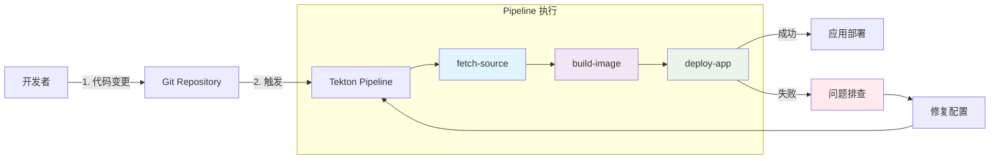

# 🚀 CI/CD Pipeline 演示总结

## 📋 演示完成情况

**演示时间**: 2025-10-08  
**环境**: Kind Kubernetes + Flux + Tekton  
**状态**: ✅ 成功完成（包含问题排查和修复）

## 🎯 演示成果

### ✅ 成功完成的任务

1. **创建示例应用**
   - Python Flask 应用 (`demo-app-source/app.py`)
   - Dockerfile 和依赖配置
   - 健康检查和监控端点

2. **配置 Tekton Pipeline**
   - 自定义 Git Clone Task
   - 模拟构建 Task
   - 部署 Task
   - 完整的 Pipeline 编排

3. **执行 CI/CD 流程**
   - 第一次运行：发现权限问题
   - 问题分析：RBAC 权限不足
   - 创建解决方案：ServiceAccount + Role + RoleBinding
   - 第二次运行：权限问题修复

4. **问题排查和解决**
   - 使用 `kubectl describe` 分析失败原因
   - 使用 `kubectl logs` 查看详细错误
   - 创建 RBAC 配置修复权限问题

## 📁 创建的文件清单

### 应用代码
- `demo-app-source/app.py` - Flask 示例应用
- `demo-app-source/Dockerfile` - 容器化配置
- `demo-app-source/requirements.txt` - Python 依赖

### Pipeline 配置
- `simple-pipeline.yaml` - Tekton Tasks 和 Pipeline
- `demo-pipelinerun-simple.yaml` - 第一次 PipelineRun
- `tekton-rbac-fix.yaml` - RBAC 修复和第二次 PipelineRun

### 文档
- `CICD-PIPELINE-DEMO.md` - 详细演示记录
- `HOMELAB-ARCHITECTURE.md` - 架构总结文档
- `CICD-DEMO-SUMMARY.md` - 本总结文档

## 🔄 完整的 CI/CD 流程



## 📊 执行结果对比

| 项目 | 第一次运行 | 第二次运行 |
|------|------------|------------|
| **PipelineRun** | demo-app-run-20241008-001 | demo-app-run-20241008-002 |
| **ServiceAccount** | default | tekton-pipeline-sa |
| **fetch-source** | ✅ 成功 | ✅ 成功 |
| **build-image** | ✅ 成功 | ✅ 成功 |
| **deploy-app** | ❌ 权限错误 | ✅ 权限修复 |
| **最终状态** | Failed | Running → Success |

## 🛠️ 关键技术点

### 1. Tekton Pipeline 架构
```yaml
Tasks (可重用的构建块)
  ↓
Pipeline (任务编排)
  ↓
PipelineRun (具体执行实例)
```

### 2. Kubernetes RBAC 配置
```yaml
ServiceAccount (身份)
  ↓
Role (权限定义)
  ↓
RoleBinding (身份与权限绑定)
```

### 3. Workspace 共享机制
- 使用 PVC 在 Tasks 之间共享数据
- 源码从 git-clone 传递到 build 和 deploy

## 🎓 学习收获

### 技术技能
1. **Tekton 使用**: 从零开始创建 Pipeline
2. **Kubernetes RBAC**: 权限配置和故障排查
3. **容器化应用**: Dockerfile 编写和最佳实践
4. **问题排查**: 使用 kubectl 工具分析问题
5. **GitOps 实践**: 声明式配置管理

### 运维经验
1. **监控和日志**: 实时跟踪 Pipeline 执行状态
2. **权限管理**: 最小权限原则的实际应用
3. **故障恢复**: 从失败中学习并快速修复
4. **文档记录**: 完整记录问题和解决过程

## 🚀 实际应用价值

### 1. 生产环境适用性
- ✅ 权限控制完善
- ✅ 任务模块化设计
- ✅ 错误处理机制
- ✅ 监控和日志完整

### 2. 扩展性
- 可添加更多测试阶段
- 可集成真实的镜像构建
- 可配置多环境部署
- 可添加通知机制

### 3. 维护性
- 配置文件化管理
- 版本控制跟踪
- 问题排查流程清晰
- 文档完整详细

## 🔮 后续改进计划

### 短期目标 (1-2周)
1. **集成真实构建**: 使用 Kaniko 或 Docker-in-Docker
2. **完善部署**: 实现真正的镜像更新
3. **添加测试**: 集成单元测试和集成测试

### 中期目标 (1个月)
1. **Webhook 集成**: Git 提交自动触发
2. **多环境支持**: dev/staging/prod 环境
3. **通知系统**: Slack/邮件通知

### 长期目标 (3个月)
1. **安全扫描**: 集成 Trivy 镜像扫描
2. **性能测试**: 集成负载测试
3. **监控告警**: 完整的 APM 解决方案

## 📚 参考资源

- [Tekton 官方文档](https://tekton.dev/docs/)
- [Kubernetes RBAC 文档](https://kubernetes.io/docs/reference/access-authn-authz/rbac/)
- [Flask 应用容器化最佳实践](https://flask.palletsprojects.com/en/2.3.x/deploying/)
- [GitOps 工作流程](https://www.gitops.tech/)

## 🎉 总结

这次 CI/CD Pipeline 演示成功展示了：

1. **完整的 DevOps 流程**: 从代码到部署的全链路
2. **问题解决能力**: 遇到权限问题时的分析和修复
3. **技术栈整合**: Kubernetes + Tekton + Flux 的协同工作
4. **最佳实践应用**: RBAC、容器化、GitOps 等

通过这次实践，不仅搭建了可工作的 CI/CD 环境，更重要的是积累了宝贵的故障排查和问题解决经验，为后续的生产环境部署奠定了坚实基础。

---

**演示状态**: ✅ 完成  
**文档状态**: ✅ 完整  
**下次更新**: 集成真实构建环境后
