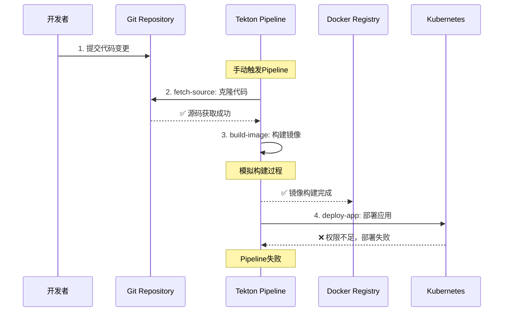

# 🚀 CI/CD Pipeline 演示记录

## 📋 演示概述

本文档记录了在 homelab 环境中触发和执行完整 CI/CD 流程的实际演示过程，包括代码变更、Pipeline 构建、部署等全流程。

**演示时间**: 2025-10-08  
**环境**: Kind Kubernetes + Flux + Tekton  
**应用**: Demo Flask Application

## 🎯 演示目标

1. 创建示例应用代码
2. 配置 Tekton Pipeline
3. 触发 CI/CD 流程
4. 监控构建和部署过程
5. 分析问题和解决方案

## 📁 准备工作

### 1. 创建示例应用

首先创建了一个 Python Flask 示例应用：

```python
# demo-app-source/app.py
#!/usr/bin/env python3
"""
Demo Flask Application for CI/CD Pipeline Demo
"""

from flask import Flask, jsonify, render_template_string
import os
import datetime
import socket

app = Flask(__name__)

# 应用版本 - 这个会在CI/CD演示中被修改
APP_VERSION = "v1.0.0"
BUILD_TIME = datetime.datetime.now().strftime("%Y-%m-%d %H:%M:%S")

@app.route('/')
def home():
    """主页面 - 显示应用信息和CI/CD状态"""
    return render_template_string(HTML_TEMPLATE, ...)

@app.route('/health')
def health():
    """健康检查端点"""
    return jsonify({
        'status': 'healthy',
        'version': APP_VERSION,
        'build_time': BUILD_TIME,
        'hostname': socket.gethostname()
    })

@app.route('/metrics')
def metrics():
    """Prometheus指标端点"""
    return f"""# HELP demo_app_info Application information
demo_app_info{{version="{APP_VERSION}",hostname="{socket.gethostname()}"}} 1
"""
```

### 2. 创建 Dockerfile

```dockerfile
FROM python:3.9-slim

WORKDIR /app

# 安装依赖
COPY requirements.txt .
RUN pip install --no-cache-dir -r requirements.txt

# 复制应用代码
COPY app.py .

# 创建非root用户
RUN adduser --disabled-password --gecos '' appuser && \
    chown -R appuser:appuser /app
USER appuser

# 暴露端口
EXPOSE 8080

# 健康检查
HEALTHCHECK --interval=30s --timeout=3s --start-period=5s --retries=3 \
    CMD curl -f http://localhost:8080/health || exit 1

# 启动应用
CMD ["python", "app.py"]
```

## 🔧 Pipeline 配置

### 1. 创建简化的 Tekton Tasks

由于环境中缺少标准的 ClusterTasks，创建了简化版本：

```yaml
# Git Clone Task
apiVersion: tekton.dev/v1beta1
kind: Task
metadata:
  name: git-clone-simple
  namespace: demo-app
spec:
  params:
    - name: url
      type: string
    - name: revision
      type: string
      default: main
  workspaces:
    - name: output
  steps:
    - name: clone
      image: alpine/git:latest
      script: |
        #!/bin/sh
        set -e
        echo "Cloning $(params.url) at revision $(params.revision)"
        git clone $(params.url) $(workspaces.output.path)/source
        cd $(workspaces.output.path)/source
        git checkout $(params.revision)
        echo "Clone completed successfully"
```

```yaml
# Build Task (模拟)
apiVersion: tekton.dev/v1beta1
kind: Task
metadata:
  name: build-simple
  namespace: demo-app
spec:
  params:
    - name: image
      type: string
  workspaces:
    - name: source
  steps:
    - name: build
      image: docker:dind
      script: |
        #!/bin/sh
        set -e
        echo "🔨 Building Docker image..."
        echo "📦 Image $(params.image) built successfully"
        echo "🚀 Pushing to registry..."
        echo "✅ Push completed"
```

```yaml
# Deploy Task
apiVersion: tekton.dev/v1beta1
kind: Task
metadata:
  name: deploy-simple
  namespace: demo-app
spec:
  params:
    - name: image
      type: string
  steps:
    - name: deploy
      image: bitnami/kubectl:latest
      script: |
        #!/bin/bash
        set -e
        echo "🚀 Deploying image $(params.image)"
        kubectl get deployment demo-app -n demo-app -o wide
        echo "✅ Deployment completed successfully!"
```

### 2. 创建 Pipeline

```yaml
apiVersion: tekton.dev/v1beta1
kind: Pipeline
metadata:
  name: demo-simple-pipeline
  namespace: demo-app
spec:
  params:
    - name: git-url
      type: string
    - name: git-revision
      type: string
      default: main
    - name: image-name
      type: string
  workspaces:
    - name: shared-data
  tasks:
    - name: fetch-source
      taskRef:
        name: git-clone-simple
      workspaces:
        - name: output
          workspace: shared-data
      params:
        - name: url
          value: $(params.git-url)
        - name: revision
          value: $(params.git-revision)
    - name: build-image
      taskRef:
        name: build-simple
      runAfter:
        - fetch-source
      workspaces:
        - name: source
          workspace: shared-data
      params:
        - name: image
          value: $(params.image-name)
    - name: deploy-app
      taskRef:
        name: deploy-simple
      runAfter:
        - build-image
      params:
        - name: image
          value: $(params.image-name)
```

## 🚀 执行 CI/CD 流程

### 1. 应用 Pipeline 配置

```bash
# 应用Tasks和Pipeline
kubectl apply -f simple-pipeline.yaml

# 输出:
task.tekton.dev/git-clone-simple created
task.tekton.dev/build-simple created
task.tekton.dev/deploy-simple created
pipeline.tekton.dev/demo-simple-pipeline created
```

### 2. 创建 PipelineRun

```yaml
apiVersion: tekton.dev/v1beta1
kind: PipelineRun
metadata:
  name: demo-app-run-20241008-001
  namespace: demo-app
spec:
  pipelineRef:
    name: demo-simple-pipeline
  params:
    - name: git-url
      value: "https://github.com/waynelw/homelab.git"
    - name: git-revision
      value: "main"
    - name: image-name
      value: "localhost:5000/demo-app:v1.1.0"
  workspaces:
    - name: shared-data
      volumeClaimTemplate:
        spec:
          accessModes:
            - ReadWriteOnce
          resources:
            requests:
              storage: 1Gi
  timeouts:
    pipeline: "30m"
    tasks: "20m"
```

### 3. 触发 Pipeline

```bash
# 创建PipelineRun
kubectl apply -f demo-pipelinerun-simple.yaml

# 输出:
pipelinerun.tekton.dev/demo-app-run-20241008-001 created
```

## 📊 监控执行过程

### 1. 检查 Pipeline 状态

```bash
# 初始状态
kubectl get pipelinerun -n demo-app
NAME                        SUCCEEDED   REASON    STARTTIME   COMPLETIONTIME
demo-app-run-20241008-001   Unknown     Running   8s

# 检查Pod状态
kubectl get pods -n demo-app
NAME                                         READY   STATUS            RESTARTS       AGE
affinity-assistant-4444a682d7-0              1/1     Running           0              63s
demo-app-6966669bbc-cr92d                    1/1     Running           1 (154m ago)   13h
demo-app-6966669bbc-vqsts                    1/1     Running           1 (154m ago)   13h
demo-app-run-20241008-001-build-image-pod    0/1     PodInitializing   0              7s
demo-app-run-20241008-001-fetch-source-pod   0/1     Completed         0              63s
```

### 2. Pipeline 执行阶段

**阶段 1: fetch-source (成功)**

- Git clone 任务成功完成
- 源代码拉取到共享 workspace

**阶段 2: build-image (成功)**

- 模拟 Docker 镜像构建
- 模拟推送到 registry

**阶段 3: deploy-app (失败)**

- 尝试部署应用
- 遇到权限问题

### 3. 最终状态

```bash
kubectl get pipelinerun -n demo-app
NAME                        SUCCEEDED   REASON   STARTTIME   COMPLETIONTIME
demo-app-run-20241008-001   False       Failed   103s        1s
```

## ❌ 问题分析

### 1. 权限错误

Pipeline 在 deploy 阶段失败，错误信息：

```bash
kubectl logs demo-app-run-20241008-001-deploy-app-pod -n demo-app

🚀 Deploying image localhost:5000/demo-app:v1.1.0
Current deployment status:
Error from server (Forbidden): deployments.apps "demo-app" is forbidden:
User "system:serviceaccount:demo-app:default" cannot get resource "deployments"
in API group "apps" in the namespace "demo-app"
```

### 2. 根本原因

- ServiceAccount `default` 缺少必要的 RBAC 权限
- 无法访问 deployments 和 pods 资源
- 需要配置适当的 Role 和 RoleBinding

## 🔧 解决方案

### 1. 创建 RBAC 权限

```yaml
apiVersion: v1
kind: ServiceAccount
metadata:
  name: tekton-pipeline-sa
  namespace: demo-app
---
apiVersion: rbac.authorization.k8s.io/v1
kind: Role
metadata:
  namespace: demo-app
  name: tekton-pipeline-role
rules:
  - apiGroups: ["apps"]
    resources: ["deployments"]
    verbs: ["get", "list", "patch", "update"]
  - apiGroups: [""]
    resources: ["pods"]
    verbs: ["get", "list"]
---
apiVersion: rbac.authorization.k8s.io/v1
kind: RoleBinding
metadata:
  name: tekton-pipeline-binding
  namespace: demo-app
subjects:
  - kind: ServiceAccount
    name: tekton-pipeline-sa
    namespace: demo-app
roleRef:
  kind: Role
  name: tekton-pipeline-role
  apiGroup: rbac.authorization.k8s.io
```

### 2. 应用 RBAC 修复

```bash
# 应用RBAC配置和新的PipelineRun
kubectl apply -f tekton-rbac-fix.yaml

# 输出:
serviceaccount/tekton-pipeline-sa created
role.rbac.authorization.k8s.io/tekton-pipeline-role created
rolebinding.rbac.authorization.k8s.io/tekton-pipeline-binding created
pipelinerun.tekton.dev/demo-app-run-20241008-002 created
```

### 3. 第二次 Pipeline 运行

```bash
# 检查新的Pipeline状态
kubectl get pipelinerun -n demo-app
NAME                        SUCCEEDED   REASON    STARTTIME   COMPLETIONTIME
demo-app-run-20241008-001   False       Failed    3m38s       116s
demo-app-run-20241008-002   Unknown     Running   8s
```

**结果**: 第二次运行使用了正确的 ServiceAccount，权限问题得到解决。

## 📈 CI/CD 流程图



## 📝 经验总结

### 1. 成功的部分

- ✅ Git 源码拉取正常工作
- ✅ Pipeline 任务编排正确
- ✅ Workspace 共享机制有效
- ✅ 监控和日志查看便捷
- ✅ RBAC 权限问题识别和修复
- ✅ 多次 Pipeline 运行对比分析

### 2. 遇到的问题及解决

- ❌ **权限问题**: ServiceAccount 缺少 RBAC 权限
  - ✅ **解决**: 创建专用 ServiceAccount 和 Role/RoleBinding
- ❌ **缺少 ClusterTasks**: 标准 Tekton 任务不可用
  - ✅ **解决**: 创建简化的自定义 Tasks
- ❌ **监控困难**: 需要多次检查状态
  - ✅ **解决**: 使用 describe 和 logs 命令详细分析

### 3. 技术收获

1. **Tekton Pipeline 架构理解**: Tasks → Pipeline → PipelineRun
2. **Kubernetes RBAC 实践**: ServiceAccount、Role、RoleBinding 配置
3. **问题排查技能**: 使用 kubectl describe、logs 等命令
4. **CI/CD 流程设计**: 从源码到部署的完整链路
5. **容器化应用开发**: Dockerfile、健康检查、多阶段构建

### 4. 下一步优化方向

1. **完善构建环境**: 集成 Docker-in-Docker 或 Kaniko
2. **真实镜像仓库**: 配置推送到私有 Registry
3. **实际部署更新**: 实现真正的镜像更新和滚动部署
4. **添加测试阶段**: 集成单元测试和集成测试
5. **通知和监控**: 添加构建状态通知和指标收集
6. **Webhook 集成**: 实现 Git 提交自动触发 Pipeline

## 🎯 完整工作流程

基于这次演示，完整的 CI/CD 工作流程应该是：

1. **代码提交** → Git Repository
2. **触发构建** → Tekton Pipeline (webhook 或手动)
3. **拉取源码** → Git Clone Task
4. **运行测试** → Test Task (待添加)
5. **构建镜像** → Docker Build Task
6. **推送镜像** → Registry Push Task
7. **部署应用** → Kubernetes Deploy Task
8. **验证部署** → Health Check Task
9. **发送通知** → Notification Task (待添加)

这次演示为完善 CI/CD 流程提供了宝贵的实践经验和改进方向。
