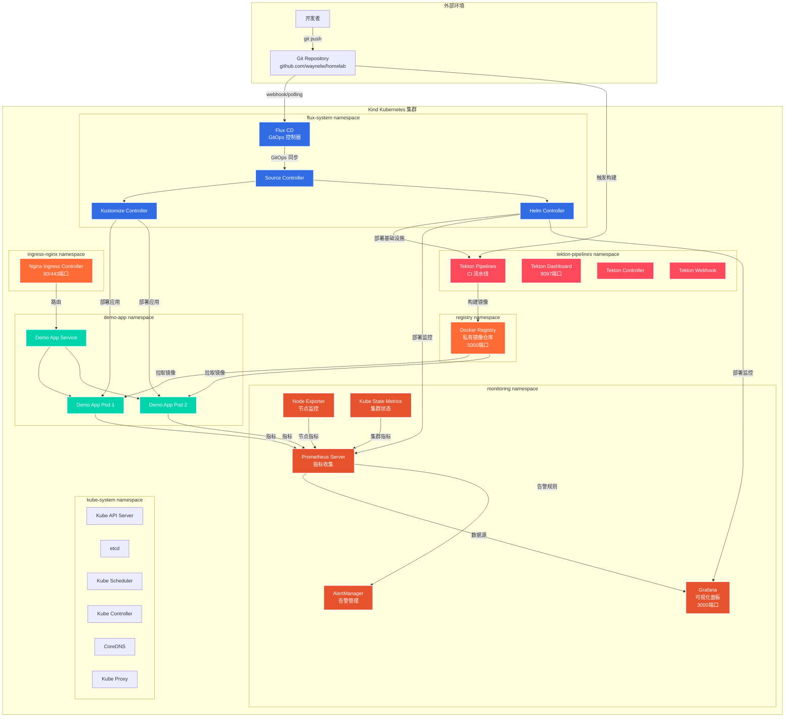
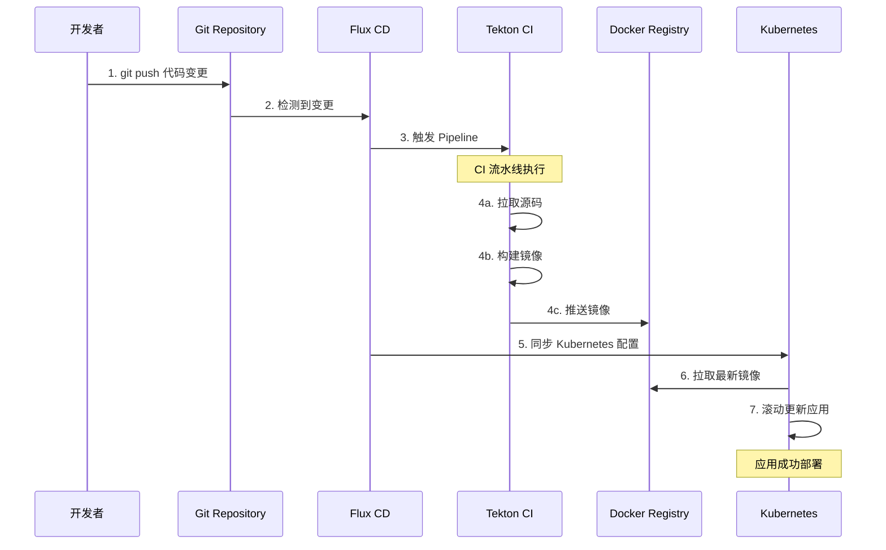
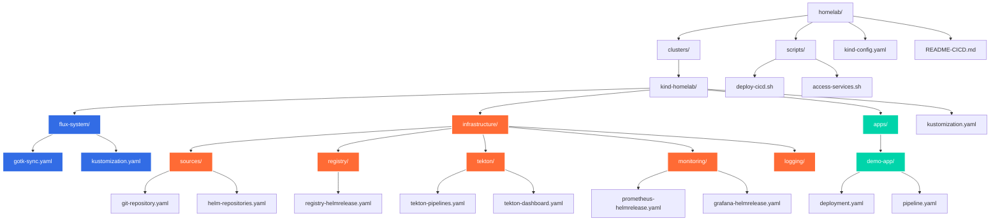

# 🏠 Homelab 云原生环境架构总结

## 🎯 整体架构概览

您的homelab环境是一个基于**Kind + Flux + Tekton**的完整云原生CI/CD平台，包含监控、日志、镜像仓库等完整的DevOps工具链。

## 🏗️ 系统架构图

### 主架构图


## 📊 当前运行状态分析

根据 `kubectl get pods -A` 输出，环境运行状态如下：

### ✅ 正常运行的组件
- **Flux System**: 6个组件全部正常运行
- **Tekton Pipelines**: 4个组件全部正常运行  
- **Demo Application**: 2个副本正常运行
- **Monitoring**: Prometheus、AlertManager等大部分组件正常
- **Infrastructure**: Ingress、Registry、DNS等核心组件正常

### ⚠️ 需要关注的问题
- **Grafana**: 状态为 `Unknown`，可能需要重启或检查配置

## 🏗️ 架构特点

### 1. **GitOps 驱动**
- 使用 Flux CD 实现声明式部署
- Git 仓库作为唯一真实来源
- 自动同步和部署

### 2. **云原生 CI/CD**
- Tekton 提供容器化构建流水线
- 私有 Docker Registry 存储镜像
- 完整的构建-测试-部署流程

### 3. **完整监控体系**
- Prometheus 收集指标
- Grafana 可视化展示
- AlertManager 告警管理
- Node Exporter 节点监控

### 4. **命名空间隔离**
- 按功能划分命名空间
- 清晰的权限边界
- 便于管理和维护

## 🔄 CI/CD 工作流程



## 📁 项目结构



## 🛠️ 核心组件详情

| 组件 | 命名空间 | 状态 | 功能描述 |
|------|----------|------|----------|
| **Flux CD** | flux-system | ✅ 正常 | GitOps 持续部署，自动同步 Git 仓库 |
| **Tekton Pipelines** | tekton-pipelines | ✅ 正常 | 云原生 CI 流水线，构建和测试 |
| **Docker Registry** | registry | ✅ 正常 | 私有镜像仓库，存储构建的镜像 |
| **Prometheus** | monitoring | ✅ 正常 | 指标收集和存储，7天数据保留 |
| **Grafana** | monitoring | ⚠️ Unknown | 监控可视化面板，需要检查 |
| **AlertManager** | monitoring | ✅ 正常 | 告警管理和通知 |
| **Nginx Ingress** | ingress-nginx | ✅ 正常 | 入口控制器，处理外部访问 |
| **Demo App** | demo-app | ✅ 正常 | 示例应用，2个副本运行 |

## 🔧 服务访问方式

### 本地端口转发访问
```bash
# Tekton Dashboard
kubectl port-forward -n tekton-pipelines svc/tekton-dashboard 9097:9097
# 访问: http://localhost:9097

# Grafana 监控面板
kubectl port-forward -n monitoring svc/grafana 3000:80
# 访问: http://localhost:3000 (admin/admin123)

# Docker Registry
kubectl port-forward -n registry svc/docker-registry 5000:5000
# 访问: http://localhost:5000
```

## 📈 资源使用情况

根据配置文件分析，当前资源配置：

| 组件 | CPU 请求 | 内存请求 | 存储需求 |
|------|----------|----------|----------|
| Prometheus Server | 200m | 256Mi | 8Gi |
| AlertManager | 50m | 64Mi | 2Gi |
| Grafana | ~100m | ~128Mi | 1Gi |
| Node Exporter | 50m | 64Mi | - |
| Kube State Metrics | 50m | 64Mi | - |
| **总计** | ~450m | ~576Mi | ~11Gi |

## 🎯 架构优势

1. **轻量级设计**: 基于 Kind 的本地 Kubernetes 环境
2. **GitOps 最佳实践**: 声明式配置，版本控制
3. **完整的 DevOps 工具链**: CI/CD + 监控 + 日志
4. **云原生技术栈**: 容器化、微服务、自动化
5. **易于扩展**: 模块化设计，便于添加新组件

## 🔍 建议的后续优化

1. **修复 Grafana**: 检查 Grafana Pod 状态，可能需要重启
2. **添加日志聚合**: 当前 Loki 组件可能未完全部署
3. **配置告警规则**: 完善 Prometheus 告警配置
4. **安全加固**: 添加 RBAC 权限控制和网络策略
5. **备份策略**: 配置 etcd 和持久化数据备份

---

**生成时间**: 2025-10-08  
**环境版本**: Kind v1.28.0 + Flux + Tekton  
**文档状态**: 基于当前运行状态分析
