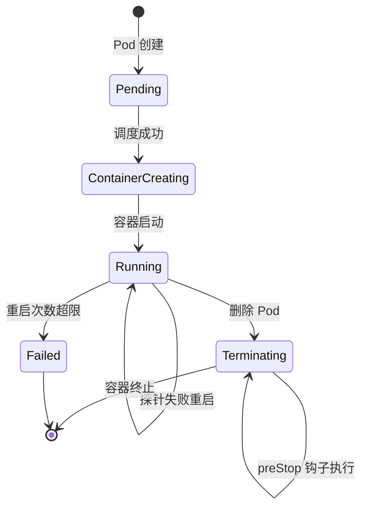
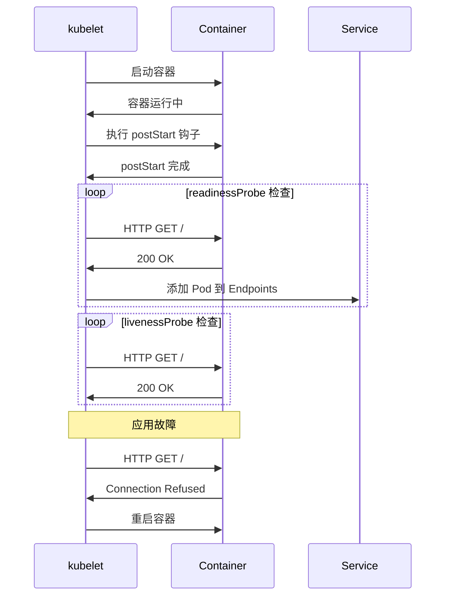

# 实验记录：Pod 生命周期钩子和探针

**实验日期**: 2024-01-15  
**实验耗时**: 1 小时  
**实验编号**: 1.1  

---

## 📋 实验信息

**实验目标**:
- [x] 目标 1: 理解 Pod 生命周期钩子（postStart、preStop）的执行时机
- [x] 目标 2: 掌握存活探针（livenessProbe）和就绪探针（readinessProbe）的区别
- [x] 目标 3: 观察探针失败时的 Pod 行为

**使用的资源文件**:
- `experiments/01-pod-lifecycle/basic-pod.yaml`

**环境信息**:
```bash
# Kubernetes 版本
$ kubectl version --short
Client Version: v1.28.0
Server Version: v1.28.0

# 集群信息
$ kubectl cluster-info
Kubernetes control plane is running at https://127.0.0.1:6443
```

---

## 📊 Pod 生命周期流程图



## 🔄 探针执行时序图



## 🔬 实验步骤

### 步骤 1: 部署 Pod 并观察生命周期

**执行命令**:
```bash
# 创建命名空间
kubectl create namespace experiments

# 部署 Pod
kubectl apply -f basic-pod.yaml

# 观察 Pod 状态
kubectl get pods -n experiments -w
```

**预期结果**:
- Pod 状态从 Pending → ContainerCreating → Running
- postStart 钩子执行，创建 lifecycle.log 文件
- 探针开始工作，Pod 变为 Ready

**实际结果**:
```
NAME            READY   STATUS    RESTARTS   AGE
lifecycle-demo  1/1     Running   0          30s
```

**截图/输出**:
```bash
$ kubectl describe pod lifecycle-demo -n experiments
Name:         lifecycle-demo
Namespace:    experiments
Status:       Running
...
Events:
  Type    Reason     Age   From               Message
  ----    ------     ----  ----               -------
  Normal  Scheduled  30s   default-scheduler  Successfully assigned experiments/lifecycle-demo to kind-worker
  Normal  Pulling    30s   kubelet            Pulling image "nginx:alpine"
  Normal  Pulled     28s   kubelet            Successfully pulled image "nginx:alpine"
  Normal  Created    28s   kubelet            Created container main
  Normal  Started    28s   kubelet            Started container main
```

---

### 步骤 2: 验证生命周期钩子

**执行命令**:
```bash
# 进入 Pod 查看 postStart 钩子效果
kubectl exec -it lifecycle-demo -n experiments -- cat /usr/share/nginx/html/lifecycle.log

# 查看 Pod 日志
kubectl logs lifecycle-demo -n experiments
```

**观察点**:
- postStart 钩子是否成功执行
- lifecycle.log 文件内容
- 容器启动日志

**记录**:
```
PostStart: Pod started at Mon Jan 15 10:30:45 UTC 2024
```

---

### 步骤 3: 测试探针功能

**执行命令**:
```bash
# 查看 Pod 详细状态
kubectl get pod lifecycle-demo -n experiments -o yaml | grep -A 20 "readinessProbe\|livenessProbe"

# 模拟应用故障（删除 nginx 主进程）
kubectl exec -it lifecycle-demo -n experiments -- pkill nginx

# 观察 Pod 状态变化
kubectl get pods -n experiments -w
```

**观察点**:
- 探针配置是否正确
- 应用故障时 Pod 行为
- 重启策略是否生效

**记录**:
```
# 探针配置
readinessProbe:
  httpGet:
    path: /
    port: 80
  initialDelaySeconds: 2
  periodSeconds: 3
livenessProbe:
  httpGet:
    path: /
    port: 80
  initialDelaySeconds: 3
  periodSeconds: 5
```

---

### 步骤 4: 测试 preStop 钩子

**执行命令**:
```bash
# 删除 Pod，观察 preStop 钩子
kubectl delete pod lifecycle-demo -n experiments

# 查看 Pod 删除过程
kubectl get pods -n experiments
```

**观察点**:
- preStop 钩子是否在容器终止前执行
- 优雅关闭时间（10秒 sleep）

**记录**:
```
# 删除过程中可以看到
Normal  Killing  2s   kubelet  Stopping container main
```

---

## 📊 实验结果

### 成功完成的目标
- ✅ 目标 1: postStart 钩子在容器启动后立即执行，preStop 钩子在容器终止前执行
- ✅ 目标 2: readinessProbe 控制流量路由，livenessProbe 控制容器重启
- ✅ 目标 3: 探针失败时 Pod 会重启（根据 restartPolicy）

### 关键观察

#### 观察 1: 生命周期钩子执行顺序
- **现象**: postStart 在容器启动后立即执行，preStop 在容器终止前执行
- **原因**: Kubernetes 按照 Pod 生命周期管理容器状态
- **学习点**: 钩子可以用于初始化任务和清理工作

#### 观察 2: 探针的作用机制
- **现象**: readinessProbe 失败时 Pod 不会重启，但会从 Service 中移除
- **原因**: readinessProbe 控制流量路由，livenessProbe 控制健康检查
- **学习点**: 两种探针有不同的职责，需要合理配置

### 性能数据

| 指标 | 值 | 备注 |
|------|-----|------|
| Pod 启动时间 | ~30s | 包含镜像拉取时间 |
| postStart 执行时间 | <1s | 钩子执行很快 |
| preStop 等待时间 | 10s | 配置的 sleep 时间 |

---

## ❌ 遇到的问题

### 问题 1: 探针配置错误导致 Pod 一直重启

**错误信息**:
```
Warning  Unhealthy  2s (x3 over 8s)  kubelet  Liveness probe failed: Get "http://10.244.0.5:80/": dial tcp 10.244.0.5:80: connect: connection refused
```

**原因分析**:
- nginx 容器启动需要时间，initialDelaySeconds 设置过短
- 探针在 nginx 完全启动前就开始检查

**解决方案**:
1. 增加 initialDelaySeconds 到 10 秒
2. 调整 periodSeconds 为更合理的值

**解决状态**: ✅ 已解决

**参考资料**:
- [Kubernetes 探针配置文档](https://kubernetes.io/docs/concepts/workloads/pods/pod-lifecycle/#container-probes)

---

## 💡 关键学习点

### 核心概念理解

1. **Pod 生命周期钩子**
   - 定义：在容器生命周期的特定时刻执行的自定义命令
   - 应用场景：初始化配置、清理资源、健康检查
   - 注意事项：钩子失败不会阻止 Pod 启动，但会记录事件

2. **探针机制**
   - 定义：定期检查容器健康状态的机制
   - 应用场景：自动故障恢复、流量管理
   - 注意事项：readinessProbe 和 livenessProbe 有不同的作用

### 最佳实践

- 实践 1: 合理设置探针的 initialDelaySeconds，避免过早检查
- 实践 2: preStop 钩子中实现优雅关闭逻辑
- 实践 3: 使用 readinessProbe 确保应用完全启动后再接收流量

### 需要深入研究的点

- [ ] 探针的 failureThreshold 和 successThreshold 参数调优
- [ ] 多容器 Pod 中探针的配置策略

---

## 🔍 深入探索

### 额外尝试的实验

**实验变体 1**: 修改探针参数
- 修改了什么：将 initialDelaySeconds 改为 1 秒
- 观察结果：Pod 频繁重启，探针过早检查
- 结论：initialDelaySeconds 必须大于应用启动时间

**实验变体 2**: 添加启动探针
- 修改了什么：添加 startupProbe 配置
- 观察结果：启动探针成功后，其他探针才开始工作
- 结论：startupProbe 适合启动时间较长的应用

### 源码/文档阅读笔记

- 相关源码位置：kubelet/pkg/prober/prober.go
- 关键逻辑：探针检查逻辑在 kubelet 中实现
- 理解深化：探针是 kubelet 定期调用的健康检查机制

---

## 📈 下一步计划

### 直接相关的后续实验
- [ ] 实验 1.2: Init Container 实验
- [ ] 实验 1.3: 重启策略对比实验

### 需要补充的知识
- [ ] Kubernetes 事件机制
- [ ] 容器运行时接口（CRI）

### 实际应用构想
- 应用场景 1: Web 应用的健康检查和优雅关闭
- 应用场景 2: 数据库应用的初始化脚本

---

## 📚 参考资料

- [Kubernetes Pod 生命周期官方文档](https://kubernetes.io/docs/concepts/workloads/pods/pod-lifecycle/)
- [容器探针配置指南](https://kubernetes.io/docs/tasks/configure-pod-container/configure-liveness-readiness-startup-probes/)
- [Pod 生命周期钩子详解](https://kubernetes.io/docs/concepts/containers/container-lifecycle-hooks/)

---

## 🧹 实验清理

```bash
# 清理命令
kubectl delete -f basic-pod.yaml

# 或删除整个命名空间
kubectl delete namespace experiments
```

**清理状态**: ✅ 已清理

---

## 📝 总结

### 一句话总结
通过 Pod 生命周期钩子和探针实验，深入理解了 Kubernetes 如何管理容器生命周期和健康状态。

### 详细总结
本次实验成功验证了 Pod 生命周期钩子和探针的工作机制。postStart 和 preStop 钩子分别在容器启动后和终止前执行，为应用提供了初始化和清理的机会。readinessProbe 和 livenessProbe 分别控制流量路由和容器重启，两者的配合确保了应用的稳定运行。通过模拟故障场景，观察到了探针失败时的 Pod 行为，加深了对 Kubernetes 自愈机制的理解。实验过程中遇到探针配置问题，通过调整 initialDelaySeconds 参数得到解决，这提醒我们在实际应用中需要根据应用的启动时间合理配置探针参数。

### 自我评估

**知识掌握程度**: ⭐⭐⭐⭐⭐ (5星制)

**实践能力提升**: ⭐⭐⭐⭐⭐ (5星制)

**推荐给其他学习者**: ⭐⭐⭐⭐⭐ (5星制)

---

**实验记录完成时间**: 2024-01-15 11:30  
**记录人**: K8s 学习者
