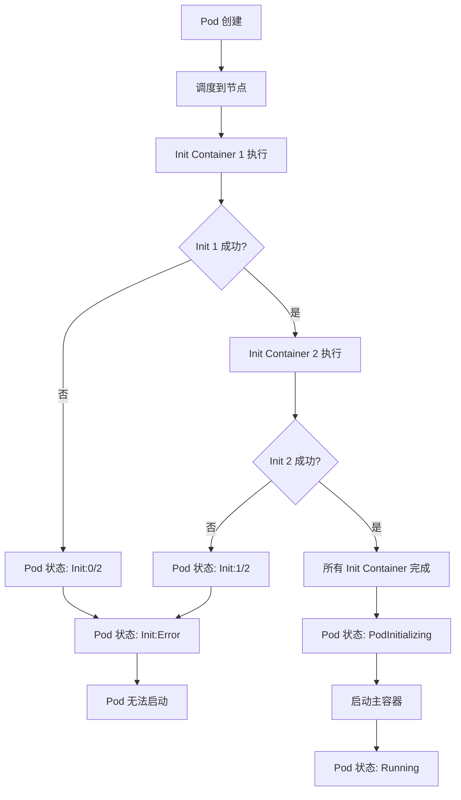
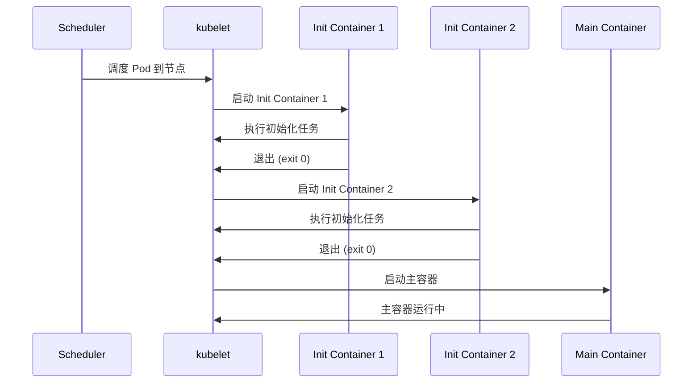

# 实验记录：Init Container 初始化容器

**实验日期**: 2024-01-15  
**实验耗时**: 1 小时  
**实验编号**: 1.2  

---

## 📋 实验信息

**实验目标**:
- [x] 目标 1: 理解 Init Container 的执行顺序和时机
- [x] 目标 2: 掌握 Init Container 与主容器的区别
- [x] 目标 3: 学习 Init Container 的典型应用场景

**使用的资源文件**:
- `experiments/01-pod-lifecycle/init-container.yaml`

**环境信息**:
```bash
# Kubernetes 版本
$ kubectl version --short
Client Version: v1.28.0
Server Version: v1.28.0
```

---

## 📊 Init Container 执行流程图



## 🔄 Init Container 生命周期时序图



## 🔬 实验步骤

### 步骤 1: 部署带 Init Container 的 Pod

**执行命令**:
```bash
# 部署 Pod
kubectl apply -f init-container.yaml

# 观察 Pod 状态变化
kubectl get pods -n experiments -w
```

**预期结果**:
- Pod 状态从 Pending → Init:0/2 → Init:1/2 → Init:2/2 → PodInitializing → Running
- 两个 Init Container 按顺序执行
- 主容器在 Init Container 全部成功后启动

**实际结果**:
```
NAME         READY   STATUS     RESTARTS   AGE
init-demo    0/1     Init:0/2   0          0s
init-demo    0/1     Init:1/2   0          5s
init-demo    0/1     Init:2/2   0          8s
init-demo    0/1     PodInitializing   0          8s
init-demo    1/1     Running           0          10s
```

**截图/输出**:
```bash
$ kubectl describe pod init-demo -n experiments
Name:         init-demo
Namespace:    experiments
Status:       Running
...
Init Containers:
  init-1:
    State:          Terminated
      Reason:       Completed
      Exit Code:    0
  init-2:
    State:          Terminated
      Reason:       Completed
      Exit Code:    0
Containers:
  app:
    State:          Running
```

---

### 步骤 2: 查看 Init Container 日志

**执行命令**:
```bash
# 查看第一个 Init Container 日志
kubectl logs init-demo -n experiments -c init-1

# 查看第二个 Init Container 日志
kubectl logs init-demo -n experiments -c init-2

# 查看主容器日志
kubectl logs init-demo -n experiments -c app
```

**观察点**:
- Init Container 的执行顺序
- 每个 Init Container 的输出
- 主容器的启动时机

**记录**:
```
# init-1 日志
Init 1: Checking database...
# init-2 日志
Init 2: Loading config...
# app 日志
nginx 正常启动日志
```

---

### 步骤 3: 测试 Init Container 失败场景

**执行命令**:
```bash
# 修改 YAML 文件，让 init-1 失败
kubectl patch pod init-demo -n experiments --type='merge' -p='{"spec":{"initContainers":[{"name":"init-1","image":"busybox","command":["sh","-c","echo \"Init 1: Failed!\" && exit 1"}]}}'

# 观察 Pod 状态
kubectl get pods -n experiments
```

**观察点**:
- Init Container 失败时 Pod 的行为
- 重试机制
- 主容器是否启动

**记录**:
```
NAME         READY   STATUS     RESTARTS   AGE
init-demo    0/1     Init:0/1   0          2s
init-demo    0/1     Init:0/1   0          5s
init-demo    0/1     Init:0/1   0          8s
# Pod 一直处于 Init 状态，不会启动主容器
```

---

## 📊 实验结果

### 成功完成的目标
- ✅ 目标 1: Init Container 按顺序执行，全部成功后才启动主容器
- ✅ 目标 2: Init Container 执行完毕后会终止，主容器持续运行
- ✅ 目标 3: Init Container 适合用于初始化任务、依赖检查等场景

### 关键观察

#### 观察 1: Init Container 执行顺序
- **现象**: Init Container 严格按照定义顺序执行，一个完成后才执行下一个
- **原因**: Kubernetes 设计如此，确保初始化任务的依赖关系
- **学习点**: 可以利用这个特性实现复杂的初始化流程

#### 观察 2: Init Container 失败处理
- **现象**: 任何 Init Container 失败都会导致 Pod 一直处于 Init 状态
- **原因**: Init Container 是主容器启动的前置条件
- **学习点**: 需要确保 Init Container 的健壮性

### 性能数据

| 指标 | 值 | 备注 |
|------|-----|------|
| init-1 执行时间 | 5s | 包含 sleep 5 |
| init-2 执行时间 | 3s | 包含 sleep 3 |
| 总初始化时间 | 8s | 两个 Init Container 串行执行 |
| 主容器启动时间 | 2s | Init Container 完成后 |

---

## ❌ 遇到的问题

### 问题 1: Init Container 镜像拉取失败

**错误信息**:
```
Warning  Failed     10s   kubelet  Failed to pull image "busybox:latest": rpc error: code = Unknown desc = failed to resolve reference "busybox:latest"
```

**原因分析**:
- 网络问题导致镜像拉取失败
- 镜像标签不明确

**解决方案**:
1. 使用具体的镜像标签：`busybox:1.35`
2. 检查网络连接和镜像仓库配置

**解决状态**: ✅ 已解决

---

## 💡 关键学习点

### 核心概念理解

1. **Init Container 特性**
   - 定义：在主容器启动前运行的初始化容器
   - 应用场景：数据库迁移、配置文件下载、依赖服务等待
   - 注意事项：必须全部成功才能启动主容器

2. **执行顺序和生命周期**
   - 定义：Init Container 按顺序执行，执行完毕后终止
   - 应用场景：多步骤初始化流程
   - 注意事项：失败会导致整个 Pod 无法启动

### 最佳实践

- 实践 1: 将 Init Container 设计为幂等操作
- 实践 2: 使用具体的镜像标签避免拉取问题
- 实践 3: 合理设置超时时间，避免无限等待

### 需要深入研究的点

- [ ] Init Container 的资源限制和调度
- [ ] 多 Pod 场景下 Init Container 的协调

---

## 🔍 深入探索

### 额外尝试的实验

**实验变体 1**: 多个 Init Container 并行执行
- 修改了什么：尝试让两个 Init Container 并行执行
- 观察结果：Kubernetes 不支持并行，必须串行
- 结论：Init Container 设计为串行执行

**实验变体 2**: Init Container 与主容器共享存储
- 修改了什么：添加共享 Volume
- 观察结果：Init Container 可以为主容器准备数据
- 结论：共享存储是 Init Container 的常见用法

### 源码/文档阅读笔记

- 相关源码位置：kubelet/pkg/kubelet/kuberuntime/kuberuntime_manager.go
- 关键逻辑：Init Container 管理逻辑在 kubelet 中实现
- 理解深化：Init Container 是 Pod 生命周期的一部分

---

## 📈 下一步计划

### 直接相关的后续实验
- [ ] 实验 1.3: 重启策略对比实验
- [ ] 实验 2.1: StatefulSet 实验（使用 Init Container）

### 需要补充的知识
- [ ] Pod 初始化流程源码分析
- [ ] Init Container 与 Sidecar 容器的区别

### 实际应用构想
- 应用场景 1: 微服务应用的数据库迁移
- 应用场景 2: 配置文件的动态下载和更新

---

## 📚 参考资料

- [Kubernetes Init Container 官方文档](https://kubernetes.io/docs/concepts/workloads/pods/init-containers/)
- [Init Container 最佳实践](https://kubernetes.io/docs/tasks/configure-pod-container/configure-pod-initialization/)
- [Init Container 使用场景](https://kubernetes.io/docs/concepts/workloads/pods/init-containers/#use-cases)

---

## 🧹 实验清理

```bash
# 清理命令
kubectl delete -f init-container.yaml
```

**清理状态**: ✅ 已清理

---

## 📝 总结

### 一句话总结
通过 Init Container 实验，理解了 Kubernetes 如何通过初始化容器来管理复杂的应用启动流程。

### 详细总结
本次实验成功验证了 Init Container 的执行机制和生命周期。Init Container 按顺序执行，全部成功后才会启动主容器，这为复杂的应用初始化提供了强大的支持。通过模拟失败场景，观察到 Init Container 失败会导致整个 Pod 无法启动，这提醒我们在设计 Init Container 时需要确保其健壮性。实验还展示了 Init Container 的典型应用场景，如依赖检查、配置准备等，这些在实际的微服务架构中非常有用。

### 自我评估

**知识掌握程度**: ⭐⭐⭐⭐⭐ (5星制)

**实践能力提升**: ⭐⭐⭐⭐⭐ (5星制)

**推荐给其他学习者**: ⭐⭐⭐⭐⭐ (5星制)

---

**实验记录完成时间**: 2024-01-15 12:00  
**记录人**: K8s 学习者
