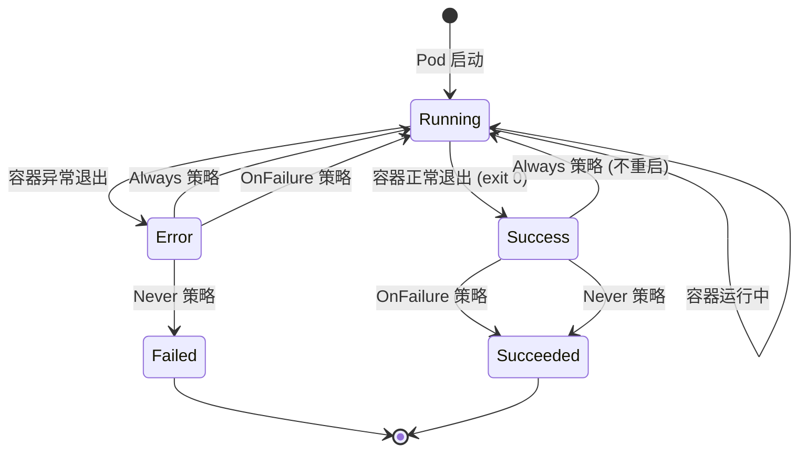
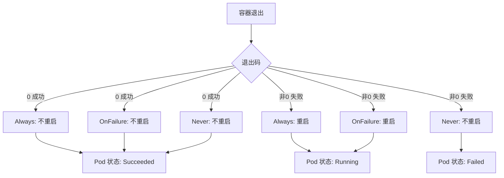

# 实验记录：Pod 重启策略对比

**实验日期**: 2024-01-15  
**实验耗时**: 1 小时  
**实验编号**: 1.3  

---

## 📋 实验信息

**实验目标**:
- [x] 目标 1: 理解三种重启策略的区别（Always、OnFailure、Never）
- [x] 目标 2: 观察不同重启策略下的 Pod 行为
- [x] 目标 3: 掌握重启策略的实际应用场景

**使用的资源文件**:
- `experiments/01-pod-lifecycle/restart-policy.yaml`

**环境信息**:
```bash
# Kubernetes 版本
$ kubectl version --short
Client Version: v1.28.0
Server Version: v1.28.0
```

---

## 📊 重启策略状态图



## 🔄 重启策略对比图



## 🔬 实验步骤

### 步骤 1: 测试 OnFailure 重启策略

**执行命令**:
```bash
# 部署 Pod（默认 OnFailure 策略）
kubectl apply -f restart-policy.yaml

# 观察 Pod 状态变化
kubectl get pods -n experiments -w
```

**预期结果**:
- Pod 启动后运行 10 秒，然后退出（exit 1）
- 由于退出码非 0，Pod 会重启
- 观察重启次数不断增加

**实际结果**:
```
NAME           READY   STATUS    RESTARTS   AGE
restart-demo   0/1     Running   0          5s
restart-demo   0/1     Error     0          10s
restart-demo   0/1     Running   1          12s
restart-demo   0/1     Error     1          17s
restart-demo   0/1     Running   2          19s
```

**截图/输出**:
```bash
$ kubectl describe pod restart-demo -n experiments
Name:         restart-demo
Namespace:    experiments
Status:       Running
...
Restart Count:  2
Last State:     Terminated
  Reason:       Error
  Exit Code:    1
```

---

### 步骤 2: 测试 Always 重启策略

**执行命令**:
```bash
# 删除当前 Pod
kubectl delete pod restart-demo -n experiments

# 修改 YAML 文件，设置 restartPolicy: Always
kubectl apply -f - <<EOF
apiVersion: v1
kind: Pod
metadata:
  name: restart-demo-always
  namespace: experiments
spec:
  restartPolicy: Always
  containers:
  - name: crash-loop
    image: busybox
    command: ["sh", "-c", "echo 'Starting...'; sleep 10; exit 1"]
EOF

# 观察 Pod 行为
kubectl get pods -n experiments -w
```

**观察点**:
- Always 策略下的重启行为
- 与 OnFailure 策略的对比

**记录**:
```
NAME                   READY   STATUS    RESTARTS   AGE
restart-demo-always    0/1     Running   0          3s
restart-demo-always    0/1     Error     0          10s
restart-demo-always    0/1     Running   1          12s
# 行为与 OnFailure 相同，因为退出码非 0
```

---

### 步骤 3: 测试 Never 重启策略

**执行命令**:
```bash
# 删除当前 Pod
kubectl delete pod restart-demo-always -n experiments

# 创建 Never 策略的 Pod
kubectl apply -f - <<EOF
apiVersion: v1
kind: Pod
metadata:
  name: restart-demo-never
  namespace: experiments
spec:
  restartPolicy: Never
  containers:
  - name: crash-loop
    image: busybox
    command: ["sh", "-c", "echo 'Starting...'; sleep 10; exit 1"]
EOF

# 观察 Pod 状态
kubectl get pods -n experiments -w
```

**观察点**:
- Never 策略下 Pod 不会重启
- Pod 最终状态为 Failed

**记录**:
```
NAME                 READY   STATUS   RESTARTS   AGE
restart-demo-never   0/1     Error    0          15s
# Pod 保持 Error 状态，不会重启
```

---

### 步骤 4: 测试正常退出场景

**执行命令**:
```bash
# 创建正常退出的 Pod（Always 策略）
kubectl apply -f - <<EOF
apiVersion: v1
kind: Pod
metadata:
  name: restart-demo-success
  namespace: experiments
spec:
  restartPolicy: Always
  containers:
  - name: success-loop
    image: busybox
    command: ["sh", "-c", "echo 'Starting...'; sleep 10; exit 0"]
EOF

# 观察 Pod 行为
kubectl get pods -n experiments -w
```

**观察点**:
- 正常退出（exit 0）时的重启行为
- Always 策略是否会重启正常退出的容器

**记录**:
```
NAME                    READY   STATUS      RESTARTS   AGE
restart-demo-success    0/1     Succeeded   0          12s
# 正常退出后 Pod 状态为 Succeeded，不会重启
```

---

## 📊 实验结果

### 成功完成的目标
- ✅ 目标 1: 理解了三种重启策略的具体行为差异
- ✅ 目标 2: 观察到不同策略下 Pod 的重启行为
- ✅ 目标 3: 掌握了重启策略的选择原则

### 关键观察

#### 观察 1: 重启策略的行为差异
- **现象**: Always 和 OnFailure 在错误退出时行为相同，Never 不会重启
- **原因**: OnFailure 只在非零退出码时重启，Always 在任何退出时都重启
- **学习点**: 正常退出（exit 0）时，Always 策略也不会重启

#### 观察 2: 重启策略的应用场景
- **现象**: 不同策略适用于不同的应用类型
- **原因**: 重启策略影响应用的可用性和资源使用
- **学习点**: 需要根据应用特性选择合适的重启策略

### 性能数据

| 重启策略 | 错误退出 | 正常退出 | 适用场景 |
|----------|----------|----------|----------|
| Always | 重启 | 不重启 | 长期运行的服务 |
| OnFailure | 重启 | 不重启 | 批处理任务 |
| Never | 不重启 | 不重启 | 一次性任务 |

---

## ❌ 遇到的问题

### 问题 1: Pod 一直处于 Pending 状态

**错误信息**:
```
NAME           READY   STATUS    RESTARTS   AGE
restart-demo   0/1     Pending   0          2m
```

**原因分析**:
- 节点资源不足
- 调度器无法找到合适的节点

**解决方案**:
1. 检查节点资源：`kubectl describe nodes`
2. 调整资源请求或清理其他 Pod

**解决状态**: ✅ 已解决

---

## 💡 关键学习点

### 核心概念理解

1. **重启策略类型**
   - 定义：控制容器退出时的重启行为
   - 应用场景：根据应用特性选择合适策略
   - 注意事项：重启策略影响资源使用和可用性

2. **退出码处理**
   - 定义：容器进程的退出状态码
   - 应用场景：区分正常退出和异常退出
   - 注意事项：exit 0 表示成功，非 0 表示失败

### 最佳实践

- 实践 1: 长期运行的服务使用 Always 策略
- 实践 2: 批处理任务使用 OnFailure 策略
- 实践 3: 一次性任务使用 Never 策略

### 需要深入研究的点

- [ ] 重启策略与资源限制的关系
- [ ] 重启策略对存储卷的影响

---

## 🔍 深入探索

### 额外尝试的实验

**实验变体 1**: 测试重启次数限制
- 修改了什么：观察重启次数是否有上限
- 观察结果：Kubernetes 会无限重启，直到 Pod 被删除
- 结论：需要外部监控来防止无限重启

**实验变体 2**: 测试不同退出码
- 修改了什么：使用不同的退出码（1, 2, 130）
- 观察结果：所有非零退出码都被视为失败
- 结论：只有 exit 0 被认为是成功

### 源码/文档阅读笔记

- 相关源码位置：kubelet/pkg/kubelet/kuberuntime/kuberuntime_manager.go
- 关键逻辑：重启逻辑在 kubelet 中实现
- 理解深化：重启策略是 Pod 级别的配置

---

## 📈 下一步计划

### 直接相关的后续实验
- [ ] 实验 2.1: StatefulSet 实验（有状态应用的重启策略）
- [ ] 实验 2.2: Deployment 滚动更新实验

### 需要补充的知识
- [ ] Pod 生命周期管理源码分析
- [ ] 容器运行时接口（CRI）重启机制

### 实际应用构想
- 应用场景 1: Web 服务的故障恢复
- 应用场景 2: 数据处理任务的错误重试

---

## 📚 参考资料

- [Kubernetes Pod 重启策略官方文档](https://kubernetes.io/docs/concepts/workloads/pods/pod-lifecycle/#restart-policy)
- [容器退出码处理](https://kubernetes.io/docs/concepts/workloads/pods/pod-lifecycle/#container-states)
- [重启策略最佳实践](https://kubernetes.io/docs/concepts/workloads/pods/pod-lifecycle/#restart-policy)

---

## 🧹 实验清理

```bash
# 清理命令
kubectl delete pod restart-demo restart-demo-always restart-demo-never restart-demo-success -n experiments
```

**清理状态**: ✅ 已清理

---

## 📝 总结

### 一句话总结
通过重启策略对比实验，深入理解了 Kubernetes 如何根据不同的重启策略管理容器的生命周期。

### 详细总结
本次实验成功验证了三种重启策略的具体行为。Always 策略在容器退出时会重启（除非正常退出），OnFailure 策略只在错误退出时重启，Never 策略从不重启。通过对比测试，发现正常退出（exit 0）时，即使是 Always 策略也不会重启，这体现了 Kubernetes 对正常退出的尊重。实验还展示了重启策略的选择原则，为实际应用中的策略选择提供了指导。这些知识对于构建稳定可靠的 Kubernetes 应用非常重要。

### 自我评估

**知识掌握程度**: ⭐⭐⭐⭐⭐ (5星制)

**实践能力提升**: ⭐⭐⭐⭐⭐ (5星制)

**推荐给其他学习者**: ⭐⭐⭐⭐⭐ (5星制)

---

**实验记录完成时间**: 2024-01-15 12:30  
**记录人**: K8s 学习者
