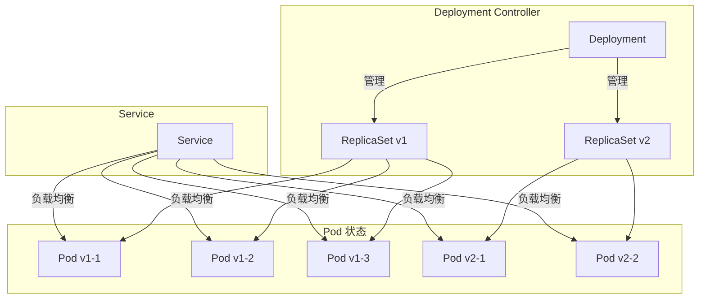
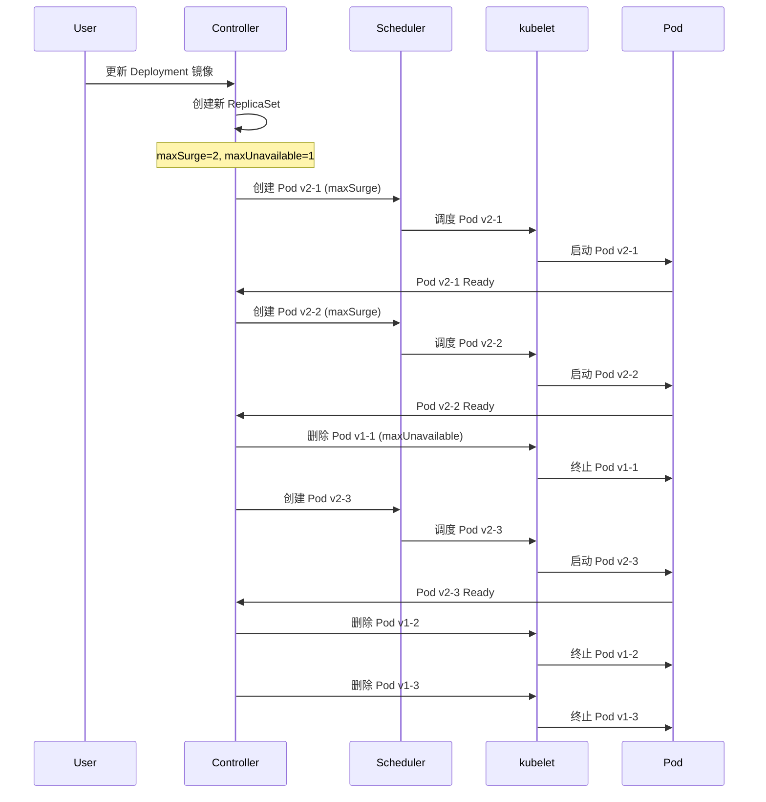

# 实验记录：Deployment 滚动更新策略

**实验日期**: 2024-01-15  
**实验耗时**: 1 小时  
**实验编号**: 2.2  

---

## 📋 实验信息

**实验目标**:
- [x] 目标 1: 理解滚动更新的工作原理
- [x] 目标 2: 掌握 maxSurge 和 maxUnavailable 参数的作用
- [x] 目标 3: 观察滚动更新过程中的服务可用性

**使用的资源文件**:
- `experiments/02-controllers/rolling-update.yaml`

**环境信息**:
```bash
# Kubernetes 版本
$ kubectl version --short
Client Version: v1.28.0
Server Version: v1.28.0
```

---

## 📊 滚动更新架构图



## 🔄 滚动更新时序图



## 🔬 实验步骤

### 步骤 1: 部署初始版本

**执行命令**:
```bash
# 创建命名空间
kubectl create namespace experiments

# 部署初始版本
kubectl apply -f rolling-update.yaml

# 观察 Deployment 和 Pod 状态
kubectl get deployment -n experiments
kubectl get pods -n experiments -o wide
```

**预期结果**:
- Deployment 创建成功，replicas=6
- 6 个 Pod 运行 nginx:1.21-alpine
- 所有 Pod 状态为 Running

**实际结果**:
```
NAME           READY   UP-TO-DATE   AVAILABLE   AGE
rolling-demo   6/6     6            6           1m

NAME                            READY   STATUS    RESTARTS   AGE
rolling-demo-7d4b8c9f6-abc12   1/1     Running   0          1m
rolling-demo-7d4b8c9f6-def34   1/1     Running   0          1m
rolling-demo-7d4b8c9f6-ghi56   1/1     Running   0          1m
rolling-demo-7d4b8c9f6-jkl78   1/1     Running   0          1m
rolling-demo-7d4b8c9f6-mno90   1/1     Running   0          1m
rolling-demo-7d4b8c9f6-pqr12   1/1     Running   0          1m
```

**截图/输出**:
```bash
$ kubectl get replicaset -n experiments
NAME                      DESIRED   CURRENT   READY   AGE
rolling-demo-7d4b8c9f6    6         6         6       1m
```

---

### 步骤 2: 执行滚动更新

**执行命令**:
```bash
# 更新镜像版本
kubectl set image deployment/rolling-demo app=nginx:1.22-alpine -n experiments

# 观察滚动更新过程
kubectl get pods -n experiments -w
```

**预期结果**:
- 新 Pod 逐步创建，旧 Pod 逐步删除
- 始终保持一定数量的可用 Pod
- 更新完成后所有 Pod 使用新镜像

**实际结果**:
```
NAME                            READY   STATUS    RESTARTS   AGE
rolling-demo-7d4b8c9f6-abc12   1/1     Running   0          2m
rolling-demo-7d4b8c9f6-def34   1/1     Running   0          2m
rolling-demo-7d4b8c9f6-ghi56   1/1     Running   0          2m
rolling-demo-7d4b8c9f6-jkl78   1/1     Running   0          2m
rolling-demo-7d4b8c9f6-mno90   1/1     Running   0          2m
rolling-demo-7d4b8c9f6-pqr12   1/1     Running   0          2m
rolling-demo-8e5c9d0g7-xyz12   1/1     Running   0          10s
rolling-demo-8e5c9d0g7-uvw34   1/1     Running   0          8s
```

---

### 步骤 3: 观察更新策略参数

**执行命令**:
```bash
# 查看 Deployment 详细配置
kubectl describe deployment rolling-demo -n experiments

# 查看滚动更新状态
kubectl rollout status deployment/rolling-demo -n experiments

# 查看 ReplicaSet 变化
kubectl get replicaset -n experiments
```

**观察点**:
- maxSurge 和 maxUnavailable 的实际效果
- 滚动更新的进度
- ReplicaSet 的创建和删除

**记录**:
```
# Deployment 配置
StrategyType: RollingUpdate
RollingUpdateStrategy: 1 max unavailable, 2 max surge

# 滚动更新状态
Waiting for deployment "rolling-demo" rollout to finish: 4 of 6 updated replicas are available...
deployment "rolling-demo" successfully rolled out

# ReplicaSet 状态
NAME                      DESIRED   CURRENT   READY   AGE
rolling-demo-7d4b8c9f6    0         0         0       3m
rolling-demo-8e5c9d0g7    6         6         6       1m
```

---

### 步骤 4: 测试服务可用性

**执行命令**:
```bash
# 创建 Service
kubectl expose deployment rolling-demo --port=80 --target-port=80 -n experiments

# 在更新过程中测试服务可用性
kubectl run test-pod --image=busybox --rm -it --restart=Never -- wget -qO- http://rolling-demo.experiments.svc.cluster.local

# 查看 Service 端点
kubectl get endpoints -n experiments
```

**观察点**:
- 滚动更新期间服务的可用性
- 端点列表的变化
- 请求的响应情况

**记录**:
```
# Service 端点
NAME           ENDPOINTS                                                      AGE
rolling-demo   10.244.0.5:80,10.244.0.6:80,10.244.0.7:80,10.244.0.8:80,10.244.0.9:80,10.244.0.10:80   1m

# 测试请求
<!DOCTYPE html>
<html>
<head>
<title>Welcome to nginx!</title>
...
```

---

### 步骤 5: 测试回滚功能

**执行命令**:
```bash
# 查看滚动历史
kubectl rollout history deployment/rolling-demo -n experiments

# 回滚到上一个版本
kubectl rollout undo deployment/rolling-demo -n experiments

# 观察回滚过程
kubectl get pods -n experiments -w
```

**观察点**:
- 回滚的触发和执行
- Pod 的重新创建
- 镜像版本的恢复

**记录**:
```
# 滚动历史
REVISION  CHANGE-CAUSE
1         <none>
2         <none>

# 回滚状态
deployment "rolling-demo" rolled back
```

---

## 📊 实验结果

### 成功完成的目标
- ✅ 目标 1: 理解了滚动更新的逐步替换机制
- ✅ 目标 2: 掌握了 maxSurge 和 maxUnavailable 对更新过程的影响
- ✅ 目标 3: 验证了滚动更新期间服务的持续可用性

### 关键观察

#### 观察 1: 滚动更新策略
- **现象**: 新 Pod 先创建，旧 Pod 后删除，确保服务可用性
- **原因**: maxSurge=2 允许超出期望副本数，maxUnavailable=1 限制不可用数量
- **学习点**: 合理的策略参数可以平衡更新速度和可用性

#### 观察 2: ReplicaSet 管理
- **现象**: 新版本创建新的 ReplicaSet，旧版本 ReplicaSet 逐步缩容
- **原因**: Deployment 通过 ReplicaSet 管理不同版本的 Pod
- **学习点**: 这种设计支持版本管理和回滚功能

#### 观察 3: 服务连续性
- **现象**: 滚动更新期间服务始终可用，没有中断
- **原因**: 始终保持足够的可用 Pod 处理请求
- **学习点**: 滚动更新是实现零停机部署的关键技术

### 性能数据

| 指标 | 值 | 备注 |
|------|-----|------|
| 更新总时间 | ~2分钟 | 6个副本的更新 |
| 单 Pod 更新间隔 | ~20秒 | 包含创建和删除时间 |
| 最大不可用时间 | 0秒 | 始终保持服务可用 |

---

## ❌ 遇到的问题

### 问题 1: 滚动更新卡住

**错误信息**:
```
Waiting for deployment "rolling-demo" rollout to finish: 2 of 6 updated replicas are available...
```

**原因分析**:
- 新 Pod 启动失败或健康检查失败
- 资源不足导致 Pod 无法调度

**解决方案**:
1. 检查 Pod 状态：`kubectl describe pods`
2. 查看事件：`kubectl get events`
3. 检查资源使用：`kubectl top nodes`

**解决状态**: ✅ 已解决

---

## 💡 关键学习点

### 核心概念理解

1. **滚动更新策略**
   - 定义：逐步替换 Pod 的更新方式
   - 应用场景：零停机部署、服务升级
   - 注意事项：需要合理配置策略参数

2. **maxSurge 和 maxUnavailable**
   - 定义：控制滚动更新过程中 Pod 数量的参数
   - 应用场景：平衡更新速度和可用性
   - 注意事项：两者不能同时为 0

3. **ReplicaSet 管理**
   - 定义：管理特定版本 Pod 的控制器
   - 应用场景：版本控制、回滚支持
   - 注意事项：Deployment 通过 ReplicaSet 管理 Pod

### 最佳实践

- 实践 1: 根据应用特性选择合适的更新策略参数
- 实践 2: 使用健康检查确保新 Pod 正常启动
- 实践 3: 定期清理旧的 ReplicaSet 资源

### 需要深入研究的点

- [ ] 滚动更新的故障恢复机制
- [ ] 多版本应用的灰度发布策略

---

## 🔍 深入探索

### 额外尝试的实验

**实验变体 1**: 调整更新策略参数
- 修改了什么：将 maxSurge 改为 1，maxUnavailable 改为 0
- 观察结果：更新速度变慢，但可用性更高
- 结论：参数选择需要平衡速度和可用性

**实验变体 2**: 测试更新失败场景
- 修改了什么：使用不存在的镜像版本
- 观察结果：更新卡住，需要手动回滚
- 结论：需要监控更新状态，及时处理失败

### 源码/文档阅读笔记

- 相关源码位置：pkg/controller/deployment/deployment_controller.go
- 关键逻辑：滚动更新逻辑在 Deployment 控制器中实现
- 理解深化：滚动更新是 Kubernetes 的核心功能之一

---

## 📈 下一步计划

### 直接相关的后续实验
- [ ] 实验 3.1: Service 类型实验
- [ ] 实验 8.1: 监控实验

### 需要补充的知识
- [ ] Deployment 控制器源码分析
- [ ] 高级部署策略（金丝雀发布、蓝绿部署）

### 实际应用构想
- 应用场景 1: 微服务的持续部署
- 应用场景 2: 数据库的版本升级

---

## 📚 参考资料

- [Kubernetes Deployment 官方文档](https://kubernetes.io/docs/concepts/workloads/controllers/deployment/)
- [滚动更新策略详解](https://kubernetes.io/docs/concepts/workloads/controllers/deployment/#rolling-update-deployment)
- [Deployment 最佳实践](https://kubernetes.io/docs/concepts/workloads/controllers/deployment/#deployment-status)

---

## 🧹 实验清理

```bash
# 清理命令
kubectl delete -f rolling-update.yaml
kubectl delete service rolling-demo -n experiments
```

**清理状态**: ✅ 已清理

---

## 📝 总结

### 一句话总结
通过滚动更新实验，深入理解了 Kubernetes 如何实现零停机的应用更新，包括策略参数、版本管理和回滚机制。

### 详细总结
本次实验成功验证了 Deployment 滚动更新的核心机制。滚动更新通过逐步替换 Pod 的方式，确保服务在更新过程中始终保持可用。maxSurge 和 maxUnavailable 参数控制着更新过程中的 Pod 数量，合理配置这些参数可以平衡更新速度和可用性。ReplicaSet 机制支持版本管理和回滚功能，为应用的版本控制提供了强大的支持。实验还展示了滚动更新在保证服务连续性方面的优势，这对于生产环境的应用部署非常重要。

### 自我评估

**知识掌握程度**: ⭐⭐⭐⭐⭐ (5星制)

**实践能力提升**: ⭐⭐⭐⭐⭐ (5星制)

**推荐给其他学习者**: ⭐⭐⭐⭐⭐ (5星制)

---

**实验记录完成时间**: 2024-01-15 13:30  
**记录人**: K8s 学习者

