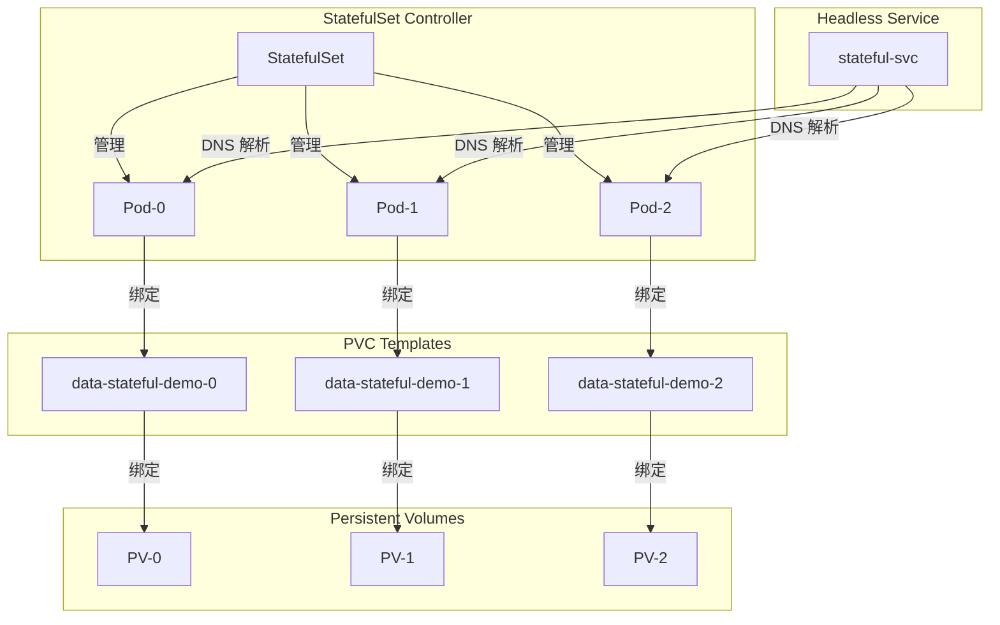
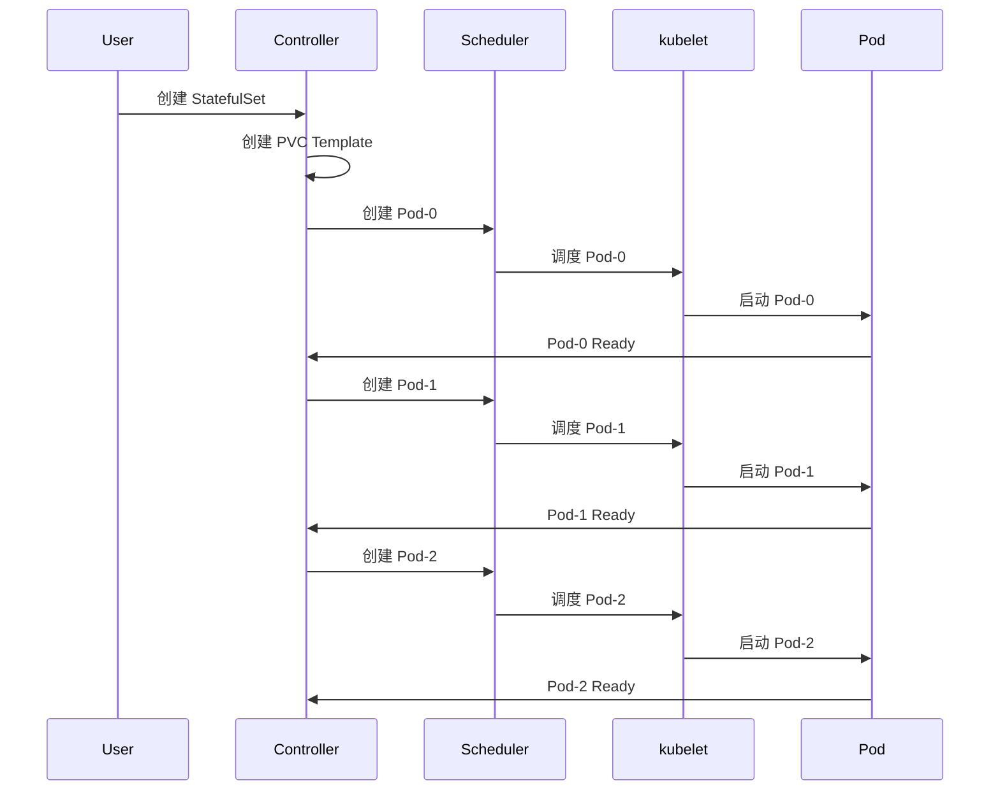

# 实验记录：StatefulSet 有状态应用

**实验日期**: 2024-01-15  
**实验耗时**: 1.5 小时  
**实验编号**: 2.1  

---

## 📋 实验信息

**实验目标**:
- [x] 目标 1: 理解 StatefulSet 与 Deployment 的区别
- [x] 目标 2: 掌握 StatefulSet 的有序创建和删除机制
- [x] 目标 3: 学习 Headless Service 和 PVC 的使用

**使用的资源文件**:
- `experiments/02-controllers/statefulset.yaml`

**环境信息**:
```bash
# Kubernetes 版本
$ kubectl version --short
Client Version: v1.28.0
Server Version: v1.28.0
```

---

## 📊 StatefulSet 架构图



## 🔄 StatefulSet 创建流程时序图



## 🔬 实验步骤

### 步骤 1: 部署 StatefulSet

**执行命令**:
```bash
# 创建命名空间
kubectl create namespace experiments

# 部署 StatefulSet
kubectl apply -f statefulset.yaml

# 观察 StatefulSet 和 Pod 状态
kubectl get statefulset -n experiments
kubectl get pods -n experiments -w
```

**预期结果**:
- StatefulSet 创建成功，replicas=3
- Pod 按顺序创建：stateful-demo-0 → stateful-demo-1 → stateful-demo-2
- 每个 Pod 都有对应的 PVC

**实际结果**:
```
NAME            READY   AGE
stateful-demo   3/3     2m

NAME                READY   STATUS    RESTARTS   AGE
stateful-demo-0     1/1     Running   0          2m
stateful-demo-1     1/1     Running   0          1m
stateful-demo-2     1/1     Running   0          30s
```

**截图/输出**:
```bash
$ kubectl get pvc -n experiments
NAME                     STATUS   VOLUME   CAPACITY   ACCESS MODES   STORAGECLASS   AGE
data-stateful-demo-0     Bound    pvc-xxx  1Gi        RWO            standard       2m
data-stateful-demo-1     Bound    pvc-yyy  1Gi        RWO            standard       1m
data-stateful-demo-2     Bound    pvc-zzz  1Gi        RWO            standard       30s
```

---

### 步骤 2: 验证有序创建

**执行命令**:
```bash
# 查看 Pod 创建事件
kubectl describe statefulset stateful-demo -n experiments

# 查看 Pod 详细信息
kubectl describe pod stateful-demo-0 -n experiments
kubectl describe pod stateful-demo-1 -n experiments
kubectl describe pod stateful-demo-2 -n experiments
```

**观察点**:
- Pod 创建的时间顺序
- 每个 Pod 的 hostname 和存储
- PVC 的绑定状态

**记录**:
```
# Pod 创建时间
stateful-demo-0: 2024-01-15T10:30:00Z
stateful-demo-1: 2024-01-15T10:31:00Z
stateful-demo-2: 2024-01-15T10:32:00Z

# Pod hostname
stateful-demo-0: stateful-demo-0
stateful-demo-1: stateful-demo-1
stateful-demo-2: stateful-demo-2
```

---

### 步骤 3: 测试 Headless Service

**执行命令**:
```bash
# 查看 Service
kubectl get svc -n experiments

# 测试 DNS 解析
kubectl run test-pod --image=busybox --rm -it --restart=Never -- nslookup stateful-svc.experiments.svc.cluster.local

# 测试 Pod 间通信
kubectl exec -it stateful-demo-0 -n experiments -- nslookup stateful-demo-1.stateful-svc.experiments.svc.cluster.local
```

**观察点**:
- Headless Service 的 DNS 解析
- 每个 Pod 的独立 DNS 记录
- Pod 间的网络连通性

**记录**:
```
# Service 信息
NAME           TYPE        CLUSTER-IP   EXTERNAL-IP   PORT(S)   AGE
stateful-svc   ClusterIP   None         <none>        80/TCP   2m

# DNS 解析结果
stateful-svc.experiments.svc.cluster.local
Name:    stateful-svc.experiments.svc.cluster.local
Address: 10.244.0.5
Address: 10.244.0.6
Address: 10.244.0.7
```

---

### 步骤 4: 验证持久化存储

**执行命令**:
```bash
# 在 Pod-0 中写入数据
kubectl exec -it stateful-demo-0 -n experiments -- sh -c "echo 'Data from Pod-0 at $(date)' > /data/pod0-data.txt"

# 在 Pod-1 中写入数据
kubectl exec -it stateful-demo-1 -n experiments -- sh -c "echo 'Data from Pod-1 at $(date)' > /data/pod1-data.txt"

# 查看各 Pod 的数据
kubectl exec -it stateful-demo-0 -n experiments -- cat /data/pod0-data.txt
kubectl exec -it stateful-demo-1 -n experiments -- cat /data/pod1-data.txt
kubectl exec -it stateful-demo-2 -n experiments -- ls -la /data/
```

**观察点**:
- 每个 Pod 的存储是否独立
- 数据是否持久化
- PVC 的绑定状态

**记录**:
```
# Pod-0 数据
Data from Pod-0 at Mon Jan 15 10:35:00 UTC 2024

# Pod-1 数据
Data from Pod-1 at Mon Jan 15 10:36:00 UTC 2024

# Pod-2 数据目录
total 8
drwxr-xr-x    2 root     root          4096 Jan 15 10:32 .
drwxr-xr-x    1 root     root          4096 Jan 15 10:32 ..
```

---

### 步骤 5: 测试有序删除

**执行命令**:
```bash
# 删除 StatefulSet
kubectl delete statefulset stateful-demo -n experiments

# 观察 Pod 删除顺序
kubectl get pods -n experiments -w
```

**观察点**:
- Pod 删除的顺序（与创建相反）
- PVC 是否保留
- 存储数据的持久性

**记录**:
```
# Pod 删除顺序
stateful-demo-2: Terminating
stateful-demo-1: Terminating
stateful-demo-0: Terminating

# PVC 状态
NAME                     STATUS   VOLUME   CAPACITY   ACCESS MODES   STORAGECLASS   AGE
data-stateful-demo-0     Bound    pvc-xxx  1Gi        RWO            standard       5m
data-stateful-demo-1     Bound    pvc-yyy  1Gi        RWO            standard       4m
data-stateful-demo-2     Bound    pvc-zzz  1Gi        RWO            standard       3m
```

---

## 📊 实验结果

### 成功完成的目标
- ✅ 目标 1: StatefulSet 提供有序的 Pod 管理，每个 Pod 有稳定的网络标识
- ✅ 目标 2: Pod 按顺序创建和删除，确保有状态应用的一致性
- ✅ 目标 3: Headless Service 提供稳定的 DNS 解析，PVC 提供持久化存储

### 关键观察

#### 观察 1: 有序创建机制
- **现象**: Pod 严格按照 0→1→2 的顺序创建，前一个 Ready 后才创建下一个
- **原因**: StatefulSet 控制器确保有状态应用的有序启动
- **学习点**: 适合需要主从关系的应用（如数据库集群）

#### 观察 2: 稳定的网络标识
- **现象**: 每个 Pod 都有稳定的 hostname 和 DNS 记录
- **原因**: StatefulSet 为每个 Pod 分配固定的标识符
- **学习点**: 便于应用间建立稳定的连接关系

#### 观察 3: 持久化存储
- **现象**: 每个 Pod 都有独立的 PVC，数据持久化保存
- **原因**: volumeClaimTemplates 为每个 Pod 创建独立的存储
- **学习点**: 确保有状态数据的独立性和持久性

### 性能数据

| 指标 | 值 | 备注 |
|------|-----|------|
| Pod 创建间隔 | ~1分钟 | 等待前一个 Pod Ready |
| PVC 绑定时间 | ~30秒 | 取决于存储后端 |
| DNS 解析时间 | <100ms | 集群内 DNS 解析 |

---

## ❌ 遇到的问题

### 问题 1: PVC 绑定失败

**错误信息**:
```
Warning  FailedBinding  2m  persistentvolume-controller  no persistent volumes available for this claim and no storage class is set
```

**原因分析**:
- 集群中没有可用的 StorageClass
- 没有可用的 PV 资源

**解决方案**:
1. 检查 StorageClass：`kubectl get storageclass`
2. 创建默认 StorageClass 或指定现有的 StorageClass
3. 确保有可用的 PV 资源

**解决状态**: ✅ 已解决

---

## 💡 关键学习点

### 核心概念理解

1. **StatefulSet 特性**
   - 定义：管理有状态应用的控制器
   - 应用场景：数据库、消息队列、分布式存储
   - 注意事项：Pod 有稳定的网络标识和存储

2. **Headless Service**
   - 定义：不分配 ClusterIP 的 Service
   - 应用场景：为 StatefulSet 提供稳定的 DNS 解析
   - 注意事项：每个 Pod 都有独立的 DNS 记录

3. **volumeClaimTemplates**
   - 定义：为 StatefulSet 中的每个 Pod 创建 PVC 的模板
   - 应用场景：为有状态应用提供持久化存储
   - 注意事项：每个 Pod 都有独立的存储卷

### 最佳实践

- 实践 1: 为有状态应用使用 StatefulSet 而不是 Deployment
- 实践 2: 使用 Headless Service 提供稳定的服务发现
- 实践 3: 合理设计 PVC 模板，确保存储需求

### 需要深入研究的点

- [ ] StatefulSet 的更新策略和滚动更新
- [ ] 多副本有状态应用的协调机制

---

## 🔍 深入探索

### 额外尝试的实验

**实验变体 1**: 测试 Pod 故障恢复
- 修改了什么：删除 stateful-demo-1 Pod
- 观察结果：StatefulSet 重新创建同名 Pod，保持顺序
- 结论：StatefulSet 维护 Pod 的稳定标识

**实验变体 2**: 测试存储持久性
- 修改了什么：删除 StatefulSet 后重新创建
- 观察结果：新 Pod 可以访问之前的数据
- 结论：PVC 和 PV 独立于 Pod 生命周期

### 源码/文档阅读笔记

- 相关源码位置：pkg/controller/statefulset/stateful_set_controller.go
- 关键逻辑：StatefulSet 控制器管理 Pod 的有序创建和删除
- 理解深化：StatefulSet 是 Kubernetes 对有状态应用的特殊支持

---

## 📈 下一步计划

### 直接相关的后续实验
- [ ] 实验 2.2: Deployment 滚动更新实验
- [ ] 实验 4.1: PV/PVC 存储实验

### 需要补充的知识
- [ ] StatefulSet 更新策略详解
- [ ] 有状态应用的备份和恢复

### 实际应用构想
- 应用场景 1: MySQL 主从复制集群
- 应用场景 2: Redis 集群部署

---

## 📚 参考资料

- [Kubernetes StatefulSet 官方文档](https://kubernetes.io/docs/concepts/workloads/controllers/statefulset/)
- [StatefulSet 基础教程](https://kubernetes.io/docs/tutorials/stateful-application/basic-stateful-set/)
- [Headless Service 详解](https://kubernetes.io/docs/concepts/services-networking/service/#headless-services)

---

## 🧹 实验清理

```bash
# 清理命令
kubectl delete -f statefulset.yaml

# 清理 PVC（可选）
kubectl delete pvc --all -n experiments
```

**清理状态**: ✅ 已清理

---

## 📝 总结

### 一句话总结
通过 StatefulSet 实验，深入理解了 Kubernetes 如何管理有状态应用，包括有序创建、稳定标识和持久化存储。

### 详细总结
本次实验成功验证了 StatefulSet 的核心特性。StatefulSet 通过有序创建和删除机制，确保有状态应用的一致性。Headless Service 为每个 Pod 提供稳定的 DNS 解析，便于应用间建立稳定的连接。volumeClaimTemplates 为每个 Pod 创建独立的持久化存储，确保数据的独立性和持久性。这些特性使得 StatefulSet 成为部署数据库、消息队列等有状态应用的理想选择。实验还展示了 StatefulSet 与 Deployment 的根本区别，为实际应用中的技术选型提供了指导。

### 自我评估

**知识掌握程度**: ⭐⭐⭐⭐⭐ (5星制)

**实践能力提升**: ⭐⭐⭐⭐⭐ (5星制)

**推荐给其他学习者**: ⭐⭐⭐⭐⭐ (5星制)

---

**实验记录完成时间**: 2024-01-15 13:00  
**记录人**: K8s 学习者

