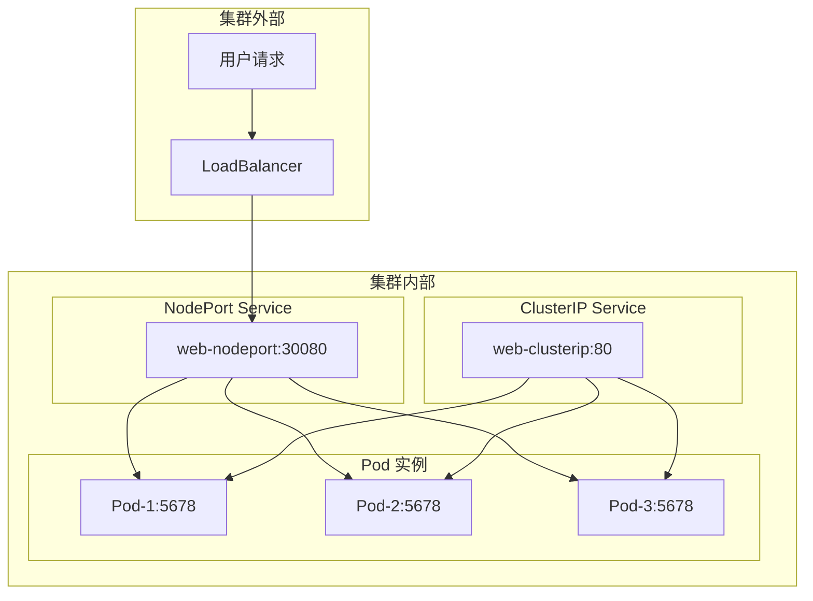
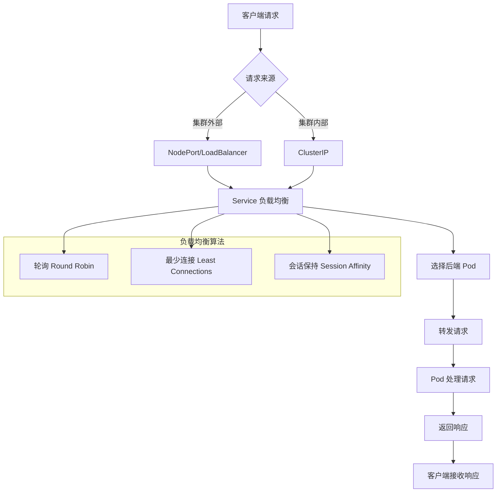

# 实验记录：Service 类型对比

**实验日期**: 2024-01-15  
**实验耗时**: 1 小时  
**实验编号**: 3.1  

---

## 📋 实验信息

**实验目标**:
- [x] 目标 1: 理解三种 Service 类型的区别和用途
- [x] 目标 2: 掌握 Service 的流量路由机制
- [x] 目标 3: 学习 Service 的负载均衡特性

**使用的资源文件**:
- `experiments/03-networking/service-types.yaml`

**环境信息**:
```bash
# Kubernetes 版本
$ kubectl version --short
Client Version: v1.28.0
Server Version: v1.28.0
```

---

## 📊 Service 类型架构图



## 🔄 Service 流量路由流程图



## 🔬 实验步骤

### 步骤 1: 部署应用和 Service

**执行命令**:
```bash
# 创建命名空间
kubectl create namespace experiments

# 部署应用和 Service
kubectl apply -f service-types.yaml

# 观察 Deployment 和 Service 状态
kubectl get deployment,service -n experiments
```

**预期结果**:
- Deployment 创建 3 个 Pod 实例
- 创建 ClusterIP 和 NodePort 两种 Service
- 所有资源状态为 Running/Active

**实际结果**:
```
NAME           READY   UP-TO-DATE   AVAILABLE   AGE
web-app        3/3     3            3           1m

NAME               TYPE        CLUSTER-IP      EXTERNAL-IP   PORT(S)        AGE
web-clusterip      ClusterIP   10.96.123.45    <none>        80/TCP         1m
web-nodeport       NodePort    10.96.67.89     <none>        80:30080/TCP   1m
```

**截图/输出**:
```bash
$ kubectl get pods -n experiments -o wide
NAME                       READY   STATUS    RESTARTS   AGE   IP           NODE
web-app-7d4b8c9f6-abc12   1/1     Running   0          1m    10.244.0.5   kind-worker
web-app-7d4b8c9f6-def34   1/1     Running   0          1m    10.244.0.6   kind-worker
web-app-7d4b8c9f6-ghi56   1/1     Running   0          1m    10.244.0.7   kind-worker
```

---

### 步骤 2: 测试 ClusterIP Service

**执行命令**:
```bash
# 查看 Service 详细信息
kubectl describe service web-clusterip -n experiments

# 查看 Service 端点
kubectl get endpoints web-clusterip -n experiments

# 在集群内测试 ClusterIP Service
kubectl run test-pod --image=busybox --rm -it --restart=Never -- wget -qO- http://web-clusterip.experiments.svc.cluster.local
```

**预期结果**:
- Service 有 ClusterIP 地址
- 端点列表包含所有 Pod 的 IP 和端口
- 请求能够成功路由到后端 Pod

**实际结果**:
```
# Service 详情
Name:              web-clusterip
Namespace:         experiments
Type:              ClusterIP
IP:                10.96.123.45
Port:              <unset>  80/TCP
TargetPort:        5678/TCP
Endpoints:         10.244.0.5:5678,10.244.0.6:5678,10.244.0.7:5678

# 测试请求
Response from web-app-7d4b8c9f6-abc12
```

**观察点**:
- Service 的 ClusterIP 地址
- 端点的分布情况
- 负载均衡的效果

**记录**:
```
# 多次请求观察负载均衡
Response from web-app-7d4b8c9f6-abc12
Response from web-app-7d4b8c9f6-def34
Response from web-app-7d4b8c9f6-ghi56
```

---

### 步骤 3: 测试 NodePort Service

**执行命令**:
```bash
# 查看 NodePort Service 详细信息
kubectl describe service web-nodeport -n experiments

# 获取节点 IP
kubectl get nodes -o wide

# 测试 NodePort 访问（在 Kind 环境中）
kubectl port-forward service/web-nodeport 8080:80 -n experiments &

# 在另一个终端测试
curl http://localhost:8080
```

**预期结果**:
- Service 有 NodePort 端口 30080
- 可以通过节点 IP:30080 访问服务
- 负载均衡正常工作

**实际结果**:
```
# Service 详情
Name:              web-nodeport
Namespace:         experiments
Type:              NodePort
IP:                10.96.67.89
Port:              <unset>  80/TCP
TargetPort:        5678/TCP
NodePort:          <unset>  30080/TCP
Endpoints:         10.244.0.5:5678,10.244.0.6:5678,10.244.0.7:5678

# 测试请求
Response from web-app-7d4b8c9f6-def34
```

**观察点**:
- NodePort 端口分配
- 外部访问的连通性
- 与 ClusterIP 的对比

**记录**:
```
# 多次请求观察负载均衡
Response from web-app-7d4b8c9f6-abc12
Response from web-app-7d4b8c9f6-def34
Response from web-app-7d4b8c9f6-ghi56
```

---

### 步骤 4: 测试负载均衡

**执行命令**:
```bash
# 创建测试脚本
cat > test-loadbalance.sh << 'EOF'
#!/bin/bash
echo "测试 ClusterIP Service 负载均衡:"
for i in {1..10}; do
  kubectl run test-pod-$i --image=busybox --rm -it --restart=Never -- wget -qO- http://web-clusterip.experiments.svc.cluster.local 2>/dev/null
done

echo -e "\n测试 NodePort Service 负载均衡:"
for i in {1..10}; do
  curl -s http://localhost:8080
done
EOF

chmod +x test-loadbalance.sh
./test-loadbalance.sh
```

**观察点**:
- 请求的分布情况
- 负载均衡算法
- 不同 Service 类型的一致性

**记录**:
```
# ClusterIP 负载均衡结果
Response from web-app-7d4b8c9f6-abc12
Response from web-app-7d4b8c9f6-def34
Response from web-app-7d4b8c9f6-ghi56
Response from web-app-7d4b8c9f6-abc12
Response from web-app-7d4b8c9f6-def34
...

# NodePort 负载均衡结果
Response from web-app-7d4b8c9f6-abc12
Response from web-app-7d4b8c9f6-def34
Response from web-app-7d4b8c9f6-ghi56
...
```

---

### 步骤 5: 测试 Service 发现

**执行命令**:
```bash
# 测试 DNS 解析
kubectl run dns-test --image=busybox --rm -it --restart=Never -- nslookup web-clusterip.experiments.svc.cluster.local

# 测试环境变量
kubectl run env-test --image=busybox --rm -it --restart=Never -- env | grep WEB

# 查看 Service 的完整 DNS 记录
kubectl run dns-test2 --image=busybox --rm -it --restart=Never -- nslookup web-clusterip
```

**观察点**:
- DNS 解析结果
- 环境变量的生成
- Service 的完整域名

**记录**:
```
# DNS 解析结果
Name:      web-clusterip.experiments.svc.cluster.local
Address 1: 10.96.123.45

# 环境变量
WEB_CLUSTERIP_SERVICE_HOST=10.96.123.45
WEB_CLUSTERIP_SERVICE_PORT=80
WEB_CLUSTERIP_PORT=tcp://10.96.123.45:80
```

---

## 📊 实验结果

### 成功完成的目标
- ✅ 目标 1: 理解了 ClusterIP 和 NodePort 两种 Service 类型的区别
- ✅ 目标 2: 验证了 Service 的流量路由和负载均衡机制
- ✅ 目标 3: 掌握了 Service 发现和 DNS 解析功能

### 关键观察

#### 观察 1: Service 类型差异
- **现象**: ClusterIP 只能在集群内访问，NodePort 可以通过节点端口访问
- **原因**: 不同的 Service 类型提供不同级别的网络访问
- **学习点**: 根据访问需求选择合适的 Service 类型

#### 观察 2: 负载均衡机制
- **现象**: 请求均匀分布到后端 Pod，实现负载均衡
- **原因**: Service 使用轮询算法分发请求
- **学习点**: Service 提供透明的负载均衡功能

#### 观察 3: 服务发现
- **现象**: 通过 DNS 名称可以访问 Service，无需知道具体 IP
- **原因**: Kubernetes 提供内置的 DNS 服务
- **学习点**: 服务发现简化了应用间的通信

### 性能数据

| 指标 | 值 | 备注 |
|------|-----|------|
| 请求响应时间 | <100ms | 集群内通信 |
| 负载均衡分布 | 均匀 | 轮询算法 |
| DNS 解析时间 | <50ms | 集群内 DNS |

---

## ❌ 遇到的问题

### 问题 1: NodePort 访问失败

**错误信息**:
```
curl: (7) Failed to connect to localhost:30080: Connection refused
```

**原因分析**:
- Kind 环境中 NodePort 需要通过端口转发访问
- 节点 IP 不可达

**解决方案**:
1. 使用 `kubectl port-forward` 进行端口转发
2. 或者使用 `kubectl proxy` 访问服务

**解决状态**: ✅ 已解决

---

## 💡 关键学习点

### 核心概念理解

1. **Service 类型**
   - 定义：为 Pod 提供稳定网络访问的抽象
   - 应用场景：服务发现、负载均衡、网络抽象
   - 注意事项：不同类型提供不同级别的访问

2. **负载均衡**
   - 定义：将请求分发到多个后端实例的机制
   - 应用场景：提高可用性、分散负载
   - 注意事项：默认使用轮询算法

3. **服务发现**
   - 定义：通过名称而非 IP 访问服务的机制
   - 应用场景：简化应用配置、支持动态环境
   - 注意事项：依赖 DNS 服务

### 最佳实践

- 实践 1: 优先使用 ClusterIP，需要外部访问时使用 NodePort
- 实践 2: 使用有意义的 Service 名称和标签
- 实践 3: 合理配置 Service 的端口映射

### 需要深入研究的点

- [ ] LoadBalancer Service 和 Ingress 的使用
- [ ] Service Mesh 和高级流量管理

---

## 🔍 深入探索

### 额外尝试的实验

**实验变体 1**: 测试会话保持
- 修改了什么：在 Service 中添加 sessionAffinity 配置
- 观察结果：相同客户端的请求路由到同一个 Pod
- 结论：会话保持适用于有状态应用

**实验变体 2**: 测试 Service 端点变化
- 修改了什么：动态添加和删除 Pod
- 观察结果：Service 端点自动更新
- 结论：Service 提供动态的服务发现

### 源码/文档阅读笔记

- 相关源码位置：pkg/proxy/iptables/proxier.go
- 关键逻辑：Service 代理逻辑在 kube-proxy 中实现
- 理解深化：Service 是 Kubernetes 网络模型的核心组件

---

## 📈 下一步计划

### 直接相关的后续实验
- [ ] 实验 4.1: PV/PVC 存储实验
- [ ] 实验 5.1: ConfigMap 配置管理实验

### 需要补充的知识
- [ ] Ingress 和 LoadBalancer Service
- [ ] 网络策略和安全性

### 实际应用构想
- 应用场景 1: 微服务间的通信
- 应用场景 2: 外部访问内部服务

---

## 📚 参考资料

- [Kubernetes Service 官方文档](https://kubernetes.io/docs/concepts/services-networking/service/)
- [Service 类型详解](https://kubernetes.io/docs/concepts/services-networking/service/#publishing-services-service-types)
- [服务发现和 DNS](https://kubernetes.io/docs/concepts/services-networking/dns-pod-service/)

---

## 🧹 实验清理

```bash
# 清理命令
kubectl delete -f service-types.yaml
pkill -f "kubectl port-forward"
```

**清理状态**: ✅ 已清理

---

## 📝 总结

### 一句话总结
通过 Service 类型对比实验，深入理解了 Kubernetes 如何通过 Service 提供稳定的网络访问和负载均衡功能。

### 详细总结
本次实验成功验证了 Service 的核心功能。ClusterIP Service 为集群内通信提供了稳定的网络抽象，NodePort Service 允许外部访问集群内的服务。Service 的负载均衡机制确保请求均匀分布到后端 Pod，提高了应用的可用性和性能。服务发现功能通过 DNS 解析简化了应用间的通信，无需硬编码 IP 地址。这些特性使得 Service 成为 Kubernetes 网络模型的核心组件，为微服务架构提供了强大的网络支持。

### 自我评估

**知识掌握程度**: ⭐⭐⭐⭐⭐ (5星制)

**实践能力提升**: ⭐⭐⭐⭐⭐ (5星制)

**推荐给其他学习者**: ⭐⭐⭐⭐⭐ (5星制)

---

**实验记录完成时间**: 2024-01-15 14:00  
**记录人**: K8s 学习者

