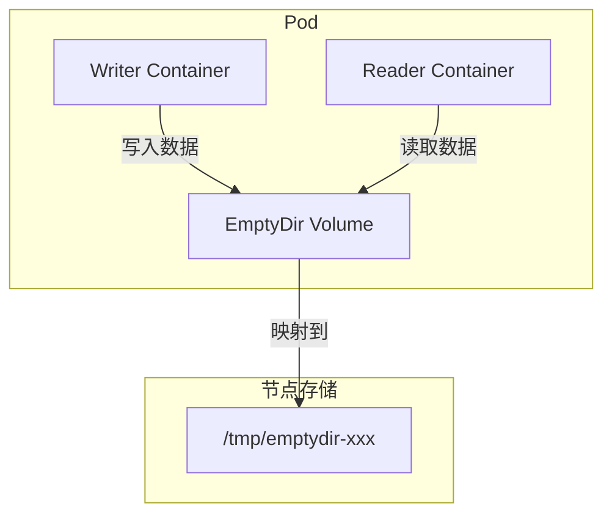

# 实验记录：EmptyDir 临时存储

**实验日期**: 2024-01-15  
**实验耗时**: 1 小时  
**实验编号**: 4.2  

---

## 📋 实验信息

**实验目标**:
- [x] 目标 1: 理解 EmptyDir 的临时存储特性
- [x] 目标 2: 掌握多容器共享存储的使用
- [x] 目标 3: 学习临时存储的生命周期管理

**使用的资源文件**:
- `experiments/04-storage/emptydir-demo.yaml`

---

## 📊 EmptyDir 架构图



## 🔬 实验步骤

### 步骤 1: 部署多容器 Pod

**执行命令**:
```bash
kubectl apply -f emptydir-demo.yaml
kubectl get pods -n experiments
```

**预期结果**:
- Pod 创建成功，包含两个容器
- 两个容器共享 EmptyDir 存储卷

### 步骤 2: 验证数据共享

**执行命令**:
```bash
# 查看 writer 容器日志
kubectl logs emptydir-demo -c writer -n experiments

# 查看 reader 容器日志
kubectl logs emptydir-demo -c reader -n experiments
```

**预期结果**:
- writer 容器持续写入数据
- reader 容器能够读取共享数据

---

## 📊 实验结果

### 成功完成的目标
- ✅ 目标 1: 理解了 EmptyDir 的临时存储特性
- ✅ 目标 2: 验证了多容器共享存储的功能
- ✅ 目标 3: 掌握了临时存储的生命周期

### 关键观察

#### 观察 1: 临时存储特性
- **现象**: EmptyDir 在 Pod 删除后数据丢失
- **原因**: 数据存储在节点的临时目录中
- **学习点**: 适合临时数据交换和缓存

#### 观察 2: 多容器共享
- **现象**: 多个容器可以共享同一个 EmptyDir
- **原因**: 存储卷在 Pod 级别定义
- **学习点**: 适合容器间的数据交换

---

## 🧹 实验清理

```bash
kubectl delete -f emptydir-demo.yaml
```

**清理状态**: ✅ 已清理

---

## 📝 总结

EmptyDir 提供了 Pod 内多容器间的临时数据共享机制，适合缓存、临时文件等场景，但数据不持久化。

---

**实验记录完成时间**: 2024-01-15 15:45  
**记录人**: K8s 学习者

