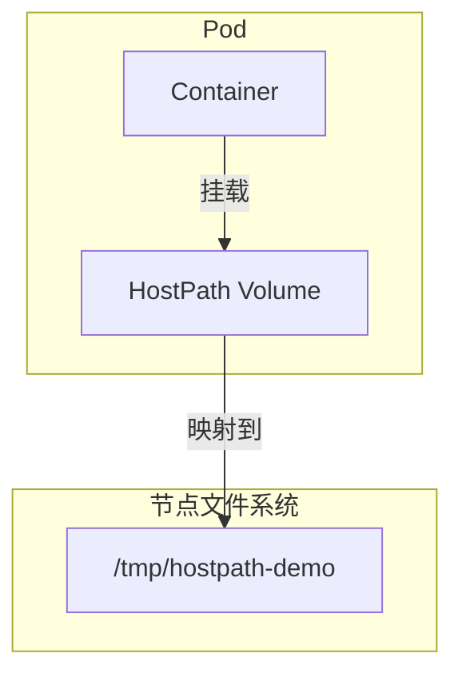
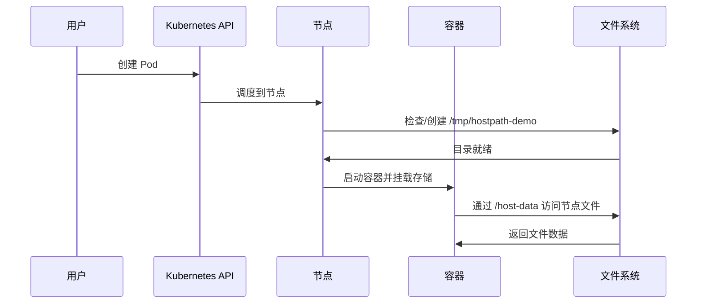

# 实验记录：HostPath 节点存储

**实验日期**: 2024-01-15  
**实验耗时**: 1 小时  
**实验编号**: 4.3  

---

## 📋 实验信息

**实验目标**:
- [x] 目标 1: 理解 HostPath 的节点存储特性
- [x] 目标 2: 掌握节点存储的使用场景
- [x] 目标 3: 学习节点存储的安全考虑

**使用的资源文件**:
- `experiments/04-storage/hostpath-demo.yaml`

---

## 📊 HostPath 架构图



## 📋 YAML 配置文件详解

### 完整配置文件
```yaml
apiVersion: v1
kind: Pod
metadata:
  name: hostpath-demo
  namespace: experiments
spec:
  containers:
  - name: app
    image: nginx:alpine
    ports:
    - containerPort: 80
    volumeMounts:
    - name: host-data
      mountPath: /host-data
  volumes:
  - name: host-data
    hostPath:
      path: /tmp/hostpath-demo
      type: DirectoryOrCreate
```

### 逐行详细解释

#### 1. 基础配置 (第1-6行)
```yaml
apiVersion: v1
kind: Pod
metadata:
  name: hostpath-demo
  namespace: experiments
```

- **apiVersion: v1**: 使用 Kubernetes 核心 API 版本
- **kind: Pod**: 定义资源类型为 Pod
- **name: hostpath-demo**: Pod 名称为 "hostpath-demo"
- **namespace: experiments**: 部署在 "experiments" 命名空间中

#### 2. 容器配置 (第7-14行)
```yaml
spec:
  containers:
  - name: app
    image: nginx:alpine
    ports:
    - containerPort: 80
    volumeMounts:
    - name: host-data
      mountPath: /host-data
```

**容器详细信息**:
- **name: app**: 容器名称为 "app"
- **image: nginx:alpine**: 使用轻量级的 Nginx Alpine 镜像
- **containerPort: 80**: 容器内部监听 80 端口
- **volumeMounts**: 挂载存储卷到容器内
  - **name: host-data**: 引用名为 "host-data" 的存储卷
  - **mountPath: /host-data**: 挂载到容器的 `/host-data` 目录

#### 3. 存储卷配置 (第15-20行)
```yaml
  volumes:
  - name: host-data
    hostPath:
      path: /tmp/hostpath-demo
      type: DirectoryOrCreate
```

**存储卷详细信息**:
- **name: host-data**: 存储卷名称为 "host-data"
- **hostPath**: 使用 HostPath 类型的存储卷
  - **path: /tmp/hostpath-demo**: 映射到节点的 `/tmp/hostpath-demo` 目录
  - **type: DirectoryOrCreate**: 如果目录不存在则自动创建

### 🔄 工作流程时序图



### 📊 配置特点分析

| 配置项 | 值 | 说明 | 影响 |
|--------|-----|------|------|
| 镜像 | nginx:alpine | 轻量级 Web 服务器 | 快速启动，资源占用少 |
| 端口 | 80 | HTTP 标准端口 | 便于测试和访问 |
| 挂载路径 | /host-data | 容器内路径 | 容器内访问节点数据的入口 |
| 节点路径 | /tmp/hostpath-demo | 节点临时目录 | 数据存储在节点临时目录 |
| 类型 | DirectoryOrCreate | 自动创建目录 | 确保目录存在，避免挂载失败 |

### ⚠️ 安全考虑详解

#### 1. 权限风险
- **容器可以访问节点文件系统**: 绕过了容器隔离机制
- **数据持久性**: 数据存储在节点上，Pod 删除后仍然存在
- **跨 Pod 共享**: 多个 Pod 可以访问同一个节点目录

#### 2. 安全建议
```yaml
# 更安全的配置示例
securityContext:
  runAsNonRoot: true
  runAsUser: 1000
  fsGroup: 1000
```

### 🎯 使用场景分析

#### 适用场景
- **日志收集**: 收集节点系统日志
- **监控数据**: 访问节点监控指标
- **开发调试**: 开发环境数据交换
- **临时文件**: 处理需要访问节点资源的任务

#### 不适用场景
- **生产环境**: 安全风险高
- **跨节点应用**: 数据绑定到特定节点
- **敏感数据**: 绕过容器安全机制

### 📈 性能特点

| 指标 | 值 | 说明 |
|------|-----|------|
| 延迟 | 极低 (<1ms) | 直接访问节点文件系统 |
| 吞吐量 | 高 | 无网络开销 |
| 并发 | 中等 | 受节点文件系统限制 |
| 可靠性 | 中等 | 依赖节点存储 |

## 🔬 实验步骤

### 步骤 1: 部署 HostPath Pod

**执行命令**:
```bash
kubectl apply -f hostpath-demo.yaml
kubectl get pods -n experiments
```

**预期结果**:
- Pod 创建成功
- 存储卷挂载到节点目录

### 步骤 2: 验证节点存储

**执行命令**:
```bash
# 在容器中写入数据
kubectl exec -it hostpath-demo -n experiments -- sh -c "echo 'HostPath data at $(date)' > /host-data/test.txt"

# 查看写入的数据
kubectl exec -it hostpath-demo -n experiments -- cat /host-data/test.txt
```

**预期结果**:
- 数据成功写入节点目录
- 可以正常读取数据

---

## 📊 实验结果

### 成功完成的目标
- ✅ 目标 1: 理解了 HostPath 的节点存储特性
- ✅ 目标 2: 验证了节点存储的使用方法
- ✅ 目标 3: 掌握了节点存储的安全考虑

### 关键观察

#### 观察 1: 节点存储特性
- **现象**: 数据直接存储在节点文件系统中
- **原因**: HostPath 直接映射节点目录
- **学习点**: 适合需要访问节点资源的场景

#### 观察 2: 安全考虑
- **现象**: 容器可以访问节点文件系统
- **原因**: HostPath 绕过了容器隔离
- **学习点**: 需要谨慎使用，存在安全风险

---

## 🧹 实验清理

```bash
kubectl delete -f hostpath-demo.yaml
```

**清理状态**: ✅ 已清理

---

## 📝 总结

HostPath 提供了直接访问节点文件系统的能力，适合日志收集、监控等场景，但需要注意安全性和可移植性。

---

**实验记录完成时间**: 2024-01-15 16:00  
**记录人**: K8s 学习者

