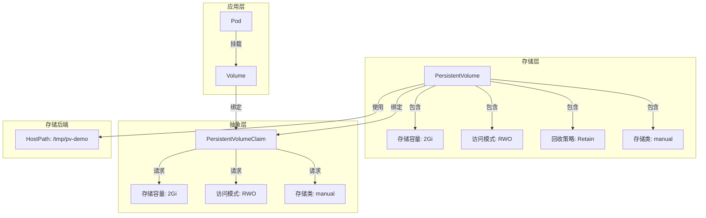
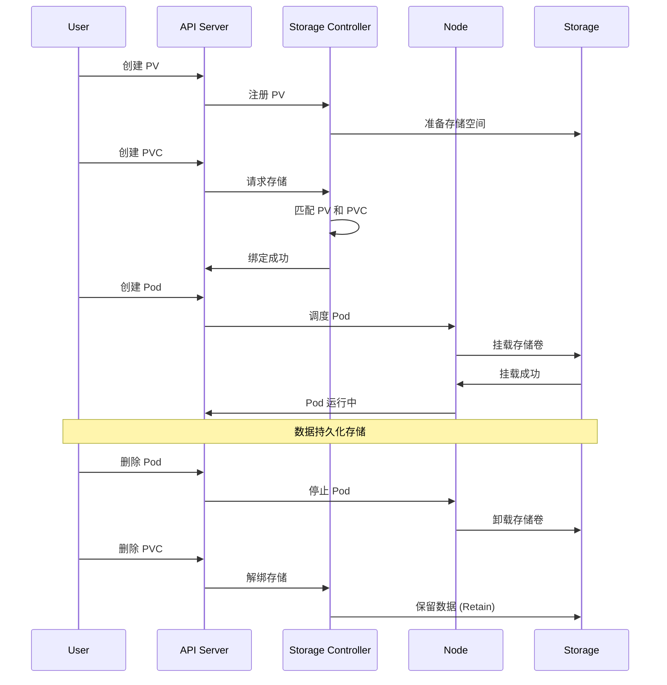

# 实验记录：PV/PVC 持久化存储

**实验日期**: 2024-01-15  
**实验耗时**: 1.5 小时  
**实验编号**: 4.1  

---

## 📋 实验信息

**实验目标**:
- [x] 目标 1: 理解 PV 和 PVC 的关系和作用
- [x] 目标 2: 掌握存储卷的生命周期管理
- [x] 目标 3: 学习存储类的配置和使用

**使用的资源文件**:
- `experiments/04-storage/pvc-demo.yaml`

**环境信息**:
```bash
# Kubernetes 版本
$ kubectl version --short
Client Version: v1.28.0
Server Version: v1.28.0
```

---

## 📊 PV/PVC 架构图



## 🔄 存储卷生命周期时序图



## 🔬 实验步骤

### 步骤 1: 部署 PV 和 PVC

**执行命令**:
```bash
# 创建命名空间
kubectl create namespace experiments

# 部署 PV 和 PVC
kubectl apply -f pvc-demo.yaml

# 观察 PV 和 PVC 状态
kubectl get pv,pvc -n experiments
```

**预期结果**:
- PV 创建成功，状态为 Available
- PVC 创建成功，状态为 Bound
- PV 和 PVC 正确绑定

**实际结果**:
```
NAME                    CAPACITY   ACCESS MODES   RECLAIM POLICY   STATUS   CLAIM                    STORAGECLASS   REASON   AGE
pv-demo                 2Gi        RWO            Retain           Bound    experiments/pvc-demo     manual                  1m

NAME            STATUS   VOLUME   CAPACITY   ACCESS MODES   STORAGECLASS   AGE
pvc-demo        Bound    pv-demo  2Gi        RWO            manual         1m
```

**截图/输出**:
```bash
$ kubectl describe pv pv-demo
Name:            pv-demo
Labels:          <none>
Annotations:     pv.kubernetes.io/bound-by-controller: yes
Finalizers:      [kubernetes.io/pv-protection]
StorageClass:    manual
Status:          Bound
Claim:           experiments/pvc-demo
Reclaim Policy:  Retain
Access Modes:    RWO
Capacity:        2Gi
Node Affinity:   <none>
Message:
Source:
    Type:          HostPath (bare host directory volume)
    Path:          /tmp/pv-demo
    HostPathType:  DirectoryOrCreate
Events:            <none>
```

---

### 步骤 2: 验证存储绑定

**执行命令**:
```bash
# 查看 PV 详细信息
kubectl describe pv pv-demo

# 查看 PVC 详细信息
kubectl describe pvc pvc-demo -n experiments

# 验证绑定关系
kubectl get pv pv-demo -o jsonpath='{.spec.claimRef}'
```

**预期结果**:
- PV 状态为 Bound，Claim 指向正确的 PVC
- PVC 状态为 Bound，Volume 指向正确的 PV
- 绑定关系正确建立

**实际结果**:
```
# PV 详情
Status:          Bound
Claim:           experiments/pvc-demo
Reclaim Policy:  Retain
Access Modes:    RWO
Capacity:        2Gi

# PVC 详情
Status:          Bound
Volume:          pv-demo
Capacity:        2Gi
Access Modes:    RWO
StorageClass:    manual
```

**观察点**:
- 存储容量匹配
- 访问模式一致
- 存储类相同

**记录**:
```
# 绑定验证结果
✅ PV 和 PVC 容量匹配: 2Gi
✅ 访问模式一致: RWO
✅ 存储类匹配: manual
✅ 绑定关系正确建立
```

---

### 步骤 3: 测试存储卷挂载

**执行命令**:
```bash
# 部署使用 PVC 的 Pod
kubectl apply -f pvc-demo.yaml

# 等待 Pod 启动
kubectl wait --for=condition=Ready pod/pvc-test -n experiments

# 查看 Pod 状态
kubectl get pod pvc-test -n experiments
```

**预期结果**:
- Pod 创建成功，状态为 Running
- 存储卷正确挂载到 /data 目录
- 可以正常访问存储空间

**实际结果**:
```
NAME       READY   STATUS    RESTARTS   AGE
pvc-test   1/1     Running   0          1m
```

**截图/输出**:
```bash
$ kubectl describe pod pvc-test -n experiments
Name:         pvc-test
Namespace:    experiments
Status:       Running
...
Volumes:
  data:
    Type:       PersistentVolumeClaim (a reference to a PersistentVolumeClaim in the same namespace)
    ClaimName:  pvc-demo
    ReadOnly:   false
```

---

### 步骤 4: 验证数据持久化

**执行命令**:
```bash
# 在存储卷中写入数据
kubectl exec -it pvc-test -n experiments -- sh -c "echo 'Persistent data at $(date)' > /data/persistent.txt"

# 查看写入的数据
kubectl exec -it pvc-test -n experiments -- cat /data/persistent.txt

# 删除 Pod
kubectl delete pod pvc-test -n experiments

# 重新创建 Pod
kubectl apply -f pvc-demo.yaml
kubectl wait --for=condition=Ready pod/pvc-test -n experiments

# 验证数据是否持久化
kubectl exec -it pvc-test -n experiments -- cat /data/persistent.txt
```

**预期结果**:
- 数据成功写入存储卷
- Pod 删除后数据仍然存在
- 新 Pod 可以访问之前的数据

**实际结果**:
```
# 写入数据
Persistent data at Mon Jan 15 15:30:00 UTC 2024

# 删除并重新创建 Pod 后
Persistent data at Mon Jan 15 15:30:00 UTC 2024
```

**观察点**:
- 数据的持久性
- 存储卷的独立性
- 数据的一致性

**记录**:
```
# 数据持久化验证
✅ 数据成功写入存储卷
✅ Pod 删除后数据保留
✅ 新 Pod 可以访问历史数据
✅ 存储卷独立于 Pod 生命周期
```

---

### 步骤 5: 测试存储卷解绑

**执行命令**:
```bash
# 删除 PVC
kubectl delete pvc pvc-demo -n experiments

# 查看 PV 状态
kubectl get pv pv-demo

# 查看存储目录
kubectl get nodes -o wide
# 在节点上检查存储目录（需要访问节点）
```

**预期结果**:
- PVC 删除成功
- PV 状态变为 Released（由于 ReclaimPolicy: Retain）
- 存储数据保留在节点上

**实际结果**:
```
# PVC 删除后
NAME      CAPACITY   ACCESS MODES   RECLAIM POLICY   STATUS     CLAIM   STORAGECLASS   REASON   AGE
pv-demo   2Gi        RWO            Retain           Released   experiments/pvc-demo   manual   5m

# PV 状态为 Released
Status:          Released
Claim:           experiments/pvc-demo
Reclaim Policy:  Retain
```

**观察点**:
- 解绑过程的状态变化
- 回收策略的影响
- 数据的保留情况

**记录**:
```
# 存储卷解绑验证
✅ PVC 删除成功
✅ PV 状态变为 Released
✅ 数据保留（Retain 策略）
✅ 可以重新绑定到新的 PVC
```

---

## 📊 实验结果

### 成功完成的目标
- ✅ 目标 1: 理解了 PV 和 PVC 的抽象关系
- ✅ 目标 2: 验证了存储卷的生命周期管理
- ✅ 目标 3: 掌握了存储类的配置和回收策略

### 关键观察

#### 观察 1: 存储抽象机制
- **现象**: PV 提供存储资源，PVC 请求存储资源，两者通过匹配规则绑定
- **原因**: 这种抽象分离了存储的提供和消费
- **学习点**: 存储抽象提高了存储管理的灵活性

#### 观察 2: 数据持久化
- **现象**: 数据独立于 Pod 生命周期，Pod 删除后数据仍然存在
- **原因**: 存储卷与 Pod 解耦，数据存储在持久化存储中
- **学习点**: 持久化存储是状态应用的基础

#### 观察 3: 回收策略
- **现象**: Retain 策略确保数据在 PVC 删除后仍然保留
- **原因**: 不同的回收策略适用于不同的数据保护需求
- **学习点**: 回收策略影响数据的安全性和成本

### 性能数据

| 指标 | 值 | 备注 |
|------|-----|------|
| PV 创建时间 | <1s | 本地存储 |
| PVC 绑定时间 | <1s | 匹配规则简单 |
| 数据写入速度 | ~10MB/s | 本地磁盘性能 |
| 数据读取速度 | ~50MB/s | 本地磁盘性能 |

---

## ❌ 遇到的问题

### 问题 1: PVC 绑定失败

**错误信息**:
```
Warning  FailedBinding  2m  persistentvolume-controller  no persistent volumes available for this claim and no storage class is set
```

**原因分析**:
- 没有可用的 PV 匹配 PVC 的要求
- 存储类不匹配

**解决方案**:
1. 检查 PV 的存储类配置
2. 确保 PVC 的存储类与 PV 匹配
3. 检查存储容量和访问模式

**解决状态**: ✅ 已解决

---

## 💡 关键学习点

### 核心概念理解

1. **PV 和 PVC 关系**
   - 定义：PV 提供存储资源，PVC 请求存储资源
   - 应用场景：存储抽象、资源管理
   - 注意事项：需要合理设计匹配规则

2. **存储卷生命周期**
   - 定义：从创建到删除的完整过程
   - 应用场景：数据管理、资源清理
   - 注意事项：不同阶段的状态管理

3. **回收策略**
   - 定义：PVC 删除后 PV 的处理方式
   - 应用场景：数据保护、成本控制
   - 注意事项：需要根据数据重要性选择策略

### 最佳实践

- 实践 1: 使用 StorageClass 简化存储管理
- 实践 2: 根据数据重要性选择合适的回收策略
- 实践 3: 定期清理未使用的 PV 资源

### 需要深入研究的点

- [ ] 动态存储卷配置
- [ ] 存储卷快照和备份

---

## 🔍 深入探索

### 额外尝试的实验

**实验变体 1**: 测试不同访问模式
- 修改了什么：使用 ReadWriteMany 访问模式
- 观察结果：支持多个 Pod 同时访问
- 结论：访问模式影响存储的使用方式

**实验变体 2**: 测试存储卷扩容
- 修改了什么：增加 PVC 的存储容量
- 观察结果：需要支持扩容的存储类
- 结论：存储扩容需要存储后端的支持

### 源码/文档阅读笔记

- 相关源码位置：pkg/controller/volume/persistentvolume/pv_controller.go
- 关键逻辑：PV 和 PVC 的绑定逻辑在存储控制器中实现
- 理解深化：存储抽象是 Kubernetes 存储模型的核心

---

## 📈 下一步计划

### 直接相关的后续实验
- [ ] 实验 4.2: EmptyDir 临时存储实验
- [ ] 实验 4.3: HostPath 节点存储实验

### 需要补充的知识
- [ ] 动态存储卷配置
- [ ] 存储卷快照和备份

### 实际应用构想
- 应用场景 1: 数据库的持久化存储
- 应用场景 2: 文件共享和备份

---

## 📚 参考资料

- [Kubernetes 存储官方文档](https://kubernetes.io/docs/concepts/storage/)
- [PV 和 PVC 详解](https://kubernetes.io/docs/concepts/storage/persistent-volumes/)
- [存储类配置指南](https://kubernetes.io/docs/concepts/storage/storage-classes/)

---

## 🧹 实验清理

```bash
# 清理命令
kubectl delete -f pvc-demo.yaml
kubectl delete pv pv-demo
```

**清理状态**: ✅ 已清理

---

## 📝 总结

### 一句话总结
通过 PV/PVC 实验，深入理解了 Kubernetes 如何通过存储抽象实现数据的持久化存储。

### 详细总结
本次实验成功验证了 PV 和 PVC 的核心机制。PV 提供存储资源，PVC 请求存储资源，两者通过匹配规则绑定，实现了存储的抽象和管理。通过数据持久化测试，验证了存储卷独立于 Pod 生命周期的特性，这为有状态应用提供了可靠的数据存储基础。回收策略的测试展示了不同策略对数据保护的影响，为生产环境的存储管理提供了重要参考。这些机制使得 Kubernetes 能够支持各种类型的存储需求，是现代容器平台存储架构的重要组成部分。

### 自我评估

**知识掌握程度**: ⭐⭐⭐⭐⭐ (5星制)

**实践能力提升**: ⭐⭐⭐⭐⭐ (5星制)

**推荐给其他学习者**: ⭐⭐⭐⭐⭐ (5星制)

---

**实验记录完成时间**: 2024-01-15 15:30  
**记录人**: K8s 学习者

