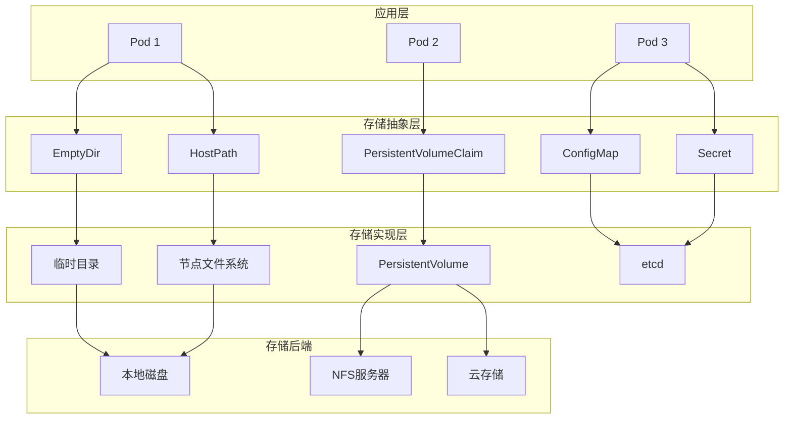
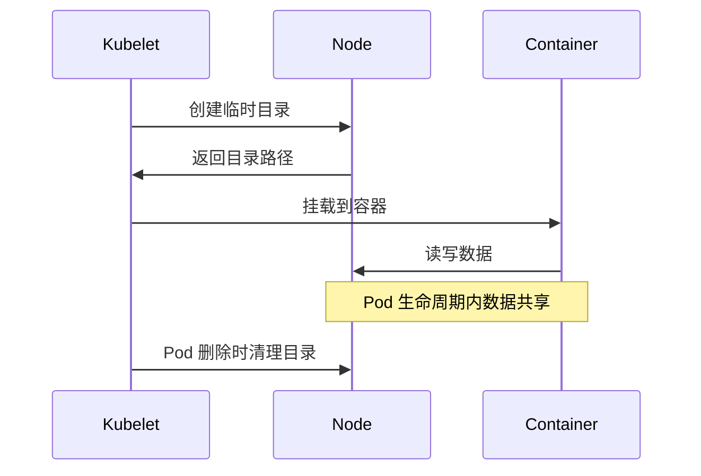
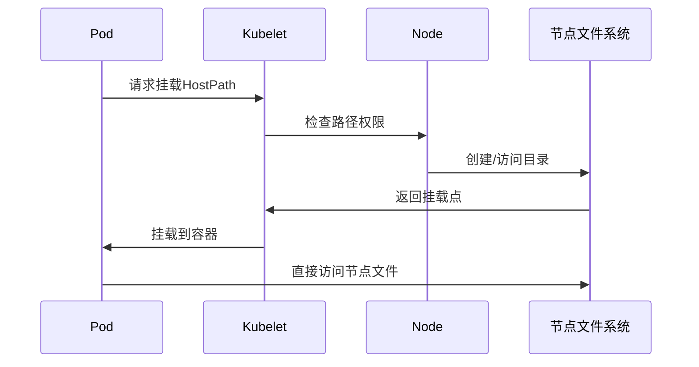
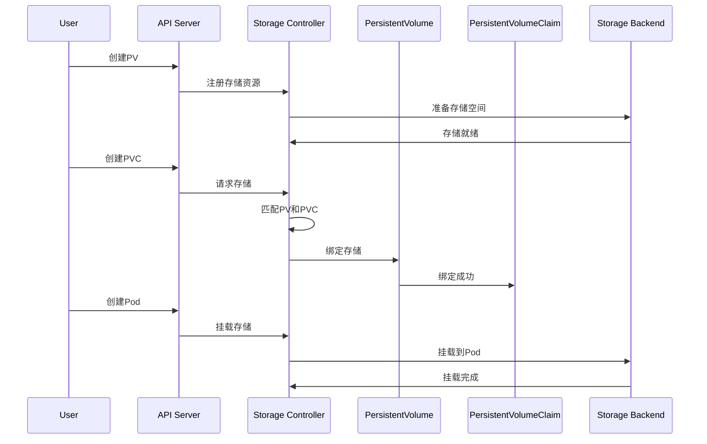
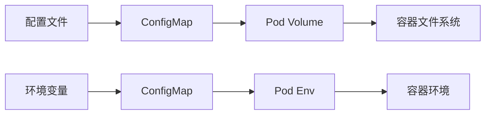
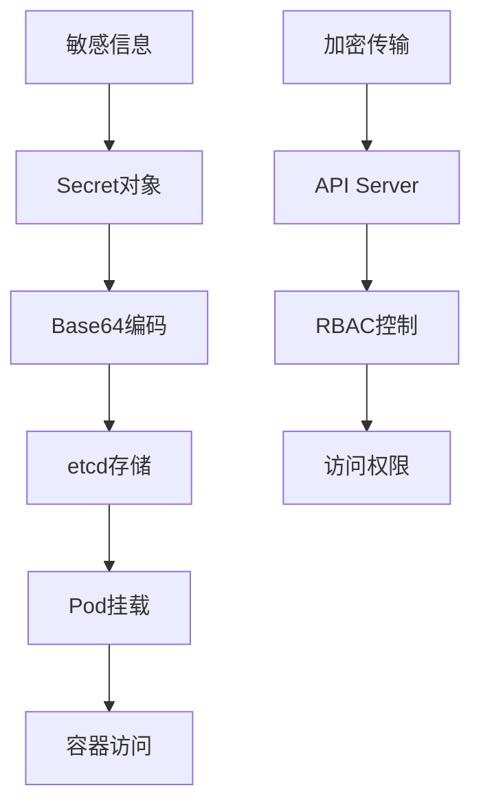
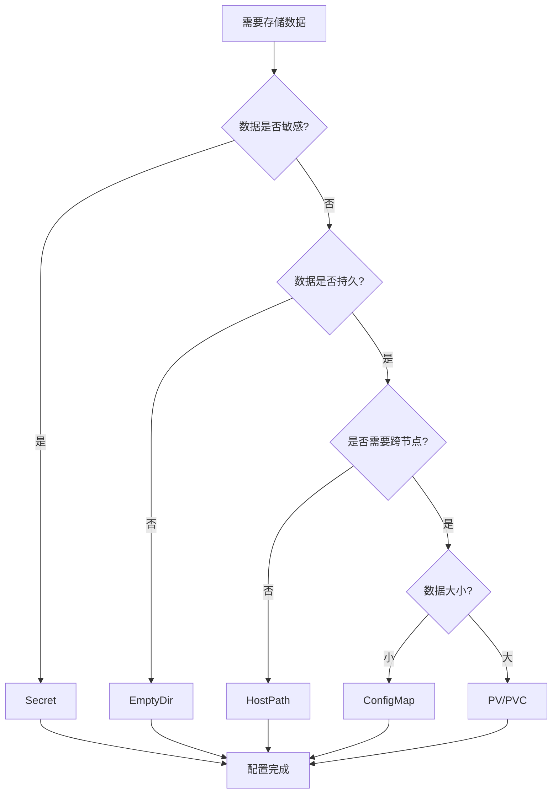
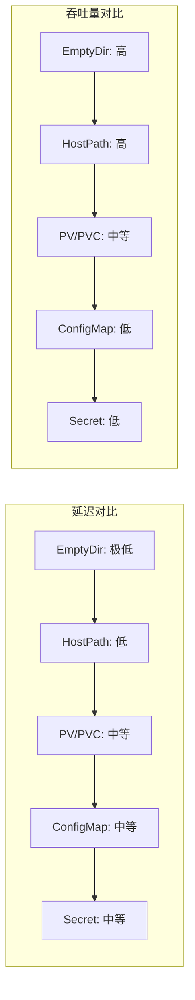
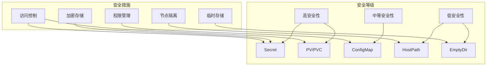
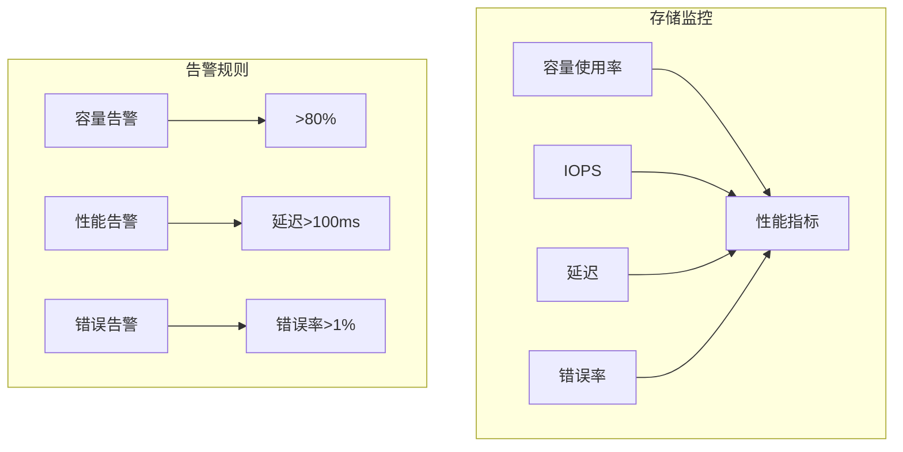

# Kubernetes 存储类型总结

**文档创建日期**: 2024-01-15  
**文档版本**: v1.0  
**作者**: K8s 学习者

---

## 📋 概述

本文档总结了 Kubernetes 中几种主要存储类型的使用场景、工作原理和最佳实践，帮助理解不同存储方案的适用场景。

---

## 🗂️ 存储类型对比

| 存储类型 | 数据持久性 | 共享能力 | 使用场景 | 安全级别 |
|---------|-----------|---------|---------|---------|
| EmptyDir | ❌ 临时 | ✅ Pod内共享 | 缓存、临时文件 | 🟢 高 |
| HostPath | ✅ 持久 | ❌ 单节点 | 日志收集、监控 | 🟡 中 |
| PV/PVC | ✅ 持久 | ✅ 跨节点 | 数据库、应用数据 | 🟢 高 |
| ConfigMap | ✅ 持久 | ✅ 跨Pod | 配置文件 | 🟢 高 |
| Secret | ✅ 持久 | ✅ 跨Pod | 敏感信息 | 🟢 高 |

---

## 📊 存储架构总览



---

## 🔍 详细分析

### 1. EmptyDir 临时存储

#### 工作原理


#### 使用场景
- **缓存数据**: 应用临时缓存
- **临时文件**: 处理过程中的中间文件
- **容器间通信**: 多容器Pod的数据交换

#### 配置示例
```yaml
volumes:
- name: cache-volume
  emptyDir:
    sizeLimit: 1Gi  # 可选：限制大小
```

#### 最佳实践
- ✅ 适合临时数据存储
- ✅ 性能好，延迟低
- ❌ 数据不持久化
- ❌ 不能跨Pod共享

---

### 2. HostPath 节点存储

#### 工作原理


#### 使用场景
- **日志收集**: 收集节点日志
- **监控数据**: 系统监控指标
- **开发调试**: 开发环境数据访问

#### 配置示例
```yaml
volumes:
- name: host-logs
  hostPath:
    path: /var/log
    type: Directory
```

#### 最佳实践
- ✅ 直接访问节点资源
- ✅ 性能好
- ❌ 安全风险高
- ❌ 可移植性差
- ⚠️ 生产环境谨慎使用

---

### 3. PV/PVC 持久化存储

#### 工作原理


#### 使用场景
- **数据库存储**: MySQL、PostgreSQL等
- **应用数据**: 用户上传的文件
- **共享存储**: 多Pod共享数据

#### 配置示例
```yaml
# PV 定义
apiVersion: v1
kind: PersistentVolume
metadata:
  name: mysql-pv
spec:
  capacity:
    storage: 10Gi
  accessModes:
    - ReadWriteOnce
  persistentVolumeReclaimPolicy: Retain
  storageClassName: fast-ssd
  hostPath:
    path: /data/mysql

---
# PVC 定义
apiVersion: v1
kind: PersistentVolumeClaim
metadata:
  name: mysql-pvc
spec:
  accessModes:
    - ReadWriteOnce
  resources:
    requests:
      storage: 10Gi
  storageClassName: fast-ssd
```

#### 最佳实践
- ✅ 数据持久化
- ✅ 支持多种存储后端
- ✅ 跨节点共享
- ⚠️ 需要合理设计回收策略
- ⚠️ 注意存储容量规划

---

### 4. ConfigMap 配置存储

#### 工作原理


#### 使用场景
- **应用配置**: 数据库连接字符串
- **环境变量**: 运行时配置
- **配置文件**: 应用配置文件

#### 配置示例
```yaml
apiVersion: v1
kind: ConfigMap
metadata:
  name: app-config
data:
  database_url: "mysql://localhost:3306/mydb"
  log_level: "info"
  config.yaml: |
    server:
      port: 8080
      host: 0.0.0.0
```

#### 最佳实践
- ✅ 配置与代码分离
- ✅ 支持热更新
- ✅ 版本控制友好
- ❌ 不适合敏感信息

---

### 5. Secret 敏感信息存储

#### 工作原理


#### 使用场景
- **数据库密码**: 数据库连接凭证
- **API密钥**: 第三方服务密钥
- **TLS证书**: SSL/TLS证书

#### 配置示例
```yaml
apiVersion: v1
kind: Secret
metadata:
  name: db-secret
type: Opaque
data:
  username: YWRtaW4=  # base64编码
  password: cGFzc3dvcmQ=  # base64编码
```

#### 最佳实践
- ✅ 加密存储
- ✅ 访问控制
- ✅ 自动轮换支持
- ⚠️ 需要定期更新
- ⚠️ 注意权限管理

---

## 🎯 选择指南

### 存储选择决策树



### 场景匹配表

| 应用场景 | 推荐存储 | 原因 |
|---------|---------|------|
| 数据库 | PV/PVC | 需要持久化和高可用 |
| 缓存 | EmptyDir | 临时数据，性能优先 |
| 日志收集 | HostPath | 直接访问节点日志 |
| 配置文件 | ConfigMap | 非敏感配置 |
| 密码密钥 | Secret | 敏感信息保护 |
| 文件上传 | PV/PVC | 用户数据持久化 |
| 临时处理 | EmptyDir | 处理完成后清理 |

---

## ⚡ 性能对比

### 存储性能特征



### 性能数据

| 存储类型 | 延迟 | 吞吐量 | 并发能力 | 适用场景 |
|---------|------|--------|---------|---------|
| EmptyDir | <1ms | 高 | 高 | 高频读写 |
| HostPath | <5ms | 高 | 中 | 节点级访问 |
| PV/PVC | 5-50ms | 中 | 中 | 持久化存储 |
| ConfigMap | <10ms | 低 | 高 | 配置读取 |
| Secret | <10ms | 低 | 高 | 密钥访问 |

---

## 🛡️ 安全考虑

### 安全等级对比



### 安全最佳实践

1. **敏感数据**: 使用 Secret，启用加密
2. **访问控制**: 配置 RBAC 权限
3. **数据加密**: 启用存储加密
4. **定期轮换**: 定期更新密钥
5. **审计日志**: 记录访问行为

---

## 🔧 故障排查

### 常见问题及解决方案

#### 1. EmptyDir 数据丢失
**问题**: Pod 重启后数据丢失
**原因**: EmptyDir 是临时存储
**解决**: 使用 PV/PVC 实现持久化

#### 2. HostPath 权限问题
**问题**: 容器无法访问节点目录
**原因**: 权限配置不当
**解决**: 检查节点目录权限和 SELinux 设置

#### 3. PVC 绑定失败
**问题**: PVC 无法绑定到 PV
**原因**: 存储类或容量不匹配
**解决**: 检查 PV 和 PVC 的配置匹配

#### 4. Secret 访问被拒绝
**问题**: Pod 无法读取 Secret
**原因**: RBAC 权限不足
**解决**: 配置正确的 ServiceAccount 权限

---

## 📈 监控和运维

### 存储监控指标



### 运维最佳实践

1. **容量规划**: 定期检查存储使用情况
2. **性能监控**: 监控 IOPS 和延迟
3. **备份策略**: 定期备份重要数据
4. **清理策略**: 清理过期和未使用的存储
5. **安全审计**: 定期检查访问权限

---

## 🚀 未来趋势

### 存储技术发展方向

1. **云原生存储**: 更好的云集成
2. **边缘存储**: 边缘计算场景优化
3. **AI/ML 存储**: 大数据处理优化
4. **安全增强**: 更强的加密和访问控制
5. **性能优化**: 更低的延迟和更高的吞吐量

---

## 📚 参考资料

- [Kubernetes 存储官方文档](https://kubernetes.io/docs/concepts/storage/)
- [存储最佳实践](https://kubernetes.io/docs/concepts/storage/volumes/)
- [安全存储指南](https://kubernetes.io/docs/concepts/security/)
- [性能调优指南](https://kubernetes.io/docs/concepts/cluster-administration/)

---

## 📝 总结

Kubernetes 提供了多种存储类型来满足不同的应用需求：

- **EmptyDir**: 适合临时数据和缓存
- **HostPath**: 适合节点级访问和开发调试
- **PV/PVC**: 适合生产环境的持久化存储
- **ConfigMap**: 适合非敏感配置管理
- **Secret**: 适合敏感信息保护

选择合适的存储类型需要考虑数据持久性、共享能力、安全性和性能要求。在生产环境中，建议优先使用 PV/PVC 和 Secret，谨慎使用 HostPath，合理使用 EmptyDir 和 ConfigMap。

---

**文档完成时间**: 2024-01-15 16:30  
**文档维护**: K8s 学习者
