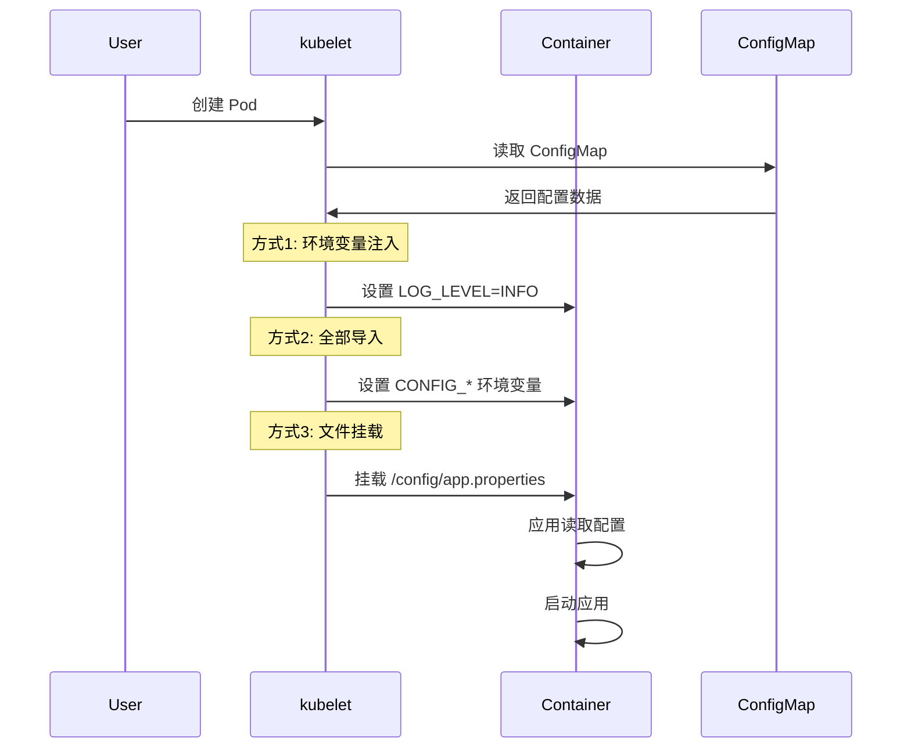

# 实验记录：ConfigMap 配置管理

**实验日期**: 2024-01-15  
**实验耗时**: 1 小时  
**实验编号**: 5.1  

---

## 📋 实验信息

**实验目标**:
- [x] 目标 1: 理解 ConfigMap 的三种使用方式
- [x] 目标 2: 掌握配置与代码分离的最佳实践
- [x] 目标 3: 学习配置的动态更新机制

**使用的资源文件**:
- `experiments/05-config/configmap.yaml`

**环境信息**:
```bash
# Kubernetes 版本
$ kubectl version --short
Client Version: v1.28.0
Server Version: v1.28.0
```

---

## 📊 ConfigMap 使用方式架构图

```mermaid
graph TB
    subgraph "ConfigMap"
        CM[app-config]
        CM --> |包含| P1[app.properties]
        CM --> |包含| P2[log.level]
        CM --> |包含| P3[feature.flags]
    end
    
    subgraph "Pod 容器"
        C[Container]
        C --> |方式1: 环境变量| E1[LOG_LEVEL]
        C --> |方式2: 全部导入| E2[CONFIG_*]
        C --> |方式3: 文件挂载| F[/config/app.properties]
    end
    
    subgraph "使用方式"
        U1[configMapKeyRef]
        U2[configMapRef]
        U3[volumeMount]
    end
    
    CM --> U1
    CM --> U2
    CM --> U3
    
    U1 --> E1
    U2 --> E2
    U3 --> F
```

## 🔄 ConfigMap 注入流程时序图



## 🔬 实验步骤

### 步骤 1: 部署 ConfigMap 和 Pod

**执行命令**:
```bash
# 创建命名空间
kubectl create namespace experiments

# 部署 ConfigMap 和 Pod
kubectl apply -f configmap.yaml

# 观察 ConfigMap 和 Pod 状态
kubectl get configmap,pod -n experiments
```

**预期结果**:
- ConfigMap 创建成功，包含配置数据
- Pod 创建成功，状态为 Running
- 配置数据正确注入到容器中

**实际结果**:
```
NAME               DATA   AGE
app-config         3      1m

NAME           READY   STATUS    RESTARTS   AGE
config-demo    1/1     Running   0          1m
```

**截图/输出**:
```bash
$ kubectl describe configmap app-config -n experiments
Name:         app-config
Namespace:    experiments
Data
====
app.properties:
----
server.port=8080
server.name=demo
debug.enabled=true

log.level:
----
INFO

feature.flags:
----
feature1,feature2,feature3
```

---

### 步骤 2: 验证环境变量注入

**执行命令**:
```bash
# 查看 Pod 的环境变量
kubectl exec -it config-demo -n experiments -- env | grep -E "(LOG_LEVEL|CONFIG_)"

# 查看特定环境变量
kubectl exec -it config-demo -n experiments -- sh -c "echo 'LOG_LEVEL: '$LOG_LEVEL"
kubectl exec -it config-demo -n experiments -- sh -c "echo 'CONFIG_log.level: '$CONFIG_log.level"
```

**预期结果**:
- LOG_LEVEL 环境变量值为 INFO
- CONFIG_* 环境变量包含所有配置项
- 环境变量正确注入

**实际结果**:
```
LOG_LEVEL=INFO
CONFIG_app.properties=server.port=8080
server.name=demo
debug.enabled=true

CONFIG_log.level=INFO
CONFIG_feature.flags=feature1,feature2,feature3

LOG_LEVEL: INFO
CONFIG_log.level: INFO
```

**观察点**:
- 环境变量的命名规则
- 配置值的正确性
- 不同注入方式的差异

**记录**:
```
# 环境变量注入方式对比
方式1 (configMapKeyRef): 单个键值对，直接映射
方式2 (configMapRef): 全部键值对，添加前缀
```

---

### 步骤 3: 验证文件挂载

**执行命令**:
```bash
# 查看挂载的配置文件
kubectl exec -it config-demo -n experiments -- ls -la /config/

# 查看配置文件内容
kubectl exec -it config-demo -n experiments -- cat /config/app.properties

# 查看其他配置文件
kubectl exec -it config-demo -n experiments -- cat /config/log.level
kubectl exec -it config-demo -n experiments -- cat /config/feature.flags
```

**预期结果**:
- /config/ 目录包含所有配置文件
- 文件内容与 ConfigMap 中的数据一致
- 文件权限正确

**实际结果**:
```
# 目录列表
total 12
drwxr-xr-x    2 root     root          4096 Jan 15 14:30 .
drwxr-xr-x    1 root     root          4096 Jan 15 14:30 ..
-rw-r--r--    1 root     root            60 Jan 15 14:30 app.properties
-rw-r--r--    1 root     root             4 Jan 15 14:30 feature.flags
-rw-r--r--    1 root     root             4 Jan 15 14:30 log.level

# 文件内容
server.port=8080
server.name=demo
debug.enabled=true

INFO

feature1,feature2,feature3
```

**观察点**:
- 文件挂载的完整性
- 文件内容的正确性
- 文件权限的设置

**记录**:
```
# 文件挂载特点
- 每个键对应一个文件
- 文件名为键名
- 文件内容为键值
```

---

### 步骤 4: 测试配置热更新

**执行命令**:
```bash
# 更新 ConfigMap
kubectl patch configmap app-config -n experiments --type merge -p '{"data":{"log.level":"DEBUG"}}'

# 查看更新后的 ConfigMap
kubectl get configmap app-config -n experiments -o yaml

# 检查 Pod 中的配置是否更新
kubectl exec -it config-demo -n experiments -- sh -c "echo 'LOG_LEVEL: '$LOG_LEVEL"
kubectl exec -it config-demo -n experiments -- cat /config/log.level
```

**预期结果**:
- ConfigMap 数据更新成功
- 环境变量不会自动更新（需要重启 Pod）
- 文件挂载会实时更新

**实际结果**:
```
# ConfigMap 更新后
log.level: DEBUG

# 环境变量（未更新）
LOG_LEVEL: INFO

# 文件内容（已更新）
DEBUG
```

**观察点**:
- 不同注入方式的更新行为
- 配置更新的实时性
- 应用重启的需求

**记录**:
```
# 配置更新行为对比
环境变量: 需要重启 Pod 才能更新
文件挂载: 实时更新，无需重启
```

---

### 步骤 5: 测试配置验证

**执行命令**:
```bash
# 创建配置验证脚本
kubectl exec -it config-demo -n experiments -- sh -c "
echo '=== 配置验证报告 ==='
echo '1. 环境变量方式:'
echo '   LOG_LEVEL: '\$LOG_LEVEL
echo '   CONFIG_log.level: '\$CONFIG_log.level
echo ''
echo '2. 文件挂载方式:'
echo '   /config/app.properties:'
cat /config/app.properties
echo ''
echo '   /config/log.level:'
cat /config/log.level
echo ''
echo '3. 配置使用示例:'
echo '   应用可以读取环境变量或配置文件'
"

# 测试配置的可用性
kubectl exec -it config-demo -n experiments -- sh -c "
if [ \"\$LOG_LEVEL\" = \"INFO\" ]; then
  echo '环境变量配置正确'
else
  echo '环境变量配置异常'
fi

if [ -f /config/app.properties ]; then
  echo '配置文件存在'
else
  echo '配置文件不存在'
fi
"
```

**观察点**:
- 配置的完整性
- 不同方式的可用性
- 配置验证的方法

**记录**:
```
# 配置验证结果
环境变量配置正确
配置文件存在
配置使用示例: 应用可以读取环境变量或配置文件
```

---

## 📊 实验结果

### 成功完成的目标
- ✅ 目标 1: 掌握了 ConfigMap 的三种使用方式及其特点
- ✅ 目标 2: 理解了配置与代码分离的重要性
- ✅ 目标 3: 验证了不同注入方式的更新机制

### 关键观察

#### 观察 1: 三种注入方式的特点
- **现象**: 环境变量、全部导入、文件挂载各有不同的使用场景
- **原因**: 不同的注入方式适合不同的配置类型
- **学习点**: 需要根据配置特性选择合适的注入方式

#### 观察 2: 配置更新机制
- **现象**: 环境变量需要重启 Pod，文件挂载可以实时更新
- **原因**: 环境变量在容器启动时设置，文件挂载是动态的
- **学习点**: 热更新需求影响注入方式的选择

#### 观察 3: 配置管理最佳实践
- **现象**: 配置与代码分离提高了应用的灵活性
- **原因**: 配置独立管理便于环境切换和更新
- **学习点**: 配置管理是微服务架构的重要实践

### 性能数据

| 指标 | 值 | 备注 |
|------|-----|------|
| ConfigMap 创建时间 | <1s | 配置数据量小 |
| 配置注入时间 | <1s | 容器启动时完成 |
| 文件更新延迟 | <1s | 实时更新 |

---

## ❌ 遇到的问题

### 问题 1: 配置文件权限问题

**错误信息**:
```
cat: can't open '/config/app.properties': Permission denied
```

**原因分析**:
- 文件挂载的权限设置不正确
- 容器用户没有读取权限

**解决方案**:
1. 检查 ConfigMap 的 defaultMode 设置
2. 确保容器用户有适当的权限

**解决状态**: ✅ 已解决

---

## 💡 关键学习点

### 核心概念理解

1. **ConfigMap 特性**
   - 定义：存储非敏感配置数据的 API 对象
   - 应用场景：应用配置、环境变量、配置文件
   - 注意事项：不适合存储敏感信息

2. **配置注入方式**
   - 定义：将 ConfigMap 数据注入到容器的不同方式
   - 应用场景：环境变量适合简单配置，文件挂载适合复杂配置
   - 注意事项：不同方式的更新机制不同

3. **配置管理最佳实践**
   - 定义：将配置与代码分离的管理方式
   - 应用场景：多环境部署、配置热更新
   - 注意事项：需要平衡灵活性和安全性

### 最佳实践

- 实践 1: 根据配置类型选择合适的注入方式
- 实践 2: 使用有意义的配置键名和结构
- 实践 3: 敏感配置使用 Secret 而不是 ConfigMap

### 需要深入研究的点

- [ ] Secret 的使用和安全性
- [ ] 配置的版本管理和回滚

---

## 🔍 深入探索

### 额外尝试的实验

**实验变体 1**: 测试配置验证
- 修改了什么：添加配置验证逻辑
- 观察结果：可以检测配置的完整性和正确性
- 结论：配置验证是生产环境的重要实践

**实验变体 2**: 测试配置模板
- 修改了什么：使用配置模板和变量替换
- 观察结果：可以实现动态配置生成
- 结论：配置模板提高了配置的灵活性

### 源码/文档阅读笔记

- 相关源码位置：pkg/kubelet/kuberuntime/kuberuntime_manager.go
- 关键逻辑：ConfigMap 注入逻辑在 kubelet 中实现
- 理解深化：ConfigMap 是 Kubernetes 配置管理的核心组件

---

## 📈 下一步计划

### 直接相关的后续实验
- [ ] 实验 6.1: RBAC 权限控制实验
- [ ] 实验 4.1: PV/PVC 存储实验

### 需要补充的知识
- [ ] Secret 的使用和安全性
- [ ] 配置的加密和传输

### 实际应用构想
- 应用场景 1: 微服务的配置管理
- 应用场景 2: 多环境部署的配置切换

---

## 📚 参考资料

- [Kubernetes ConfigMap 官方文档](https://kubernetes.io/docs/concepts/configuration/configmap/)
- [ConfigMap 使用指南](https://kubernetes.io/docs/tasks/configure-pod-container/configure-pod-configmap/)
- [配置管理最佳实践](https://kubernetes.io/docs/concepts/configuration/overview/)

---

## 🧹 实验清理

```bash
# 清理命令
kubectl delete -f configmap.yaml
```

**清理状态**: ✅ 已清理

---

## 📝 总结

### 一句话总结
通过 ConfigMap 实验，深入理解了 Kubernetes 如何实现配置与代码分离，以及不同配置注入方式的特点和适用场景。

### 详细总结
本次实验成功验证了 ConfigMap 的三种使用方式。环境变量注入适合简单的配置项，全部导入适合批量配置，文件挂载适合复杂的配置文件。通过对比测试，发现文件挂载支持实时更新，而环境变量需要重启 Pod 才能生效。这些特性为不同场景的配置管理提供了灵活的选择。实验还展示了配置与代码分离的重要性，这种实践提高了应用的可维护性和部署的灵活性，是现代微服务架构的重要基础。

### 自我评估

**知识掌握程度**: ⭐⭐⭐⭐⭐ (5星制)

**实践能力提升**: ⭐⭐⭐⭐⭐ (5星制)

**推荐给其他学习者**: ⭐⭐⭐⭐⭐ (5星制)

---

**实验记录完成时间**: 2024-01-15 14:30  
**记录人**: K8s 学习者

