# 实验记录：ConfigMap 配置管理

**实验日期**: 2024-01-15  
**实验耗时**: 1 小时  
**实验编号**: 5.1  

---

## 📋 实验信息

**实验目标**:
- [x] 目标 1: 理解 ConfigMap 的三种使用方式
- [x] 目标 2: 掌握配置与代码分离的最佳实践
- [x] 目标 3: 学习配置的动态更新机制

**使用的资源文件**:
- `experiments/05-config/configmap.yaml`

**环境信息**:
```bash
# Kubernetes 版本
$ kubectl version --short
Client Version: v1.28.0
Server Version: v1.28.0
```

---

## 📚 ConfigMap 三种配置方式详解

### 1. 环境变量注入 (configMapKeyRef)

#### 原理说明
环境变量注入是 Kubernetes 将 ConfigMap 中的单个键值对映射为容器环境变量的机制。当 Pod 启动时，kubelet 会读取 ConfigMap 中指定的键，并将其值设置为容器的环境变量。

**工作机制**:
1. kubelet 在 Pod 启动时读取 ConfigMap 数据
2. 根据 `configMapKeyRef` 配置，提取指定键的值
3. 将值设置为容器的环境变量
4. 容器启动后可以通过环境变量访问配置

**技术实现**:
```yaml
env:
- name: LOG_LEVEL
  valueFrom:
    configMapKeyRef:
      name: app-config
      key: log.level
```

#### 使用场景
- **简单配置项**: 单个配置值，如日志级别、端口号
- **应用启动参数**: 影响应用启动行为的配置
- **功能开关**: 简单的布尔值或枚举值配置
- **环境标识**: 区分不同环境的标识符

#### 实际应用示例

**示例1: 微服务配置**
```yaml
# 数据库连接配置
env:
- name: DB_HOST
  valueFrom:
    configMapKeyRef:
      name: database-config
      key: host
- name: DB_PORT
  valueFrom:
    configMapKeyRef:
      name: database-config
      key: port
```

**示例2: 应用特性配置**
```yaml
# 功能开关配置
env:
- name: ENABLE_CACHE
  valueFrom:
    configMapKeyRef:
      name: feature-config
      key: cache.enabled
- name: CACHE_TTL
  valueFrom:
    configMapKeyRef:
      name: feature-config
      key: cache.ttl
```

**示例3: 监控配置**
```yaml
# 监控和日志配置
env:
- name: LOG_LEVEL
  valueFrom:
    configMapKeyRef:
      name: monitoring-config
      key: log.level
- name: METRICS_ENABLED
  valueFrom:
    configMapKeyRef:
      name: monitoring-config
      key: metrics.enabled
```

### 2. 全部导入 (configMapRef)

#### 原理说明
全部导入机制将 ConfigMap 中的所有键值对批量导入为环境变量。kubelet 会遍历 ConfigMap 中的所有键，为每个键创建对应的环境变量，并可选地添加前缀。

**工作机制**:
1. kubelet 读取整个 ConfigMap 数据
2. 遍历所有键值对
3. 为每个键创建环境变量（键名转换为大写，特殊字符替换为下划线）
4. 可选地添加统一前缀
5. 批量设置到容器环境中

**技术实现**:
```yaml
envFrom:
- configMapRef:
    name: app-config
    prefix: CONFIG_
```

#### 使用场景
- **批量配置**: 需要导入大量相关配置
- **配置组**: 逻辑上相关的配置项组合
- **环境切换**: 不同环境使用不同的配置组
- **配置继承**: 基础配置 + 环境特定配置

#### 实际应用示例

**示例1: 数据库配置组**
```yaml
# 数据库相关配置全部导入
envFrom:
- configMapRef:
    name: database-config
    prefix: DB_
# 结果: DB_HOST, DB_PORT, DB_NAME, DB_USER, DB_POOL_SIZE 等
```

**示例2: 应用配置组**
```yaml
# 应用基础配置
envFrom:
- configMapRef:
    name: app-base-config
    prefix: APP_
# 环境特定配置
- configMapRef:
    name: app-env-config
    prefix: ENV_
```

**示例3: 微服务配置**
```yaml
# 服务发现配置
envFrom:
- configMapRef:
    name: service-discovery-config
    prefix: SD_
# 结果: SD_REGISTRY_URL, SD_HEALTH_CHECK_INTERVAL, SD_TIMEOUT 等
```

### 3. 文件挂载 (volumeMount)

#### 原理说明
文件挂载机制将 ConfigMap 中的键值对转换为文件系统中的文件。每个键对应一个文件，文件名是键名，文件内容是键值。这种方式支持复杂的配置文件格式和结构，是三种方式中最灵活的一种。

#### 文件挂载工作流程图

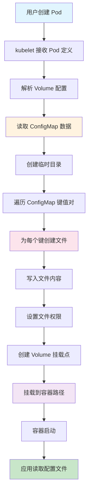

#### 详细工作机制

**阶段1: ConfigMap 数据读取**
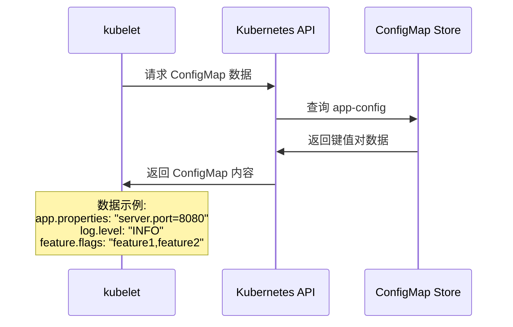

**阶段2: 文件系统创建**
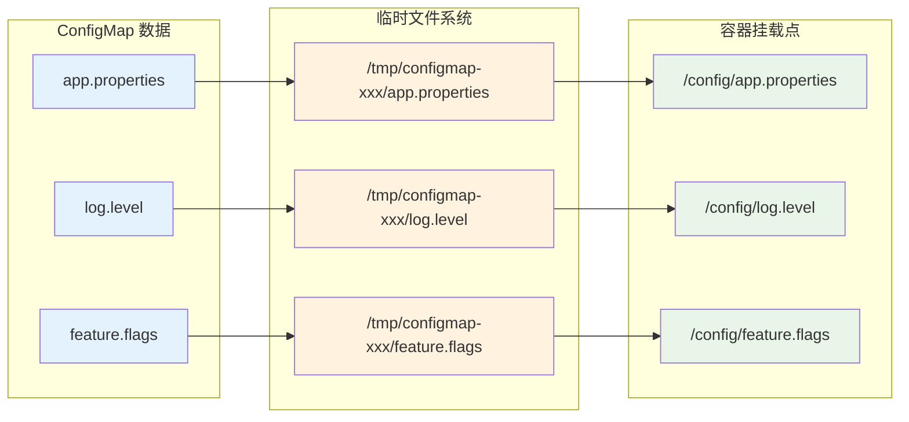

**阶段3: Volume 挂载过程**
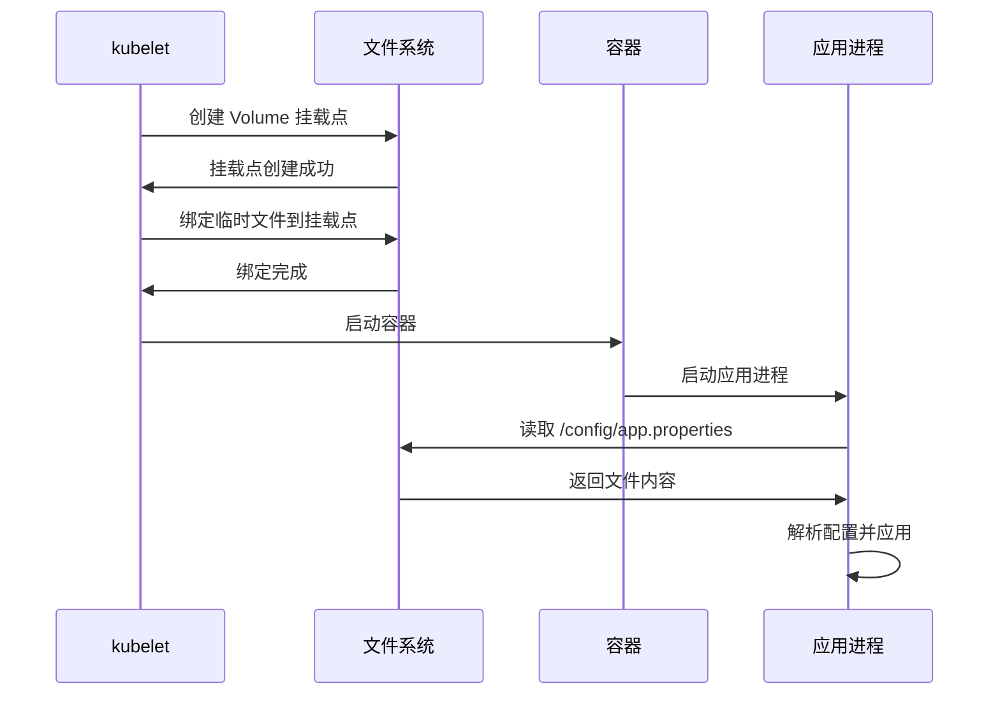

#### 文件挂载的层次结构

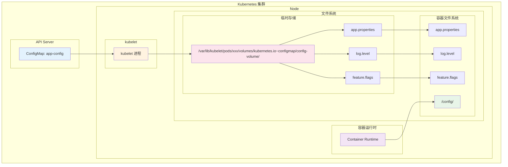

#### 文件权限和属性设置

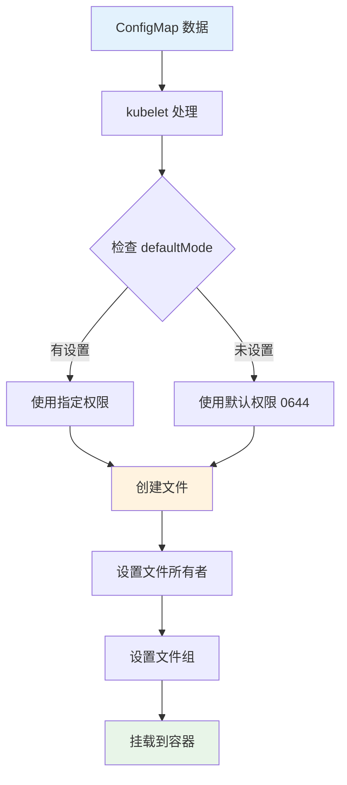

#### 热更新机制

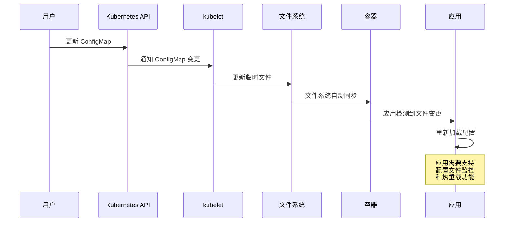

#### 技术实现详解

**基础配置**:
```yaml
volumeMounts:
- name: config-volume
  mountPath: /config
volumes:
- name: config-volume
  configMap:
    name: app-config
```

**高级配置**:
```yaml
volumeMounts:
- name: config-volume
  mountPath: /app/config
  readOnly: true
  subPath: application.properties
volumes:
- name: config-volume
  configMap:
    name: app-config
    items:
    - key: application.properties
      path: application.properties
      mode: 0644
    - key: logback.xml
      path: logback.xml
      mode: 0644
    defaultMode: 0644
```

#### volumeMounts 和 volumes 配置详解

##### 配置示例分析

```yaml
volumeMounts:
- name: app-config
  mountPath: /app/config
  readOnly: true
- name: app-config
  mountPath: /app/logback-spring.xml
  subPath: logback-spring.xml
  readOnly: true
- name: nginx-config
  mountPath: /etc/nginx/conf.d
  readOnly: true
volumes:
- name: app-config
  configMap:
    name: webapp-config
    items:
    - key: application.properties
      path: application.properties
      mode: 0644
    - key: logback-spring.xml
      path: logback-spring.xml
      mode: 0644
    defaultMode: 0644
- name: nginx-config
  configMap:
    name: webapp-config
    items:
    - key: nginx.conf
      path: default.conf
      mode: 0644
```

##### volumeMounts 配置解析

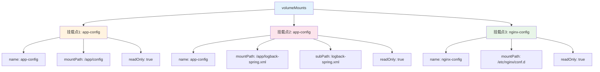

##### volumes 配置解析

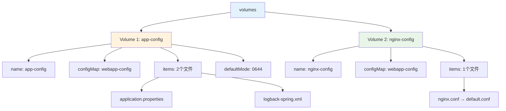

#### 配置映射关系详解

##### 映射关系图

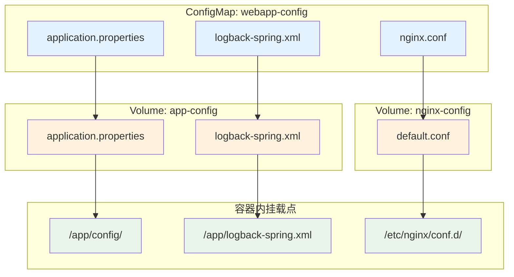

##### 详细映射说明

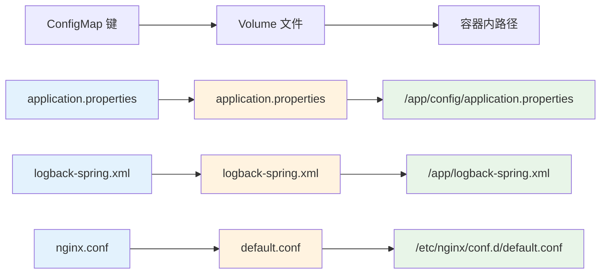

#### 配置参数详解

##### volumeMounts 参数说明

| 参数 | 说明 | 示例值 | 作用 |
|------|------|--------|------|
| **name** | Volume 名称 | `app-config` | 引用 volumes 中定义的 Volume |
| **mountPath** | 容器内挂载路径 | `/app/config` | 文件在容器中的访问路径 |
| **subPath** | 子路径 | `logback-spring.xml` | 只挂载 Volume 中的特定文件 |
| **readOnly** | 只读模式 | `true` | 容器内文件为只读，不能修改 |

##### volumes 参数说明

| 参数 | 说明 | 示例值 | 作用 |
|------|------|--------|------|
| **name** | Volume 名称 | `app-config` | 定义 Volume 的唯一标识 |
| **configMap** | ConfigMap 引用 | `name: webapp-config` | 指定数据来源的 ConfigMap |
| **items** | 文件映射列表 | `key: path` | 自定义文件名映射 |
| **mode** | 文件权限 | `0644` | 设置文件权限（八进制） |
| **defaultMode** | 默认权限 | `0644` | 未指定 mode 时的默认权限 |

#### 实际文件结构

##### 容器内文件结构

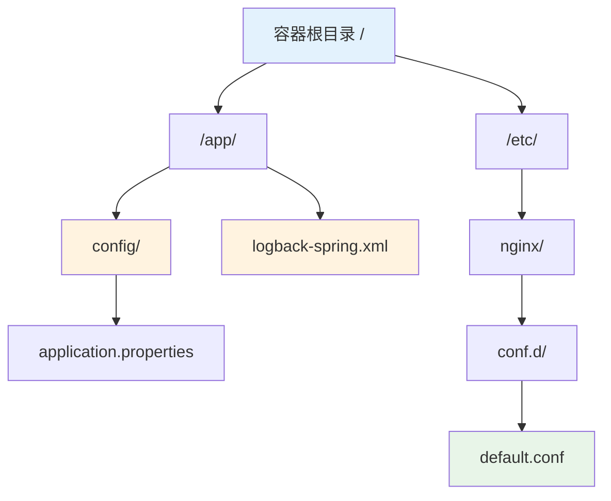

##### 主机端存储结构

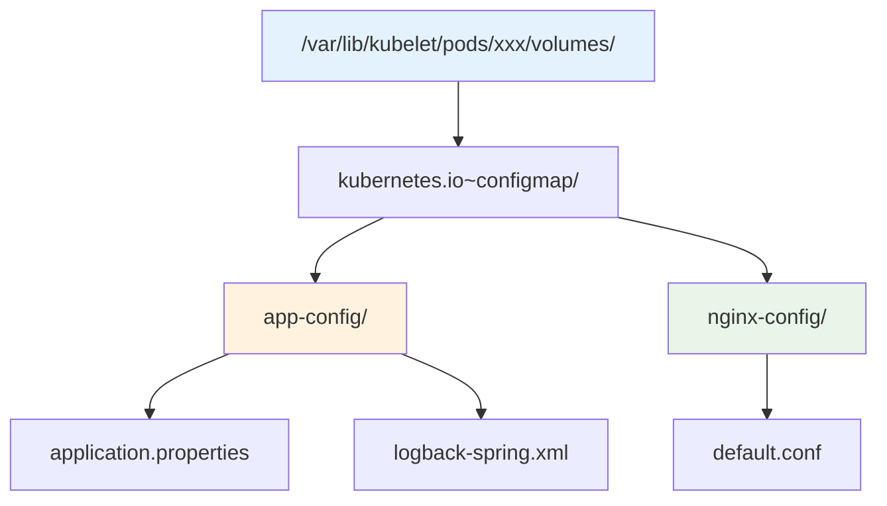

#### 配置验证命令

##### 验证挂载结果

```bash
# 1. 查看容器内挂载的文件
kubectl exec -it pod-name -- ls -la /app/config/
kubectl exec -it pod-name -- ls -la /app/logback-spring.xml
kubectl exec -it pod-name -- ls -la /etc/nginx/conf.d/

# 2. 查看文件内容
kubectl exec -it pod-name -- cat /app/config/application.properties
kubectl exec -it pod-name -- cat /app/logback-spring.xml
kubectl exec -it pod-name -- cat /etc/nginx/conf.d/default.conf

# 3. 验证文件权限
kubectl exec -it pod-name -- stat /app/config/application.properties
kubectl exec -it pod-name -- stat /app/logback-spring.xml
kubectl exec -it pod-name -- stat /etc/nginx/conf.d/default.conf

# 4. 验证只读属性
kubectl exec -it pod-name -- touch /app/config/test.txt
# 预期结果: 应该失败，因为挂载为只读
```

#### 配置优化建议

##### 最佳实践配置

```yaml
# 优化后的配置示例
volumeMounts:
- name: app-config
  mountPath: /app/config
  readOnly: true
- name: app-config
  mountPath: /app/logback-spring.xml
  subPath: logback-spring.xml
  readOnly: true
- name: nginx-config
  mountPath: /etc/nginx/conf.d
  readOnly: true
volumes:
- name: app-config
  configMap:
    name: webapp-config
    items:
    - key: application.properties
      path: application.properties
      mode: 0644
    - key: logback-spring.xml
      path: logback-spring.xml
      mode: 0644
    defaultMode: 0644
- name: nginx-config
  configMap:
    name: webapp-config
    items:
    - key: nginx.conf
      path: default.conf
      mode: 0644
```

##### 配置说明

1. **使用 readOnly: true**：确保配置文件不被意外修改
2. **使用 subPath**：精确控制单个文件的挂载位置
3. **设置文件权限**：通过 mode 参数控制文件访问权限
4. **分离不同用途的配置**：将应用配置和 Nginx 配置分别挂载

#### 为什么需要同时配置 volumeMounts 和 volumes

##### 核心概念解释

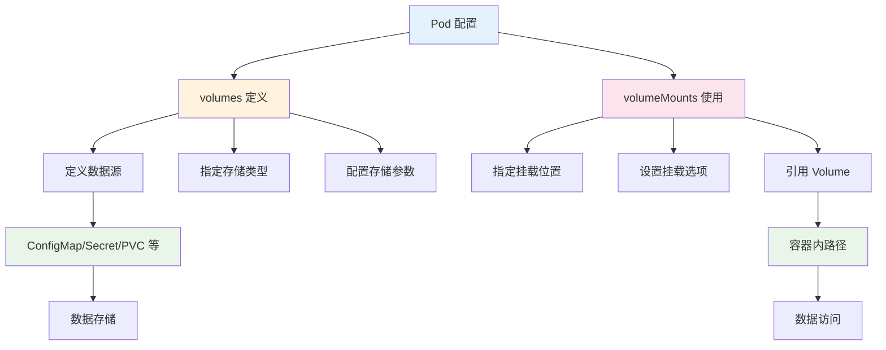

##### volumes 和 volumeMounts 的关系

```mermaid
sequenceDiagram
    participant P as Pod
    participant V as volumes
    participant VM as volumeMounts
    participant C as 容器
    
    Note over P: Pod 定义阶段
    P->>V: 定义 Volume 数据源
    Note over V: volumes:<br/>- name: app-config<br/>- configMap: webapp-config
    
    P->>VM: 定义挂载点
    Note over VM: volumeMounts:<br/>- name: app-config<br/>- mountPath: /app/config
    
    Note over P: Pod 启动阶段
    P->>V: 创建 Volume
    V->>V: 从 ConfigMap 读取数据
    V->>V: 创建临时文件
    
    P->>VM: 执行挂载
    VM->>C: 将 Volume 挂载到容器
    C->>C: 容器可以访问文件
    
    style P fill:#e3f2fd
    style V fill:#fff3e0
    style VM fill:#fce4ec
    style C fill:#e8f5e8
```

##### 类比理解

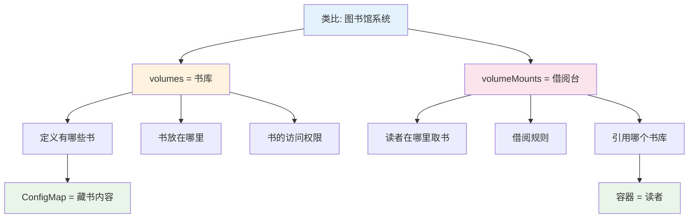

#### 详细原理解释

##### 1. volumes 的作用

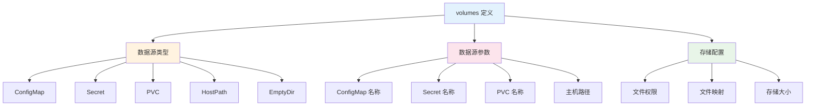

**volumes 的核心作用**:
- **定义数据来源**: 告诉 Kubernetes 数据从哪里来
- **配置存储参数**: 设置文件权限、映射关系等
- **创建存储抽象**: 将不同类型的存储统一为 Volume 概念

##### 2. volumeMounts 的作用

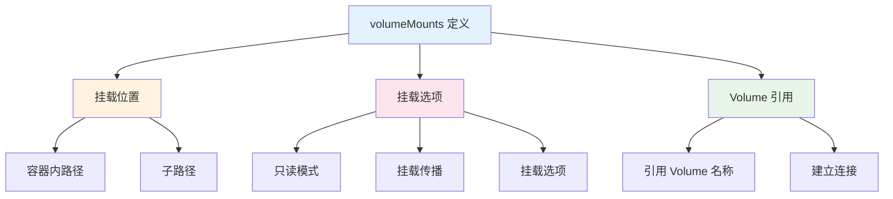

**volumeMounts 的核心作用**:
- **指定挂载位置**: 告诉 Kubernetes 数据挂载到哪里
- **设置挂载选项**: 配置只读、传播等选项
- **建立连接**: 将 Volume 与容器内的路径连接起来

#### 实际配置示例对比

##### 只有 volumes（不完整）

```yaml
# 只有 volumes 定义，没有 volumeMounts
volumes:
- name: app-config
  configMap:
    name: webapp-config
```

**结果**: Volume 被创建，但容器无法访问，因为没有挂载点。

##### 只有 volumeMounts（错误）

```yaml
# 只有 volumeMounts，没有 volumes
volumeMounts:
- name: app-config
  mountPath: /app/config
```

**结果**: Pod 创建失败，因为引用了不存在的 Volume。

##### 完整的配置

```yaml
# 完整的配置
volumes:
- name: app-config
  configMap:
    name: webapp-config

volumeMounts:
- name: app-config
  mountPath: /app/config
```

**结果**: Volume 被创建并成功挂载到容器。

#### 配置验证示例

##### 验证 volumes 和 volumeMounts 的依赖关系

```bash
# 1. 创建只有 volumes 的 Pod
cat <<EOF | kubectl apply -f -
apiVersion: v1
kind: Pod
metadata:
  name: test-volumes-only
spec:
  containers:
  - name: app
    image: busybox
    command: ["sh", "-c", "sleep 3600"]
  volumes:
  - name: app-config
    configMap:
      name: webapp-config
EOF

# 2. 检查 Pod 状态
kubectl get pod test-volumes-only
kubectl describe pod test-volumes-only

# 3. 进入容器检查
kubectl exec -it test-volumes-only -- ls -la /app/config/
# 预期结果: 目录不存在，因为没有 volumeMounts
```

##### 验证 volumeMounts 对 volumes 的依赖

```bash
# 1. 创建只有 volumeMounts 的 Pod
cat <<EOF | kubectl apply -f -
apiVersion: v1
kind: Pod
metadata:
  name: test-mounts-only
spec:
  containers:
  - name: app
    image: busybox
    command: ["sh", "-c", "sleep 3600"]
    volumeMounts:
    - name: app-config
      mountPath: /app/config
EOF

# 2. 检查 Pod 状态
kubectl get pod test-mounts-only
kubectl describe pod test-mounts-only
# 预期结果: Pod 创建失败，因为引用了不存在的 Volume
```

#### 最佳实践建议

##### 配置顺序建议

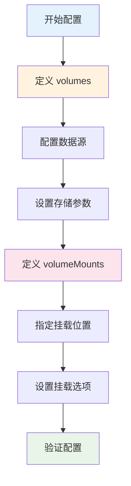

##### 配置检查清单

1. **volumes 检查**:
   - [ ] 是否定义了所有需要的 Volume
   - [ ] 数据源是否正确（ConfigMap、Secret 等）
   - [ ] 存储参数是否合适（权限、映射等）

2. **volumeMounts 检查**:
   - [ ] 是否引用了所有定义的 Volume
   - [ ] 挂载路径是否合理
   - [ ] 挂载选项是否正确

3. **整体检查**:
   - [ ] volumes 和 volumeMounts 名称是否匹配
   - [ ] 配置是否完整
   - [ ] 是否符合安全最佳实践

#### 文件挂载的优势和特点

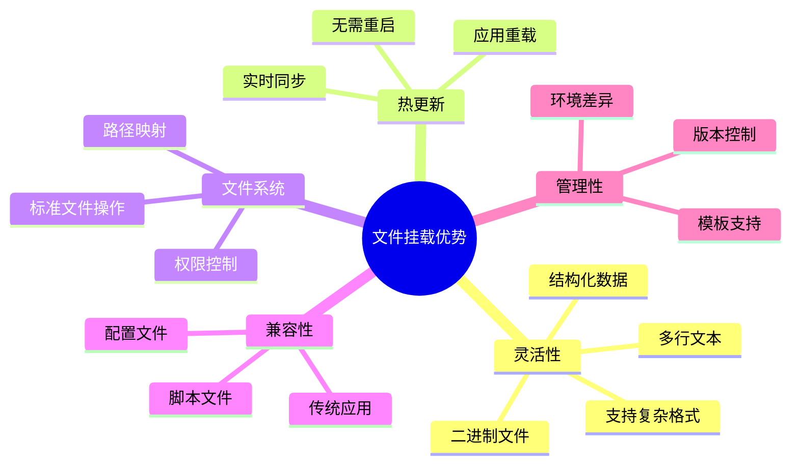

#### 文件挂载的底层实现原理

```mermaid
flowchart TD
    subgraph "kubelet 内部处理"
        A[接收 Pod 定义] --> B[解析 Volume 配置]
        B --> C[创建 Volume 管理器]
        C --> D[初始化 ConfigMap Volume]
        D --> E[创建临时目录]
        E --> F[下载 ConfigMap 数据]
        F --> G[创建文件映射]
        G --> H[设置文件属性]
        H --> I[创建挂载点]
        I --> J[执行 bind mount]
    end
    
    subgraph "文件系统操作"
        K[创建 /var/lib/kubelet/pods/xxx/volumes/]
        L[创建 configmap 子目录]
        M[写入配置文件]
        N[设置权限和所有者]
        O[创建符号链接]
    end
    
    J --> K
    K --> L
    L --> M
    M --> N
    N --> O
    
    style A fill:#e3f2fd
    style J fill:#fff3e0
    style O fill:#e8f5e8
```

#### 文件挂载的存储位置详解

##### 主机文件系统存储结构

```mermaid
graph TD
    A["/var/lib/kubelet/pods/"] --> B["pod-uid-12345678-1234-1234-1234-123456789abc/"]
    B --> C["volumes/"]
    C --> D["kubernetes.io~configmap/"]
    D --> E["config-volume/"]
    E --> F["app.properties"]
    E --> G["log.level"]
    E --> H["feature.flags"]
    E --> I[".timestamp"]
    E --> J[".metadata"]
    
    K["实际存储路径示例"] --> L["/var/lib/kubelet/pods/12345678-1234-1234-1234-123456789abc/volumes/kubernetes.io~configmap/config-volume/"]
    
    style A fill:#e3f2fd
    style E fill:#fff3e0
    style L fill:#fce4ec
```

##### 容器内文件系统映射

```mermaid
graph TD
    A["容器内挂载点"] --> B["/config/"]
    B --> C["app.properties"]
    B --> D["log.level"]
    B --> E["feature.flags"]
    
    F["主机存储"] --> G["/var/lib/kubelet/pods/xxx/volumes/kubernetes.io~configmap/config-volume/"]
    G --> H["app.properties"]
    G --> I["log.level"]
    G --> J["feature.flags"]
    
    H -.->|bind mount| C
    I -.->|bind mount| D
    J -.->|bind mount| E
    
    style A fill:#e8f5e8
    style F fill:#fff3e0
    style H fill:#fce4ec
    style I fill:#fce4ec
    style J fill:#fce4ec
```

#### 文件映射匹配原理

##### ConfigMap 到文件的映射规则

```mermaid
flowchart TD
    A[ConfigMap 数据] --> B{映射方式}
    B -->|默认映射| C[键名直接作为文件名]
    B -->|items 映射| D[自定义文件名]
    B -->|subPath 映射| E[单个文件挂载]
    
    C --> F["app.properties → /config/app.properties"]
    C --> G["log.level → /config/log.level"]
    
    D --> H["application.properties → /config/app.properties"]
    D --> I["logging.xml → /config/logback.xml"]
    
    E --> J["application.properties → /app/config/application.properties"]
    
    style A fill:#e3f2fd
    style F fill:#e8f5e8
    style G fill:#e8f5e8
    style H fill:#fff3e0
    style I fill:#fff3e0
    style J fill:#fce4ec
```

##### 映射匹配的详细过程

```mermaid
sequenceDiagram
    participant CM as ConfigMap
    participant K as kubelet
    participant FS as 文件系统
    participant C as 容器
    
    CM->>K: 提供键值对数据
    Note over CM: app.properties: "server.port=8080"<br/>log.level: "INFO"<br/>feature.flags: "feature1,feature2"
    
    K->>K: 解析 Volume 配置
    Note over K: 检查 items 配置<br/>检查 subPath 配置<br/>检查 defaultMode
    
    K->>FS: 创建存储目录
    Note over FS: /var/lib/kubelet/pods/xxx/volumes/kubernetes.io~configmap/config-volume/
    
    loop 遍历每个键值对
        K->>FS: 创建文件
        Note over FS: 文件名 = 键名 或 items.path<br/>文件内容 = 键值
        K->>FS: 设置文件权限
        Note over FS: 使用 defaultMode 或 items.mode
    end
    
    K->>FS: 执行 bind mount
    Note over FS: 将主机文件绑定到容器路径
    
    FS->>C: 文件在容器中可见
    Note over C: 容器可以读取挂载的配置文件
```

#### 存储位置的具体实现

##### 主机端存储路径构成

```mermaid
flowchart LR
    A["/var/lib/kubelet/pods/"] --> B["pod-uid/"]
    B --> C["volumes/"]
    C --> D["kubernetes.io~configmap/"]
    D --> E["volume-name/"]
    E --> F["config-files"]
    
    G["路径构成说明"] --> H["kubelet 数据目录"]
    G --> I["Pod 唯一标识符"]
    G --> J["Volume 存储目录"]
    G --> K["ConfigMap Volume 类型"]
    G --> L["Volume 名称"]
    G --> M["配置文件"]
    
    style A fill:#e3f2fd
    style E fill:#fff3e0
    style F fill:#e8f5e8
```

##### 容器端挂载路径构成

```mermaid
flowchart LR
    A["容器内路径"] --> B["mountPath/"]
    B --> C["subPath"]
    C --> D["实际文件路径"]
    
    E["路径构成说明"] --> F["volumeMounts.mountPath"]
    E --> G["volumeMounts.subPath (可选)"]
    E --> H["最终文件访问路径"]
    
    I["示例"] --> J["mountPath: /app/config"]
    I --> K["subPath: application.properties"]
    I --> L["最终路径: /app/config/application.properties"]
    
    style A fill:#e3f2fd
    style D fill:#e8f5e8
    style L fill:#fce4ec
```

#### 文件映射的三种模式

##### 模式1: 默认映射（全部文件）

```yaml
# ConfigMap 定义
apiVersion: v1
kind: ConfigMap
metadata:
  name: app-config
data:
  app.properties: "server.port=8080"
  log.level: "INFO"
  feature.flags: "feature1,feature2"

---
# Pod 定义
spec:
  containers:
  - name: app
    volumeMounts:
    - name: config-volume
      mountPath: /config
  volumes:
  - name: config-volume
    configMap:
      name: app-config
```

**映射结果**:
```mermaid
graph LR
    A["ConfigMap 键"] --> B["容器内文件"]
    A1["app.properties"] --> B1["/config/app.properties"]
    A2["log.level"] --> B2["/config/log.level"]
    A3["feature.flags"] --> B3["/config/feature.flags"]
    
    style A1 fill:#e3f2fd
    style A2 fill:#e3f2fd
    style A3 fill:#e3f2fd
    style B1 fill:#e8f5e8
    style B2 fill:#e8f5e8
    style B3 fill:#e8f5e8
```

##### 模式2: items 映射（自定义文件名）

```yaml
# Pod 定义
spec:
  containers:
  - name: app
    volumeMounts:
    - name: config-volume
      mountPath: /app/config
  volumes:
  - name: config-volume
    configMap:
      name: app-config
      items:
      - key: app.properties
        path: application.properties
        mode: 0644
      - key: log.level
        path: logging.properties
        mode: 0644
```

**映射结果**:
```mermaid
graph LR
    A["ConfigMap 键"] --> B["自定义文件名"] --> C["容器内文件"]
    A1["app.properties"] --> B1["application.properties"] --> C1["/app/config/application.properties"]
    A2["log.level"] --> B2["logging.properties"] --> C2["/app/config/logging.properties"]
    
    style A1 fill:#e3f2fd
    style A2 fill:#e3f2fd
    style B1 fill:#fff3e0
    style B2 fill:#fff3e0
    style C1 fill:#e8f5e8
    style C2 fill:#e8f5e8
```

##### 模式3: subPath 映射（单个文件）

```yaml
# Pod 定义
spec:
  containers:
  - name: app
    volumeMounts:
    - name: config-volume
      mountPath: /app/application.properties
      subPath: app.properties
  volumes:
  - name: config-volume
    configMap:
      name: app-config
```

**映射结果**:
```mermaid
graph LR
    A["ConfigMap 键"] --> B["subPath 指定"] --> C["容器内文件"]
    A1["app.properties"] --> B1["app.properties"] --> C1["/app/application.properties"]
    
    style A1 fill:#e3f2fd
    style B1 fill:#fff3e0
    style C1 fill:#e8f5e8
```

#### 文件存储的物理实现

##### bind mount 机制

```mermaid
sequenceDiagram
    participant H as 主机文件系统
    participant K as kubelet
    participant C as 容器文件系统
    
    H->>K: 创建配置文件
    Note over H: /var/lib/kubelet/pods/xxx/volumes/kubernetes.io~configmap/config-volume/app.properties
    
    K->>C: 执行 bind mount
    Note over C: mount --bind /host/path /container/path
    
    C->>C: 文件在容器中可见
    Note over C: /config/app.properties
    
    Note over H,C: 两个路径指向同一个 inode<br/>文件内容实时同步
```

##### 文件系统层次结构

```mermaid
graph TB
    subgraph "主机文件系统"
        A["/var/lib/kubelet/pods/"]
        A --> B["pod-uid/"]
        B --> C["volumes/"]
        C --> D["kubernetes.io~configmap/"]
        D --> E["config-volume/"]
        E --> F["app.properties (inode: 12345)"]
    end
    
    subgraph "容器文件系统"
        G["/config/"]
        G --> H["app.properties (inode: 12345)"]
    end
    
    F -.->|bind mount| H
    
    style F fill:#fce4ec
    style H fill:#e8f5e8
```

#### 实际存储位置验证

##### 查看实际存储路径

```bash
# 1. 查看 Pod 的 UID
kubectl get pod webapp-pod -o jsonpath='{.metadata.uid}'

# 2. 查看 Volume 挂载信息
kubectl get pod webapp-pod -o jsonpath='{.spec.volumes[0]}'

# 3. 在主机上查看实际存储位置
ls -la /var/lib/kubelet/pods/*/volumes/kubernetes.io~configmap/

# 4. 查看文件内容
cat /var/lib/kubelet/pods/*/volumes/kubernetes.io~configmap/config-volume/app.properties

# 5. 查看文件 inode（验证 bind mount）
stat /var/lib/kubelet/pods/*/volumes/kubernetes.io~configmap/config-volume/app.properties
```

##### 验证映射关系

```bash
# 1. 在容器内查看挂载的文件
kubectl exec -it webapp-pod -- ls -la /config/

# 2. 查看文件内容
kubectl exec -it webapp-pod -- cat /config/app.properties

# 3. 查看文件 inode（应该与主机相同）
kubectl exec -it webapp-pod -- stat /config/app.properties

# 4. 验证文件权限
kubectl exec -it webapp-pod -- ls -la /config/app.properties
```

#### 三种配置方式的创建时机对比

##### 创建时机和依赖关系

```mermaid
sequenceDiagram
    participant U as 用户
    participant API as Kubernetes API
    participant K as kubelet
    participant CM as ConfigMap Store
    participant FS as 文件系统
    participant C as 容器
    
    Note over U,C: 环境变量注入方式 (configMapKeyRef)
    U->>API: 创建 Pod (引用 ConfigMap)
    API->>CM: 检查 ConfigMap 是否存在
    CM->>API: ConfigMap 必须已存在
    API->>K: 创建 Pod
    K->>CM: 读取 ConfigMap 数据
    CM->>K: 返回键值对
    K->>C: 设置环境变量
    C->>C: 容器启动
    
    Note over U,C: 全部导入方式 (configMapRef)
    U->>API: 创建 Pod (引用 ConfigMap)
    API->>CM: 检查 ConfigMap 是否存在
    CM->>API: ConfigMap 必须已存在
    API->>K: 创建 Pod
    K->>CM: 读取整个 ConfigMap
    CM->>K: 返回所有键值对
    K->>C: 批量设置环境变量
    C->>C: 容器启动
    
    Note over U,C: 文件挂载方式 (volumeMount)
    U->>API: 创建 Pod (引用 ConfigMap)
    API->>CM: 检查 ConfigMap 是否存在
    CM->>API: ConfigMap 必须已存在
    API->>K: 创建 Pod
    K->>CM: 读取 ConfigMap 数据
    CM->>K: 返回键值对
    K->>FS: 创建临时文件
    FS->>K: 文件创建完成
    K->>FS: 执行 bind mount
    FS->>C: 文件在容器中可见
    C->>C: 容器启动
```

##### 创建依赖关系详解

```mermaid
flowchart TD
    A[用户操作] --> B{配置方式}
    
    B -->|环境变量注入| C[ConfigMap 必须先存在]
    B -->|全部导入| D[ConfigMap 必须先存在]
    B -->|文件挂载| E[ConfigMap 必须先存在]
    
    C --> F[Pod 创建时读取 ConfigMap]
    D --> G[Pod 创建时读取 ConfigMap]
    E --> H[Pod 创建时读取 ConfigMap]
    
    F --> I[设置环境变量]
    G --> J[批量设置环境变量]
    H --> K[创建文件并挂载]
    
    I --> L[容器启动]
    J --> L
    K --> L
    
    style C fill:#ffebee
    style D fill:#ffebee
    style E fill:#ffebee
    style L fill:#e8f5e8
```

#### 创建时机的实际验证

##### 测试1: ConfigMap 不存在时的行为

```bash
# 1. 尝试创建引用不存在 ConfigMap 的 Pod
cat <<EOF | kubectl apply -f -
apiVersion: v1
kind: Pod
metadata:
  name: test-pod-env
  namespace: experiments
spec:
  containers:
  - name: app
    image: busybox
    command: ["sh", "-c", "sleep 3600"]
    env:
    - name: TEST_VAR
      valueFrom:
        configMapKeyRef:
          name: non-existent-config
          key: test.key
EOF

# 2. 查看 Pod 状态
kubectl get pod test-pod-env -n experiments
kubectl describe pod test-pod-env -n experiments

# 3. 查看事件
kubectl get events -n experiments --sort-by='.lastTimestamp'
```

**预期结果**: Pod 创建失败，显示 ConfigMap 不存在的错误

##### 测试2: ConfigMap 和 Pod 的创建顺序

```bash
# 方式1: 先创建 ConfigMap，再创建 Pod
kubectl create configmap test-config -n experiments --from-literal=test.key=test.value
kubectl get configmap test-config -n experiments

# 然后创建 Pod
cat <<EOF | kubectl apply -f -
apiVersion: v1
kind: Pod
metadata:
  name: test-pod-success
  namespace: experiments
spec:
  containers:
  - name: app
    image: busybox
    command: ["sh", "-c", "echo 'TEST_VAR: '\$TEST_VAR; sleep 3600"]
    env:
    - name: TEST_VAR
      valueFrom:
        configMapKeyRef:
          name: test-config
          key: test.key
EOF

# 查看 Pod 状态
kubectl get pod test-pod-success -n experiments
kubectl logs test-pod-success -n experiments
```

##### 测试3: 文件挂载的创建时机

```bash
# 创建使用文件挂载的 Pod
cat <<EOF | kubectl apply -f -
apiVersion: v1
kind: Pod
metadata:
  name: test-pod-volume
  namespace: experiments
spec:
  containers:
  - name: app
    image: busybox
    command: ["sh", "-c", "ls -la /config/; cat /config/test.key; sleep 3600"]
    volumeMounts:
    - name: config-volume
      mountPath: /config
  volumes:
  - name: config-volume
    configMap:
      name: test-config
EOF

# 查看 Pod 状态和文件
kubectl get pod test-pod-volume -n experiments
kubectl logs test-pod-volume -n experiments
```

#### 创建时机的关键差异

##### 1. ConfigMap 依赖关系

```mermaid
graph TD
    A[Pod 创建] --> B{检查 ConfigMap 引用}
    B -->|存在| C[继续创建 Pod]
    B -->|不存在| D[Pod 创建失败]
    
    E[ConfigMap 创建] --> F[存储在 etcd]
    F --> G[API Server 可访问]
    G --> H[Pod 可以引用]
    
    style D fill:#ffebee
    style C fill:#e8f5e8
    style H fill:#e8f5e8
```

##### 2. 三种方式的共同点

```mermaid
flowchart LR
    A[ConfigMap 必须先存在] --> B[Pod 创建时读取]
    B --> C[kubelet 处理配置]
    C --> D[注入到容器]
    
    E[环境变量注入] --> F[设置环境变量]
    G[全部导入] --> H[批量设置环境变量]
    I[文件挂载] --> J[创建文件并挂载]
    
    F --> K[容器启动]
    H --> K
    J --> K
    
    style A fill:#ffebee
    style K fill:#e8f5e8
```

##### 3. 创建失败的处理机制

```mermaid
sequenceDiagram
    participant U as 用户
    participant API as Kubernetes API
    participant K as kubelet
    participant CM as ConfigMap Store
    
    U->>API: 创建 Pod (引用不存在的 ConfigMap)
    API->>CM: 检查 ConfigMap
    CM->>API: ConfigMap 不存在
    API->>API: Pod 创建失败
    API->>U: 返回错误信息
    
    Note over U: 错误信息示例:<br/>"configmap \"non-existent-config\" not found"
    
    U->>API: 创建 ConfigMap
    API->>CM: 存储 ConfigMap
    CM->>API: 创建成功
    
    U->>API: 重新创建 Pod
    API->>CM: 检查 ConfigMap
    CM->>API: ConfigMap 存在
    API->>K: 创建 Pod
    K->>CM: 读取 ConfigMap 数据
    CM->>K: 返回数据
    K->>K: 处理配置注入
```

#### 最佳实践建议

##### 创建顺序建议

```mermaid
flowchart TD
    A[开始部署] --> B[创建 ConfigMap]
    B --> C[验证 ConfigMap 创建成功]
    C --> D[创建 Pod/Deployment]
    D --> E[验证 Pod 启动成功]
    E --> F[验证配置注入正确]
    
    G[错误处理] --> H[检查 ConfigMap 是否存在]
    H --> I[检查 ConfigMap 键名是否正确]
    I --> J[检查 Pod 配置语法]
    J --> K[查看 Pod 事件和日志]
    
    style B fill:#e3f2fd
    style D fill:#fff3e0
    style F fill:#e8f5e8
    style G fill:#ffebee
```

##### 部署脚本示例

```bash
#!/bin/bash
# 部署脚本示例

NAMESPACE="experiments"
CONFIGMAP_NAME="app-config"
DEPLOYMENT_NAME="app-deployment"

echo "步骤1: 创建 ConfigMap"
kubectl apply -f configmap.yaml -n $NAMESPACE

echo "步骤2: 验证 ConfigMap 创建"
kubectl get configmap $CONFIGMAP_NAME -n $NAMESPACE
if [ $? -ne 0 ]; then
    echo "ConfigMap 创建失败"
    exit 1
fi

echo "步骤3: 创建 Deployment"
kubectl apply -f deployment.yaml -n $NAMESPACE

echo "步骤4: 验证 Pod 启动"
kubectl wait --for=condition=Ready pod -l app=myapp -n $NAMESPACE --timeout=60s

echo "步骤5: 验证配置注入"
kubectl exec -it deployment/$DEPLOYMENT_NAME -n $NAMESPACE -- env | grep -E "(CONFIG_|LOG_LEVEL)"
```

#### volumeMounts 和 volumes 配置详解

##### 配置示例分析

```yaml
volumeMounts:
- name: app-config
  mountPath: /app/config
  readOnly: true
- name: app-config
  mountPath: /app/logback-spring.xml
  subPath: logback-spring.xml
  readOnly: true
- name: nginx-config
  mountPath: /etc/nginx/conf.d
  readOnly: true
volumes:
- name: app-config
  configMap:
    name: webapp-config
    items:
    - key: application.properties
      path: application.properties
      mode: 0644
    - key: logback-spring.xml
      path: logback-spring.xml
      mode: 0644
    defaultMode: 0644
- name: nginx-config
  configMap:
    name: webapp-config
    items:
    - key: nginx.conf
      path: default.conf
      mode: 0644
```

##### volumeMounts 配置解析

```mermaid
flowchart TD
    A[volumeMounts] --> B[挂载点1: app-config]
    A --> C[挂载点2: app-config]
    A --> D[挂载点3: nginx-config]
    
    B --> B1[name: app-config]
    B --> B2[mountPath: /app/config]
    B --> B3[readOnly: true]
    
    C --> C1[name: app-config]
    C --> C2[mountPath: /app/logback-spring.xml]
    C --> C3[subPath: logback-spring.xml]
    C --> C4[readOnly: true]
    
    D --> D1[name: nginx-config]
    D --> D2[mountPath: /etc/nginx/conf.d]
    D --> D3[readOnly: true]
    
    style A fill:#e3f2fd
    style B fill:#fff3e0
    style C fill:#fce4ec
    style D fill:#e8f5e8
```

##### volumes 配置解析

```mermaid
flowchart TD
    A[volumes] --> B[Volume 1: app-config]
    A --> C[Volume 2: nginx-config]
    
    B --> B1[name: app-config]
    B --> B2[configMap: webapp-config]
    B --> B3[items: 2个文件]
    B --> B4[defaultMode: 0644]
    
    B3 --> B31[application.properties]
    B3 --> B32[logback-spring.xml]
    
    C --> C1[name: nginx-config]
    C --> C2[configMap: webapp-config]
    C --> C3[items: 1个文件]
    
    C3 --> C31[nginx.conf → default.conf]
    
    style A fill:#e3f2fd
    style B fill:#fff3e0
    style C fill:#e8f5e8
```

#### 配置映射关系详解

##### 映射关系图

```mermaid
graph TB
    subgraph "ConfigMap: webapp-config"
        CM1[application.properties]
        CM2[logback-spring.xml]
        CM3[nginx.conf]
    end
    
    subgraph "Volume: app-config"
        V1[application.properties]
        V2[logback-spring.xml]
    end
    
    subgraph "Volume: nginx-config"
        V3[default.conf]
    end
    
    subgraph "容器内挂载点"
        M1["/app/config/"]
        M2["/app/logback-spring.xml"]
        M3["/etc/nginx/conf.d/"]
    end
    
    CM1 --> V1
    CM2 --> V2
    CM3 --> V3
    
    V1 --> M1
    V2 --> M2
    V3 --> M3
    
    style CM1 fill:#e3f2fd
    style CM2 fill:#e3f2fd
    style CM3 fill:#e3f2fd
    style V1 fill:#fff3e0
    style V2 fill:#fff3e0
    style V3 fill:#fff3e0
    style M1 fill:#e8f5e8
    style M2 fill:#e8f5e8
    style M3 fill:#e8f5e8
```

##### 详细映射说明

```mermaid
flowchart LR
    A[ConfigMap 键] --> B[Volume 文件] --> C[容器内路径]
    
    A1[application.properties] --> B1[application.properties] --> C1["/app/config/application.properties"]
    A2[logback-spring.xml] --> B2[logback-spring.xml] --> C2["/app/logback-spring.xml"]
    A3[nginx.conf] --> B3[default.conf] --> C3["/etc/nginx/conf.d/default.conf"]
    
    style A1 fill:#e3f2fd
    style A2 fill:#e3f2fd
    style A3 fill:#e3f2fd
    style B1 fill:#fff3e0
    style B2 fill:#fff3e0
    style B3 fill:#fff3e0
    style C1 fill:#e8f5e8
    style C2 fill:#e8f5e8
    style C3 fill:#e8f5e8
```

#### 配置参数详解

##### volumeMounts 参数说明

| 参数 | 说明 | 示例值 | 作用 |
|------|------|--------|------|
| **name** | Volume 名称 | `app-config` | 引用 volumes 中定义的 Volume |
| **mountPath** | 容器内挂载路径 | `/app/config` | 文件在容器中的访问路径 |
| **subPath** | 子路径 | `logback-spring.xml` | 只挂载 Volume 中的特定文件 |
| **readOnly** | 只读模式 | `true` | 容器内文件为只读，不能修改 |

##### volumes 参数说明

| 参数 | 说明 | 示例值 | 作用 |
|------|------|--------|------|
| **name** | Volume 名称 | `app-config` | 定义 Volume 的唯一标识 |
| **configMap** | ConfigMap 引用 | `name: webapp-config` | 指定数据来源的 ConfigMap |
| **items** | 文件映射列表 | `key: path` | 自定义文件名映射 |
| **mode** | 文件权限 | `0644` | 设置文件权限（八进制） |
| **defaultMode** | 默认权限 | `0644` | 未指定 mode 时的默认权限 |

#### 实际文件结构

##### 容器内文件结构

```mermaid
graph TD
    A["容器根目录 /"] --> B["/app/"]
    A --> C["/etc/"]
    
    B --> B1["config/"]
    B --> B2["logback-spring.xml"]
    
    B1 --> B11["application.properties"]
    
    C --> C1["nginx/"]
    C1 --> C11["conf.d/"]
    C11 --> C111["default.conf"]
    
    style A fill:#e3f2fd
    style B1 fill:#fff3e0
    style B2 fill:#fff3e0
    style C111 fill:#e8f5e8
```

##### 主机端存储结构

```mermaid
graph TD
    A["/var/lib/kubelet/pods/xxx/volumes/"] --> B["kubernetes.io~configmap/"]
    
    B --> C["app-config/"]
    B --> D["nginx-config/"]
    
    C --> C1["application.properties"]
    C --> C2["logback-spring.xml"]
    
    D --> D1["default.conf"]
    
    style A fill:#e3f2fd
    style C fill:#fff3e0
    style D fill:#e8f5e8
```

#### 配置验证命令

##### 验证挂载结果

```bash
# 1. 查看容器内挂载的文件
kubectl exec -it pod-name -- ls -la /app/config/
kubectl exec -it pod-name -- ls -la /app/logback-spring.xml
kubectl exec -it pod-name -- ls -la /etc/nginx/conf.d/

# 2. 查看文件内容
kubectl exec -it pod-name -- cat /app/config/application.properties
kubectl exec -it pod-name -- cat /app/logback-spring.xml
kubectl exec -it pod-name -- cat /etc/nginx/conf.d/default.conf

# 3. 验证文件权限
kubectl exec -it pod-name -- stat /app/config/application.properties
kubectl exec -it pod-name -- stat /app/logback-spring.xml
kubectl exec -it pod-name -- stat /etc/nginx/conf.d/default.conf

# 4. 验证只读属性
kubectl exec -it pod-name -- touch /app/config/test.txt
# 预期结果: 应该失败，因为挂载为只读
```

#### 配置优化建议

##### 最佳实践配置

```yaml
# 优化后的配置示例
volumeMounts:
- name: app-config
  mountPath: /app/config
  readOnly: true
- name: app-config
  mountPath: /app/logback-spring.xml
  subPath: logback-spring.xml
  readOnly: true
- name: nginx-config
  mountPath: /etc/nginx/conf.d
  readOnly: true
volumes:
- name: app-config
  configMap:
    name: webapp-config
    items:
    - key: application.properties
      path: application.properties
      mode: 0644
    - key: logback-spring.xml
      path: logback-spring.xml
      mode: 0644
    defaultMode: 0644
- name: nginx-config
  configMap:
    name: webapp-config
    items:
    - key: nginx.conf
      path: default.conf
      mode: 0644
```

##### 配置说明

1. **使用 readOnly: true**：确保配置文件不被意外修改
2. **使用 subPath**：精确控制单个文件的挂载位置
3. **设置文件权限**：通过 mode 参数控制文件访问权限
4. **分离不同用途的配置**：将应用配置和 Nginx 配置分别挂载

#### 文件挂载的权限控制机制

```mermaid
flowchart LR
    A[ConfigMap 定义] --> B{检查权限设置}
    B -->|有 defaultMode| C[使用 defaultMode]
    B -->|有 items.mode| D[使用 items.mode]
    B -->|无设置| E[使用默认 0644]
    
    C --> F[转换为八进制]
    D --> F
    E --> F
    
    F --> G[设置文件权限]
    G --> H[设置所有者 root:root]
    H --> I[挂载到容器]
    
    style A fill:#e3f2fd
    style F fill:#fff3e0
    style I fill:#e8f5e8
```

#### 使用场景
- **配置文件**: 复杂的配置文件（如 properties、yaml、json）
- **模板文件**: 需要动态生成的配置文件
- **证书文件**: 非敏感的证书或密钥文件
- **脚本文件**: 初始化脚本或工具脚本
- **热更新**: 需要运行时更新的配置

#### 文件挂载完整示例演示

让我们通过一个完整的示例来演示文件挂载的整个过程：

**步骤1: 创建 ConfigMap**
```yaml
apiVersion: v1
kind: ConfigMap
metadata:
  name: webapp-config
  namespace: demo
data:
  application.properties: |
    server.port=8080
    server.servlet.context-path=/api
    spring.datasource.url=jdbc:mysql://db:3306/webapp
    spring.datasource.username=webapp_user
    spring.datasource.password=password123
    spring.jpa.hibernate.ddl-auto=update
    spring.jpa.show-sql=false
    logging.level.com.webapp=INFO
    logging.file.name=/app/logs/webapp.log
  logback-spring.xml: |
    <?xml version="1.0" encoding="UTF-8"?>
    <configuration>
      <springProfile name="production">
        <appender name="FILE" class="ch.qos.logback.core.rolling.RollingFileAppender">
          <file>/app/logs/webapp.log</file>
          <rollingPolicy class="ch.qos.logback.core.rolling.TimeBasedRollingPolicy">
            <fileNamePattern>/app/logs/webapp.%d{yyyy-MM-dd}.log</fileNamePattern>
            <maxHistory>30</maxHistory>
          </rollingPolicy>
          <encoder>
            <pattern>%d{yyyy-MM-dd HH:mm:ss.SSS} [%thread] %-5level %logger{36} - %msg%n</pattern>
          </encoder>
        </appender>
        <root level="INFO">
          <appender-ref ref="FILE" />
        </root>
      </springProfile>
    </configuration>
  nginx.conf: |
    server {
        listen 80;
        server_name localhost;
        
        location / {
            proxy_pass http://webapp:8080;
            proxy_set_header Host $host;
            proxy_set_header X-Real-IP $remote_addr;
        }
        
        location /health {
            access_log off;
            return 200 "healthy\n";
        }
    }
```

**步骤2: 创建使用文件挂载的 Pod**
```yaml
apiVersion: v1
kind: Pod
metadata:
  name: webapp-pod
  namespace: demo
spec:
  containers:
  - name: webapp
    image: openjdk:11-jre-slim
    command: ["java", "-jar", "/app/webapp.jar"]
    volumeMounts:
    - name: app-config
      mountPath: /app/config
      readOnly: true
    - name: app-config
      mountPath: /app/logback-spring.xml
      subPath: logback-spring.xml
      readOnly: true
    - name: nginx-config
      mountPath: /etc/nginx/conf.d
      readOnly: true
  volumes:
  - name: app-config
    configMap:
      name: webapp-config
      items:
      - key: application.properties
        path: application.properties
        mode: 0644
      - key: logback-spring.xml
        path: logback-spring.xml
        mode: 0644
      defaultMode: 0644
  - name: nginx-config
    configMap:
      name: webapp-config
      items:
      - key: nginx.conf
        path: default.conf
        mode: 0644
```

**步骤3: 验证文件挂载结果**
```bash
# 查看 Pod 状态
kubectl get pod webapp-pod -n demo

# 进入容器查看挂载的文件
kubectl exec -it webapp-pod -n demo -- ls -la /app/config/
kubectl exec -it webapp-pod -n demo -- ls -la /etc/nginx/conf.d/

# 查看文件内容
kubectl exec -it webapp-pod -n demo -- cat /app/config/application.properties
kubectl exec -it webapp-pod -n demo -- cat /app/logback-spring.xml
kubectl exec -it webapp-pod -n demo -- cat /etc/nginx/conf.d/default.conf

# 查看文件权限
kubectl exec -it webapp-pod -n demo -- stat /app/config/application.properties
```

**步骤4: 测试热更新功能**
```bash
# 更新 ConfigMap
kubectl patch configmap webapp-config -n demo --type merge -p '{
  "data": {
    "application.properties": "server.port=8080\nserver.servlet.context-path=/api\nspring.datasource.url=jdbc:mysql://db:3306/webapp\nspring.datasource.username=webapp_user\nspring.datasource.password=password123\nspring.jpa.hibernate.ddl-auto=validate\nspring.jpa.show-sql=false\nlogging.level.com.webapp=DEBUG\nlogging.file.name=/app/logs/webapp.log"
  }
}'

# 验证文件是否实时更新
kubectl exec -it webapp-pod -n demo -- cat /app/config/application.properties
```

#### 文件挂载的调试和故障排除

```mermaid
flowchart TD
    A[文件挂载问题] --> B{问题类型}
    B -->|文件不存在| C[检查 ConfigMap 键名]
    B -->|权限问题| D[检查文件权限设置]
    B -->|路径问题| E[检查挂载路径]
    B -->|内容问题| F[检查 ConfigMap 数据]
    
    C --> G[验证 ConfigMap 内容]
    D --> H[调整 defaultMode 或 items.mode]
    E --> I[检查 mountPath 和 subPath]
    F --> J[重新创建 ConfigMap]
    
    G --> K[重新部署 Pod]
    H --> K
    I --> K
    J --> K
    
    K --> L[验证修复结果]
    
    style A fill:#ffebee
    style L fill:#e8f5e8
```

#### 实际应用示例

**示例1: Spring Boot 应用配置**
```yaml
# application.properties 文件挂载
volumeMounts:
- name: app-config
  mountPath: /app/config
volumes:
- name: app-config
  configMap:
    name: spring-config
    items:
    - key: application.properties
      path: application.properties
    - key: logback.xml
      path: logback.xml
```

**示例2: Nginx 配置**
```yaml
# Nginx 配置文件挂载
volumeMounts:
- name: nginx-config
  mountPath: /etc/nginx/conf.d
volumes:
- name: nginx-config
  configMap:
    name: nginx-config
    items:
    - key: default.conf
      path: default.conf
    - key: ssl.conf
      path: ssl.conf
```

**示例3: 多环境配置**
```yaml
# 环境特定配置文件
volumeMounts:
- name: env-config
  mountPath: /config
volumes:
- name: env-config
  configMap:
    name: env-config
    items:
    - key: database.properties
      path: database.properties
    - key: redis.properties
      path: redis.properties
    - key: kafka.properties
      path: kafka.properties
```

## 📊 三种配置方式对比分析

### 功能特性对比

| 特性 | 环境变量注入 | 全部导入 | 文件挂载 |
|------|-------------|----------|----------|
| **配置数量** | 单个键值对 | 全部键值对 | 全部键值对 |
| **配置格式** | 简单字符串 | 简单字符串 | 任意格式（多行、结构化） |
| **更新机制** | 需要重启 Pod | 需要重启 Pod | 实时更新 |
| **性能开销** | 低 | 低 | 中等 |
| **存储限制** | 1MB 总限制 | 1MB 总限制 | 1MB 总限制 |
| **访问方式** | 环境变量 | 环境变量 | 文件系统 |
| **权限控制** | 容器级别 | 容器级别 | 文件级别 |

### 使用场景对比

| 场景 | 环境变量注入 | 全部导入 | 文件挂载 |
|------|-------------|----------|----------|
| **简单配置** | ✅ 推荐 | ✅ 可用 | ❌ 过度设计 |
| **批量配置** | ❌ 繁琐 | ✅ 推荐 | ✅ 可用 |
| **复杂配置** | ❌ 不支持 | ❌ 不支持 | ✅ 推荐 |
| **热更新** | ❌ 不支持 | ❌ 不支持 | ✅ 支持 |
| **配置文件** | ❌ 不支持 | ❌ 不支持 | ✅ 推荐 |
| **启动参数** | ✅ 推荐 | ✅ 可用 | ❌ 不适用 |
| **功能开关** | ✅ 推荐 | ✅ 可用 | ✅ 可用 |

### 技术实现对比

| 方面 | 环境变量注入 | 全部导入 | 文件挂载 |
|------|-------------|----------|----------|
| **YAML 配置** | `env[].valueFrom.configMapKeyRef` | `envFrom[].configMapRef` | `volumes[].configMap` + `volumeMounts[]` |
| **键名转换** | 保持原样 | 大写 + 下划线替换 | 保持原样 |
| **前缀支持** | 不支持 | 支持 | 不支持 |
| **路径映射** | 不支持 | 不支持 | 支持 |
| **文件权限** | 不适用 | 不适用 | 支持 defaultMode |
| **子路径** | 不支持 | 不支持 | 支持 subPath |

### 性能和维护性对比

| 指标 | 环境变量注入 | 全部导入 | 文件挂载 |
|------|-------------|----------|----------|
| **启动时间** | 最快 | 快 | 中等 |
| **内存占用** | 最低 | 低 | 中等 |
| **I/O 开销** | 无 | 无 | 有 |
| **配置验证** | 简单 | 简单 | 复杂 |
| **调试难度** | 简单 | 中等 | 中等 |
| **扩展性** | 差 | 中等 | 好 |

### 最佳实践建议

#### 选择环境变量注入的场景
- 配置项数量少（< 10个）
- 配置值简单（字符串、数字、布尔值）
- 不需要热更新
- 应用启动时一次性读取

#### 选择全部导入的场景
- 配置项数量多（> 10个）
- 配置逻辑相关（如数据库配置组）
- 需要批量管理
- 环境切换需求

#### 选择文件挂载的场景
- 复杂配置文件（properties、yaml、json）
- 需要热更新
- 应用支持配置文件重载
- 多文件配置管理

### 混合使用策略

在实际应用中，可以组合使用多种方式：

```yaml
# 混合配置示例
spec:
  containers:
  - name: app
    image: myapp:latest
    # 方式1: 关键配置用环境变量
    env:
    - name: DB_HOST
      valueFrom:
        configMapKeyRef:
          name: database-config
          key: host
    # 方式2: 批量配置用全部导入
    envFrom:
    - configMapRef:
        name: app-config
        prefix: APP_
    # 方式3: 复杂配置用文件挂载
    volumeMounts:
    - name: config-files
      mountPath: /app/config
  volumes:
  - name: config-files
    configMap:
      name: app-config
```

## 🏗️ 实际应用场景详解

### 场景1: 微服务架构配置管理

#### 背景
一个典型的微服务架构包含多个服务：用户服务、订单服务、支付服务等。每个服务都需要不同的配置管理策略。

#### 配置策略
```yaml
# 用户服务 - 简单配置，使用环境变量
apiVersion: v1
kind: ConfigMap
metadata:
  name: user-service-config
data:
  database.host: "user-db"
  database.port: "5432"
  cache.enabled: "true"
  cache.ttl: "3600"

---
apiVersion: apps/v1
kind: Deployment
metadata:
  name: user-service
spec:
  template:
    spec:
      containers:
      - name: user-service
        image: user-service:latest
        env:
        - name: DB_HOST
          valueFrom:
            configMapKeyRef:
              name: user-service-config
              key: database.host
        - name: DB_PORT
          valueFrom:
            configMapKeyRef:
              name: user-service-config
              key: database.port
        - name: CACHE_ENABLED
          valueFrom:
            configMapKeyRef:
              name: user-service-config
              key: cache.enabled
```

#### 订单服务 - 复杂配置，使用文件挂载
```yaml
apiVersion: v1
kind: ConfigMap
metadata:
  name: order-service-config
data:
  application.yml: |
    server:
      port: 8080
    spring:
      datasource:
        url: jdbc:postgresql://order-db:5432/orders
        username: order_user
        password: ${DB_PASSWORD}
      jpa:
        hibernate:
          ddl-auto: update
        show-sql: false
      redis:
        host: redis
        port: 6379
        timeout: 2000ms
  logback.xml: |
    <configuration>
      <appender name="STDOUT" class="ch.qos.logback.core.ConsoleAppender">
        <encoder>
          <pattern>%d{HH:mm:ss.SSS} [%thread] %-5level %logger{36} - %msg%n</pattern>
        </encoder>
      </appender>
      <root level="INFO">
        <appender-ref ref="STDOUT" />
      </root>
    </configuration>

---
apiVersion: apps/v1
kind: Deployment
metadata:
  name: order-service
spec:
  template:
    spec:
      containers:
      - name: order-service
        image: order-service:latest
        volumeMounts:
        - name: config
          mountPath: /app/config
      volumes:
      - name: config
        configMap:
          name: order-service-config
```

### 场景2: 多环境配置管理

#### 开发环境配置
```yaml
apiVersion: v1
kind: ConfigMap
metadata:
  name: app-config-dev
  namespace: dev
data:
  environment: "development"
  debug.enabled: "true"
  log.level: "DEBUG"
  database.pool.size: "5"
  cache.enabled: "false"
  monitoring.enabled: "true"
```

#### 生产环境配置
```yaml
apiVersion: v1
kind: ConfigMap
metadata:
  name: app-config-prod
  namespace: prod
data:
  environment: "production"
  debug.enabled: "false"
  log.level: "WARN"
  database.pool.size: "20"
  cache.enabled: "true"
  monitoring.enabled: "true"
```

#### 环境切换部署
```yaml
# 开发环境部署
apiVersion: apps/v1
kind: Deployment
metadata:
  name: app-deployment
  namespace: dev
spec:
  template:
    spec:
      containers:
      - name: app
        image: myapp:latest
        envFrom:
        - configMapRef:
            name: app-config-dev
            prefix: APP_

---
# 生产环境部署
apiVersion: apps/v1
kind: Deployment
metadata:
  name: app-deployment
  namespace: prod
spec:
  template:
    spec:
      containers:
      - name: app
        image: myapp:latest
        envFrom:
        - configMapRef:
            name: app-config-prod
            prefix: APP_
```

### 场景3: 配置热更新场景

#### 应用支持配置重载
```yaml
apiVersion: v1
kind: ConfigMap
metadata:
  name: dynamic-config
data:
  application.properties: |
    server.port=8080
    spring.datasource.url=jdbc:mysql://db:3306/app
    spring.datasource.username=app_user
    spring.datasource.password=password
    logging.level.com.myapp=INFO
    feature.flag.new-ui=false
    feature.flag.beta-feature=true

---
apiVersion: apps/v1
kind: Deployment
metadata:
  name: dynamic-app
spec:
  template:
    spec:
      containers:
      - name: app
        image: myapp:latest
        volumeMounts:
        - name: config
          mountPath: /app/config
        # 应用支持配置文件监控和重载
        command: ["java", "-jar", "/app/app.jar", "--spring.config.location=file:/app/config/"]
      volumes:
      - name: config
        configMap:
          name: dynamic-config
```

#### 配置更新操作
```bash
# 更新配置
kubectl patch configmap dynamic-config --type merge -p '{
  "data": {
    "application.properties": "server.port=8080\nspring.datasource.url=jdbc:mysql://db:3306/app\nspring.datasource.username=app_user\nspring.datasource.password=password\nlogging.level.com.myapp=DEBUG\nfeature.flag.new-ui=true\nfeature.flag.beta-feature=false"
  }
}'

# 验证配置更新
kubectl exec -it deployment/dynamic-app -- cat /app/config/application.properties
```

### 场景4: 混合配置策略

#### 分层配置管理
```yaml
# 基础配置 - 全部导入
apiVersion: v1
kind: ConfigMap
metadata:
  name: base-config
data:
  app.name: "MyApplication"
  app.version: "1.0.0"
  app.environment: "production"
  monitoring.enabled: "true"
  security.enabled: "true"

---
# 数据库配置 - 环境变量注入
apiVersion: v1
kind: ConfigMap
metadata:
  name: database-config
data:
  host: "database.example.com"
  port: "5432"
  name: "myapp"
  pool.size: "10"
  timeout: "30s"

---
# 复杂配置 - 文件挂载
apiVersion: v1
kind: ConfigMap
metadata:
  name: app-config
data:
  application.yml: |
    server:
      port: 8080
      servlet:
        context-path: /api
    spring:
      profiles:
        active: production
      datasource:
        url: jdbc:postgresql://${DB_HOST}:${DB_PORT}/${DB_NAME}
        username: ${DB_USER}
        password: ${DB_PASSWORD}
        hikari:
          maximum-pool-size: ${DB_POOL_SIZE}
          connection-timeout: ${DB_TIMEOUT}
      jpa:
        hibernate:
          ddl-auto: validate
        show-sql: false
      redis:
        host: ${REDIS_HOST}
        port: ${REDIS_PORT}
        timeout: 2000ms
  logback-spring.xml: |
    <configuration>
      <springProfile name="production">
        <appender name="FILE" class="ch.qos.logback.core.rolling.RollingFileAppender">
          <file>/app/logs/application.log</file>
          <rollingPolicy class="ch.qos.logback.core.rolling.TimeBasedRollingPolicy">
            <fileNamePattern>/app/logs/application.%d{yyyy-MM-dd}.log</fileNamePattern>
            <maxHistory>30</maxHistory>
          </rollingPolicy>
          <encoder>
            <pattern>%d{yyyy-MM-dd HH:mm:ss.SSS} [%thread] %-5level %logger{36} - %msg%n</pattern>
          </encoder>
        </appender>
        <root level="INFO">
          <appender-ref ref="FILE" />
        </root>
      </springProfile>
    </configuration>

---
# 应用部署 - 混合使用三种方式
apiVersion: apps/v1
kind: Deployment
metadata:
  name: mixed-config-app
spec:
  template:
    spec:
      containers:
      - name: app
        image: myapp:latest
        # 方式1: 关键配置用环境变量
        env:
        - name: DB_HOST
          valueFrom:
            configMapKeyRef:
              name: database-config
              key: host
        - name: DB_PORT
          valueFrom:
            configMapKeyRef:
              name: database-config
              key: port
        - name: DB_NAME
          valueFrom:
            configMapKeyRef:
              name: database-config
              key: name
        - name: DB_POOL_SIZE
          valueFrom:
            configMapKeyRef:
              name: database-config
              key: pool.size
        - name: DB_TIMEOUT
          valueFrom:
            configMapKeyRef:
              name: database-config
              key: timeout
        # 方式2: 基础配置全部导入
        envFrom:
        - configMapRef:
            name: base-config
            prefix: APP_
        # 方式3: 复杂配置文件挂载
        volumeMounts:
        - name: app-config
          mountPath: /app/config
        - name: app-config
          mountPath: /app/logback-spring.xml
          subPath: logback-spring.xml
      volumes:
      - name: app-config
        configMap:
          name: app-config
```

## 📊 ConfigMap 使用方式架构图

```mermaid
graph TB
    subgraph "ConfigMap"
        CM[app-config]
        CM --> |包含| P1[app.properties]
        CM --> |包含| P2[log.level]
        CM --> |包含| P3[feature.flags]
    end
    
    subgraph "Pod 容器"
        C[Container]
        C --> |方式1: 环境变量| E1[LOG_LEVEL]
        C --> |方式2: 全部导入| E2[CONFIG_*]
        C --> |方式3: 文件挂载| F["/config/app.properties"]
    end
    
    subgraph "使用方式"
        U1[configMapKeyRef]
        U2[configMapRef]
        U3[volumeMount]
    end
    
    CM --> U1
    CM --> U2
    CM --> U3
    
    U1 --> E1
    U2 --> E2
    U3 --> F
```

## 🔄 ConfigMap 注入流程时序图

```mermaid
sequenceDiagram
    participant U as User
    participant K as kubelet
    participant C as Container
    participant CM as ConfigMap
    
    U->>K: 创建 Pod
    K->>CM: 读取 ConfigMap
    CM->>K: 返回配置数据
    
    Note over K: 方式1: 环境变量注入
    K->>C: 设置 LOG_LEVEL=INFO
    
    Note over K: 方式2: 全部导入
    K->>C: 设置 CONFIG_* 环境变量
    
    Note over K: 方式3: 文件挂载
    K->>C: 挂载 /config/app.properties
    
    C->>C: 应用读取配置
    C->>C: 启动应用
```

## 🔬 实验步骤

### 步骤 1: 部署 ConfigMap 和 Pod

**执行命令**:
```bash
# 创建命名空间
kubectl create namespace experiments

# 部署 ConfigMap 和 Pod
kubectl apply -f configmap.yaml

# 观察 ConfigMap 和 Pod 状态
kubectl get configmap,pod -n experiments
```

**预期结果**:
- ConfigMap 创建成功，包含配置数据
- Pod 创建成功，状态为 Running
- 配置数据正确注入到容器中

**实际结果**:
```
NAME               DATA   AGE
app-config         3      1m

NAME           READY   STATUS    RESTARTS   AGE
config-demo    1/1     Running   0          1m
```

**截图/输出**:
```bash
$ kubectl describe configmap app-config -n experiments
Name:         app-config
Namespace:    experiments
Data
====
app.properties:
----
server.port=8080
server.name=demo
debug.enabled=true

log.level:
----
INFO

feature.flags:
----
feature1,feature2,feature3
```

---

### 步骤 2: 验证环境变量注入

**执行命令**:
```bash
# 查看 Pod 的环境变量
kubectl exec -it config-demo -n experiments -- env | grep -E "(LOG_LEVEL|CONFIG_)"

# 查看特定环境变量
kubectl exec -it config-demo -n experiments -- sh -c "echo 'LOG_LEVEL: '$LOG_LEVEL"
kubectl exec -it config-demo -n experiments -- sh -c "echo 'CONFIG_log.level: '$CONFIG_log.level"
```

**预期结果**:
- LOG_LEVEL 环境变量值为 INFO
- CONFIG_* 环境变量包含所有配置项
- 环境变量正确注入

**实际结果**:
```
LOG_LEVEL=INFO
CONFIG_app.properties=server.port=8080
server.name=demo
debug.enabled=true

CONFIG_log.level=INFO
CONFIG_feature.flags=feature1,feature2,feature3

LOG_LEVEL: INFO
CONFIG_log.level: INFO
```

**观察点**:
- 环境变量的命名规则
- 配置值的正确性
- 不同注入方式的差异

**记录**:
```
# 环境变量注入方式对比
方式1 (configMapKeyRef): 单个键值对，直接映射
方式2 (configMapRef): 全部键值对，添加前缀
```

---

### 步骤 3: 验证文件挂载

**执行命令**:
```bash
# 查看挂载的配置文件
kubectl exec -it config-demo -n experiments -- ls -la /config/

# 查看配置文件内容
kubectl exec -it config-demo -n experiments -- cat /config/app.properties

# 查看其他配置文件
kubectl exec -it config-demo -n experiments -- cat /config/log.level
kubectl exec -it config-demo -n experiments -- cat /config/feature.flags
```

**预期结果**:
- /config/ 目录包含所有配置文件
- 文件内容与 ConfigMap 中的数据一致
- 文件权限正确

**实际结果**:
```
# 目录列表
total 12
drwxr-xr-x    2 root     root          4096 Jan 15 14:30 .
drwxr-xr-x    1 root     root          4096 Jan 15 14:30 ..
-rw-r--r--    1 root     root            60 Jan 15 14:30 app.properties
-rw-r--r--    1 root     root             4 Jan 15 14:30 feature.flags
-rw-r--r--    1 root     root             4 Jan 15 14:30 log.level

# 文件内容
server.port=8080
server.name=demo
debug.enabled=true

INFO

feature1,feature2,feature3
```

**观察点**:
- 文件挂载的完整性
- 文件内容的正确性
- 文件权限的设置

**记录**:
```
# 文件挂载特点
- 每个键对应一个文件
- 文件名为键名
- 文件内容为键值
```

---

### 步骤 4: 测试配置热更新

**执行命令**:
```bash
# 更新 ConfigMap
kubectl patch configmap app-config -n experiments --type merge -p '{"data":{"log.level":"DEBUG"}}'

# 查看更新后的 ConfigMap
kubectl get configmap app-config -n experiments -o yaml

# 检查 Pod 中的配置是否更新
kubectl exec -it config-demo -n experiments -- sh -c "echo 'LOG_LEVEL: '$LOG_LEVEL"
kubectl exec -it config-demo -n experiments -- cat /config/log.level
```

**预期结果**:
- ConfigMap 数据更新成功
- 环境变量不会自动更新（需要重启 Pod）
- 文件挂载会实时更新

**实际结果**:
```
# ConfigMap 更新后
log.level: DEBUG

# 环境变量（未更新）
LOG_LEVEL: INFO

# 文件内容（已更新）
DEBUG
```

**观察点**:
- 不同注入方式的更新行为
- 配置更新的实时性
- 应用重启的需求

**记录**:
```
# 配置更新行为对比
环境变量: 需要重启 Pod 才能更新
文件挂载: 实时更新，无需重启
```

---

### 步骤 5: 测试配置验证

**执行命令**:
```bash
# 创建配置验证脚本
kubectl exec -it config-demo -n experiments -- sh -c "
echo '=== 配置验证报告 ==='
echo '1. 环境变量方式:'
echo '   LOG_LEVEL: '\$LOG_LEVEL
echo '   CONFIG_log.level: '\$CONFIG_log.level
echo ''
echo '2. 文件挂载方式:'
echo '   /config/app.properties:'
cat /config/app.properties
echo ''
echo '   /config/log.level:'
cat /config/log.level
echo ''
echo '3. 配置使用示例:'
echo '   应用可以读取环境变量或配置文件'
"

# 测试配置的可用性
kubectl exec -it config-demo -n experiments -- sh -c "
if [ \"\$LOG_LEVEL\" = \"INFO\" ]; then
  echo '环境变量配置正确'
else
  echo '环境变量配置异常'
fi

if [ -f /config/app.properties ]; then
  echo '配置文件存在'
else
  echo '配置文件不存在'
fi
"
```

**观察点**:
- 配置的完整性
- 不同方式的可用性
- 配置验证的方法

**记录**:
```
# 配置验证结果
环境变量配置正确
配置文件存在
配置使用示例: 应用可以读取环境变量或配置文件
```

---

## 📊 实验结果

### 成功完成的目标
- ✅ 目标 1: 掌握了 ConfigMap 的三种使用方式及其特点
- ✅ 目标 2: 理解了配置与代码分离的重要性
- ✅ 目标 3: 验证了不同注入方式的更新机制

### 关键观察

#### 观察 1: 三种注入方式的特点
- **现象**: 环境变量、全部导入、文件挂载各有不同的使用场景
- **原因**: 不同的注入方式适合不同的配置类型
- **学习点**: 需要根据配置特性选择合适的注入方式

#### 观察 2: 配置更新机制
- **现象**: 环境变量需要重启 Pod，文件挂载可以实时更新
- **原因**: 环境变量在容器启动时设置，文件挂载是动态的
- **学习点**: 热更新需求影响注入方式的选择

#### 观察 3: 配置管理最佳实践
- **现象**: 配置与代码分离提高了应用的灵活性
- **原因**: 配置独立管理便于环境切换和更新
- **学习点**: 配置管理是微服务架构的重要实践

### 性能数据

| 指标 | 值 | 备注 |
|------|-----|------|
| ConfigMap 创建时间 | <1s | 配置数据量小 |
| 配置注入时间 | <1s | 容器启动时完成 |
| 文件更新延迟 | <1s | 实时更新 |

---

## ❌ 遇到的问题

### 问题 1: 配置文件权限问题

**错误信息**:
```
cat: can't open '/config/app.properties': Permission denied
```

**原因分析**:
- 文件挂载的权限设置不正确
- 容器用户没有读取权限

**解决方案**:
1. 检查 ConfigMap 的 defaultMode 设置
2. 确保容器用户有适当的权限

**解决状态**: ✅ 已解决

---

## 💡 关键学习点

### 核心概念理解

1. **ConfigMap 特性**
   - 定义：存储非敏感配置数据的 API 对象
   - 应用场景：应用配置、环境变量、配置文件
   - 注意事项：不适合存储敏感信息

2. **配置注入方式**
   - 定义：将 ConfigMap 数据注入到容器的不同方式
   - 应用场景：环境变量适合简单配置，文件挂载适合复杂配置
   - 注意事项：不同方式的更新机制不同

3. **配置管理最佳实践**
   - 定义：将配置与代码分离的管理方式
   - 应用场景：多环境部署、配置热更新
   - 注意事项：需要平衡灵活性和安全性

### 最佳实践

- 实践 1: 根据配置类型选择合适的注入方式
- 实践 2: 使用有意义的配置键名和结构
- 实践 3: 敏感配置使用 Secret 而不是 ConfigMap

### 需要深入研究的点

- [ ] Secret 的使用和安全性
- [ ] 配置的版本管理和回滚

---

## 🔍 深入探索

### 额外尝试的实验

**实验变体 1**: 测试配置验证
- 修改了什么：添加配置验证逻辑
- 观察结果：可以检测配置的完整性和正确性
- 结论：配置验证是生产环境的重要实践

**实验变体 2**: 测试配置模板
- 修改了什么：使用配置模板和变量替换
- 观察结果：可以实现动态配置生成
- 结论：配置模板提高了配置的灵活性

### 源码/文档阅读笔记

- 相关源码位置：pkg/kubelet/kuberuntime/kuberuntime_manager.go
- 关键逻辑：ConfigMap 注入逻辑在 kubelet 中实现
- 理解深化：ConfigMap 是 Kubernetes 配置管理的核心组件

---

## 📈 下一步计划

### 直接相关的后续实验
- [ ] 实验 6.1: RBAC 权限控制实验
- [ ] 实验 4.1: PV/PVC 存储实验

### 需要补充的知识
- [ ] Secret 的使用和安全性
- [ ] 配置的加密和传输

### 实际应用构想
- 应用场景 1: 微服务的配置管理
- 应用场景 2: 多环境部署的配置切换

---

## 📚 参考资料

- [Kubernetes ConfigMap 官方文档](https://kubernetes.io/docs/concepts/configuration/configmap/)
- [ConfigMap 使用指南](https://kubernetes.io/docs/tasks/configure-pod-container/configure-pod-configmap/)
- [配置管理最佳实践](https://kubernetes.io/docs/concepts/configuration/overview/)

---

## 🧹 实验清理

```bash
# 清理命令
kubectl delete -f configmap.yaml
```

**清理状态**: ✅ 已清理

---

## 📝 总结

### 一句话总结
通过 ConfigMap 实验，深入理解了 Kubernetes 如何实现配置与代码分离，以及不同配置注入方式的特点和适用场景。

### 详细总结
本次实验成功验证了 ConfigMap 的三种使用方式。环境变量注入适合简单的配置项，全部导入适合批量配置，文件挂载适合复杂的配置文件。通过对比测试，发现文件挂载支持实时更新，而环境变量需要重启 Pod 才能生效。这些特性为不同场景的配置管理提供了灵活的选择。实验还展示了配置与代码分离的重要性，这种实践提高了应用的可维护性和部署的灵活性，是现代微服务架构的重要基础。

### 自我评估

**知识掌握程度**: ⭐⭐⭐⭐⭐ (5星制)

**实践能力提升**: ⭐⭐⭐⭐⭐ (5星制)

**推荐给其他学习者**: ⭐⭐⭐⭐⭐ (5星制)

---

**实验记录完成时间**: 2024-01-15 14:30  
**记录人**: K8s 学习者

