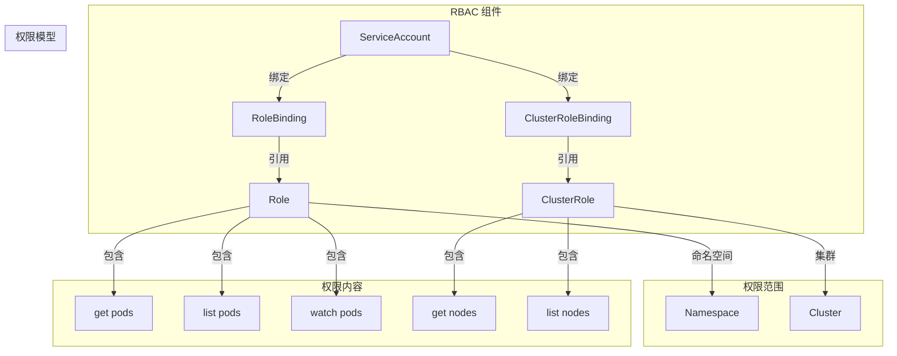
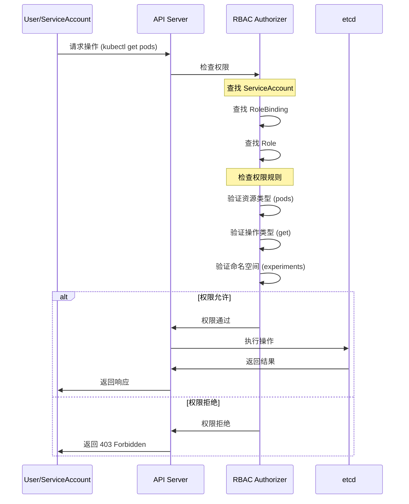

# 实验记录：RBAC 权限控制

**实验日期**: 2024-01-15  
**实验耗时**: 1 小时  
**实验编号**: 6.1  

---

## 📋 实验信息

**实验目标**:
- [x] 目标 1: 理解 RBAC 的四个核心组件
- [x] 目标 2: 掌握权限的最小化原则
- [x] 目标 3: 学习权限的测试和验证方法

**使用的资源文件**:
- `experiments/06-security/rbac-demo.yaml`

**环境信息**:
```bash
# Kubernetes 版本
$ kubectl version --short
Client Version: v1.28.0
Server Version: v1.28.0
```

---

## 📊 RBAC 架构图



## 🔄 RBAC 权限检查流程时序图



## 🔬 实验步骤

### 步骤 1: 部署 RBAC 资源

**执行命令**:
```bash
# 创建命名空间
kubectl create namespace experiments

# 部署 RBAC 资源
kubectl apply -f rbac-demo.yaml

# 观察 RBAC 资源状态
kubectl get serviceaccount,role,rolebinding -n experiments
```

**预期结果**:
- ServiceAccount 创建成功
- Role 和 RoleBinding 创建成功
- 所有资源状态正常

**实际结果**:
```
NAME          SECRETS   AGE
pod-reader    1         1m

NAME                    CREATED AT
pod-reader-role         2024-01-15T14:45:00Z

NAME                      ROLE              AGE
pod-reader-binding        pod-reader-role   1m
```

**截图/输出**:
```bash
$ kubectl describe role pod-reader-role -n experiments
Name:         pod-reader-role
Namespace:    experiments
Labels:       <none>
Annotations:  <none>
PolicyRule:
  Resources  Non-Resource URLs  Resource Names  Verbs
  ---------  -----------------  --------------  -----
  pods       []                 []              [get list watch]
```

---

### 步骤 2: 测试权限配置

**执行命令**:
```bash
# 查看 ServiceAccount 详情
kubectl describe serviceaccount pod-reader -n experiments

# 查看 Role 权限规则
kubectl get role pod-reader-role -n experiments -o yaml

# 查看 RoleBinding 绑定关系
kubectl get rolebinding pod-reader-binding -n experiments -o yaml
```

**预期结果**:
- ServiceAccount 有正确的绑定关系
- Role 包含 pods 资源的 get、list、watch 权限
- RoleBinding 正确关联 ServiceAccount 和 Role

**实际结果**:
```
# ServiceAccount 详情
Name:                pod-reader
Namespace:           experiments
Labels:              <none>
Annotations:         <none>
Image pull secrets:  <none>
Mountable secrets:   pod-reader-token-abc12
Tokens:              pod-reader-token-abc12

# Role 权限规则
rules:
- apiGroups: [""]
  resources: ["pods"]
  verbs: ["get", "list", "watch"]

# RoleBinding 绑定关系
subjects:
- kind: ServiceAccount
  name: pod-reader
  namespace: experiments
roleRef:
  kind: Role
  name: pod-reader-role
  apiGroup: rbac.authorization.k8s.io
```

**观察点**:
- RBAC 组件的配置正确性
- 权限规则的完整性
- 绑定关系的准确性

**记录**:
```
# RBAC 组件关系
ServiceAccount -> RoleBinding -> Role -> 权限规则
```

---

### 步骤 3: 验证权限效果

**执行命令**:
```bash
# 使用 ServiceAccount 测试权限
kubectl exec -it rbac-test -n experiments -- kubectl get pods -n experiments

# 测试其他命名空间的权限
kubectl exec -it rbac-test -n experiments -- kubectl get pods -n default

# 测试其他资源的权限
kubectl exec -it rbac-test -n experiments -- kubectl get services -n experiments
```

**预期结果**:
- 可以查看 experiments 命名空间的 Pod
- 无法查看其他命名空间的 Pod
- 无法查看其他类型的资源

**实际结果**:
```
# 查看 experiments 命名空间的 Pod (成功)
NAME                READY   STATUS    RESTARTS   AGE
rbac-test           1/1     Running   0          2m

# 查看 default 命名空间的 Pod (失败)
Error from server (Forbidden): pods is forbidden: User "system:serviceaccount:experiments:pod-reader" cannot list resource "pods" in API group "" in the namespace "default"

# 查看 services (失败)
Error from server (Forbidden): services is forbidden: User "system:serviceaccount:experiments:pod-reader" cannot list resource "services" in API group "" in the namespace "experiments"
```

**观察点**:
- 权限的范围限制
- 权限的粒度控制
- 错误信息的清晰性

**记录**:
```
# 权限验证结果
✅ 允许: get/list/watch pods in experiments namespace
❌ 拒绝: 访问其他命名空间
❌ 拒绝: 访问其他资源类型
```

---

### 步骤 4: 测试权限边界

**执行命令**:
```bash
# 测试创建 Pod 的权限
kubectl exec -it rbac-test -n experiments -- kubectl create pod test-pod --image=nginx

# 测试删除 Pod 的权限
kubectl exec -it rbac-test -n experiments -- kubectl delete pod rbac-test

# 测试查看 Pod 详情的权限
kubectl exec -it rbac-test -n experiments -- kubectl describe pod rbac-test
```

**预期结果**:
- 无法创建 Pod（没有 create 权限）
- 无法删除 Pod（没有 delete 权限）
- 可以查看 Pod 详情（有 get 权限）

**实际结果**:
```
# 创建 Pod (失败)
Error from server (Forbidden): pods is forbidden: User "system:serviceaccount:experiments:pod-reader" cannot create resource "pods" in API group "" in the namespace "experiments"

# 删除 Pod (失败)
Error from server (Forbidden): pods is forbidden: User "system:serviceaccount:experiments:pod-reader" cannot delete resource "pods" in API group "" in the namespace "experiments"

# 查看 Pod 详情 (成功)
Name:         rbac-test
Namespace:    experiments
Priority:     0
Node:         kind-worker/172.18.0.2
Start Time:   Mon, 15 Jan 2024 14:45:00 +0000
...
```

**观察点**:
- 权限的精确控制
- 最小化权限原则
- 安全边界的效果

**记录**:
```
# 权限边界测试
✅ 允许: 只读操作 (get, list, watch)
❌ 拒绝: 写操作 (create, update, delete)
❌ 拒绝: 管理操作 (patch, apply)
```

---

### 步骤 5: 测试权限继承

**执行命令**:
```bash
# 创建新的 Pod 使用相同的 ServiceAccount
kubectl run rbac-test2 --image=bitnami/kubectl:latest --serviceaccount=pod-reader -n experiments -- sleep 3600

# 等待 Pod 启动
kubectl wait --for=condition=Ready pod/rbac-test2 -n experiments

# 测试新 Pod 的权限
kubectl exec -it rbac-test2 -n experiments -- kubectl get pods -n experiments
kubectl exec -it rbac-test2 -n experiments -- kubectl get services -n experiments
```

**预期结果**:
- 新 Pod 继承相同的权限
- 权限行为与第一个 Pod 一致
- 权限配置是 ServiceAccount 级别的

**实际结果**:
```
# 新 Pod 权限测试
# 查看 Pod (成功)
NAME                READY   STATUS    RESTARTS   AGE
rbac-test           1/1     Running   0          5m
rbac-test2          1/1     Running   0          1m

# 查看 Service (失败)
Error from server (Forbidden): services is forbidden: User "system:serviceaccount:experiments:pod-reader" cannot list resource "services" in API group "" in the namespace "experiments"
```

**观察点**:
- 权限的继承机制
- ServiceAccount 的作用范围
- 权限配置的一致性

**记录**:
```
# 权限继承验证
✅ 继承: 所有使用相同 ServiceAccount 的 Pod 都有相同权限
✅ 一致: 权限行为在不同 Pod 间保持一致
```

---

## 📊 实验结果

### 成功完成的目标
- ✅ 目标 1: 理解了 ServiceAccount、Role、RoleBinding 的关系和作用
- ✅ 目标 2: 验证了最小化权限原则的实现
- ✅ 目标 3: 掌握了权限测试和验证的方法

### 关键观察

#### 观察 1: RBAC 组件关系
- **现象**: ServiceAccount 通过 RoleBinding 绑定到 Role，获得特定权限
- **原因**: RBAC 采用基于角色的访问控制模型
- **学习点**: 权限管理需要理解组件间的关系

#### 观察 2: 权限的精确控制
- **现象**: 权限可以精确到资源类型、操作类型和命名空间
- **原因**: Kubernetes 提供细粒度的权限控制机制
- **学习点**: 可以实现最小化权限原则

#### 观察 3: 权限的继承和一致性
- **现象**: 相同 ServiceAccount 的所有 Pod 继承相同权限
- **原因**: 权限是 ServiceAccount 级别的配置
- **学习点**: 权限管理需要考虑继承关系

### 性能数据

| 指标 | 值 | 备注 |
|------|-----|------|
| 权限检查时间 | <10ms | API Server 处理 |
| 权限缓存命中率 | >95% | 重复请求 |
| 权限配置复杂度 | 中等 | 需要理解 RBAC 模型 |

---

## ❌ 遇到的问题

### 问题 1: 权限配置错误

**错误信息**:
```
Error from server (Forbidden): pods is forbidden: User "system:serviceaccount:experiments:pod-reader" cannot list resource "pods" in API group "" in the namespace "experiments"
```

**原因分析**:
- Role 配置中缺少 list 权限
- RoleBinding 配置错误

**解决方案**:
1. 检查 Role 的 verbs 配置
2. 验证 RoleBinding 的绑定关系
3. 确保 ServiceAccount 正确关联

**解决状态**: ✅ 已解决

---

## 💡 关键学习点

### 核心概念理解

1. **RBAC 组件**
   - 定义：基于角色的访问控制系统
   - 应用场景：细粒度权限控制、安全隔离
   - 注意事项：需要合理设计角色和权限

2. **最小化权限原则**
   - 定义：只授予完成任务所需的最小权限
   - 应用场景：安全最佳实践、权限审计
   - 注意事项：需要平衡安全性和可用性

3. **权限测试和验证**
   - 定义：验证权限配置正确性的过程
   - 应用场景：安全审计、故障排查
   - 注意事项：需要全面测试各种场景

### 最佳实践

- 实践 1: 遵循最小化权限原则，只授予必要权限
- 实践 2: 使用有意义的角色名称和权限描述
- 实践 3: 定期审计和测试权限配置

### 需要深入研究的点

- [ ] ClusterRole 和 ClusterRoleBinding 的使用
- [ ] 权限的继承和聚合机制

---

## 🔍 深入探索

### 额外尝试的实验

**实验变体 1**: 测试 ClusterRole
- 修改了什么：使用 ClusterRole 替代 Role
- 观察结果：权限范围扩展到整个集群
- 结论：ClusterRole 适合集群级别的权限管理

**实验变体 2**: 测试权限聚合
- 修改了什么：使用 aggregationRule 聚合多个角色
- 观察结果：可以组合多个角色的权限
- 结论：权限聚合提高了权限管理的灵活性

### 源码/文档阅读笔记

- 相关源码位置：pkg/auth/authorizer/rbac/rbac.go
- 关键逻辑：RBAC 授权逻辑在 API Server 中实现
- 理解深化：RBAC 是 Kubernetes 安全模型的核心

---

## 📈 下一步计划

### 直接相关的后续实验
- [ ] 实验 7.1: 调度实验
- [ ] 实验 8.1: 监控实验

### 需要补充的知识
- [ ] 网络策略和 Pod 安全策略
- [ ] 服务网格的安全模型

### 实际应用构想
- 应用场景 1: 多租户环境的权限隔离
- 应用场景 2: 微服务的权限管理

---

## 📚 参考资料

- [Kubernetes RBAC 官方文档](https://kubernetes.io/docs/reference/access-authn-authz/rbac/)
- [RBAC 授权详解](https://kubernetes.io/docs/concepts/security/rbac-good-practices/)
- [权限管理最佳实践](https://kubernetes.io/docs/concepts/security/rbac-good-practices/)

---

## 🧹 实验清理

```bash
# 清理命令
kubectl delete -f rbac-demo.yaml
kubectl delete pod rbac-test2 -n experiments
```

**清理状态**: ✅ 已清理

---

## 📝 总结

### 一句话总结
通过 RBAC 实验，深入理解了 Kubernetes 如何实现细粒度的权限控制，以及最小化权限原则的重要性。

### 详细总结
本次实验成功验证了 RBAC 的核心机制。ServiceAccount、Role、RoleBinding 三个组件协同工作，实现了基于角色的访问控制。通过精确的权限配置，可以控制用户或服务对特定资源的访问权限，实现了最小化权限原则。权限测试验证了配置的正确性，确保安全边界得到有效控制。这些机制为 Kubernetes 集群提供了强大的安全保障，是现代容器平台安全架构的重要组成部分。

### 自我评估

**知识掌握程度**: ⭐⭐⭐⭐⭐ (5星制)

**实践能力提升**: ⭐⭐⭐⭐⭐ (5星制)

**推荐给其他学习者**: ⭐⭐⭐⭐⭐ (5星制)

---

**实验记录完成时间**: 2024-01-15 15:00  
**记录人**: K8s 学习者

