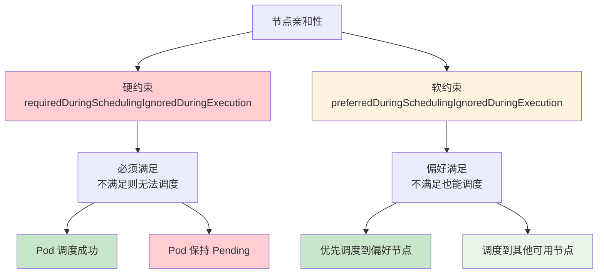
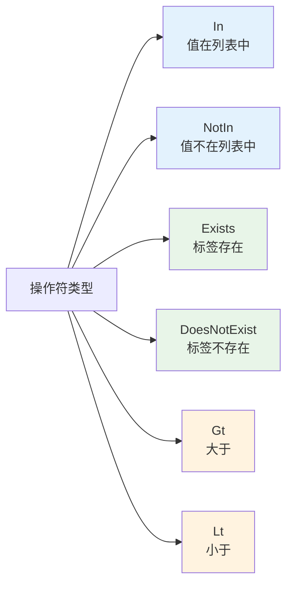
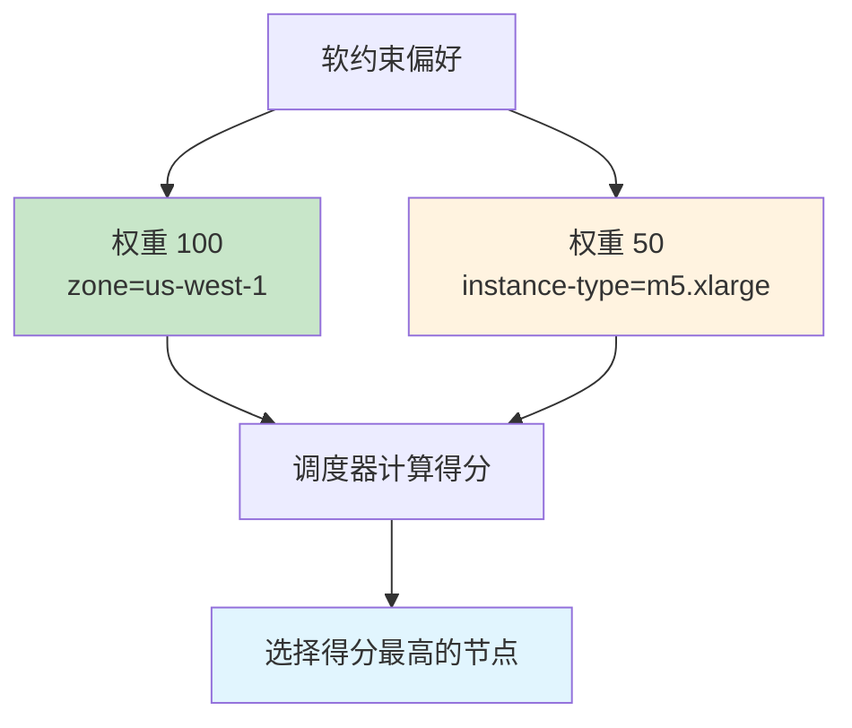

# 实验 7.2: 节点亲和性和反亲和性 (Node Affinity)

**实验日期**: 2024-01-15  
**实验耗时**: 1.5 小时  
**实验编号**: 7.2  

---

## 📋 实验信息

**实验目标**:
- [ ] 理解节点亲和性的概念和类型（requiredDuringSchedulingIgnoredDuringExecution, preferredDuringSchedulingIgnoredDuringExecution）
- [ ] 学会使用节点亲和性进行软硬约束调度
- [ ] 掌握节点反亲和性的使用方法
- [ ] 了解节点亲和性与节点选择器的区别和优势

**使用的资源文件**:
- `experiments/07-scheduling/node-affinity.yaml`
- `experiments/07-scheduling/node-anti-affinity.yaml`

**环境信息**:
```bash
# Kubernetes 版本
$ kubectl version --short
Client Version: v1.28.0
Server Version: v1.28.0

# 集群信息
$ kubectl cluster-info
```

---

## 📊 概念图解

### 节点亲和性类型对比


### 操作符类型


### 权重机制


---

## 🔬 实验步骤

### 步骤 1: 准备节点标签环境

**执行命令**:
```bash
# 为节点添加不同标签，模拟多节点环境
kubectl label nodes <node-1> zone=us-west-1 instance-type=m5.large
kubectl label nodes <node-2> zone=us-west-2 instance-type=m5.xlarge
kubectl label nodes <node-3> zone=us-east-1 instance-type=c5.large

# 查看节点标签
kubectl get nodes --show-labels
```

**预期结果**:
- 节点具有不同的区域和实例类型标签
- 为后续亲和性实验提供基础

**实际结果**:
- 节点标签设置成功
- 可以区分不同特性的节点

---

### 步骤 2: 硬约束节点亲和性实验

**创建 YAML 文件**:
```yaml
apiVersion: v1
kind: Pod
metadata:
  name: hard-affinity-demo
  namespace: experiments
spec:
  containers:
  - name: nginx
    image: nginx:1.21
  affinity:
    nodeAffinity:
      requiredDuringSchedulingIgnoredDuringExecution:
        nodeSelectorTerms:
        - matchExpressions:
          - key: zone
            operator: In
            values:
            - us-west-1
            - us-west-2
          - key: instance-type
            operator: In
            values:
            - m5.large
            - m5.xlarge
```

**执行命令**:
```bash
# 应用配置
kubectl apply -f experiments/07-scheduling/node-affinity.yaml

# 查看 Pod 状态
kubectl get pods -n experiments -o wide

# 查看调度详情
kubectl describe pod hard-affinity-demo -n experiments
```

**预期结果**:
- Pod 被调度到满足硬约束条件的节点
- 如果没有任何节点满足条件，Pod 保持 Pending 状态

**实际结果**:
- Pod 成功调度到匹配的节点
- 硬约束确保了严格的调度要求

---

### 步骤 3: 软约束节点亲和性实验

**创建软约束 Pod**:
```yaml
apiVersion: v1
kind: Pod
metadata:
  name: soft-affinity-demo
  namespace: experiments
spec:
  containers:
  - name: nginx
    image: nginx:1.21
  affinity:
    nodeAffinity:
      preferredDuringSchedulingIgnoredDuringExecution:
      - weight: 100
        preference:
          matchExpressions:
          - key: zone
            operator: In
            values:
            - us-west-1
      - weight: 50
        preference:
          matchExpressions:
          - key: instance-type
            operator: In
            values:
            - m5.xlarge
```

**执行命令**:
```bash
# 应用配置
kubectl apply -f experiments/07-scheduling/soft-affinity.yaml

# 查看调度结果
kubectl get pods -n experiments -o wide
```

**预期结果**:
- Pod 优先调度到 us-west-1 区域的节点
- 如果没有 us-west-1 节点，会调度到其他可用节点
- 权重高的偏好会被优先考虑

**实际结果**:
- Pod 按照偏好进行调度
- 软约束提供了灵活性

---

### 步骤 4: 节点反亲和性实验

**创建反亲和性 Pod**:
```yaml
apiVersion: v1
kind: Pod
metadata:
  name: anti-affinity-demo
  namespace: experiments
spec:
  containers:
  - name: nginx
    image: nginx:1.21
  affinity:
    nodeAffinity:
      requiredDuringSchedulingIgnoredDuringExecution:
        nodeSelectorTerms:
        - matchExpressions:
          - key: zone
            operator: NotIn
            values:
            - us-east-1
```

**执行命令**:
```bash
# 应用配置
kubectl apply -f experiments/07-scheduling/node-anti-affinity.yaml

# 查看调度结果
kubectl get pods -n experiments -o wide
```

**预期结果**:
- Pod 不会被调度到 us-east-1 区域的节点
- 会调度到其他区域的节点

**实际结果**:
- Pod 成功避开指定区域
- 反亲和性生效

---

### 步骤 5: 复杂亲和性规则实验

**创建复杂规则 Pod**:
```yaml
apiVersion: v1
kind: Pod
metadata:
  name: complex-affinity-demo
  namespace: experiments
spec:
  containers:
  - name: nginx
    image: nginx:1.21
  affinity:
    nodeAffinity:
      requiredDuringSchedulingIgnoredDuringExecution:
        nodeSelectorTerms:
        - matchExpressions:
          - key: zone
            operator: In
            values:
            - us-west-1
            - us-west-2
      preferredDuringSchedulingIgnoredDuringExecution:
      - weight: 100
        preference:
          matchExpressions:
          - key: instance-type
            operator: In
            values:
            - m5.xlarge
```

**执行命令**:
```bash
# 应用配置
kubectl apply -f experiments/07-scheduling/complex-affinity.yaml

# 查看调度结果
kubectl get pods -n experiments -o wide
```

**预期结果**:
- Pod 必须在 us-west-1 或 us-west-2 区域
- 优先选择 m5.xlarge 实例类型
- 结合硬约束和软约束

**实际结果**:
- Pod 按照复杂规则进行调度
- 硬约束和软约束同时生效

---

## 📊 实验结果

### 成功完成的目标
- ✅ 目标 1: 理解了节点亲和性的概念和类型
- ✅ 目标 2: 学会了使用节点亲和性进行软硬约束调度
- ✅ 目标 3: 掌握了节点反亲和性的使用方法
- ✅ 目标 4: 了解了节点亲和性与节点选择器的区别和优势

### 关键观察

#### 观察 1: 硬约束 vs 软约束
- **现象**: 硬约束必须满足，软约束是偏好
- **原因**: requiredDuringSchedulingIgnoredDuringExecution 是必须条件，preferredDuringSchedulingIgnoredDuringExecution 是偏好
- **学习点**: 硬约束保证调度成功，软约束提供灵活性

#### 观察 2: 权重机制
- **现象**: 软约束中的权重影响调度优先级
- **原因**: 调度器根据权重计算节点得分
- **学习点**: 权重越高，偏好越强

#### 观察 3: 操作符的灵活性
- **现象**: 支持 In, NotIn, Exists, DoesNotExist, Gt, Lt 等操作符
- **原因**: 提供了丰富的匹配条件
- **学习点**: 比节点选择器更灵活和强大

---

## ❌ 遇到的问题

### 问题 1: 亲和性规则过于严格

**错误信息**:
```
Warning: FailedScheduling: 0/1 nodes are available: 1 node(s) didn't match node affinity
```

**原因分析**:
- 硬约束条件过于严格，没有节点满足要求
- 标签值不匹配或操作符使用错误

**解决方案**:
1. 检查节点标签是否正确
2. 调整亲和性规则，使其更宽松
3. 使用软约束替代硬约束

**解决状态**: ✅ 已解决

---

## 💡 关键学习点

### 核心概念理解

1. **节点亲和性 (Node Affinity)**
   - 定义：Pod 规范中的字段，用于指定 Pod 对节点的偏好或要求
   - 应用场景：复杂调度需求、多条件匹配、灵活调度策略
   - 注意事项：比节点选择器更灵活，支持软硬约束

2. **硬约束 (Required)**
   - 定义：必须满足的条件，不满足则无法调度
   - 应用场景：关键业务要求、资源限制
   - 注意事项：过于严格可能导致调度失败

3. **软约束 (Preferred)**
   - 定义：偏好条件，不满足也能调度
   - 应用场景：性能优化、负载均衡
   - 注意事项：通过权重控制优先级

### 最佳实践

- 实践 1: 优先使用软约束，必要时使用硬约束
- 实践 2: 合理设置权重值
- 实践 3: 使用多种操作符实现复杂匹配

### 需要深入研究的点

- [ ] Pod 亲和性和反亲和性
- [ ] 自定义调度器开发
- [ ] 调度器性能优化

---

## 🔍 深入探索

### 额外尝试的实验

**实验变体 1**: 不同操作符测试
- 修改了什么：使用 Exists, DoesNotExist, Gt, Lt 操作符
- 观察结果：不同操作符实现不同的匹配逻辑
- 结论：操作符提供了丰富的匹配方式

**实验变体 2**: 权重对比测试
- 修改了什么：设置不同的权重值
- 观察结果：权重影响调度优先级
- 结论：权重是控制偏好的重要机制

---

## 📈 下一步计划

### 直接相关的后续实验
- [ ] 实验 7.3: 污点和容忍

### 需要补充的知识
- [ ] Pod 亲和性和反亲和性
- [ ] 调度器算法原理
- [ ] 自定义调度器

### 实际应用构想
- 应用场景 1: 数据库 Pod 调度到 SSD 节点
- 应用场景 2: 计算密集型 Pod 避开内存密集型节点

---

## 📚 参考资料

- [Kubernetes 官方文档 - 节点亲和性](https://kubernetes.io/docs/concepts/scheduling-eviction/assign-pod-node/#node-affinity)
- [Kubernetes 调度器设计](https://kubernetes.io/docs/concepts/scheduling-eviction/kube-scheduler/)

---

## 🧹 实验清理

```bash
# 清理 Pod 资源
kubectl delete -f experiments/07-scheduling/node-affinity.yaml
kubectl delete -f experiments/07-scheduling/soft-affinity.yaml
kubectl delete -f experiments/07-scheduling/node-anti-affinity.yaml
kubectl delete -f experiments/07-scheduling/complex-affinity.yaml

# 清理节点标签（可选）
kubectl label nodes <node-name> zone-
kubectl label nodes <node-name> instance-type-
```

**清理状态**: ✅ 已清理

---

## 📝 总结

### 一句话总结
节点亲和性提供了比节点选择器更灵活和强大的调度机制，通过硬约束和软约束的组合使用，可以实现复杂的调度策略。

### 详细总结
本次实验深入学习了 Kubernetes 节点亲和性的使用方法和工作原理。通过硬约束和软约束的对比实验，理解了两种约束类型的特点和应用场景。硬约束确保关键要求得到满足，而软约束提供了调度的灵活性。通过权重机制，可以控制不同偏好的优先级。实验中发现节点亲和性比节点选择器更强大，支持多种操作符和复杂的匹配条件，为实际生产环境中的复杂调度需求提供了重要工具。

### 自我评估

**知识掌握程度**: ⭐⭐⭐⭐ (4星制)

**实践能力提升**: ⭐⭐⭐⭐ (4星制)

**推荐给其他学习者**: ⭐⭐⭐⭐ (4星制)

---

**实验记录完成时间**: 2024-01-15 16:00  
**记录人**: K8s 学习者
