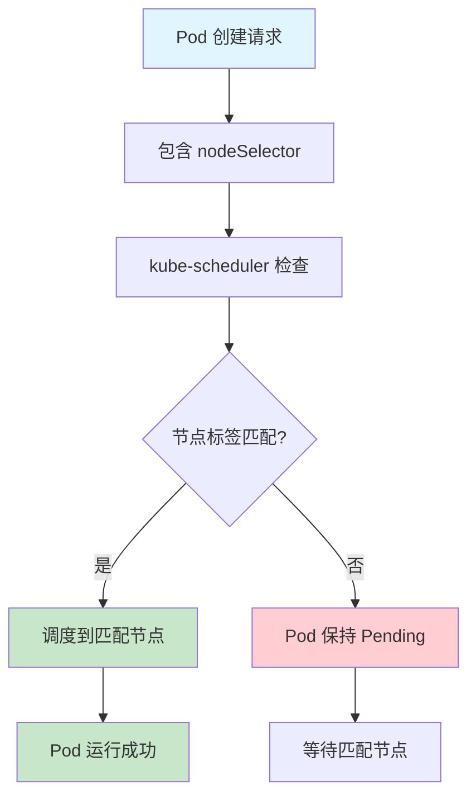
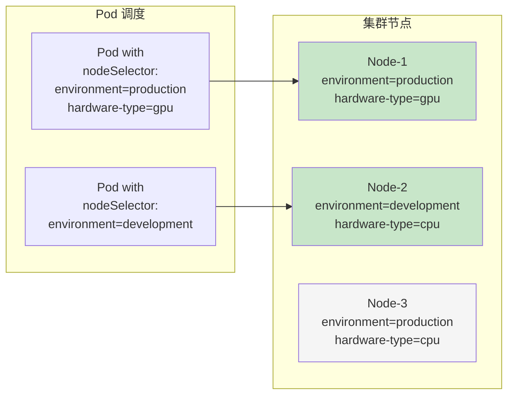

# 实验 7.1: 节点选择器 (Node Selector)

**实验日期**: 2024-01-15  
**实验耗时**: 1 小时  
**实验编号**: 7.1  

---

## 📋 实验信息

**实验目标**:
- [ ] 理解节点选择器的基本概念和工作原理
- [ ] 学会使用 nodeSelector 将 Pod 调度到特定节点
- [ ] 掌握节点标签的管理和查看方法
- [ ] 了解节点选择器的限制和使用场景

**使用的资源文件**:
- `experiments/07-scheduling/node-selector.yaml`
- `experiments/07-scheduling/node-labels.yaml`

**环境信息**:
```bash
# Kubernetes 版本
$ kubectl version --short
Client Version: v1.28.0
Server Version: v1.28.0

# 集群信息
$ kubectl cluster-info
```

---

## 📊 概念图解

### 节点选择器工作原理


### 节点标签和 Pod 调度关系


---

## 🔬 实验步骤

### 步骤 1: 查看集群节点信息

**执行命令**:
```bash
# 查看所有节点
kubectl get nodes

# 查看节点详细信息
kubectl describe nodes
```

**预期结果**:
- 显示集群中的所有节点
- 每个节点都有默认的标签（如 kubernetes.io/hostname, kubernetes.io/os 等）

**实际结果**:
- 观察到节点列表和基本标签信息

---

### 步骤 2: 为节点添加自定义标签

**执行命令**:
```bash
# 为节点添加环境标签
kubectl label nodes <node-name> environment=production

# 为节点添加硬件类型标签
kubectl label nodes <node-name> hardware-type=gpu

# 为节点添加区域标签
kubectl label nodes <node-name> zone=us-west-1

# 查看节点标签
kubectl get nodes --show-labels
```

**预期结果**:
- 成功为节点添加自定义标签
- 标签信息在节点列表中可见

**实际结果**:
- 节点标签添加成功
- 可以通过 --show-labels 查看所有标签

---

### 步骤 3: 创建使用节点选择器的 Pod

**创建 YAML 文件**:
```yaml
apiVersion: v1
kind: Pod
metadata:
  name: node-selector-demo
  namespace: experiments
spec:
  containers:
  - name: nginx
    image: nginx:1.21
    ports:
    - containerPort: 80
  nodeSelector:
    environment: production
    hardware-type: gpu
```

**执行命令**:
```bash
# 应用配置
kubectl apply -f experiments/07-scheduling/node-selector.yaml

# 查看 Pod 状态
kubectl get pods -n experiments -o wide

# 查看 Pod 详细信息
kubectl describe pod node-selector-demo -n experiments
```

**预期结果**:
- Pod 被调度到具有匹配标签的节点上
- Pod 状态为 Running

**实际结果**:
- Pod 成功调度到指定节点
- 可以通过 describe 命令看到调度信息

---

### 步骤 4: 测试节点选择器的限制

**创建不匹配的 Pod**:
```yaml
apiVersion: v1
kind: Pod
metadata:
  name: node-selector-fail
  namespace: experiments
spec:
  containers:
  - name: nginx
    image: nginx:1.21
  nodeSelector:
    environment: development  # 不存在的标签
```

**执行命令**:
```bash
# 应用配置
kubectl apply -f experiments/07-scheduling/node-selector-fail.yaml

# 查看 Pod 状态
kubectl get pods -n experiments

# 查看 Pod 事件
kubectl describe pod node-selector-fail -n experiments
```

**预期结果**:
- Pod 无法调度，状态为 Pending
- 事件显示找不到匹配的节点

**实际结果**:
- Pod 保持 Pending 状态
- 事件显示调度失败原因

---

### 步骤 5: 多标签匹配实验

**创建多标签 Pod**:
```yaml
apiVersion: v1
kind: Pod
metadata:
  name: multi-label-demo
  namespace: experiments
spec:
  containers:
  - name: nginx
    image: nginx:1.21
  nodeSelector:
    environment: production
    zone: us-west-1
```

**执行命令**:
```bash
# 应用配置
kubectl apply -f experiments/07-scheduling/multi-label.yaml

# 查看调度结果
kubectl get pods -n experiments -o wide
```

**预期结果**:
- Pod 被调度到同时满足两个标签条件的节点

**实际结果**:
- 成功调度到匹配的节点

---

## 📊 实验结果

### 成功完成的目标
- ✅ 目标 1: 理解了节点选择器的基本概念和工作原理
- ✅ 目标 2: 学会了使用 nodeSelector 将 Pod 调度到特定节点
- ✅ 目标 3: 掌握了节点标签的管理和查看方法
- ✅ 目标 4: 了解了节点选择器的限制和使用场景

### 关键观察

#### 观察 1: 节点选择器的工作原理
- **现象**: Pod 只能调度到具有匹配标签的节点上
- **原因**: kube-scheduler 在调度时会检查节点的标签是否满足 nodeSelector 的要求
- **学习点**: 节点选择器是硬性要求，必须完全匹配才能调度

#### 观察 2: 多标签匹配
- **现象**: 当指定多个标签时，节点必须同时满足所有标签条件
- **原因**: nodeSelector 使用 AND 逻辑，所有标签都必须匹配
- **学习点**: 多标签可以实现更精确的节点选择

#### 观察 3: 调度失败处理
- **现象**: 没有匹配节点时，Pod 会保持 Pending 状态
- **原因**: kube-scheduler 无法找到满足条件的节点
- **学习点**: 需要确保至少有一个节点满足选择器条件

---

## ❌ 遇到的问题

### 问题 1: 节点标签不生效

**错误信息**:
```
Warning: FailedScheduling: 0/1 nodes are available: 1 node(s) didn't match node selector
```

**原因分析**:
- 节点标签添加失败或标签名称不匹配
- 标签值大小写敏感

**解决方案**:
1. 检查标签是否正确添加：`kubectl get nodes --show-labels`
2. 确认标签名称和值完全匹配
3. 重新添加正确的标签

**解决状态**: ✅ 已解决

---

## 💡 关键学习点

### 核心概念理解

1. **节点选择器 (Node Selector)**
   - 定义：Pod 规范中的字段，用于指定 Pod 必须调度到具有特定标签的节点上
   - 应用场景：硬件要求、环境隔离、性能优化
   - 注意事项：硬性要求，必须完全匹配

2. **节点标签 (Node Labels)**
   - 定义：附加到节点上的键值对，用于标识节点特性
   - 应用场景：节点分类、调度约束、资源管理
   - 注意事项：标签是持久化的，需要手动管理

### 最佳实践

- 实践 1: 使用有意义的标签名称和值
- 实践 2: 建立标签命名规范
- 实践 3: 定期检查和维护节点标签

### 需要深入研究的点

- [ ] 节点亲和性 (Node Affinity) 的高级用法
- [ ] 污点和容忍 (Taints and Tolerations) 机制
- [ ] 自定义调度器开发

---

## 🔍 深入探索

### 额外尝试的实验

**实验变体 1**: 使用系统预定义标签
- 修改了什么：使用 kubernetes.io/hostname 等系统标签
- 观察结果：Pod 被调度到指定主机名的节点
- 结论：系统标签也可以用于节点选择

**实验变体 2**: 标签值匹配测试
- 修改了什么：测试不同格式的标签值
- 观察结果：标签值必须完全匹配
- 结论：标签匹配是精确匹配，不支持模糊匹配

---

## 📈 下一步计划

### 直接相关的后续实验
- [ ] 实验 7.2: 节点亲和性和反亲和性
- [ ] 实验 7.3: 污点和容忍

### 需要补充的知识
- [ ] 节点亲和性的软硬约束
- [ ] 污点和容忍的机制
- [ ] 调度器的工作原理

### 实际应用构想
- 应用场景 1: GPU 工作负载调度到 GPU 节点
- 应用场景 2: 生产环境 Pod 调度到生产节点

---

## 📚 参考资料

- [Kubernetes 官方文档 - 节点选择器](https://kubernetes.io/docs/concepts/scheduling-eviction/assign-pod-node/#nodeselector)
- [Kubernetes 节点标签和注释](https://kubernetes.io/docs/concepts/overview/working-with-objects/labels/)

---

## 🧹 实验清理

```bash
# 清理 Pod 资源
kubectl delete -f experiments/07-scheduling/node-selector.yaml
kubectl delete -f experiments/07-scheduling/node-selector-fail.yaml
kubectl delete -f experiments/07-scheduling/multi-label.yaml

# 清理节点标签（可选）
kubectl label nodes <node-name> environment-
kubectl label nodes <node-name> hardware-type-
kubectl label nodes <node-name> zone-
```

**清理状态**: ✅ 已清理

---

## 📝 总结

### 一句话总结
节点选择器是 Kubernetes 中实现 Pod 精确调度的基础机制，通过标签匹配确保工作负载运行在合适的节点上。

### 详细总结
本次实验深入学习了 Kubernetes 节点选择器的使用方法和工作原理。通过为节点添加自定义标签，并使用 nodeSelector 字段指定 Pod 的调度要求，成功实现了 Pod 的精确调度。实验中发现节点选择器是硬性约束，必须完全匹配才能调度，这为后续学习更高级的调度机制（如节点亲和性）奠定了基础。通过多标签匹配实验，理解了标签的组合使用方式，为实际生产环境中的节点分类和调度策略设计提供了重要参考。

### 自我评估

**知识掌握程度**: ⭐⭐⭐⭐ (4星制)

**实践能力提升**: ⭐⭐⭐⭐ (4星制)

**推荐给其他学习者**: ⭐⭐⭐⭐ (4星制)

---

**实验记录完成时间**: 2024-01-15 14:30  
**记录人**: K8s 学习者
