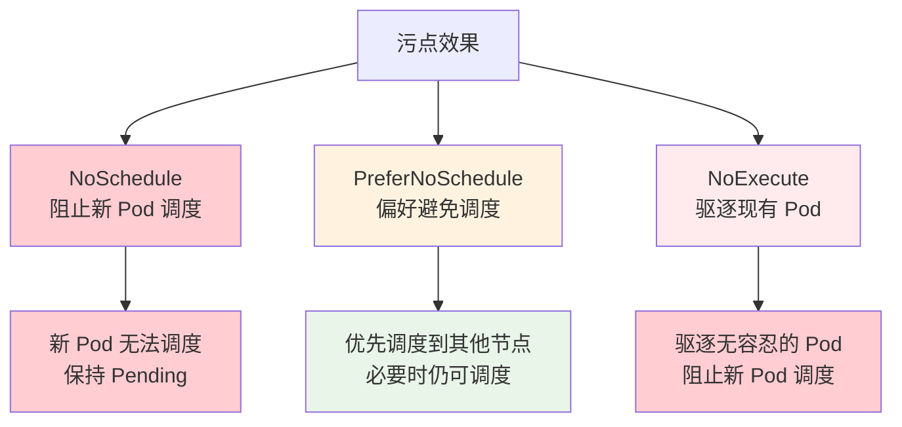
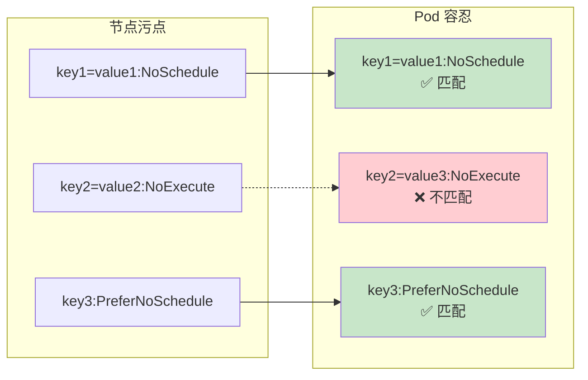
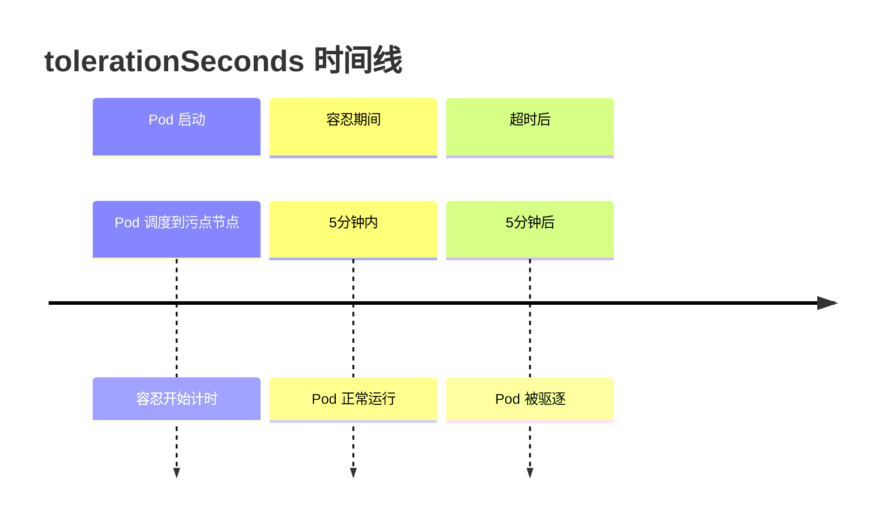

# 实验 7.3: 污点和容忍 (Taints and Tolerations)

**实验日期**: 2024-01-15  
**实验耗时**: 2 小时  
**实验编号**: 7.3  

---

## 📋 实验信息

**实验目标**:
- [ ] 理解污点 (Taints) 和容忍 (Tolerations) 的概念和工作原理
- [ ] 学会为节点添加污点，控制 Pod 调度
- [ ] 掌握为 Pod 添加容忍，允许调度到污点节点
- [ ] 了解污点的三种效果：NoSchedule, PreferNoSchedule, NoExecute
- [ ] 理解污点和容忍在节点隔离中的应用

**使用的资源文件**:
- `experiments/07-scheduling/taints-tolerations.yaml`
- `experiments/07-scheduling/node-taints.yaml`

**环境信息**:
```bash
# Kubernetes 版本
$ kubectl version --short
Client Version: v1.28.0
Server Version: v1.28.0

# 集群信息
$ kubectl cluster-info
```

---

## 📊 概念图解

### 污点效果对比


### 污点和容忍匹配机制


### tolerationSeconds 机制


---

## 🔬 实验步骤

### 步骤 1: 查看节点污点状态

**执行命令**:
```bash
# 查看所有节点的污点信息
kubectl describe nodes | grep -A 5 Taints

# 查看特定节点的污点
kubectl describe node <node-name> | grep -A 5 Taints
```

**预期结果**:
- 显示节点的污点信息（通常为空或只有系统污点）
- 了解当前节点的污点状态

**实际结果**:
- 观察到节点的污点信息
- 为后续实验提供基准

---

### 步骤 2: 添加 NoSchedule 污点

**执行命令**:
```bash
# 为节点添加 NoSchedule 污点
kubectl taint nodes <node-name> key1=value1:NoSchedule

# 查看污点是否添加成功
kubectl describe node <node-name> | grep -A 5 Taints

# 尝试调度普通 Pod 到该节点
kubectl run test-pod --image=nginx --restart=Never -n experiments
kubectl get pods -n experiments -o wide
```

**预期结果**:
- 节点成功添加 NoSchedule 污点
- 普通 Pod 无法调度到该节点
- Pod 保持 Pending 状态

**实际结果**:
- 污点添加成功
- Pod 调度失败，证明污点生效

---

### 步骤 3: 创建带容忍的 Pod

**创建带容忍的 Pod**:
```yaml
apiVersion: v1
kind: Pod
metadata:
  name: toleration-demo
  namespace: experiments
spec:
  containers:
  - name: nginx
    image: nginx:1.21
  tolerations:
  - key: "key1"
    operator: "Equal"
    value: "value1"
    effect: "NoSchedule"
```

**执行命令**:
```bash
# 应用配置
kubectl apply -f experiments/07-scheduling/taints-tolerations.yaml

# 查看 Pod 状态
kubectl get pods -n experiments -o wide

# 查看 Pod 详细信息
kubectl describe pod toleration-demo -n experiments
```

**预期结果**:
- Pod 成功调度到有污点的节点
- 容忍机制生效

**实际结果**:
- Pod 成功调度
- 容忍机制工作正常

---

### 步骤 4: 测试 PreferNoSchedule 效果

**执行命令**:
```bash
# 移除之前的污点
kubectl taint nodes <node-name> key1=value1:NoSchedule-

# 添加 PreferNoSchedule 污点
kubectl taint nodes <node-name> key2=value2:PreferNoSchedule

# 创建普通 Pod
kubectl run prefer-test-pod --image=nginx --restart=Never -n experiments
kubectl get pods -n experiments -o wide
```

**预期结果**:
- 普通 Pod 可能调度到该节点，但调度器会尽量避免
- 如果有其他可用节点，会优先选择其他节点

**实际结果**:
- Pod 可能调度到该节点
- 调度器表现出偏好行为

---

### 步骤 5: 测试 NoExecute 效果

**执行命令**:
```bash
# 移除 PreferNoSchedule 污点
kubectl taint nodes <node-name> key2=value2:PreferNoSchedule-

# 添加 NoExecute 污点
kubectl taint nodes <node-name> key3=value3:NoExecute

# 查看现有 Pod 状态
kubectl get pods -n experiments -o wide

# 创建新的普通 Pod
kubectl run noexecute-test-pod --image=nginx --restart=Never -n experiments
kubectl get pods -n experiments -o wide
```

**预期结果**:
- 现有 Pod 如果没有容忍，会被驱逐
- 新 Pod 无法调度到该节点

**实际结果**:
- Pod 被驱逐或无法调度
- NoExecute 效果生效

---

### 步骤 6: 复杂容忍规则实验

**创建复杂容忍 Pod**:
```yaml
apiVersion: v1
kind: Pod
metadata:
  name: complex-toleration-demo
  namespace: experiments
spec:
  containers:
  - name: nginx
    image: nginx:1.21
  tolerations:
  - key: "key1"
    operator: "Equal"
    value: "value1"
    effect: "NoSchedule"
  - key: "key2"
    operator: "Exists"
    effect: "NoExecute"
  - key: "key3"
    operator: "Equal"
    value: "value3"
    effect: "NoExecute"
    tolerationSeconds: 300  # 容忍 5 分钟
```

**执行命令**:
```bash
# 应用配置
kubectl apply -f experiments/07-scheduling/complex-toleration.yaml

# 查看调度结果
kubectl get pods -n experiments -o wide
```

**预期结果**:
- Pod 能够容忍多种污点
- tolerationSeconds 控制容忍时间

**实际结果**:
- Pod 成功调度
- 复杂容忍规则生效

---

## 📊 实验结果

### 成功完成的目标
- ✅ 目标 1: 理解了污点和容忍的概念和工作原理
- ✅ 目标 2: 学会了为节点添加污点，控制 Pod 调度
- ✅ 目标 3: 掌握了为 Pod 添加容忍，允许调度到污点节点
- ✅ 目标 4: 了解了污点的三种效果：NoSchedule, PreferNoSchedule, NoExecute
- ✅ 目标 5: 理解了污点和容忍在节点隔离中的应用

### 关键观察

#### 观察 1: 三种污点效果的区别
- **现象**: NoSchedule 阻止调度，PreferNoSchedule 偏好避免，NoExecute 驱逐现有 Pod
- **原因**: 不同效果对应不同的调度行为
- **学习点**: 选择合适的污点效果实现不同的隔离策略

#### 观察 2: 容忍的精确匹配
- **现象**: 容忍必须精确匹配污点的 key, value, effect
- **原因**: 污点和容忍的匹配机制是精确的
- **学习点**: 需要仔细配置容忍规则

#### 观察 3: tolerationSeconds 的作用
- **现象**: 可以设置容忍时间，超时后 Pod 被驱逐
- **原因**: 提供了临时的容忍机制
- **学习点**: 适用于维护窗口等场景

---

## ❌ 遇到的问题

### 问题 1: 污点格式错误

**错误信息**:
```
error: invalid taint specification: key=value:effect
```

**原因分析**:
- 污点格式不正确
- 效果名称拼写错误

**解决方案**:
1. 检查污点格式：`key=value:effect`
2. 确认效果名称：NoSchedule, PreferNoSchedule, NoExecute
3. 使用正确的命令格式

**解决状态**: ✅ 已解决

### 问题 2: 容忍规则不匹配

**错误信息**:
```
Warning: FailedScheduling: 0/1 nodes are available: 1 node(s) had taint {key1: value1}, that the pod didn't tolerate
```

**原因分析**:
- 容忍规则与污点不匹配
- key, value, effect 不一致

**解决方案**:
1. 检查污点的 key, value, effect
2. 确保容忍规则完全匹配
3. 使用 Exists 操作符匹配任意值

**解决状态**: ✅ 已解决

---

## 💡 关键学习点

### 核心概念理解

1. **污点 (Taints)**
   - 定义：附加到节点上的标记，用于排斥 Pod 调度
   - 应用场景：节点隔离、维护模式、特殊硬件
   - 注意事项：三种效果对应不同的行为

2. **容忍 (Tolerations)**
   - 定义：Pod 规范中的字段，允许 Pod 调度到有污点的节点
   - 应用场景：系统 Pod、特殊工作负载
   - 注意事项：必须精确匹配污点

3. **污点效果**
   - NoSchedule: 阻止新 Pod 调度
   - PreferNoSchedule: 偏好避免调度
   - NoExecute: 驱逐现有 Pod

### 最佳实践

- 实践 1: 使用污点进行节点隔离和维护
- 实践 2: 为系统 Pod 添加必要的容忍
- 实践 3: 合理使用 tolerationSeconds

### 需要深入研究的点

- [ ] 污点和容忍的高级用法
- [ ] 与节点亲和性的结合使用
- [ ] 自定义调度器中的污点处理

---

## 🔍 深入探索

### 额外尝试的实验

**实验变体 1**: 污点与亲和性结合
- 修改了什么：同时使用污点和节点亲和性
- 观察结果：两种机制可以同时生效
- 结论：污点和亲和性可以组合使用

**实验变体 2**: 动态污点管理
- 修改了什么：动态添加和移除污点
- 观察结果：Pod 调度行为实时变化
- 结论：污点可以动态管理

---

## 📈 下一步计划

### 直接相关的后续实验
- [ ] 实验 8.1: Metrics Server 资源监控

### 需要补充的知识
- [ ] Pod 亲和性和反亲和性
- [ ] 自定义调度器开发
- [ ] 调度器性能优化

### 实际应用构想
- 应用场景 1: 节点维护时添加污点
- 应用场景 2: GPU 节点专用调度

---

## 📚 参考资料

- [Kubernetes 官方文档 - 污点和容忍](https://kubernetes.io/docs/concepts/scheduling-eviction/taint-and-toleration/)
- [Kubernetes 节点隔离](https://kubernetes.io/docs/concepts/scheduling-eviction/assign-pod-node/#taints-and-tolerations)

---

## 🧹 实验清理

```bash
# 清理 Pod 资源
kubectl delete -f experiments/07-scheduling/taints-tolerations.yaml
kubectl delete -f experiments/07-scheduling/complex-toleration.yaml
kubectl delete pod test-pod prefer-test-pod noexecute-test-pod -n experiments

# 清理节点污点
kubectl taint nodes <node-name> key1=value1:NoSchedule-
kubectl taint nodes <node-name> key2=value2:PreferNoSchedule-
kubectl taint nodes <node-name> key3=value3:NoExecute-
```

**清理状态**: ✅ 已清理

---

## 📝 总结

### 一句话总结
污点和容忍机制提供了强大的节点隔离和 Pod 调度控制能力，通过三种不同的效果实现了灵活的调度策略。

### 详细总结
本次实验深入学习了 Kubernetes 污点和容忍机制的使用方法和工作原理。通过三种不同效果的污点实验，理解了 NoSchedule、PreferNoSchedule 和 NoExecute 的区别和应用场景。实验中发现污点和容忍的匹配机制是精确的，需要仔细配置。通过 tolerationSeconds 参数，可以实现临时的容忍机制，适用于维护窗口等场景。污点和容忍机制为节点隔离、维护模式和特殊硬件调度提供了重要的工具，是 Kubernetes 调度系统的重要组成部分。

### 自我评估

**知识掌握程度**: ⭐⭐⭐⭐ (4星制)

**实践能力提升**: ⭐⭐⭐⭐ (4星制)

**推荐给其他学习者**: ⭐⭐⭐⭐ (4星制)

---

**实验记录完成时间**: 2024-01-15 18:00  
**记录人**: K8s 学习者
