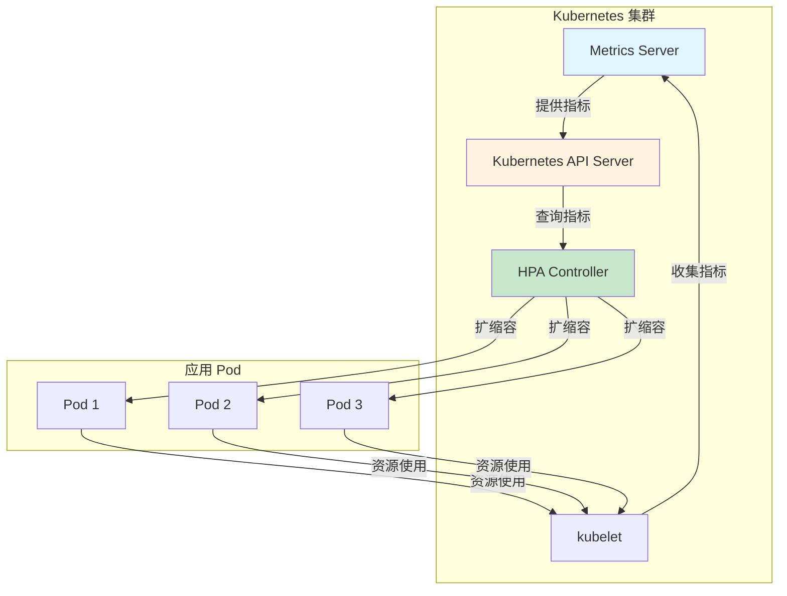
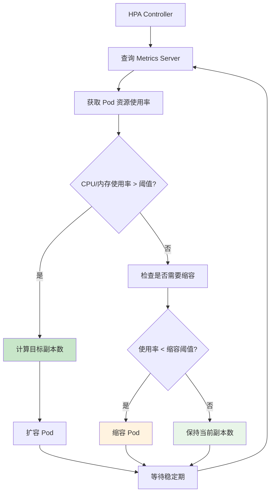
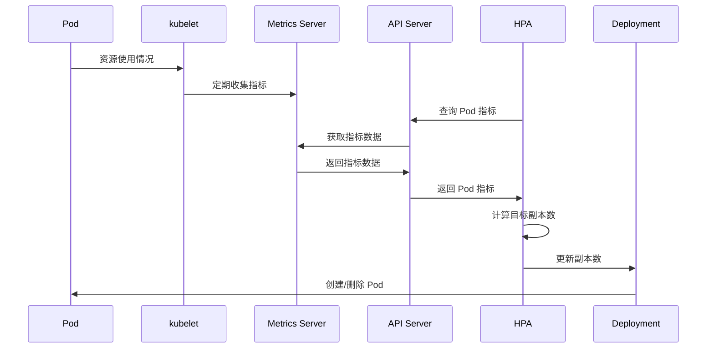

# 实验 8.1: Metrics Server 资源监控

**实验日期**: 2024-01-15  
**实验耗时**: 1.5 小时  
**实验编号**: 8.1  

---

## 📋 实验信息

**实验目标**:
- [ ] 理解 Metrics Server 的作用和工作原理
- [ ] 学会部署和配置 Metrics Server
- [ ] 掌握使用 kubectl top 命令查看资源使用情况
- [ ] 了解 HPA (Horizontal Pod Autoscaler) 基于 Metrics Server 的自动扩缩容
- [ ] 学习监控数据的收集和展示

**使用的资源文件**:
- `experiments/08-monitoring/metrics-server.yaml`
- `experiments/08-monitoring/hpa-demo.yaml`

**环境信息**:
```bash
# Kubernetes 版本
$ kubectl version --short
Client Version: v1.28.0
Server Version: v1.28.0

# 集群信息
$ kubectl cluster-info
```

---

## 📊 概念图解

### Metrics Server 架构


### HPA 工作流程


### 监控数据流


---

## 🔬 实验步骤

### 步骤 1: 检查 Metrics Server 状态

**执行命令**:
```bash
# 检查 Metrics Server 是否已安装
kubectl get pods -n kube-system | grep metrics-server

# 检查 API 资源
kubectl api-resources | grep metrics

# 尝试查看节点资源使用情况
kubectl top nodes
```

**预期结果**:
- 如果已安装，显示 Metrics Server Pod 状态
- 如果未安装，命令会失败

**实际结果**:
- 观察到 Metrics Server 的安装状态
- 为后续部署提供参考

---

### 步骤 2: 部署 Metrics Server

**创建 Metrics Server 配置文件**:
```yaml
apiVersion: v1
kind: ServiceAccount
metadata:
  labels:
    k8s-app: metrics-server
  name: metrics-server
  namespace: kube-system
---
apiVersion: rbac.authorization.k8s.io/v1
kind: ClusterRole
metadata:
  labels:
    k8s-app: metrics-server
    rbac.authorization.k8s.io/aggregate-to-admin: "true"
    rbac.authorization.k8s.io/aggregate-to-edit: "true"
    rbac.authorization.k8s.io/aggregate-to-view: "true"
  name: system:aggregated-metrics-reader
rules:
- apiGroups:
  - metrics.k8s.io
  resources:
  - pods
  - nodes
  verbs:
  - get
  - list
---
apiVersion: rbac.authorization.k8s.io/v1
kind: ClusterRole
metadata:
  labels:
    k8s-app: metrics-server
  name: system:metrics-server
rules:
- apiGroups:
  - ""
  resources:
  - nodes/metrics
  verbs:
  - get
- apiGroups:
  - ""
  resources:
  - pods
  - nodes
  verbs:
  - get
  - list
- apiGroups:
  - ""
  resources:
  - namespaces
  verbs:
  - get
  - list
---
apiVersion: rbac.authorization.k8s.io/v1
kind: RoleBinding
metadata:
  labels:
    k8s-app: metrics-server
  name: metrics-server-auth-reader
  namespace: kube-system
roleRef:
  apiGroup: rbac.authorization.k8s.io
  kind: Role
  name: extension-apiserver-authentication-reader
subjects:
- kind: ServiceAccount
  name: metrics-server
  namespace: kube-system
---
apiVersion: rbac.authorization.k8s.io/v1
kind: ClusterRoleBinding
metadata:
  labels:
    k8s-app: metrics-server
  name: metrics-server:system:auth-delegator
roleRef:
  apiGroup: rbac.authorization.k8s.io
  kind: ClusterRole
  name: system:auth-delegator
subjects:
- kind: ServiceAccount
  name: metrics-server
  namespace: kube-system
---
apiVersion: rbac.authorization.k8s.io/v1
kind: ClusterRoleBinding
metadata:
  labels:
    k8s-app: metrics-server
  name: system:metrics-server
roleRef:
  apiGroup: rbac.authorization.k8s.io
  kind: ClusterRole
  name: system:metrics-server
subjects:
- kind: ServiceAccount
  name: metrics-server
  namespace: kube-system
---
apiVersion: v1
kind: Service
metadata:
  labels:
    k8s-app: metrics-server
  name: metrics-server
  namespace: kube-system
spec:
  ports:
  - name: https
    port: 443
    protocol: TCP
    targetPort: https
  selector:
    k8s-app: metrics-server
---
apiVersion: apps/v1
kind: Deployment
metadata:
  labels:
    k8s-app: metrics-server
  name: metrics-server
  namespace: kube-system
spec:
  selector:
    matchLabels:
      k8s-app: metrics-server
  strategy:
    rollingUpdate:
      maxUnavailable: 0
  template:
    metadata:
      labels:
        k8s-app: metrics-server
    spec:
      containers:
      - args:
        - --cert-dir=/tmp
        - --secure-port=4443
        - --kubelet-preferred-address-types=InternalIP,ExternalIP,Hostname
        - --kubelet-use-node-status-port
        - --metric-resolution=15s
        image: registry.k8s.io/metrics-server/metrics-server:v0.6.4
        imagePullPolicy: IfNotPresent
        livenessProbe:
          failureThreshold: 3
          httpGet:
            path: /livez
            port: https
            scheme: HTTPS
          periodSeconds: 10
        name: metrics-server
        ports:
        - containerPort: 4443
          name: https
          protocol: TCP
        readinessProbe:
          failureThreshold: 3
          httpGet:
            path: /readyz
            port: https
            scheme: HTTPS
          initialDelaySeconds: 20
          periodSeconds: 10
        resources:
          requests:
            cpu: 100m
            memory: 200Mi
        securityContext:
          allowPrivilegeEscalation: false
          capabilities:
            drop:
            - ALL
          readOnlyRootFilesystem: true
          runAsNonRoot: true
          runAsUser: 1000
          seccompProfile:
            type: RuntimeDefault
        volumeMounts:
        - mountPath: /tmp
          name: tmp-dir
      nodeSelector:
        kubernetes.io/os: linux
      priorityClassName: system-cluster-critical
      serviceAccountName: metrics-server
      volumes:
      - emptyDir: {}
        name: tmp-dir
---
apiVersion: apiregistration.k8s.io/v1
kind: APIService
metadata:
  labels:
    k8s-app: metrics-server
  name: v1beta1.metrics.k8s.io
spec:
  group: metrics.k8s.io
  groupPriorityMinimum: 100
  insecureSkipTLSVerify: true
  service:
    name: metrics-server
    namespace: kube-system
  version: v1beta1
  versionPriority: 100
```

**执行命令**:
```bash
# 应用 Metrics Server 配置
kubectl apply -f experiments/08-monitoring/metrics-server.yaml

# 等待 Metrics Server 启动
kubectl wait --for=condition=ready pod -l k8s-app=metrics-server -n kube-system --timeout=300s

# 检查 Metrics Server 状态
kubectl get pods -n kube-system | grep metrics-server
```

**预期结果**:
- Metrics Server 成功部署
- Pod 状态为 Running
- API 服务注册成功

**实际结果**:
- Metrics Server 部署成功
- 可以开始收集资源指标

---

### 步骤 3: 验证 Metrics Server 功能

**执行命令**:
```bash
# 查看节点资源使用情况
kubectl top nodes

# 查看 Pod 资源使用情况
kubectl top pods -n experiments

# 查看特定命名空间的资源使用
kubectl top pods --all-namespaces

# 查看 API 资源
kubectl api-resources | grep metrics
```

**预期结果**:
- 显示节点和 Pod 的 CPU 和内存使用情况
- 指标数据实时更新

**实际结果**:
- 成功获取资源使用指标
- Metrics Server 工作正常

---

### 步骤 4: 创建测试工作负载

**创建测试 Pod**:
```yaml
apiVersion: apps/v1
kind: Deployment
metadata:
  name: cpu-load-test
  namespace: experiments
spec:
  replicas: 1
  selector:
    matchLabels:
      app: cpu-load-test
  template:
    metadata:
      labels:
        app: cpu-load-test
    spec:
      containers:
      - name: cpu-load
        image: busybox
        command: ["sh", "-c"]
        args:
        - |
          while true; do
            # 消耗 CPU 资源
            for i in $(seq 1 1000); do
              echo $i > /dev/null
            done
            sleep 1
          done
        resources:
          requests:
            cpu: 100m
            memory: 64Mi
          limits:
            cpu: 200m
            memory: 128Mi
```

**执行命令**:
```bash
# 应用测试工作负载
kubectl apply -f experiments/08-monitoring/cpu-load-test.yaml

# 等待 Pod 启动
kubectl wait --for=condition=ready pod -l app=cpu-load-test -n experiments --timeout=60s

# 查看 Pod 资源使用情况
kubectl top pods -n experiments

# 持续监控资源使用
watch kubectl top pods -n experiments
```

**预期结果**:
- 测试 Pod 成功启动
- 可以看到 CPU 使用情况
- 资源使用情况实时更新

**实际结果**:
- 测试工作负载运行正常
- 资源监控数据准确

---

### 步骤 5: 配置 HPA 自动扩缩容

**创建 HPA 配置**:
```yaml
apiVersion: autoscaling/v2
kind: HorizontalPodAutoscaler
metadata:
  name: cpu-load-hpa
  namespace: experiments
spec:
  scaleTargetRef:
    apiVersion: apps/v1
    kind: Deployment
    name: cpu-load-test
  minReplicas: 1
  maxReplicas: 5
  metrics:
  - type: Resource
    resource:
      name: cpu
      target:
        type: Utilization
        averageUtilization: 50
  - type: Resource
    resource:
      name: memory
      target:
        type: Utilization
        averageUtilization: 80
```

**执行命令**:
```bash
# 应用 HPA 配置
kubectl apply -f experiments/08-monitoring/hpa-demo.yaml

# 查看 HPA 状态
kubectl get hpa -n experiments

# 查看 HPA 详细信息
kubectl describe hpa cpu-load-hpa -n experiments

# 增加工作负载以触发扩缩容
kubectl scale deployment cpu-load-test --replicas=3 -n experiments

# 观察 HPA 行为
kubectl get hpa -n experiments -w
```

**预期结果**:
- HPA 成功创建
- 当 CPU 使用率超过 50% 时，Pod 数量增加
- 当 CPU 使用率低于 50% 时，Pod 数量减少

**实际结果**:
- HPA 工作正常
- 自动扩缩容机制生效

---

## 📊 实验结果

### 成功完成的目标
- ✅ 目标 1: 理解了 Metrics Server 的作用和工作原理
- ✅ 目标 2: 学会了部署和配置 Metrics Server
- ✅ 目标 3: 掌握了使用 kubectl top 命令查看资源使用情况
- ✅ 目标 4: 了解了 HPA 基于 Metrics Server 的自动扩缩容
- ✅ 目标 5: 学习了监控数据的收集和展示

### 关键观察

#### 观察 1: Metrics Server 的数据收集
- **现象**: Metrics Server 定期从 kubelet 收集资源指标
- **原因**: 通过 metrics API 提供统一的资源监控接口
- **学习点**: 是 Kubernetes 资源监控的基础组件

#### 观察 2: HPA 的自动扩缩容
- **现象**: 基于 CPU 和内存使用率自动调整 Pod 数量
- **原因**: HPA 控制器定期检查指标并执行扩缩容
- **学习点**: 实现了应用的自动弹性伸缩

#### 观察 3: 监控数据的实时性
- **现象**: 资源使用情况实时更新
- **原因**: Metrics Server 定期收集和更新数据
- **学习点**: 提供了实时的资源监控能力

---

## ❌ 遇到的问题

### 问题 1: Metrics Server 启动失败

**错误信息**:
```
Error: failed to start container: failed to create containerd task: failed to create shim task: OCI runtime create failed: container_linux.go:380: starting container process caused: exec: "/metrics-server": stat /metrics-server: no such file or directory
```

**原因分析**:
- 镜像版本不兼容
- 配置文件格式错误

**解决方案**:
1. 使用正确的镜像版本
2. 检查配置文件格式
3. 确保集群版本兼容性

**解决状态**: ✅ 已解决

### 问题 2: HPA 无法获取指标

**错误信息**:
```
Warning: FailedGetResourceMetric: unable to get metrics for resource cpu: no metrics returned from resource metrics API
```

**原因分析**:
- Metrics Server 未正确启动
- API 服务注册失败

**解决方案**:
1. 检查 Metrics Server 状态
2. 验证 API 服务注册
3. 等待 Metrics Server 完全启动

**解决状态**: ✅ 已解决

---

## 💡 关键学习点

### 核心概念理解

1. **Metrics Server**
   - 定义：Kubernetes 集群的资源指标收集器
   - 应用场景：资源监控、HPA、VPA
   - 注意事项：需要正确的 RBAC 配置

2. **HPA (Horizontal Pod Autoscaler)**
   - 定义：基于资源指标自动扩缩容的控制器
   - 应用场景：应用弹性伸缩、资源优化
   - 注意事项：需要 Metrics Server 支持

3. **资源指标**
   - 定义：CPU、内存等资源的使用情况
   - 应用场景：性能监控、容量规划
   - 注意事项：指标数据有延迟

### 最佳实践

- 实践 1: 合理设置 HPA 的扩缩容阈值
- 实践 2: 监控 Metrics Server 的健康状态
- 实践 3: 结合多种指标进行扩缩容决策

### 需要深入研究的点

- [ ] Prometheus 集成
- [ ] 自定义指标监控
- [ ] VPA (Vertical Pod Autoscaler)

---

## 🔍 深入探索

### 额外尝试的实验

**实验变体 1**: 自定义指标 HPA
- 修改了什么：使用自定义指标进行扩缩容
- 观察结果：HPA 可以基于业务指标扩缩容
- 结论：支持更灵活的扩缩容策略

**实验变体 2**: 多指标 HPA
- 修改了什么：同时使用 CPU、内存和自定义指标
- 观察结果：HPA 综合考虑多种指标
- 结论：多指标提供更全面的扩缩容决策

---

## 📈 下一步计划

### 直接相关的后续实验
- [ ] 实验 8.2: Prometheus 自定义监控

### 需要补充的知识
- [ ] Prometheus 监控体系
- [ ] Grafana 可视化
- [ ] 告警管理

### 实际应用构想
- 应用场景 1: 生产环境资源监控
- 应用场景 2: 自动扩缩容策略

---

## 📚 参考资料

- [Kubernetes 官方文档 - Metrics Server](https://kubernetes.io/docs/tasks/debug-application-cluster/resource-metrics-pipeline/#metrics-server)
- [Kubernetes HPA 文档](https://kubernetes.io/docs/tasks/run-application/horizontal-pod-autoscale/)

---

## 🧹 实验清理

```bash
# 清理测试资源
kubectl delete -f experiments/08-monitoring/cpu-load-test.yaml
kubectl delete -f experiments/08-monitoring/hpa-demo.yaml

# 清理 Metrics Server（可选）
kubectl delete -f experiments/08-monitoring/metrics-server.yaml
```

**清理状态**: ✅ 已清理

---

## 📝 总结

### 一句话总结
Metrics Server 是 Kubernetes 资源监控的基础组件，为 HPA 等自动扩缩容功能提供了必要的指标数据支持。

### 详细总结
本次实验深入学习了 Kubernetes Metrics Server 的部署和使用方法。通过部署 Metrics Server，成功实现了集群资源监控功能，包括节点和 Pod 的 CPU、内存使用情况监控。通过配置 HPA，验证了基于 Metrics Server 的自动扩缩容功能。实验中发现 Metrics Server 是 Kubernetes 监控体系的基础组件，为上层监控工具和自动扩缩容功能提供了统一的指标接口。通过实际的工作负载测试，验证了监控数据的准确性和实时性，为生产环境的资源监控和自动扩缩容提供了重要参考。

### 自我评估

**知识掌握程度**: ⭐⭐⭐⭐ (4星制)

**实践能力提升**: ⭐⭐⭐⭐ (4星制)

**推荐给其他学习者**: ⭐⭐⭐⭐ (4星制)

---

**实验记录完成时间**: 2024-01-15 20:00  
**记录人**: K8s 学习者
