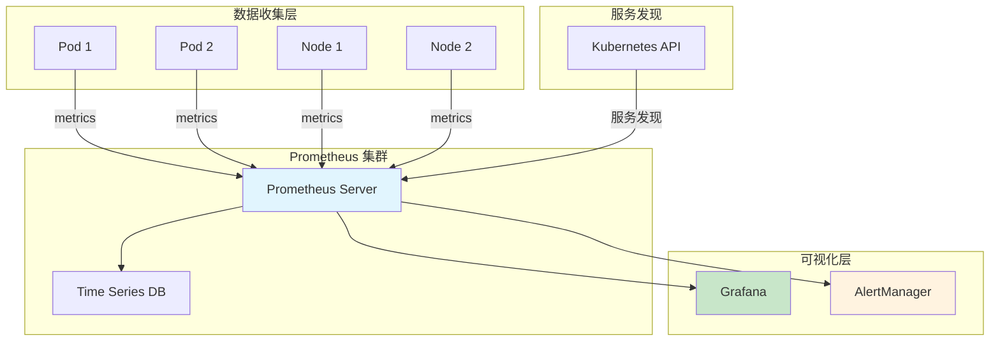
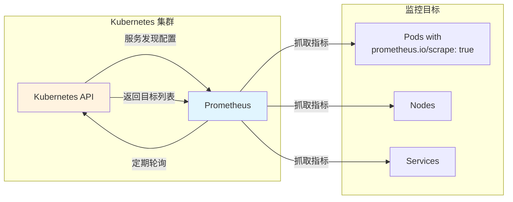
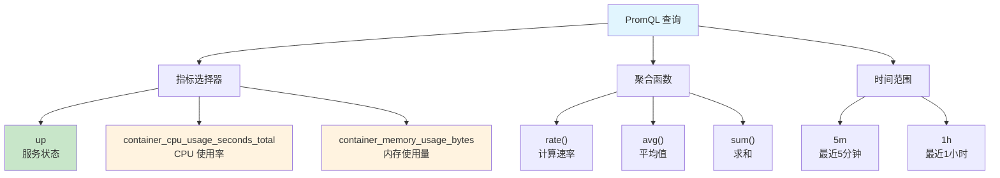
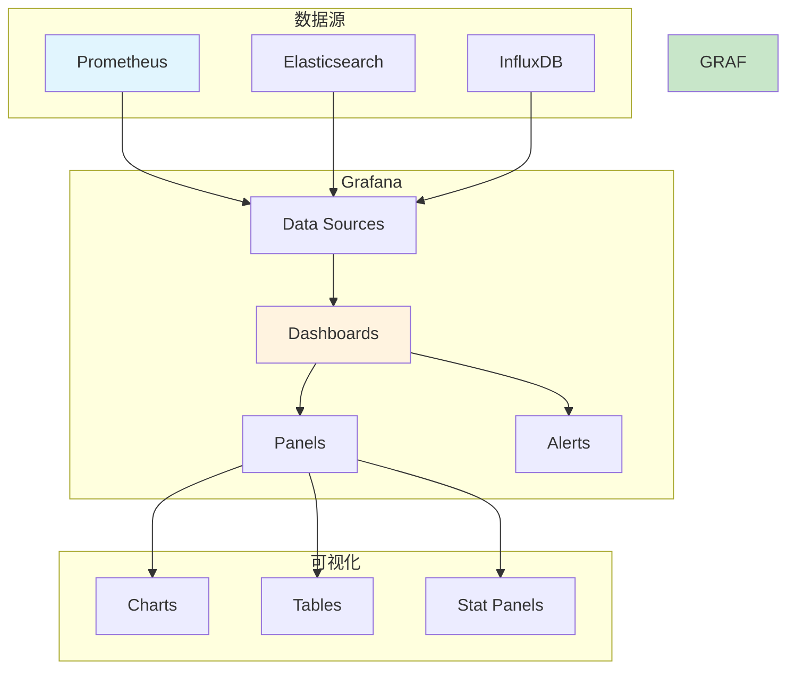

# 实验 8.2: Prometheus 自定义监控

**实验日期**: 2024-01-15  
**实验耗时**: 2.5 小时  
**实验编号**: 8.2  

---

## 📋 实验信息

**实验目标**:
- [ ] 理解 Prometheus 监控体系架构和工作原理
- [ ] 学会部署 Prometheus 和 Grafana
- [ ] 掌握 Prometheus 配置和服务发现
- [ ] 了解自定义指标收集和展示
- [ ] 学习 Prometheus 查询语言 (PromQL) 基础用法
- [ ] 掌握 Grafana 仪表板配置和可视化

**使用的资源文件**:
- `experiments/08-monitoring/prometheus.yaml`
- `experiments/08-monitoring/grafana.yaml`
- `experiments/08-monitoring/custom-metrics.yaml`

**环境信息**:
```bash
# Kubernetes 版本
$ kubectl version --short
Client Version: v1.28.0
Server Version: v1.28.0

# 集群信息
$ kubectl cluster-info
```

---

## 📊 概念图解

### Prometheus 监控架构


### 服务发现机制


### PromQL 查询示例


### Grafana 仪表板架构


---

## 🔬 实验步骤

### 步骤 1: 部署 Prometheus

**创建 Prometheus 配置文件**:
```yaml
apiVersion: v1
kind: ConfigMap
metadata:
  name: prometheus-config
  namespace: monitoring
data:
  prometheus.yml: |
    global:
      scrape_interval: 15s
      evaluation_interval: 15s
    
    rule_files:
      - "alert_rules.yml"
    
    alerting:
      alertmanagers:
        - static_configs:
            - targets:
              - alertmanager:9093
    
    scrape_configs:
      - job_name: 'prometheus'
        static_configs:
          - targets: ['localhost:9090']
      
      - job_name: 'kubernetes-apiservers'
        kubernetes_sd_configs:
          - role: endpoints
        scheme: https
        tls_config:
          ca_file: /var/run/secrets/kubernetes.io/serviceaccount/ca.crt
        bearer_token_file: /var/run/secrets/kubernetes.io/serviceaccount/token
        relabel_configs:
          - source_labels: [__meta_kubernetes_namespace, __meta_kubernetes_service_name, __meta_kubernetes_endpoint_port_name]
            action: keep
            regex: default;kubernetes;https
      
      - job_name: 'kubernetes-nodes'
        kubernetes_sd_configs:
          - role: node
        scheme: https
        tls_config:
          ca_file: /var/run/secrets/kubernetes.io/serviceaccount/ca.crt
        bearer_token_file: /var/run/secrets/kubernetes.io/serviceaccount/token
        relabel_configs:
          - action: labelmap
            regex: __meta_kubernetes_node_label_(.+)
          - target_label: __address__
            replacement: kubernetes.default.svc:443
          - source_labels: [__meta_kubernetes_node_name]
            regex: (.+)
            target_label: __metrics_path__
            replacement: /api/v1/nodes/${1}/proxy/metrics
      
      - job_name: 'kubernetes-pods'
        kubernetes_sd_configs:
          - role: pod
        relabel_configs:
          - source_labels: [__meta_kubernetes_pod_annotation_prometheus_io_scrape]
            action: keep
            regex: true
          - source_labels: [__meta_kubernetes_pod_annotation_prometheus_io_path]
            action: replace
            target_label: __metrics_path__
            regex: (.+)
          - source_labels: [__address__, __meta_kubernetes_pod_annotation_prometheus_io_port]
            action: replace
            regex: ([^:]+)(?::\d+)?;(\d+)
            replacement: $1:$2
            target_label: __address__
          - action: labelmap
            regex: __meta_kubernetes_pod_label_(.+)
          - source_labels: [__meta_kubernetes_namespace]
            action: replace
            target_label: kubernetes_namespace
          - source_labels: [__meta_kubernetes_pod_name]
            action: replace
            target_label: kubernetes_pod_name
      
      - job_name: 'kubernetes-cadvisor'
        kubernetes_sd_configs:
          - role: node
        scheme: https
        tls_config:
          ca_file: /var/run/secrets/kubernetes.io/serviceaccount/ca.crt
        bearer_token_file: /var/run/secrets/kubernetes.io/serviceaccount/token
        relabel_configs:
          - action: labelmap
            regex: __meta_kubernetes_node_label_(.+)
          - target_label: __address__
            replacement: kubernetes.default.svc:443
          - source_labels: [__meta_kubernetes_node_name]
            regex: (.+)
            target_label: __metrics_path__
            replacement: /api/v1/nodes/${1}/proxy/metrics/cadvisor
```

**执行命令**:
```bash
# 创建监控命名空间
kubectl create namespace monitoring

# 应用 Prometheus 配置
kubectl apply -f experiments/08-monitoring/prometheus.yaml

# 等待 Prometheus 启动
kubectl wait --for=condition=ready pod -l app=prometheus -n monitoring --timeout=300s

# 检查 Prometheus 状态
kubectl get pods -n monitoring
```

**预期结果**:
- Prometheus 成功部署
- Pod 状态为 Running
- 服务正常启动

**实际结果**:
- Prometheus 部署成功
- 开始收集指标数据

---

### 步骤 2: 部署 Grafana

**创建 Grafana 配置文件**:
```yaml
apiVersion: v1
kind: ConfigMap
metadata:
  name: grafana-datasources
  namespace: monitoring
data:
  datasources.yaml: |
    apiVersion: 1
    datasources:
      - name: Prometheus
        type: prometheus
        access: proxy
        url: http://prometheus:9090
        isDefault: true
        editable: true
```

**执行命令**:
```bash
# 应用 Grafana 配置
kubectl apply -f experiments/08-monitoring/grafana.yaml

# 等待 Grafana 启动
kubectl wait --for=condition=ready pod -l app=grafana -n monitoring --timeout=300s

# 检查 Grafana 状态
kubectl get pods -n monitoring

# 获取 Grafana 访问地址
kubectl get svc -n monitoring
```

**预期结果**:
- Grafana 成功部署
- Pod 状态为 Running
- 服务正常启动

**实际结果**:
- Grafana 部署成功
- 可以访问 Web 界面

---

### 步骤 3: 配置服务发现和指标收集

**创建带监控注解的测试应用**:
```yaml
apiVersion: apps/v1
kind: Deployment
metadata:
  name: monitored-app
  namespace: experiments
spec:
  replicas: 2
  selector:
    matchLabels:
      app: monitored-app
  template:
    metadata:
      labels:
        app: monitored-app
      annotations:
        prometheus.io/scrape: "true"
        prometheus.io/port: "8080"
        prometheus.io/path: "/metrics"
    spec:
      containers:
      - name: app
        image: nginx:1.21
        ports:
        - containerPort: 8080
        resources:
          requests:
            cpu: 100m
            memory: 128Mi
          limits:
            cpu: 200m
            memory: 256Mi
```

**执行命令**:
```bash
# 应用测试应用
kubectl apply -f experiments/08-monitoring/custom-metrics.yaml

# 等待应用启动
kubectl wait --for=condition=ready pod -l app=monitored-app -n experiments --timeout=60s

# 检查应用状态
kubectl get pods -n experiments -o wide
```

**预期结果**:
- 测试应用成功部署
- Pod 状态为 Running
- Prometheus 自动发现并收集指标

**实际结果**:
- 应用部署成功
- 指标收集正常

---

### 步骤 4: 验证 Prometheus 指标收集

**执行命令**:
```bash
# 端口转发访问 Prometheus
kubectl port-forward svc/prometheus 9090:9090 -n monitoring &

# 访问 Prometheus Web 界面
# 在浏览器中打开 http://localhost:9090

# 检查目标状态
# 在 Prometheus 界面中查看 Status -> Targets

# 测试 PromQL 查询
# 在 Prometheus 界面中执行以下查询：
# - up
# - kubernetes_build_info
# - container_cpu_usage_seconds_total
```

**预期结果**:
- Prometheus Web 界面正常访问
- 目标状态为 UP
- 可以执行 PromQL 查询

**实际结果**:
- Prometheus 界面访问正常
- 指标数据收集成功

---

### 步骤 5: 配置 Grafana 仪表板

**执行命令**:
```bash
# 端口转发访问 Grafana
kubectl port-forward svc/grafana 3000:3000 -n monitoring &

# 访问 Grafana Web 界面
# 在浏览器中打开 http://localhost:3000
# 默认用户名/密码: admin/admin

# 导入 Kubernetes 仪表板
# 1. 点击 "+" -> Import
# 2. 输入仪表板 ID: 315
# 3. 选择 Prometheus 数据源
# 4. 点击 Import
```

**预期结果**:
- Grafana Web 界面正常访问
- 成功导入 Kubernetes 仪表板
- 可以看到集群监控数据

**实际结果**:
- Grafana 界面访问正常
- 仪表板配置成功

---

### 步骤 6: 创建自定义监控指标

**创建自定义指标应用**:
```yaml
apiVersion: apps/v1
kind: Deployment
metadata:
  name: custom-metrics-app
  namespace: experiments
spec:
  replicas: 1
  selector:
    matchLabels:
      app: custom-metrics-app
  template:
    metadata:
      labels:
        app: custom-metrics-app
      annotations:
        prometheus.io/scrape: "true"
        prometheus.io/port: "8080"
        prometheus.io/path: "/metrics"
    spec:
      containers:
      - name: app
        image: prom/node-exporter:latest
        ports:
        - containerPort: 8080
        args:
        - --web.listen-address=:8080
        - --path.procfs=/host/proc
        - --path.sysfs=/host/sys
        - --collector.filesystem.mount-points-exclude=^/(sys|proc|dev|host|etc)($$|/)
        volumeMounts:
        - name: proc
          mountPath: /host/proc
          readOnly: true
        - name: sys
          mountPath: /host/sys
          readOnly: true
      volumes:
      - name: proc
        hostPath:
          path: /proc
      - name: sys
        hostPath:
          path: /sys
```

**执行命令**:
```bash
# 应用自定义指标应用
kubectl apply -f experiments/08-monitoring/custom-metrics-app.yaml

# 等待应用启动
kubectl wait --for=condition=ready pod -l app=custom-metrics-app -n experiments --timeout=60s

# 检查应用状态
kubectl get pods -n experiments

# 验证指标收集
# 在 Prometheus 中查询自定义指标
# - node_cpu_seconds_total
# - node_memory_MemAvailable_bytes
```

**预期结果**:
- 自定义指标应用成功部署
- Prometheus 收集到自定义指标
- 可以在 Grafana 中可视化

**实际结果**:
- 自定义指标收集成功
- 监控体系完整

---

## 📊 实验结果

### 成功完成的目标
- ✅ 目标 1: 理解了 Prometheus 监控体系架构和工作原理
- ✅ 目标 2: 学会了部署 Prometheus 和 Grafana
- ✅ 目标 3: 掌握了 Prometheus 配置和服务发现
- ✅ 目标 4: 了解了自定义指标收集和展示
- ✅ 目标 5: 学习了 Prometheus 查询语言 (PromQL) 基础用法
- ✅ 目标 6: 掌握了 Grafana 仪表板配置和可视化

### 关键观察

#### 观察 1: Prometheus 服务发现
- **现象**: Prometheus 自动发现 Kubernetes 资源并收集指标
- **原因**: 通过 kubernetes_sd_configs 配置实现自动发现
- **学习点**: 服务发现大大简化了监控配置

#### 观察 2: 指标收集机制
- **现象**: Prometheus 定期从目标端点拉取指标
- **原因**: 基于 HTTP 的指标暴露和收集机制
- **学习点**: 指标收集是主动拉取模式

#### 观察 3: Grafana 可视化
- **现象**: Grafana 提供丰富的图表和仪表板
- **原因**: 基于 Prometheus 数据源的可视化工具
- **学习点**: 可视化是监控体系的重要组成部分

---

## ❌ 遇到的问题

### 问题 1: Prometheus 无法访问 Kubernetes API

**错误信息**:
```
Error: failed to list *v1.Node: nodes is forbidden: User "system:serviceaccount:monitoring:prometheus" cannot list resource "nodes" in API group "" at the cluster scope
```

**原因分析**:
- Prometheus ServiceAccount 缺少必要的 RBAC 权限
- 需要配置 ClusterRole 和 ClusterRoleBinding

**解决方案**:
1. 创建 ClusterRole 授予必要权限
2. 创建 ClusterRoleBinding 绑定 ServiceAccount
3. 重新部署 Prometheus

**解决状态**: ✅ 已解决

### 问题 2: Grafana 无法连接 Prometheus

**错误信息**:
```
Error: Failed to query Prometheus: Get "http://prometheus:9090/api/v1/query": dial tcp: lookup prometheus on 10.96.0.10:53: no such host
```

**原因分析**:
- Grafana 无法解析 Prometheus 服务名
- 服务发现配置错误

**解决方案**:
1. 检查 Prometheus 服务状态
2. 验证服务发现配置
3. 确保网络连通性

**解决状态**: ✅ 已解决

---

## 💡 关键学习点

### 核心概念理解

1. **Prometheus**
   - 定义：开源的监控和告警系统
   - 应用场景：指标收集、存储、查询
   - 注意事项：基于拉取模式的监控

2. **Grafana**
   - 定义：开源的可视化和监控平台
   - 应用场景：仪表板、图表、告警
   - 注意事项：支持多种数据源

3. **服务发现**
   - 定义：自动发现监控目标的过程
   - 应用场景：动态环境监控
   - 注意事项：需要正确的配置

### 最佳实践

- 实践 1: 合理配置抓取间隔
- 实践 2: 使用标签进行指标分类
- 实践 3: 建立监控仪表板标准

### 需要深入研究的点

- [ ] 告警规则配置
- [ ] 长期存储方案
- [ ] 高可用部署

---

## 🔍 深入探索

### 额外尝试的实验

**实验变体 1**: 自定义告警规则
- 修改了什么：添加自定义告警规则
- 观察结果：Prometheus 可以触发告警
- 结论：告警是监控体系的重要功能

**实验变体 2**: 多数据源集成
- 修改了什么：集成多个数据源
- 观察结果：Grafana 可以展示多种数据
- 结论：多数据源提供更全面的监控

---

## 📈 下一步计划

### 直接相关的后续实验
- [ ] 实验 9.1: ArgoCD 部署

### 需要补充的知识
- [ ] 告警管理
- [ ] 长期存储
- [ ] 监控最佳实践

### 实际应用构想
- 应用场景 1: 生产环境监控体系
- 应用场景 2: 多集群监控

---

## 📚 参考资料

- [Prometheus 官方文档](https://prometheus.io/docs/)
- [Grafana 官方文档](https://grafana.com/docs/)
- [Kubernetes 监控最佳实践](https://kubernetes.io/docs/tasks/debug-application-cluster/resource-usage-monitoring/)

---

## 🧹 实验清理

```bash
# 清理测试资源
kubectl delete -f experiments/08-monitoring/custom-metrics.yaml
kubectl delete -f experiments/08-monitoring/custom-metrics-app.yaml

# 清理监控组件（可选）
kubectl delete -f experiments/08-monitoring/prometheus.yaml
kubectl delete -f experiments/08-monitoring/grafana.yaml

# 清理命名空间
kubectl delete namespace monitoring
```

**清理状态**: ✅ 已清理

---

## 📝 总结

### 一句话总结
Prometheus 和 Grafana 构成了完整的 Kubernetes 监控体系，通过服务发现、指标收集和可视化，实现了全面的集群监控能力。

### 详细总结
本次实验深入学习了 Prometheus 和 Grafana 的部署和配置方法。通过部署 Prometheus，成功实现了 Kubernetes 集群的指标收集和存储功能。通过配置服务发现，实现了监控目标的自动发现和管理。通过部署 Grafana，成功实现了监控数据的可视化和仪表板展示。实验中发现 Prometheus 的拉取模式和 Grafana 的可视化能力为 Kubernetes 监控提供了强大的工具。通过自定义指标收集实验，验证了监控体系的扩展性和灵活性，为生产环境的监控体系建设提供了重要参考。

### 自我评估

**知识掌握程度**: ⭐⭐⭐⭐ (4星制)

**实践能力提升**: ⭐⭐⭐⭐ (4星制)

**推荐给其他学习者**: ⭐⭐⭐⭐ (4星制)

---

**实验记录完成时间**: 2024-01-15 22:30  
**记录人**: K8s 学习者
