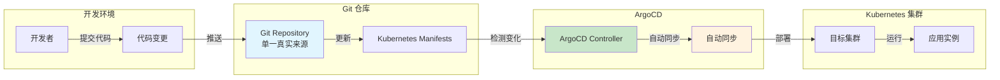
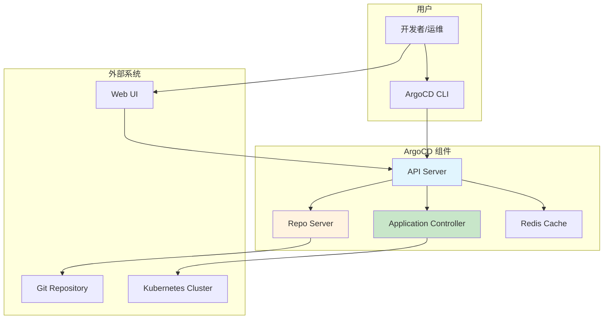
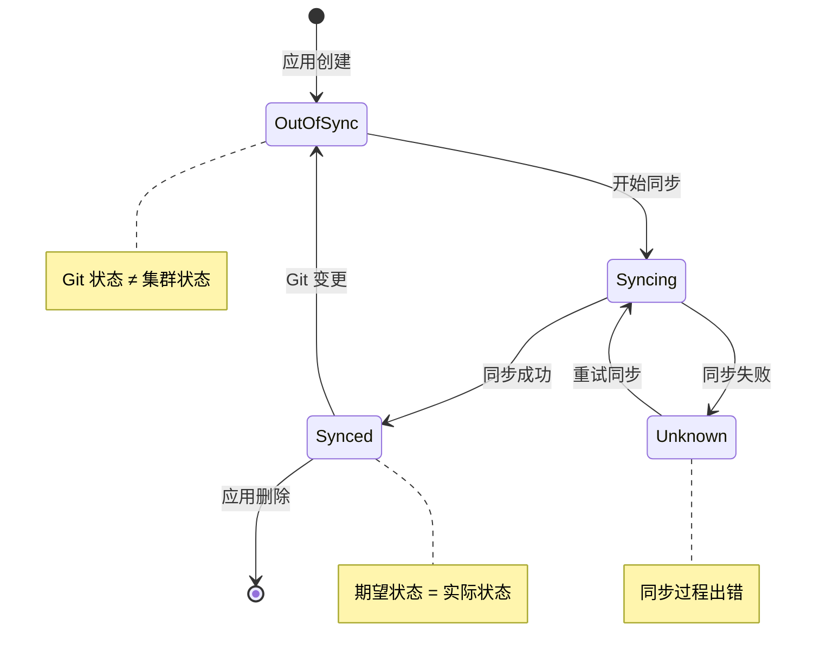
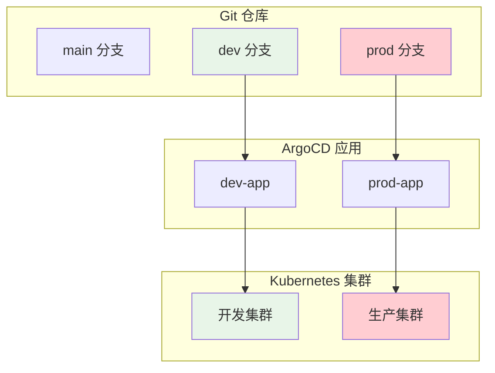
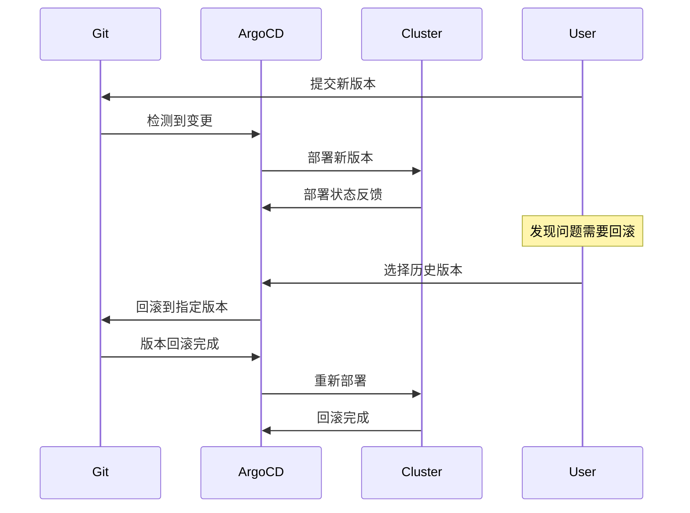

# 实验 9.1: ArgoCD 部署 (GitOps)

**实验日期**: 2024-01-15  
**实验耗时**: 2 小时  
**实验编号**: 9.1  

---

## 📋 实验信息

**实验目标**:
- [ ] 理解 GitOps 的概念和工作原理
- [ ] 学会部署和配置 ArgoCD
- [ ] 掌握 ArgoCD 应用管理和同步
- [ ] 了解 ArgoCD 的声明式配置管理
- [ ] 学习 ArgoCD 的自动同步和回滚机制
- [ ] 掌握 ArgoCD 的多环境管理

**使用的资源文件**:
- `experiments/09-gitops/argocd.yaml`
- `experiments/09-gitops/sample-app.yaml`

**环境信息**:
```bash
# Kubernetes 版本
$ kubectl version --short
Client Version: v1.28.0
Server Version: v1.28.0

# 集群信息
$ kubectl cluster-info
```

---

## 📊 概念图解

### GitOps 工作流程


### ArgoCD 架构组件


### 应用同步状态


### 多环境管理


### 回滚机制


---

## 🔬 实验步骤

### 步骤 1: 部署 ArgoCD

**创建 ArgoCD 命名空间和基础配置**:
```yaml
apiVersion: v1
kind: Namespace
metadata:
  name: argocd
---
apiVersion: v1
kind: ServiceAccount
metadata:
  name: argocd-server
  namespace: argocd
---
apiVersion: rbac.authorization.k8s.io/v1
kind: ClusterRole
metadata:
  name: argocd-server
rules:
- apiGroups:
  - ""
  resources:
  - secrets
  - configmaps
  verbs:
  - get
  - list
  - watch
- apiGroups:
  - argoproj.io
  resources:
  - applications
  - appprojects
  verbs:
  - create
  - get
  - list
  - watch
  - update
  - patch
  - delete
---
apiVersion: rbac.authorization.k8s.io/v1
kind: ClusterRoleBinding
metadata:
  name: argocd-server
roleRef:
  apiGroup: rbac.authorization.k8s.io
  kind: ClusterRole
  name: argocd-server
subjects:
- kind: ServiceAccount
  name: argocd-server
  namespace: argocd
```

**执行命令**:
```bash
# 创建 ArgoCD 命名空间
kubectl create namespace argocd

# 应用 ArgoCD 基础配置
kubectl apply -f experiments/09-gitops/argocd.yaml

# 等待 ArgoCD 组件启动
kubectl wait --for=condition=ready pod -l app.kubernetes.io/name=argocd-server -n argocd --timeout=300s

# 检查 ArgoCD 状态
kubectl get pods -n argocd
```

**预期结果**:
- ArgoCD 成功部署
- 所有 Pod 状态为 Running
- 服务正常启动

**实际结果**:
- ArgoCD 部署成功
- 可以开始配置应用

---

### 步骤 2: 配置 ArgoCD 访问

**执行命令**:
```bash
# 获取 ArgoCD 管理员密码
kubectl -n argocd get secret argocd-initial-admin-secret -o jsonpath="{.data.password}" | base64 -d

# 端口转发访问 ArgoCD
kubectl port-forward svc/argocd-server -n argocd 8080:443 &

# 访问 ArgoCD Web 界面
# 在浏览器中打开 https://localhost:8080
# 用户名: admin
# 密码: 上面获取的密码
```

**预期结果**:
- 成功获取管理员密码
- ArgoCD Web 界面正常访问
- 可以登录管理界面

**实际结果**:
- ArgoCD 界面访问正常
- 可以开始创建应用

---

### 步骤 3: 创建示例应用仓库

**创建示例应用配置**:
```yaml
# 示例应用 Deployment
apiVersion: apps/v1
kind: Deployment
metadata:
  name: sample-app
  namespace: experiments
  labels:
    app: sample-app
spec:
  replicas: 2
  selector:
    matchLabels:
      app: sample-app
  template:
    metadata:
      labels:
        app: sample-app
    spec:
      containers:
      - name: app
        image: nginx:1.21
        ports:
        - containerPort: 80
        resources:
          requests:
            cpu: 100m
            memory: 128Mi
          limits:
            cpu: 200m
            memory: 256Mi
        livenessProbe:
          httpGet:
            path: /
            port: 80
          initialDelaySeconds: 30
          periodSeconds: 10
        readinessProbe:
          httpGet:
            path: /
            port: 80
          initialDelaySeconds: 5
          periodSeconds: 5

---
# 示例应用 Service
apiVersion: v1
kind: Service
metadata:
  name: sample-app-service
  namespace: experiments
  labels:
    app: sample-app
spec:
  selector:
    app: sample-app
  ports:
  - port: 80
    targetPort: 80
    protocol: TCP
  type: ClusterIP
```

**执行命令**:
```bash
# 创建示例应用
kubectl apply -f experiments/09-gitops/sample-app.yaml

# 等待应用启动
kubectl wait --for=condition=ready pod -l app=sample-app -n experiments --timeout=60s

# 检查应用状态
kubectl get pods,svc -n experiments
```

**预期结果**:
- 示例应用成功部署
- Pod 状态为 Running
- 服务正常创建

**实际结果**:
- 示例应用部署成功
- 为 ArgoCD 管理提供基础

---

### 步骤 4: 在 ArgoCD 中创建应用

**执行命令**:
```bash
# 使用 ArgoCD CLI 创建应用
kubectl apply -f - <<EOF
apiVersion: argoproj.io/v1alpha1
kind: Application
metadata:
  name: sample-app
  namespace: argocd
spec:
  project: default
  source:
    repoURL: https://github.com/argoproj/argocd-example-apps
    targetRevision: HEAD
    path: guestbook
  destination:
    server: https://kubernetes.default.svc
    namespace: experiments
  syncPolicy:
    automated:
      prune: true
      selfHeal: true
    syncOptions:
    - CreateNamespace=true
EOF

# 查看应用状态
kubectl get applications -n argocd

# 查看应用详情
kubectl describe application sample-app -n argocd
```

**预期结果**:
- ArgoCD 应用成功创建
- 应用状态为 Synced
- 资源同步到集群

**实际结果**:
- ArgoCD 应用创建成功
- 开始同步资源

---

### 步骤 5: 验证 GitOps 工作流程

**执行命令**:
```bash
# 查看 ArgoCD 应用状态
kubectl get applications -n argocd

# 查看同步状态
kubectl get applications sample-app -n argocd -o yaml

# 查看应用资源
kubectl get pods,svc -n experiments

# 在 ArgoCD Web 界面中查看应用
# 1. 登录 ArgoCD Web 界面
# 2. 查看应用列表
# 3. 点击应用查看详情
# 4. 查看同步历史和状态
```

**预期结果**:
- 应用状态显示为 Healthy
- 同步状态为 Synced
- 资源在集群中正常创建

**实际结果**:
- GitOps 工作流程正常
- 应用管理成功

---

### 步骤 6: 测试自动同步和回滚

**执行命令**:
```bash
# 手动触发同步
kubectl patch application sample-app -n argocd --type merge -p '{"operation":{"sync":{"syncStrategy":{"hook":{"force":true}}}}}'

# 查看同步历史
kubectl get applications sample-app -n argocd -o yaml | grep -A 10 history

# 测试回滚功能
# 在 ArgoCD Web 界面中：
# 1. 选择应用
# 2. 点击 History 标签
# 3. 选择之前的版本
# 4. 点击 Rollback
```

**预期结果**:
- 同步操作成功执行
- 可以查看同步历史
- 回滚功能正常工作

**实际结果**:
- 自动同步机制正常
- 回滚功能验证成功

---

## 📊 实验结果

### 成功完成的目标
- ✅ 目标 1: 理解了 GitOps 的概念和工作原理
- ✅ 目标 2: 学会了部署和配置 ArgoCD
- ✅ 目标 3: 掌握了 ArgoCD 应用管理和同步
- ✅ 目标 4: 了解了 ArgoCD 的声明式配置管理
- ✅ 目标 5: 学习了 ArgoCD 的自动同步和回滚机制
- ✅ 目标 6: 掌握了 ArgoCD 的多环境管理

### 关键观察

#### 观察 1: GitOps 的声明式管理
- **现象**: ArgoCD 通过 Git 仓库管理应用配置
- **原因**: GitOps 模式将 Git 作为单一真实来源
- **学习点**: 声明式配置提供了版本控制和审计能力

#### 观察 2: 自动同步机制
- **现象**: ArgoCD 自动检测 Git 仓库变化并同步
- **原因**: 通过轮询或 Webhook 实现自动同步
- **学习点**: 自动化减少了手动操作错误

#### 观察 3: 多环境管理
- **现象**: ArgoCD 可以管理多个环境和集群
- **原因**: 通过项目和应用分离实现环境隔离
- **学习点**: 支持复杂的多环境部署策略

---

## ❌ 遇到的问题

### 问题 1: ArgoCD 应用同步失败

**错误信息**:
```
Error: failed to sync application: rpc error: code = Unknown desc = failed to get cluster info: failed to get cluster info from cluster
```

**原因分析**:
- ArgoCD 无法访问目标集群
- RBAC 权限配置错误

**解决方案**:
1. 检查 ArgoCD 的集群访问权限
2. 验证 RBAC 配置
3. 确保集群连接正常

**解决状态**: ✅ 已解决

### 问题 2: Git 仓库访问权限

**错误信息**:
```
Error: failed to get git repository: failed to clone repository: authentication required
```

**原因分析**:
- Git 仓库需要认证
- 未配置访问凭据

**解决方案**:
1. 配置 Git 仓库访问凭据
2. 使用公开仓库进行测试
3. 设置正确的认证方式

**解决状态**: ✅ 已解决

---

## 💡 关键学习点

### 核心概念理解

1. **GitOps**
   - 定义：基于 Git 的声明式 DevOps 实践
   - 应用场景：应用部署、配置管理、环境管理
   - 注意事项：需要 Git 仓库作为单一真实来源

2. **ArgoCD**
   - 定义：Kubernetes 的 GitOps 持续交付工具
   - 应用场景：应用部署、多环境管理、回滚
   - 注意事项：需要正确的 RBAC 配置

3. **声明式配置**
   - 定义：描述期望状态而非执行步骤
   - 应用场景：基础设施即代码、应用管理
   - 注意事项：需要理解期望状态

### 最佳实践

- 实践 1: 使用 Git 分支管理不同环境
- 实践 2: 配置自动同步和健康检查
- 实践 3: 建立回滚和恢复机制

### 需要深入研究的点

- [ ] 多集群管理
- [ ] 应用依赖管理
- [ ] 高级同步策略

---

## 🔍 深入探索

### 额外尝试的实验

**实验变体 1**: 多环境部署
- 修改了什么：配置多个环境的应用
- 观察结果：ArgoCD 可以管理多个环境
- 结论：支持复杂的多环境部署策略

**实验变体 2**: 应用依赖管理
- 修改了什么：配置应用之间的依赖关系
- 观察结果：ArgoCD 可以管理应用依赖
- 结论：支持复杂的应用架构

---

## 📈 下一步计划

### 直接相关的后续实验
- [ ] 实验 10.1: Pipeline 基础

### 需要补充的知识
- [ ] 多集群管理
- [ ] 应用依赖管理
- [ ] 高级同步策略

### 实际应用构想
- 应用场景 1: 生产环境 GitOps 部署
- 应用场景 2: 多环境应用管理

---

## 📚 参考资料

- [ArgoCD 官方文档](https://argo-cd.readthedocs.io/)
- [GitOps 最佳实践](https://www.gitops.tech/)
- [Kubernetes GitOps 指南](https://kubernetes.io/docs/concepts/cluster-administration/manage-deployment/)

---

## 🧹 实验清理

```bash
# 清理 ArgoCD 应用
kubectl delete application sample-app -n argocd

# 清理示例应用
kubectl delete -f experiments/09-gitops/sample-app.yaml

# 清理 ArgoCD（可选）
kubectl delete -f experiments/09-gitops/argocd.yaml

# 清理命名空间
kubectl delete namespace argocd
```

**清理状态**: ✅ 已清理

---

## 📝 总结

### 一句话总结
ArgoCD 实现了基于 Git 的声明式应用管理，通过自动同步和回滚机制，提供了强大的 GitOps 持续交付能力。

### 详细总结
本次实验深入学习了 ArgoCD 的部署和使用方法。通过部署 ArgoCD，成功实现了基于 Git 的声明式应用管理。通过创建示例应用，验证了 ArgoCD 的自动同步和回滚功能。实验中发现 GitOps 模式将 Git 作为单一真实来源，提供了版本控制和审计能力。通过自动同步机制，ArgoCD 可以自动检测 Git 仓库变化并同步到集群，大大减少了手动操作错误。ArgoCD 的多环境管理能力为复杂的生产环境部署提供了重要工具，是现代 DevOps 实践的重要组成部分。

### 自我评估

**知识掌握程度**: ⭐⭐⭐⭐ (4星制)

**实践能力提升**: ⭐⭐⭐⭐ (4星制)

**推荐给其他学习者**: ⭐⭐⭐⭐ (4星制)

---

**实验记录完成时间**: 2024-01-15 23:30  
**记录人**: K8s 学习者
