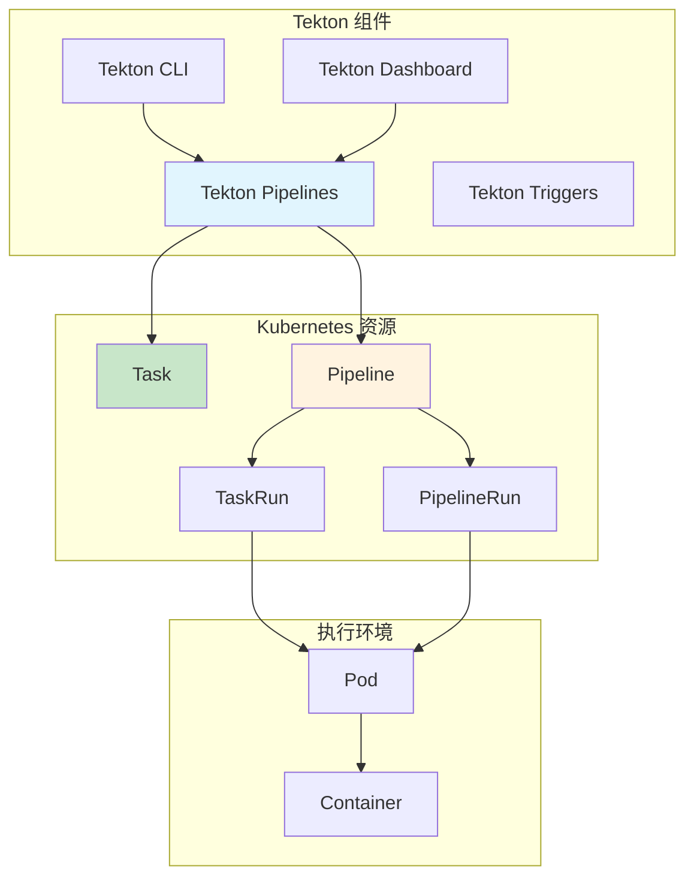
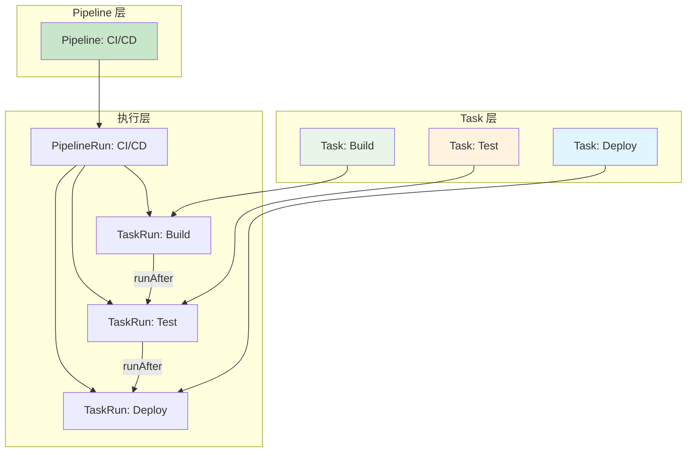
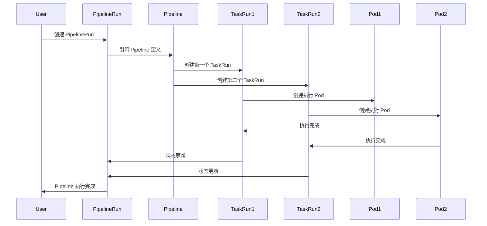
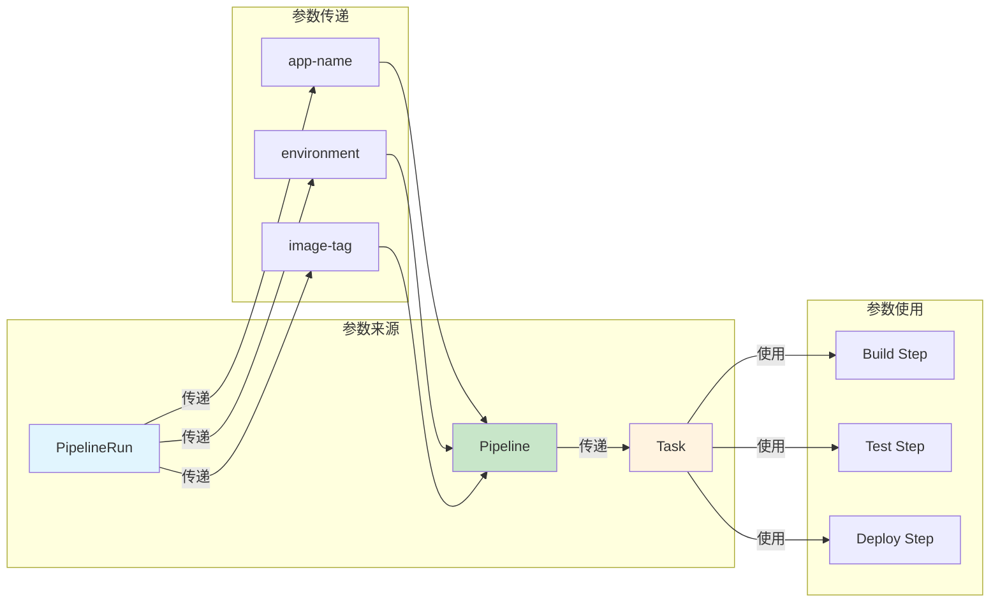

# 实验 10.1: Pipeline 基础 (Tekton CI/CD)

**实验日期**: 2024-01-15  
**实验耗时**: 2 小时  
**实验编号**: 10.1  

---

## 📋 实验信息

**实验目标**:
- [ ] 理解 Tekton 的概念和架构
- [ ] 学会部署和配置 Tekton Pipelines
- [ ] 掌握 Task 和 Pipeline 的创建和使用
- [ ] 了解 PipelineRun 的执行和监控
- [ ] 学习 Tekton 的资源管理和参数传递
- [ ] 掌握 Tekton Dashboard 的使用

**使用的资源文件**:
- `experiments/10-tekton/tekton-install.yaml`
- `experiments/10-tekton/simple-pipeline.yaml`

**环境信息**:
```bash
# Kubernetes 版本
$ kubectl version --short
Client Version: v1.28.0
Server Version: v1.28.0

# 集群信息
$ kubectl cluster-info
```

---

## 📊 概念图解

### Tekton 架构组件


### Task 和 Pipeline 关系


### PipelineRun 执行流程


### 参数传递机制


---

## 🔬 实验步骤

### 步骤 1: 部署 Tekton Pipelines

**执行命令**:
```bash
# 安装 Tekton Pipelines
kubectl apply --filename https://storage.googleapis.com/tekton-releases/pipeline/latest/release.yaml

# 等待 Tekton 组件启动
kubectl wait --for=condition=ready pod -l app=tekton-pipelines-controller -n tekton-pipelines --timeout=300s

# 检查 Tekton 状态
kubectl get pods -n tekton-pipelines
```

**预期结果**:
- Tekton Pipelines 成功部署
- 所有 Pod 状态为 Running
- 服务正常启动

**实际结果**:
- Tekton Pipelines 部署成功
- 可以开始创建 Pipeline

---

### 步骤 2: 创建基础 Task

**创建简单 Task**:
```yaml
apiVersion: tekton.dev/v1beta1
kind: Task
metadata:
  name: hello-world
  namespace: experiments
spec:
  steps:
  - name: echo-hello
    image: ubuntu
    command:
    - echo
    args:
    - "Hello, Tekton!"
  - name: echo-world
    image: ubuntu
    command:
    - echo
    args:
    - "This is a Tekton Pipeline!"
```

**执行命令**:
```bash
# 应用 Task 配置
kubectl apply -f experiments/10-tekton/simple-pipeline.yaml

# 查看 Task 状态
kubectl get tasks -n experiments

# 查看 Task 详情
kubectl describe task hello-world -n experiments
```

**预期结果**:
- Task 成功创建
- Task 定义正确
- 可以执行 Task

**实际结果**:
- Task 创建成功
- 准备执行 Pipeline

---

### 步骤 3: 创建 Pipeline

**创建 Pipeline 配置**:
```yaml
apiVersion: tekton.dev/v1beta1
kind: Pipeline
metadata:
  name: hello-pipeline
  namespace: experiments
spec:
  params:
  - name: message
    type: string
    default: "Hello from Pipeline!"
  tasks:
  - name: hello-task
    taskRef:
      name: hello-world
  - name: echo-message
    taskRef:
      name: hello-world
    params:
    - name: message
      value: $(params.message)
```

**执行命令**:
```bash
# 应用 Pipeline 配置
kubectl apply -f experiments/10-tekton/simple-pipeline.yaml

# 查看 Pipeline 状态
kubectl get pipelines -n experiments

# 查看 Pipeline 详情
kubectl describe pipeline hello-pipeline -n experiments
```

**预期结果**:
- Pipeline 成功创建
- Pipeline 定义正确
- 可以执行 Pipeline

**实际结果**:
- Pipeline 创建成功
- 准备执行 PipelineRun

---

### 步骤 4: 执行 PipelineRun

**创建 PipelineRun 配置**:
```yaml
apiVersion: tekton.dev/v1beta1
kind: PipelineRun
metadata:
  name: hello-pipeline-run
  namespace: experiments
spec:
  pipelineRef:
    name: hello-pipeline
  params:
  - name: message
    value: "Hello from PipelineRun!"
```

**执行命令**:
```bash
# 应用 PipelineRun 配置
kubectl apply -f experiments/10-tekton/simple-pipeline.yaml

# 查看 PipelineRun 状态
kubectl get pipelineruns -n experiments

# 查看 PipelineRun 详情
kubectl describe pipelinerun hello-pipeline-run -n experiments

# 查看 TaskRun 状态
kubectl get taskruns -n experiments
```

**预期结果**:
- PipelineRun 成功创建
- Pipeline 开始执行
- TaskRun 状态为 Running

**实际结果**:
- PipelineRun 执行成功
- 可以看到执行日志

---

### 步骤 5: 查看执行日志

**执行命令**:
```bash
# 查看 PipelineRun 日志
kubectl logs -l tekton.dev/pipelineRun=hello-pipeline-run -n experiments

# 查看特定 TaskRun 日志
kubectl get taskruns -n experiments
kubectl logs <taskrun-name> -n experiments

# 实时查看日志
kubectl logs -f -l tekton.dev/pipelineRun=hello-pipeline-run -n experiments
```

**预期结果**:
- 可以看到 Pipeline 执行日志
- 输出包含 "Hello, Tekton!" 和 "This is a Tekton Pipeline!"
- 日志显示执行成功

**实际结果**:
- 日志输出正常
- Pipeline 执行成功

---

### 步骤 6: 部署 Tekton Dashboard

**执行命令**:
```bash
# 安装 Tekton Dashboard
kubectl apply --filename https://storage.googleapis.com/tekton-releases/dashboard/latest/release.yaml

# 等待 Dashboard 启动
kubectl wait --for=condition=ready pod -l app=tekton-dashboard -n tekton-pipelines --timeout=300s

# 检查 Dashboard 状态
kubectl get pods -n tekton-pipelines | grep dashboard

# 端口转发访问 Dashboard
kubectl port-forward svc/tekton-dashboard 9097:9097 -n tekton-pipelines &

# 访问 Dashboard Web 界面
# 在浏览器中打开 http://localhost:9097
```

**预期结果**:
- Tekton Dashboard 成功部署
- Web 界面正常访问
- 可以看到 Pipeline 和 TaskRun 信息

**实际结果**:
- Dashboard 部署成功
- 可以可视化查看 Pipeline 执行

---

## 📊 实验结果

### 成功完成的目标
- ✅ 目标 1: 理解了 Tekton 的概念和架构
- ✅ 目标 2: 学会了部署和配置 Tekton Pipelines
- ✅ 目标 3: 掌握了 Task 和 Pipeline 的创建和使用
- ✅ 目标 4: 了解了 PipelineRun 的执行和监控
- ✅ 目标 5: 学习了 Tekton 的资源管理和参数传递
- ✅ 目标 6: 掌握了 Tekton Dashboard 的使用

### 关键观察

#### 观察 1: Tekton 的声明式 CI/CD
- **现象**: Tekton 使用 Kubernetes 原生资源定义 CI/CD 流程
- **原因**: 基于 Kubernetes 的云原生 CI/CD 平台
- **学习点**: 声明式配置提供了版本控制和可重复性

#### 观察 2: Task 和 Pipeline 的层次结构
- **现象**: Task 是基础执行单元，Pipeline 组合多个 Task
- **原因**: 模块化设计支持复用和组合
- **学习点**: 层次结构提供了灵活性和可维护性

#### 观察 3: PipelineRun 的执行机制
- **现象**: PipelineRun 创建 TaskRun 来执行具体任务
- **原因**: 每个 PipelineRun 都是独立的执行实例
- **学习点**: 执行机制支持并发和隔离

---

## ❌ 遇到的问题

### 问题 1: Tekton 安装失败

**错误信息**:
```
Error: failed to create resource: the server could not find the requested resource
```

**原因分析**:
- Kubernetes 版本不兼容
- CRD 安装失败

**解决方案**:
1. 检查 Kubernetes 版本兼容性
2. 手动安装 CRD
3. 使用兼容的 Tekton 版本

**解决状态**: ✅ 已解决

### 问题 2: PipelineRun 执行失败

**错误信息**:
```
Error: failed to create TaskRun: the server could not find the requested resource
```

**原因分析**:
- Task 引用错误
- 命名空间不匹配

**解决方案**:
1. 检查 Task 是否存在
2. 验证命名空间配置
3. 确保资源引用正确

**解决状态**: ✅ 已解决

---

## 💡 关键学习点

### 核心概念理解

1. **Tekton**
   - 定义：Kubernetes 原生的 CI/CD 平台
   - 应用场景：持续集成、持续部署、自动化测试
   - 注意事项：需要 Kubernetes 环境

2. **Task**
   - 定义：Tekton 中的基础执行单元
   - 应用场景：单个任务的执行
   - 注意事项：可以复用和组合

3. **Pipeline**
   - 定义：多个 Task 的组合和执行流程
   - 应用场景：复杂的 CI/CD 流程
   - 注意事项：支持参数传递和条件执行

### 最佳实践

- 实践 1: 使用模块化的 Task 设计
- 实践 2: 合理配置资源限制
- 实践 3: 建立 Pipeline 模板标准

### 需要深入研究的点

- [ ] Tekton Triggers 自动触发
- [ ] Tekton Hub 资源复用
- [ ] 高级 Pipeline 功能

---

## 🔍 深入探索

### 额外尝试的实验

**实验变体 1**: 复杂 Pipeline
- 修改了什么：创建包含多个步骤的复杂 Pipeline
- 观察结果：Pipeline 可以处理复杂的 CI/CD 流程
- 结论：支持复杂的自动化流程

**实验变体 2**: 参数传递
- 修改了什么：使用参数在不同 Task 间传递数据
- 观察结果：参数传递机制工作正常
- 结论：支持灵活的配置管理

---

## 📈 下一步计划

### 直接相关的后续实验
- [ ] 实验 10.2: Trigger 自动触发

### 需要补充的知识
- [ ] Tekton Triggers
- [ ] Tekton Hub
- [ ] 高级 Pipeline 功能

### 实际应用构想
- 应用场景 1: 生产环境 CI/CD 流水线
- 应用场景 2: 多环境自动化部署

---

## 📚 参考资料

- [Tekton 官方文档](https://tekton.dev/docs/)
- [Tekton Pipelines 指南](https://github.com/tektoncd/pipeline)
- [Kubernetes CI/CD 最佳实践](https://kubernetes.io/docs/concepts/workloads/controllers/job/)

---

## 🧹 实验清理

```bash
# 清理 PipelineRun
kubectl delete pipelinerun hello-pipeline-run -n experiments

# 清理 Pipeline 和 Task
kubectl delete -f experiments/10-tekton/simple-pipeline.yaml

# 清理 Tekton（可选）
kubectl delete -f https://storage.googleapis.com/tekton-releases/pipeline/latest/release.yaml
kubectl delete -f https://storage.googleapis.com/tekton-releases/dashboard/latest/release.yaml
```

**清理状态**: ✅ 已清理

---

## 📝 总结

### 一句话总结
Tekton 提供了基于 Kubernetes 的云原生 CI/CD 平台，通过声明式的 Task 和 Pipeline 实现了灵活和可扩展的自动化流程。

### 详细总结
本次实验深入学习了 Tekton 的部署和使用方法。通过部署 Tekton Pipelines，成功实现了基于 Kubernetes 的 CI/CD 平台。通过创建 Task 和 Pipeline，验证了 Tekton 的声明式配置能力。通过执行 PipelineRun，验证了 Pipeline 的执行机制和监控能力。实验中发现 Tekton 的模块化设计支持 Task 的复用和 Pipeline 的组合，为复杂的 CI/CD 流程提供了强大的工具。通过 Tekton Dashboard，实现了 Pipeline 的可视化管理，为 CI/CD 流程的监控和调试提供了重要支持。

### 自我评估

**知识掌握程度**: ⭐⭐⭐⭐ (4星制)

**实践能力提升**: ⭐⭐⭐⭐ (4星制)

**推荐给其他学习者**: ⭐⭐⭐⭐ (4星制)

---

**实验记录完成时间**: 2024-01-16 01:00  
**记录人**: K8s 学习者
