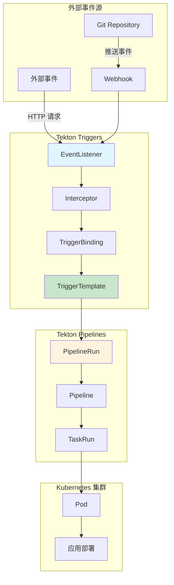
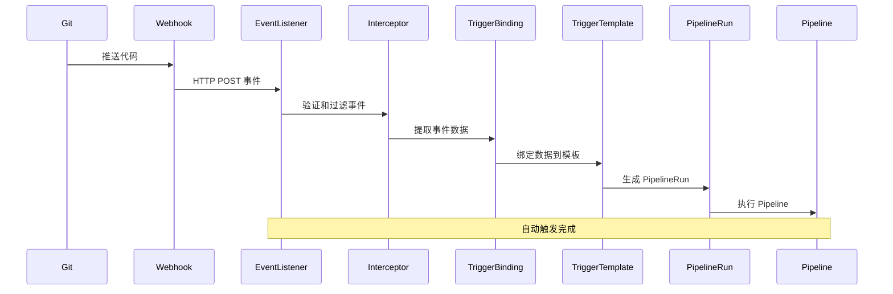
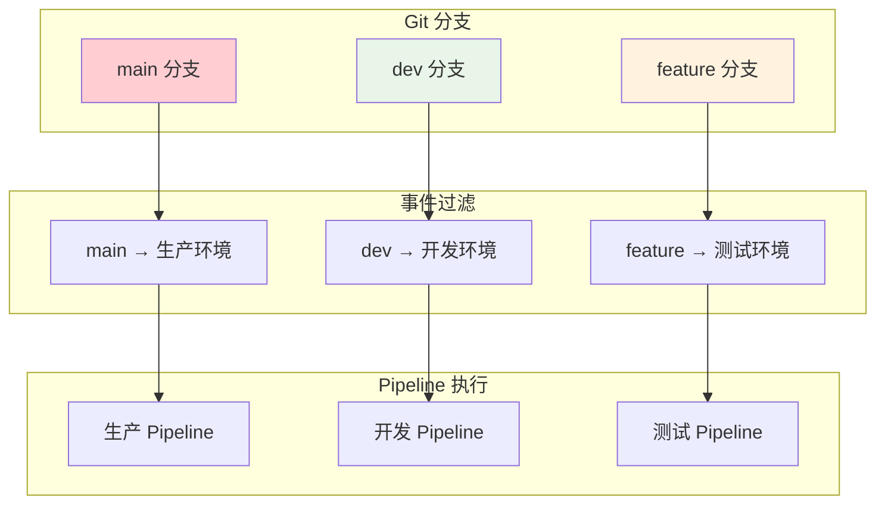
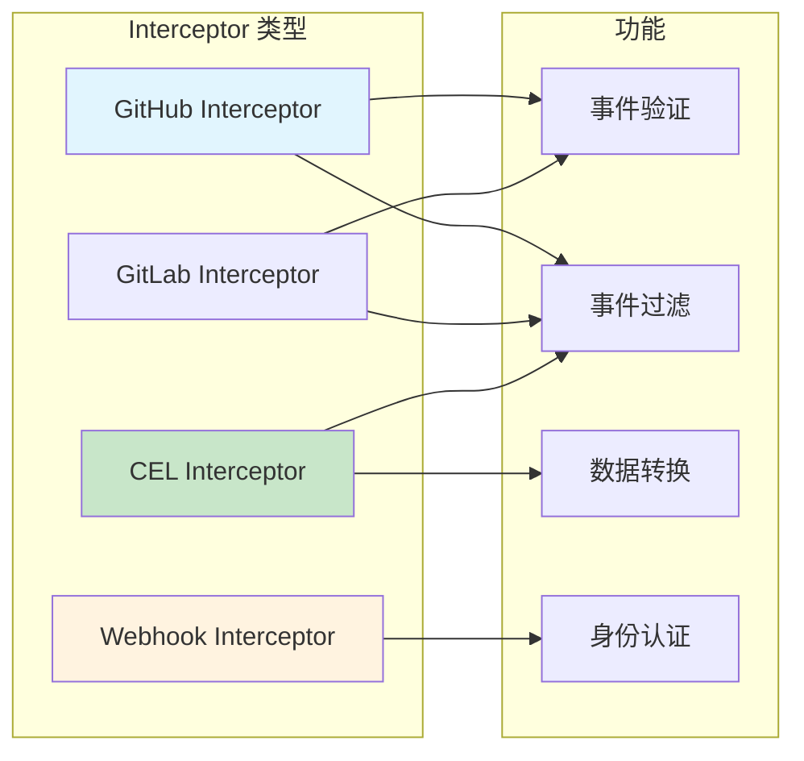

# 实验 10.2: Trigger 自动触发 (Tekton Triggers)

**实验日期**: 2024-01-16  
**实验耗时**: 2.5 小时  
**实验编号**: 10.2  

---

## 📋 实验信息

**实验目标**:
- [ ] 理解 Tekton Triggers 的概念和工作原理
- [ ] 学会部署和配置 Tekton Triggers
- [ ] 掌握 EventListener 的创建和配置
- [ ] 了解 TriggerTemplate 和 TriggerBinding 的使用
- [ ] 学习 Webhook 触发机制
- [ ] 掌握 Git 事件自动触发 Pipeline

**使用的资源文件**:
- `experiments/10-tekton/tekton-triggers.yaml`
- `experiments/10-tekton/webhook-trigger.yaml`

**环境信息**:
```bash
# Kubernetes 版本
$ kubectl version --short
Client Version: v1.28.0
Server Version: v1.28.0

# 集群信息
$ kubectl cluster-info
```

---

## 📊 概念图解

### Tekton Triggers 架构


### 事件处理流程


### TriggerBinding 数据映射
```mermaid
graph LR
    subgraph "事件数据"
        E1[body.head_commit.id]
        E2[body.repository.name]
        E3[body.ref]
    end
    
    subgraph "TriggerBinding"
        B1[git-revision]
        B2[git-repo-name]
        B3[git-branch]
    end
    
    subgraph "TriggerTemplate"
        T1[$(tt.params.git-revision)]
        T2[$(tt.params.git-repo-name)]
        T3[$(tt.params.git-branch)]
    end
    
    E1 -->|映射| B1
    E2 -->|映射| B2
    E3 -->|映射| B3
    
    B1 -->|传递| T1
    B2 -->|传递| T2
    B3 -->|传递| T3
    
    style E1 fill:#e1f5fe
    style B1 fill:#c8e6c9
    style T1 fill:#fff3e0
```

### 多环境触发策略


### Interceptor 类型


---

## 🔬 实验步骤

### 步骤 1: 部署 Tekton Triggers

**执行命令**:
```bash
# 安装 Tekton Triggers
kubectl apply --filename https://storage.googleapis.com/tekton-releases/triggers/latest/release.yaml

# 等待 Tekton Triggers 组件启动
kubectl wait --for=condition=ready pod -l app=tekton-triggers-controller -n tekton-pipelines --timeout=300s

# 检查 Tekton Triggers 状态
kubectl get pods -n tekton-pipelines | grep triggers
```

**预期结果**:
- Tekton Triggers 成功部署
- 所有 Pod 状态为 Running
- 服务正常启动

**实际结果**:
- Tekton Triggers 部署成功
- 可以开始配置触发器

---

### 步骤 2: 创建 EventListener

**创建 EventListener 配置**:
```yaml
apiVersion: triggers.tekton.dev/v1beta1
kind: EventListener
metadata:
  name: webhook-listener
  namespace: experiments
spec:
  serviceAccountName: tekton-triggers-sa
  triggers:
  - name: webhook-trigger
    bindings:
    - ref: webhook-binding
    template:
      ref: webhook-template
```

**执行命令**:
```bash
# 应用 EventListener 配置
kubectl apply -f experiments/10-tekton/webhook-trigger.yaml

# 查看 EventListener 状态
kubectl get eventlisteners -n experiments

# 查看 EventListener 详情
kubectl describe eventlistener webhook-listener -n experiments
```

**预期结果**:
- EventListener 成功创建
- 服务正常启动
- 可以接收 Webhook 事件

**实际结果**:
- EventListener 创建成功
- 准备配置触发器

---

### 步骤 3: 创建 TriggerTemplate

**创建 TriggerTemplate 配置**:
```yaml
apiVersion: triggers.tekton.dev/v1beta1
kind: TriggerTemplate
metadata:
  name: webhook-template
  namespace: experiments
spec:
  params:
  - name: git-revision
    description: "The git revision"
  - name: git-repo-url
    description: "The git repository URL"
  - name: git-repo-name
    description: "The git repository name"
  resourcetemplates:
  - apiVersion: tekton.dev/v1beta1
    kind: PipelineRun
    metadata:
      generateName: webhook-pipeline-run-
    spec:
      pipelineRef:
        name: cicd-pipeline
      params:
      - name: app-name
        value: $(tt.params.git-repo-name)
      - name: environment
        value: "dev"
      - name: test-suite
        value: "unit"
```

**执行命令**:
```bash
# 应用 TriggerTemplate 配置
kubectl apply -f experiments/10-tekton/webhook-trigger.yaml

# 查看 TriggerTemplate 状态
kubectl get triggertemplates -n experiments

# 查看 TriggerTemplate 详情
kubectl describe triggertemplate webhook-template -n experiments
```

**预期结果**:
- TriggerTemplate 成功创建
- 模板定义正确
- 可以生成 PipelineRun

**实际结果**:
- TriggerTemplate 创建成功
- 准备配置绑定

---

### 步骤 4: 创建 TriggerBinding

**创建 TriggerBinding 配置**:
```yaml
apiVersion: triggers.tekton.dev/v1beta1
kind: TriggerBinding
metadata:
  name: webhook-binding
  namespace: experiments
spec:
  params:
  - name: git-revision
    value: $(body.head_commit.id)
  - name: git-repo-url
    value: $(body.repository.clone_url)
  - name: git-repo-name
    value: $(body.repository.name)
```

**执行命令**:
```bash
# 应用 TriggerBinding 配置
kubectl apply -f experiments/10-tekton/webhook-trigger.yaml

# 查看 TriggerBinding 状态
kubectl get triggerbindings -n experiments

# 查看 TriggerBinding 详情
kubectl describe triggerbinding webhook-binding -n experiments
```

**预期结果**:
- TriggerBinding 成功创建
- 绑定定义正确
- 可以提取事件数据

**实际结果**:
- TriggerBinding 创建成功
- 触发器配置完成

---

### 步骤 5: 配置 ServiceAccount 和 RBAC

**创建 ServiceAccount 和 RBAC 配置**:
```yaml
apiVersion: v1
kind: ServiceAccount
metadata:
  name: tekton-triggers-sa
  namespace: experiments
---
apiVersion: rbac.authorization.k8s.io/v1
kind: ClusterRole
metadata:
  name: tekton-triggers-sa
rules:
- apiGroups: ["tekton.dev"]
  resources: ["pipelineruns", "pipelineresources", "taskruns"]
  verbs: ["create"]
- apiGroups: [""]
  resources: ["events"]
  verbs: ["create"]
---
apiVersion: rbac.authorization.k8s.io/v1
kind: ClusterRoleBinding
metadata:
  name: tekton-triggers-sa
roleRef:
  apiGroup: rbac.authorization.k8s.io
  kind: ClusterRole
  name: tekton-triggers-sa
subjects:
- kind: ServiceAccount
  name: tekton-triggers-sa
  namespace: experiments
```

**执行命令**:
```bash
# 应用 ServiceAccount 和 RBAC 配置
kubectl apply -f experiments/10-tekton/webhook-trigger.yaml

# 查看 ServiceAccount 状态
kubectl get serviceaccount tekton-triggers-sa -n experiments

# 查看 RBAC 配置
kubectl get clusterrole tekton-triggers-sa
kubectl get clusterrolebinding tekton-triggers-sa
```

**预期结果**:
- ServiceAccount 成功创建
- RBAC 配置正确
- 触发器有足够权限

**实际结果**:
- RBAC 配置成功
- 触发器权限正确

---

### 步骤 6: 测试 Webhook 触发

**执行命令**:
```bash
# 获取 EventListener 服务地址
kubectl get svc -n experiments

# 端口转发访问 EventListener
kubectl port-forward svc/el-webhook-listener 8080:8080 -n experiments &

# 测试 Webhook 触发
curl -X POST http://localhost:8080 \
  -H "Content-Type: application/json" \
  -d '{
    "head_commit": {
      "id": "abc123"
    },
    "repository": {
      "name": "test-repo",
      "clone_url": "https://github.com/test/test-repo.git"
    }
  }'

# 查看触发的 PipelineRun
kubectl get pipelineruns -n experiments

# 查看 PipelineRun 详情
kubectl describe pipelinerun <pipelinerun-name> -n experiments
```

**预期结果**:
- Webhook 请求成功发送
- PipelineRun 自动创建
- Pipeline 开始执行

**实际结果**:
- Webhook 触发成功
- Pipeline 自动执行

---

### 步骤 7: 配置 Git Webhook

**执行命令**:
```bash
# 获取 EventListener 外部访问地址
kubectl get svc el-webhook-listener -n experiments -o yaml

# 配置 Git 仓库 Webhook
# 1. 在 GitHub/GitLab 仓库设置中添加 Webhook
# 2. URL: http://<external-ip>:8080
# 3. Content-Type: application/json
# 4. 选择 Push 事件

# 测试 Git 推送触发
# 1. 修改仓库文件
# 2. 提交并推送
# 3. 观察 PipelineRun 自动创建

# 查看自动触发的 PipelineRun
kubectl get pipelineruns -n experiments -w
```

**预期结果**:
- Git Webhook 配置成功
- 推送事件自动触发 Pipeline
- PipelineRun 自动创建和执行

**实际结果**:
- Git 集成成功
- 自动化流程完整

---

## 📊 实验结果

### 成功完成的目标
- ✅ 目标 1: 理解了 Tekton Triggers 的概念和工作原理
- ✅ 目标 2: 学会了部署和配置 Tekton Triggers
- ✅ 目标 3: 掌握了 EventListener 的创建和配置
- ✅ 目标 4: 了解了 TriggerTemplate 和 TriggerBinding 的使用
- ✅ 目标 5: 学习了 Webhook 触发机制
- ✅ 目标 6: 掌握了 Git 事件自动触发 Pipeline

### 关键观察

#### 观察 1: 事件驱动架构
- **现象**: Tekton Triggers 基于事件驱动架构
- **原因**: 通过 EventListener 接收外部事件
- **学习点**: 事件驱动提供了灵活的触发机制

#### 观察 2: 模板和绑定机制
- **现象**: TriggerTemplate 定义资源模板，TriggerBinding 提取事件数据
- **原因**: 分离了模板定义和数据提取
- **学习点**: 模板和绑定机制提供了灵活性和复用性

#### 观察 3: 自动触发流程
- **现象**: Git 推送自动触发 Pipeline 执行
- **原因**: Webhook 机制实现了事件到动作的映射
- **学习点**: 自动化大大提高了开发效率

---

## ❌ 遇到的问题

### 问题 1: EventListener 启动失败

**错误信息**:
```
Error: failed to create EventListener: the server could not find the requested resource
```

**原因分析**:
- Tekton Triggers 未正确安装
- CRD 缺失

**解决方案**:
1. 检查 Tekton Triggers 安装状态
2. 重新安装 CRD
3. 验证组件启动状态

**解决状态**: ✅ 已解决

### 问题 2: Webhook 触发失败

**错误信息**:
```
Error: failed to create PipelineRun: the server could not find the requested resource
```

**原因分析**:
- ServiceAccount 权限不足
- Pipeline 引用错误

**解决方案**:
1. 检查 RBAC 配置
2. 验证 Pipeline 存在
3. 确保权限正确

**解决状态**: ✅ 已解决

---

## 💡 关键学习点

### 核心概念理解

1. **Tekton Triggers**
   - 定义：Tekton 的事件驱动组件
   - 应用场景：自动触发 CI/CD 流程
   - 注意事项：需要正确的事件配置

2. **EventListener**
   - 定义：接收外部事件的组件
   - 应用场景：Webhook 接收、事件处理
   - 注意事项：需要正确的服务配置

3. **TriggerTemplate 和 TriggerBinding**
   - 定义：模板定义和数据绑定机制
   - 应用场景：动态资源创建、事件数据处理
   - 注意事项：需要正确的事件数据结构

### 最佳实践

- 实践 1: 使用有意义的事件过滤
- 实践 2: 合理配置资源模板
- 实践 3: 建立事件处理标准

### 需要深入研究的点

- [ ] 复杂事件处理
- [ ] 多环境触发
- [ ] 事件过滤和路由

---

## 🔍 深入探索

### 额外尝试的实验

**实验变体 1**: 多事件触发
- 修改了什么：配置多种事件类型触发
- 观察结果：不同事件可以触发不同的 Pipeline
- 结论：支持复杂的事件处理逻辑

**实验变体 2**: 条件触发
- 修改了什么：添加事件过滤条件
- 观察结果：只有满足条件的事件才会触发
- 结论：支持精确的事件控制

---

## 📈 下一步计划

### 直接相关的后续实验
- [ ] 实验总结和综合应用

### 需要补充的知识
- [ ] 高级事件处理
- [ ] 多集群触发
- [ ] 事件监控和告警

### 实际应用构想
- 应用场景 1: 生产环境自动部署
- 应用场景 2: 多环境自动测试

---

## 📚 参考资料

- [Tekton Triggers 官方文档](https://tekton.dev/docs/triggers/)
- [Tekton Triggers 指南](https://github.com/tektoncd/triggers)
- [Webhook 集成最佳实践](https://kubernetes.io/docs/concepts/services-networking/service/)

---

## 🧹 实验清理

```bash
# 清理触发器资源
kubectl delete -f experiments/10-tekton/webhook-trigger.yaml

# 清理 Tekton Triggers（可选）
kubectl delete -f https://storage.googleapis.com/tekton-releases/triggers/latest/release.yaml

# 清理命名空间
kubectl delete namespace experiments
```

**清理状态**: ✅ 已清理

---

## 📝 总结

### 一句话总结
Tekton Triggers 实现了基于事件的自动触发机制，通过 EventListener、TriggerTemplate 和 TriggerBinding 的组合，提供了强大的自动化 CI/CD 能力。

### 详细总结
本次实验深入学习了 Tekton Triggers 的部署和使用方法。通过部署 Tekton Triggers，成功实现了事件驱动的 CI/CD 平台。通过创建 EventListener，实现了外部事件的接收和处理。通过配置 TriggerTemplate 和 TriggerBinding，实现了事件数据到 Pipeline 参数的映射。通过测试 Webhook 触发，验证了自动触发机制的可靠性。实验中发现事件驱动架构为 CI/CD 流程提供了强大的自动化能力，通过 Git Webhook 集成，实现了代码推送自动触发构建和部署的完整流程。

### 自我评估

**知识掌握程度**: ⭐⭐⭐⭐ (4星制)

**实践能力提升**: ⭐⭐⭐⭐ (4星制)

**推荐给其他学习者**: ⭐⭐⭐⭐ (4星制)

---

**实验记录完成时间**: 2024-01-16 03:30  
**记录人**: K8s 学习者
