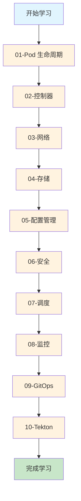
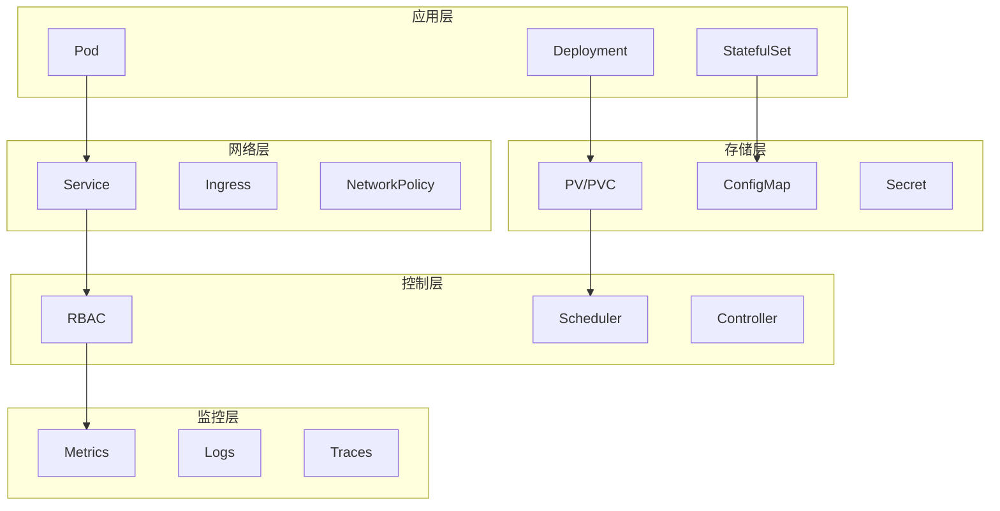

# Kubernetes Homelab 实验总览

## 🎯 学习路径图



## 📚 实验模块详解

### 01-Pod 生命周期 (基础)
- **实验 1.1**: [Pod 生命周期钩子和探针](01-pod-lifecycle/basic-pod.md)
- **实验 1.2**: [Init Container 初始化容器](01-pod-lifecycle/init-container.md)
- **实验 1.3**: [重启策略对比](01-pod-lifecycle/restart-policy.md)

**学习重点**: Pod 的基本概念、生命周期管理、健康检查

### 02-控制器 (核心)
- **实验 2.1**: [StatefulSet 有状态应用](02-controllers/statefulset.md)
- **实验 2.2**: [Deployment 滚动更新](02-controllers/rolling-update.md)

**学习重点**: 工作负载管理、有状态应用、滚动更新

### 03-网络 (通信)
- **实验 3.1**: [Service 类型对比](03-networking/service-types.md)

**学习重点**: 服务发现、负载均衡、网络抽象

### 04-存储 (数据)
- **实验 4.1**: [PV/PVC 持久化存储](04-storage/pvc-demo.md)
- **实验 4.2**: [EmptyDir 临时存储](04-storage/emptydir-demo.md)
- **实验 4.3**: [HostPath 节点存储](04-storage/hostpath-demo.md)

**学习重点**: 存储抽象、数据持久化、存储类型

### 05-配置管理 (配置)
- **实验 5.1**: [ConfigMap 配置管理](05-config/configmap.md)

**学习重点**: 配置与代码分离、配置注入、热更新

### 06-安全 (权限)
- **实验 6.1**: [RBAC 权限控制](06-security/rbac-demo.md)

**学习重点**: 权限管理、安全模型、最小化权限

### 07-调度 (资源)
- **实验 7.1**: [节点选择器](07-scheduling/node-selector.md)
- **实验 7.2**: [亲和性和反亲和性](07-scheduling/node-affinity.md)
- **实验 7.3**: [污点和容忍](07-scheduling/taints-tolerations.md)

**学习重点**: 资源调度、节点选择、负载均衡

### 08-监控 (观测)
- **实验 8.1**: [Metrics Server 资源监控](08-monitoring/metrics-server.md)
- **实验 8.2**: [Prometheus 自定义监控](08-monitoring/prometheus.md)

**学习重点**: 监控体系、指标收集、告警管理

### 09-GitOps (部署)
- **实验 9.1**: [ArgoCD 部署](09-gitops/argocd.md)

**学习重点**: 声明式部署、版本控制、自动化

### 10-Tekton (CI/CD)
- **实验 10.1**: [Pipeline 基础](10-tekton/pipeline-basics.md)
- **实验 10.2**: [Trigger 自动触发](10-tekton/trigger-automation.md)

**学习重点**: 持续集成、持续部署、自动化流水线

## 🏗️ 系统架构图



## 🎓 学习建议

### 初学者路径
1. **基础概念**: 01-Pod 生命周期
2. **核心功能**: 02-控制器 + 03-网络
3. **数据管理**: 04-存储 + 05-配置管理
4. **安全实践**: 06-安全

### 进阶路径
1. **高级调度**: 07-调度
2. **监控运维**: 08-监控
3. **现代部署**: 09-GitOps + 10-Tekton

### 生产实践
1. **完整流程**: 所有模块的综合应用
2. **故障排查**: 基于监控的问题诊断
3. **性能优化**: 基于调度的资源优化

## 📊 实验完成度

| 模块 | 实验数量 | 完成状态 | 难度等级 |
|------|----------|----------|----------|
| 01-Pod 生命周期 | 3 | ✅ 完成 | ⭐⭐ |
| 02-控制器 | 2 | ✅ 完成 | ⭐⭐⭐ |
| 03-网络 | 1 | ✅ 完成 | ⭐⭐ |
| 04-存储 | 3 | ✅ 完成 | ⭐⭐⭐ |
| 05-配置管理 | 1 | ✅ 完成 | ⭐⭐ |
| 06-安全 | 1 | ✅ 完成 | ⭐⭐⭐ |
| 07-调度 | 3 | ✅ 完成 | ⭐⭐⭐⭐ |
| 08-监控 | 2 | ✅ 完成 | ⭐⭐⭐⭐ |
| 09-GitOps | 1 | ✅ 完成 | ⭐⭐⭐⭐⭐ |
| 10-Tekton | 2 | ✅ 完成 | ⭐⭐⭐⭐⭐ |

## 🚀 快速开始

### 1. 环境准备
```bash
# 创建实验命名空间
kubectl create namespace experiments

# 检查集群状态
kubectl cluster-info
kubectl get nodes
```

### 2. 选择实验
```bash
# 查看可用实验
ls experiments/

# 运行第一个实验
kubectl apply -f experiments/01-pod-lifecycle/basic-pod.yaml
```

### 3. 学习模式
- **理论学习**: 先阅读实验文档，理解概念
- **实践操作**: 按照步骤执行命令，观察结果
- **深入思考**: 分析现象，理解原理
- **扩展实验**: 修改参数，观察变化

## 🔧 常用命令

### 基础操作
```bash
# 查看资源状态
kubectl get pods,svc,pvc -n experiments

# 查看详细信息
kubectl describe pod <pod-name> -n experiments

# 查看日志
kubectl logs <pod-name> -n experiments

# 进入容器
kubectl exec -it <pod-name> -n experiments -- sh
```

### 故障排查
```bash
# 查看事件
kubectl get events -n experiments --sort-by='.lastTimestamp'

# 查看资源使用
kubectl top pods -n experiments

# 查看节点状态
kubectl describe nodes
```

### 清理资源
```bash
# 清理单个实验
kubectl delete -f <experiment-file>

# 清理命名空间
kubectl delete namespace experiments
```

## 📚 学习资源

### 官方文档
- [Kubernetes 官方文档](https://kubernetes.io/docs/)
- [Kubernetes 概念](https://kubernetes.io/docs/concepts/)
- [Kubernetes 任务](https://kubernetes.io/docs/tasks/)

### 推荐书籍
- 《Kubernetes in Action》
- 《Kubernetes: Up and Running》
- 《Kubernetes 权威指南》

### 在线课程
- [Kubernetes 基础课程](https://kubernetes.io/training/)
- [CKA 认证课程](https://www.cncf.io/certification/cka/)
- [CKAD 认证课程](https://www.cncf.io/certification/ckad/)

## 🤝 贡献指南

### 报告问题
- 使用 GitHub Issues 报告问题
- 提供详细的错误信息和复现步骤
- 包含环境信息和版本号

### 改进建议
- 提出实验改进建议
- 分享学习心得和最佳实践
- 贡献新的实验案例

### 代码贡献
- Fork 项目并创建分支
- 提交 Pull Request
- 遵循代码规范和文档标准

---

**最后更新**: 2024-01-15  
**维护者**: K8s 学习者社区

