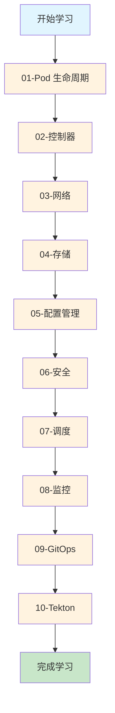

# Kubernetes 学习实验

本目录包含一系列循序渐进的 Kubernetes 学习实验，从基础概念到高级应用，帮助您全面掌握 Kubernetes 技术栈。

## 🎯 学习路径



## 🚀 快速开始

### 1. 创建实验命名空间
```bash
kubectl create namespace experiments
```

### 2. 选择实验模块
查看 [实验总览](EXPERIMENTS-OVERVIEW.md) 选择适合您当前水平的实验。

### 3. 运行实验
```bash
# 例如：运行 Pod 生命周期实验
kubectl apply -f 01-pod-lifecycle/basic-pod.yaml

# 观察 Pod 状态
kubectl get pods -n experiments -w

# 查看 Pod 详情
kubectl describe pod lifecycle-demo -n experiments
```

## 📁 实验目录结构

```
experiments/
├── 01-pod-lifecycle/       # Pod 生命周期实验 ✅
│   ├── basic-pod.md        # 生命周期钩子和探针
│   ├── init-container.md   # Init Container 实验
│   └── restart-policy.md   # 重启策略对比
├── 02-controllers/         # 控制器实验 ✅
│   ├── statefulset.md      # StatefulSet 有状态应用
│   └── rolling-update.md   # Deployment 滚动更新
├── 03-networking/          # 网络实验 ✅
│   └── service-types.md    # Service 类型对比
├── 04-storage/            # 存储实验 ✅
│   ├── pvc-demo.md         # PV/PVC 持久化存储
│   ├── emptydir-demo.md    # EmptyDir 临时存储
│   └── hostpath-demo.md    # HostPath 节点存储
├── 05-config/             # 配置管理实验 ✅
│   └── configmap.md        # ConfigMap 配置管理
├── 06-security/           # 安全和 RBAC 实验 ✅
│   └── rbac-demo.md        # RBAC 权限控制
├── 07-scheduling/         # 调度实验 ⏳
├── 08-monitoring/         # 监控实验 ⏳
├── 09-gitops/            # GitOps 实验 ⏳
├── 10-tekton/            # Tekton CI/CD 实验 ⏳
├── EXPERIMENTS-OVERVIEW.md # 实验总览
└── README.md              # 本文件
```

**图例**: ✅ 已完成 | ⏳ 待创建

## 💡 实验建议

1. **按顺序学习**: 从基础到高级，循序渐进
2. **动手实践**: 每个实验都要亲自运行和观察
3. **记录问题**: 遇到问题记录下来，有助于深入理解
4. **修改参数**: 尝试修改配置参数，观察不同结果
5. **清理资源**: 实验结束后清理资源

## 📊 学习进度

| 模块 | 状态 | 难度 | 预计时间 |
|------|------|------|----------|
| 01-Pod 生命周期 | ✅ 完成 | ⭐⭐ | 3 小时 |
| 02-控制器 | ✅ 完成 | ⭐⭐⭐ | 2 小时 |
| 03-网络 | ✅ 完成 | ⭐⭐ | 1 小时 |
| 04-存储 | ✅ 完成 | ⭐⭐⭐ | 3 小时 |
| 05-配置管理 | ✅ 完成 | ⭐⭐ | 1 小时 |
| 06-安全 | ✅ 完成 | ⭐⭐⭐ | 1 小时 |
| 07-调度 | ⏳ 待创建 | ⭐⭐⭐⭐ | 2 小时 |
| 08-监控 | ⏳ 待创建 | ⭐⭐⭐⭐ | 3 小时 |
| 09-GitOps | ⏳ 待创建 | ⭐⭐⭐⭐⭐ | 4 小时 |
| 10-Tekton | ⏳ 待创建 | ⭐⭐⭐⭐⭐ | 4 小时 |

**总计**: 6 个模块已完成，4 个模块待创建

## 🧹 清理实验资源

```bash
# 清理单个实验
kubectl delete -f 01-pod-lifecycle/basic-pod.yaml

# 清理整个命名空间
kubectl delete namespace experiments
```

## 📚 学习资源

- 主实验设计文档: `../K8S-LEARNING-EXPERIMENTS.md`
- 环境架构文档: `../HOMELAB-ARCHITECTURE.md`
- CI/CD 文档: `../README-CICD.md`

## ⚠️ 注意事项

- 某些实验需要预先存在的资源（如 StorageClass、监控组件）
- 在 Kind 环境中，NodePort 需要通过 localhost 访问
- 资源限制可能需要根据你的机器配置调整

---

祝你学习愉快！ 🎓
