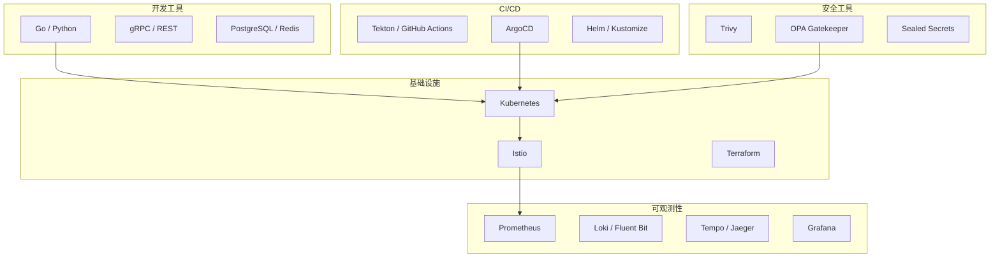
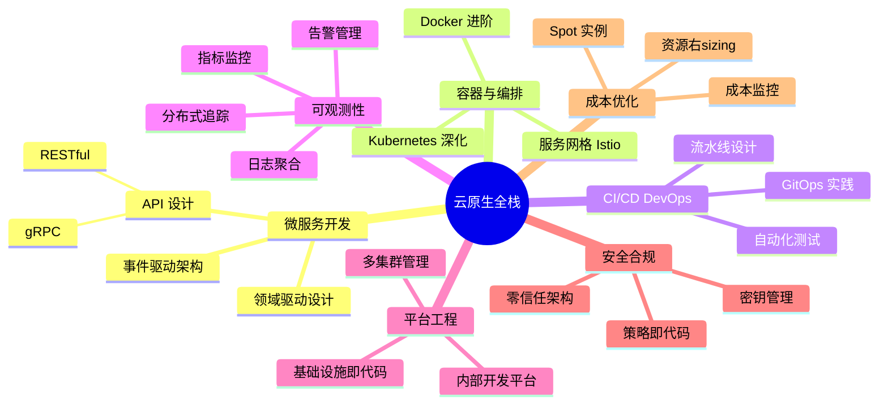

# 🚀 云原生开发与架构进阶学习路线图

## 📊 您的学习基础评估

**已掌握技能** ✅
- Kubernetes 核心概念（Pod、控制器、网络、存储）
- CI/CD 自动化（Tekton + GitOps）
- 监控体系（Prometheus + Grafana）
- 容器化与编排

**技能缺口分析** 🎯
- 微服务架构设计与开发
- 服务网格（Service Mesh）
- 云原生可观测性（日志、追踪、指标）
- 平台工程与基础设施即代码
- 成本优化与资源管理
- 安全合规与策略管理

---

## 🗓️ 8 周系统学习计划

### **阶段一：云原生应用开发基础**（第 1-2 周）

#### Week 1: 微服务架构与 API 设计
- **目标**: 掌握云原生微服务开发模式
- **核心内容**:
  - 微服务拆分原则（DDD 领域驱动设计）
  - RESTful API 设计最佳实践
  - gRPC 与 Protocol Buffers
  - API 网关模式（Kong / Nginx / Traefik）
  - 服务间通信模式（同步 vs 异步）

- **实践项目**: 
  ```
  构建一个简单的电商系统（3个微服务）
  - 用户服务（User Service）
  - 商品服务（Product Service）  
  - 订单服务（Order Service）
  使用 Go/Python + gRPC + PostgreSQL
  ```

#### Week 2: 服务网格入门（Istio 基础）
- **目标**: 理解服务网格的价值与基本使用
- **核心内容**:
  - 服务网格概念与架构
  - Istio 安装与配置（使用 Istioctl）
  - 流量管理（VirtualService、DestinationRule）
  - 灰度发布与金丝雀部署
  - 熔断与超时控制

- **实践项目**:
  ```
  将 Week 1 的微服务迁移到 Istio
  - 实现 A/B 测试
  - 配置故障注入测试
  - 实现跨服务的分布式追踪
  ```

---

### **阶段二：可观测性与稳定性工程**（第 3-4 周）

#### Week 3: 云原生可观测性（三大支柱）
- **目标**: 构建完整的可观测性体系
- **核心内容**:
  - **日志聚合**: Loki + Promtail / Fluent Bit
  - **分布式追踪**: Jaeger / Tempo + OpenTelemetry
  - **指标监控**: Prometheus 高级特性（PromQL、自定义指标）
  - SLI/SLO/SLA 定义与监控
  - 告警策略设计

- **实践项目**:
  ```
  为微服务系统添加完整观测性
  - 集成 OpenTelemetry SDK
  - 配置 Grafana 统一面板（日志+追踪+指标）
  - 定义核心 SLI（可用性 99.5%、延迟 P95 < 200ms）
  - 设置分级告警（P0/P1/P2）
  ```

#### Week 4: 混沌工程与弹性设计
- **目标**: 提升系统稳定性和故障恢复能力
- **核心内容**:
  - 弹性模式（重试、超时、熔断、限流）
  - Chaos Mesh 混沌工程实践
  - Pod Disruption Budget（PDB）
  - 多副本与自动伸缩（HPA / VPA / KEDA）
  - 备份与灾难恢复（Velero）

- **实践项目**:
  ```
  系统弹性改造
  - 使用 Chaos Mesh 注入网络延迟、Pod 故障
  - 实现服务降级策略
  - 配置 HPA 自动扩缩容
  - 设置 PDB 确保高可用
  ```

---

### **阶段三：平台工程与 DevOps 进阶**（第 5-6 周）

#### Week 5: 基础设施即代码（IaC）
- **目标**: 掌握自动化基础设施管理
- **核心内容**:
  - Terraform 基础（Provider、Resource、Module）
  - Helm Chart 高级特性（依赖管理、Hook）
  - Kustomize 多环境配置管理
  - ArgoCD ApplicationSet（多集群部署）
  - GitOps 最佳实践（分支策略、审批流程）

- **实践项目**:
  ```
  构建多环境部署平台
  - 使用 Terraform 管理云资源
  - 创建可复用的 Helm Chart
  - 配置 dev/staging/prod 三环境
  - 实现 PR 自动部署预览环境
  ```

#### Week 6: CI/CD 流水线深化
- **目标**: 构建企业级 CI/CD 流水线
- **核心内容**:
  - 容器镜像安全（Trivy 扫描、镜像签名）
  - 多阶段构建优化（减小镜像体积）
  - 缓存策略（BuildKit、Layer Caching）
  - 集成测试自动化（单元测试 + 集成测试 + E2E）
  - 部署策略（蓝绿、金丝雀、滚动）

- **实践项目**:
  ```
  完善 CI/CD 流水线
  - 添加代码质量扫描（SonarQube）
  - 集成安全扫描（镜像 + 代码）
  - 实现自动化测试（覆盖率 > 70%）
  - 配置金丝雀发布策略
  ```

---

### **阶段四：安全、成本与生产就绪**（第 7-8 周）

#### Week 7: 云原生安全最佳实践
- **目标**: 掌握 Kubernetes 安全加固
- **核心内容**:
  - Pod Security Standards（Restricted、Baseline）
  - Network Policy 网络隔离
  - Secrets 管理（Sealed Secrets / External Secrets）
  - OPA/Gatekeeper 策略即代码
  - RBAC 最佳实践与审计
  - 镜像签名与验证（Sigstore）

- **实践项目**:
  ```
  系统安全加固
  - 实施 Pod Security Standards
  - 配置 Network Policy 限制流量
  - 使用 External Secrets 集成 Vault
  - 编写 OPA 策略（镜像仓库白名单、资源限制）
  ```

#### Week 8: 成本优化与生产就绪
- **目标**: 优化资源使用，准备生产环境
- **核心内容**:
  - 资源请求与限制最佳实践
  - Spot 实例与节点池策略
  - 垂直 Pod 自动伸缩（VPA）
  - 成本监控（Kubecost / OpenCost）
  - 生产环境检查清单
  - 文档与知识库建设

- **实践项目**:
  ```
  生产环境准备
  - 使用 OpenCost 分析成本
  - 优化资源配置（减少 30% 成本）
  - 编写运维手册（故障排查、应急响应）
  - 准备上线检查清单
  ```

---

## 🎓 技术栈选型建议

### 编程语言
- **Go**: 微服务开发、CLI 工具、性能敏感场景
- **Python**: 数据处理、自动化脚本、AI/ML 集成
- **TypeScript**: 前端开发、Node.js 后端

### 核心工具链



---

## 📚 每周学习节奏

### 日常安排（周一至周五，每天 6-8 小时）
- **上午 2-3 小时**: 理论学习（文档、视频课程）
- **下午 3-4 小时**: 实践项目（动手实验）
- **晚上 1 小时**: 复盘总结（写博客、笔记）

### 周末安排
- **周六**: 完成本周项目，代码 Review
- **周日**: 休息 + 社区互动（阅读优秀开源项目）

---

## 🎯 学习成果验证

### 阶段一结束（Week 2）
- [ ] 能独立开发 gRPC 微服务
- [ ] 理解 Istio 流量管理原理
- [ ] 完成 3 个微服务的灰度发布

### 阶段二结束（Week 4）
- [ ] 搭建完整的可观测性平台
- [ ] 能使用 Chaos Mesh 进行故障测试
- [ ] 定义并监控系统 SLO

### 阶段三结束（Week 6）
- [ ] 使用 Terraform 管理基础设施
- [ ] 构建完整的 CI/CD 流水线
- [ ] 实现多环境自动化部署

### 阶段四结束（Week 8）
- [ ] 通过安全审计检查
- [ ] 优化成本 30% 以上
- [ ] 准备生产环境上线

---

## 🌟 开源贡献路径

### 入门级贡献（Week 1-4）
1. **文档改进**: 为 Kubernetes、Istio 文档修复错误
2. **问题反馈**: 在 GitHub 提交高质量 Issue
3. **代码阅读**: 学习优秀项目源码（Tekton、ArgoCD）

### 进阶级贡献（Week 5-8）
1. **Bug 修复**: 修复小 Bug 并提交 PR
2. **新功能**: 为项目添加小功能
3. **博客写作**: 在个人博客分享学习心得

### 目标项目
- **CNCF 沙箱项目**: OpenCost、Chaos Mesh
- **工具类项目**: K9s、Helm Plugins
- **中文本地化**: Kubernetes 文档翻译

---

## 📖 推荐学习资源

### 在线课程
- [LFS258: Kubernetes Fundamentals](https://training.linuxfoundation.org/)
- [Istio Fundamentals](https://academy.tetrate.io/)
- [Cloud Native DevOps with Kubernetes](https://www.oreilly.com/)

### 书籍推荐
1. **《微服务架构设计模式》**（Chris Richardson）
2. **《云原生模式》**（Cornelia Davis）
3. **《Site Reliability Engineering》**（Google SRE）
4. **《Production Kubernetes》**（Josh Rosso）

### 社区与博客
- CNCF Landscape: https://landscape.cncf.io/
- Kubernetes Blog: https://kubernetes.io/blog/
- Cloud Native 中文社区: https://cloudnative.to/

---

## 🎨 知识体系架构图



---

## ✅ 学习检查清单

### 技术能力
- [ ] 能设计并实现微服务架构系统
- [ ] 熟练使用 Istio 管理服务网格
- [ ] 搭建完整的可观测性体系
- [ ] 编写高质量的 IaC 代码
- [ ] 实施云原生安全最佳实践
- [ ] 优化系统成本与性能

### 软技能
- [ ] 能撰写清晰的技术文档
- [ ] 具备故障排查与应急响应能力
- [ ] 理解 DevOps 文化与协作方式
- [ ] 能向团队分享知识

### 职业发展
- [ ] 完成至少 2 个开源项目贡献
- [ ] 撰写 5+ 篇技术博客
- [ ] 参与 1 次技术分享/演讲
- [ ] 准备 CKA/CKAD 认证（可选）

---

## 🚀 后续进阶方向（2 个月后）

### 专家级主题
1. **eBPF 与可观测性**: Cilium、Pixie
2. **WebAssembly**: WASM 微服务、边缘计算
3. **多集群管理**: Cluster API、Karmada
4. **AI/ML on Kubernetes**: Kubeflow、KServe
5. **边缘计算**: K3s、OpenYurt
6. **Serverless**: Knative、OpenFaaS

### 认证考试
- **CKA** (Certified Kubernetes Administrator)
- **CKAD** (Certified Kubernetes Application Developer)
- **CKS** (Certified Kubernetes Security Specialist)

---

**预计完成时间**: 8 周（56 天）  
**每周投入**: 35-40 小时  
**总学时**: 约 300 小时

**成功标准**: 能独立设计、开发、部署和运维一个生产级云原生系统
