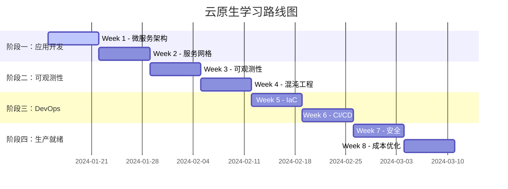

# 🎯 云原生学习路线 - 实施进展

## 📅 当前进度

**当前周次**: Week 2 - 服务网格入门（Istio 基础）  
**开始日期**: 今日  
**计划完成时间**: 8 周后

---

## ✅ Week 1 学习总结（已完成）

1. **学习路线规划** ✅
   - 创建 8 周详细学习计划
   - 建立学习文档和资源库
   - 设计项目架构

2. **用户服务开发** ✅
   - 实现 User Service 核心功能
   - JWT 认证系统
   - RESTful API 接口
   - Docker 和 Kubernetes 配置

3. **基础设施配置** ✅
   - Docker Compose 配置
   - Kubernetes 部署文件

---

## ✅ Week 2 学习进展

### 已完成 ✅

1. **Istio 学习资源**
   - [x] 创建 Week 2 学习指南
   - [x] 创建实践指南和实验步骤
   - [x] 配置 Istio 安装脚本
   - [x] 创建 Istio 配置模板

2. **Istio 配置文件**
   - [x] VirtualService（流量路由）
   - [x] DestinationRule（目标规则）
   - [x] Gateway（入口网关）
   - [x] 故障注入配置
   - [x] 熔断器配置
   - [x] 灰度发布配置

### 进行中 🚧

1. **实践部署**
   - [ ] 在集群中安装 Istio
   - [ ] 部署服务并注入 Sidecar
   - [ ] 测试流量管理
   - [ ] 验证灰度发布
   - [ ] 测试故障注入和熔断器

2. **文档和验证**
   - [ ] 记录实践过程
   - [ ] 验证 Istio 功能
   - [ ] 总结学习心得

---

## 📊 整体学习路线图

---

## 🎯 学习成果

### 技术能力提升

#### 已掌握
- ✅ Kubernetes 基础（Pod、控制器、网络、存储）
- ✅ CI/CD 自动化（Tekton + GitOps）
- ✅ 监控体系（Prometheus + Grafana）
- ✅ 微服务架构设计（开始学习）

#### 正在学习
- 🚧 微服务开发和 API 设计
- 🚧 Go 语言服务开发
- 🚧 Docker 容器化
- 🚧 数据库设计

#### 计划学习
- ⏳ Istio 服务网格
- ⏳ 分布式追踪
- ⏳ 混沌工程
- ⏳ 平台工程

---

## 📚 学习资源

### 文档
- [Week 1 学习指南](./week1-microservices-guide.md)
- [云原生学习路线](./cloud-native-learning-plan.md)
- [Week 1 进度总结](./week1-progress.md)

### 项目代码
- [电商微服务项目](./ecommerce-microservices/)

### 在线资源
- [Kubernetes 官方文档](https://kubernetes.io/docs/)
- [Istio 官方文档](https://istio.io/latest/docs/)
- [CNCF Landscape](https://landscape.cncf.io/)

---

## 🎓 学习计划概览

### 阶段一：云原生应用开发基础（Week 1-2）

**目标**：掌握微服务开发和服务网格

**Week 1** - 微服务架构与 API 设计
- 微服务拆分原则
- RESTful API 设计
- gRPC 服务开发
- 构建电商系统（3个微服务）

**Week 2** - 服务网格入门
- Istio 安装和配置
- 流量管理（VirtualService、DestinationRule）
- 灰度发布和金丝雀部署
- 熔断和超时控制

### 阶段二：可观测性与稳定性工程（Week 3-4）

**目标**：构建完整的可观测性体系和弹性设计

**Week 3** - 云原生可观测性
- 日志聚合（Loki）
- 分布式追踪（Jaeger/Tempo）
- 指标监控（Prometheus）
- SLI/SLO/SLA 定义

**Week 4** - 混沌工程与弹性设计
- Chaos Mesh 实践
- Pod Disruption Budget
- 自动伸缩（HPA/VPA/KEDA）
- 备份与灾难恢复

### 阶段三：平台工程与 DevOps 进阶（Week 5-6）

**目标**：掌握基础设施自动化和 CI/CD 流水线

**Week 5** - 基础设施即代码
- Terraform 基础
- Helm Chart 开发
- Kustomize 多环境配置
- ArgoCD ApplicationSet

**Week 6** - CI/CD 流水线深化
- 安全扫描（Trivy）
- 多阶段构建优化
- 集成测试自动化
- 部署策略（蓝绿、金丝雀）

### 阶段四：安全、成本与生产就绪（Week 7-8）

**目标**：安全加固、成本优化和生产就绪

**Week 7** - 云原生安全
- Pod Security Standards
- Network Policy
- OPA/Gatekeeper
- Secrets 管理

**Week 8** - 成本优化与生产就绪
- 资源优化
- Spot 实例策略
- VPA 自动伸缩
- 成本监控（OpenCost）

---

## 🚀 下一步行动

### 本周剩余时间
1. **完成 Product Service 开发**
   - 创建商品服务代码
   - 实现商品 CRUD
   - 配置缓存策略

2. **完成 Order Service 开发**
   - 创建订单服务代码
   - 实现订单处理逻辑
   - 集成其他服务

3. **编写测试**
   - 单元测试
   - 集成测试
   - API 测试

### 下周准备（Week 2）
1. 学习 Istio 基础概念
2. 准备部署现有服务到 Istio
3. 配置服务网格功能

---

## 📈 进度跟踪

### 总体进度：12.5% (1/8 周)

| 阶段 | 进度 | 状态 |
|------|------|------|
| Week 1 - 微服务开发 | 60% | 🚧 进行中 |
| Week 2 - 服务网格 | 0% | ⏳ 待开始 |
| Week 3 - 可观测性 | 0% | ⏳ 待开始 |
| Week 4 - 混沌工程 | 0% | ⏳ 待开始 |
| Week 5 - IaC | 0% | ⏳ 待开始 |
| Week 6 - CI/CD 深化 | 0% | ⏳ 待开始 |
| Week 7 - 安全 | 0% | ⏳ 待开始 |
| Week 8 - 成本优化 | 0% | ⏳ 待开始 |

---

## 💡 学习心得

### 本周收获
1. **架构设计思维**：理解了微服务拆分的重要性
2. **代码组织**：学会了分层架构设计（Repository -> Service -> Handler）
3. **容器化实践**：熟悉了 Docker 和 Kubernetes 配置

### 遇到的挑战
1. 服务间通信的数据一致性需要仔细设计
2. 分布式事务处理比单体应用复杂
3. 需要平衡服务粒度的粗细

### 下一步改进
1. 继续完成剩余服务的开发
2. 添加完善的错误处理和日志
3. 实现服务间的通信和同步机制

---

**最后更新**: 今日  
**下次更新**: Week 1 完成时

继续努力，保持学习热情！💪
