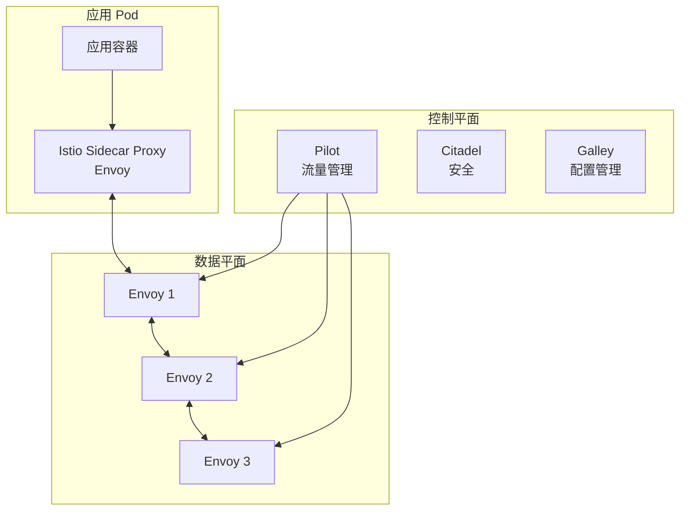
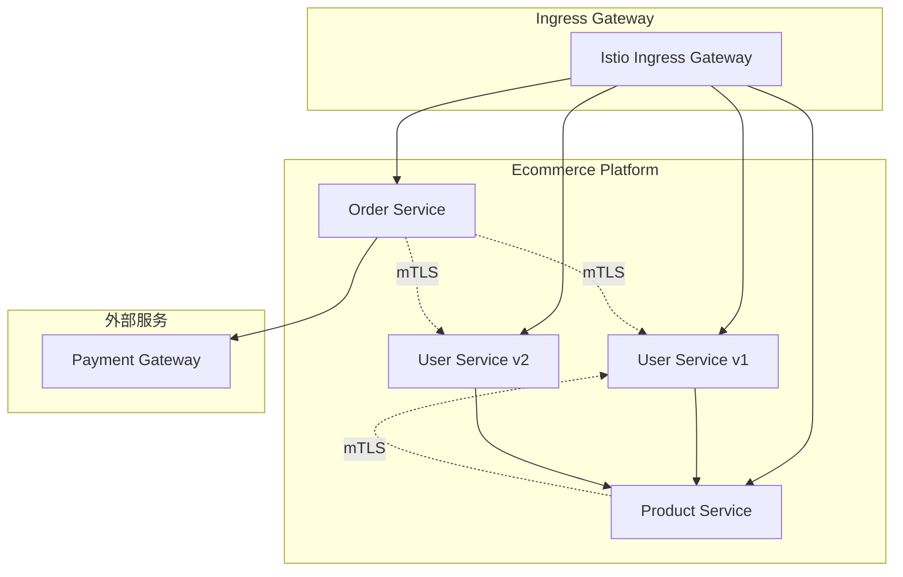

# Week 2: 服务网格入门（Istio 基础）

## 🎯 本周学习目标

1. **理解服务网格概念**：了解 Service Mesh 的价值和架构
2. **掌握 Istio 基础**：学习 Istio 的安装和配置
3. **实践流量管理**：使用 VirtualService 和 DestinationRule
4. **实现灰度发布**：配置金丝雀部署和 A/B 测试
5. **配置故障注入**：测试系统的容错能力
6. **集成分布式追踪**：实现跨服务请求追踪

## 📚 理论学习重点

### 1. 服务网格概念

#### 什么是服务网格？
服务网格（Service Mesh）是一个专用的基础设施层，用于处理微服务间的通信。它提供：
- **流量管理**：路由、负载均衡、超时、重试
- **安全**：mTLS、认证、授权
- **可观测性**：指标、日志、追踪
- **策略**：速率限制、熔断器、故障注入

#### 服务网格架构


#### 为什么需要服务网格？
1. **解耦通信逻辑**：从应用代码中分离通信逻辑
2. **统一管理**：集中管理和控制服务间通信
3. **可观测性**：自动收集指标和追踪
4. **安全增强**：自动实施 mTLS 和策略
5. **流量控制**：灵活的路由和负载均衡策略

### 2. Istio 核心组件

#### 控制平面（Control Plane）

**Pilot** - 流量管理
- 管理服务发现
- 配置流量规则
- 生成 Envoy 配置

**Citadel** - 安全
- 证书管理
- mTLS 配置
- 身份验证和授权

**Galley** - 配置管理
- 验证配置
- 分发配置到控制平面组件

#### 数据平面（Data Plane）

**Envoy Proxy** - Sidecar
- 处理所有进出流量
- 执行流量策略
- 收集指标和日志

### 3. Istio 资源对象

#### VirtualService（虚拟服务）
定义流量路由规则

```yaml
apiVersion: networking.istio.io/v1beta1
kind: VirtualService
metadata:
  name: user-service-vs
spec:
  hosts:
  - user-service
  http:
  - match:
    - headers:
        version:
          exact: v2
    route:
    - destination:
        host: user-service
        subset: v2
      weight: 10  # 10% 流量到 v2
    route:
    - destination:
        host: user-service
        subset: v1
      weight: 90  # 90% 流量到 v1
```

#### DestinationRule（目标规则）
定义路由后的流量策略

```yaml
apiVersion: networking.istio.io/v1beta1
kind: DestinationRule
metadata:
  name: user-service-dr
spec:
  host: user-service
  subsets:
  - name: v1
    labels:
      version: v1
  - name: v2
    labels:
      version: v2
  trafficPolicy:
    loadBalancer:
      simple: LEAST_CONN
    connectionPool:
      tcp:
        maxConnections: 100
      http:
        http1MaxPendingRequests: 10
        http2MaxRequests: 10
        maxRequestsPerConnection: 2
    outlierDetection:
      consecutiveErrors: 3
      interval: 30s
      baseEjectionTime: 30s
      maxEjectionPercent: 50
      minHealthPercent: 50
```

#### Gateway（网关）
配置入口流量

```yaml
apiVersion: networking.istio.io/v1beta1
kind: Gateway
metadata:
  name: ecommerce-gateway
spec:
  selector:
    istio: ingressgateway
  servers:
  - port:
      number: 80
      name: http
      protocol: HTTP
    hosts:
    - ecommerce.com
```

#### ServiceEntry（服务入口）
注册外部服务

```yaml
apiVersion: networking.istio.io/v1beta1
kind: ServiceEntry
metadata:
  name: external-api
spec:
  hosts:
  - api.example.com
  ports:
  - number: 443
    name: https
    protocol: HTTPS
  location: MESH_EXTERNAL
  resolution: DNS
```

## 🏗️ 实践项目

### 项目架构



### 实践步骤

#### Step 1: 安装 Istio

```bash
# 下载 Istio
curl -L https://istio.io/downloadIstio | sh -
cd istio-*
export PATH=$PWD/bin:$PATH

# 安装 Istio（使用 demo 配置）
istioctl install --set profile=demo -y

# 验证安装
istioctl verify-install
kubectl get pods -n istio-system
```

#### Step 2: 启用自动注入

```bash
# 为命名空间启用自动注入
kubectl label namespace ecommerce-microservices istio-injection=enabled

# 验证
kubectl get namespace -L istio-injection
```

#### Step 3: 部署服务并注入 Sidecar

```bash
# 部署 User Service
kubectl apply -f infrastructure/kubernetes/user-service.yaml

# 检查 Sidecar 注入
kubectl get pods -n ecommerce-microservices -o jsonpath='{.items[*].spec.containers[*].name}'
```

#### Step 4: 配置流量管理

1. **创建 DestinationRule**
   ```yaml
   # 用户服务金丝雀部署
   # 区分 v1 和 v2 版本
   ```

2. **创建 VirtualService**
   ```yaml
   # 配置 90-10 的流量分割
   # 90% 流量到 v1，10% 流量到 v2
   ```

#### Step 5: 实现灰度发布

```bash
# 逐步增加 v2 流量
# 10% -> 25% -> 50% -> 75% -> 100%
```

#### Step 6: 配置故障注入

```yaml
# 注入延迟
fault:
  delay:
    percentage:
      value: 50
    fixedDelay: 5s

# 注入错误
fault:
  abort:
    percentage:
      value: 10
    httpStatus: 500
```

#### Step 7: 配置熔断器

```yaml
# 在 DestinationRule 中配置
outlierDetection:
  consecutiveErrors: 3
  interval: 30s
  baseEjectionTime: 30s
  maxEjectionPercent: 50
```

## 🎯 学习成果验证

### 理论理解
- [ ] 理解服务网格的价值和适用场景
- [ ] 掌握 Istio 架构和控制平面组件
- [ ] 理解 Sidecar 模式的工作原理

### 实践能力
- [ ] 能安装和配置 Istio
- [ ] 能使用 VirtualService 管理流量
- [ ] 能使用 DestinationRule 配置策略
- [ ] 能实现灰度发布流程
- [ ] 能配置故障注入测试
- [ ] 能配置熔断和超时策略

### 工具使用
- [ ] 熟练使用 `istioctl` 命令
- [ ] 能使用 `kubectl` 管理 Istio 资源
- [ ] 能查看 Envoy 代理配置
- [ ] 能使用 Kiali/Grafana 可视化

## 📖 推荐学习资源

### 官方文档
- [Istio 官方文档](https://istio.io/latest/docs/)
- [Istio 概念](https://istio.io/latest/docs/concepts/)
- [Istio 任务](https://istio.io/latest/docs/tasks/)

### 在线教程
- [Istio 实验室](https://istio.io/latest/docs/tasks/)
- [Tetrate Academy](https://academy.tetrate.io/)
- [Red Hat Service Mesh 教程](https://learn.openshift.com/servicemesh/)

### 书籍推荐
- 《Istio 权威指南》
- 《云原生服务网格 Istio》
- 《微服务架构与实践》

---

**本周目标**：完成 Istio 的安装配置，将电商微服务迁移到服务网格，实现灰度发布和熔断器功能。
