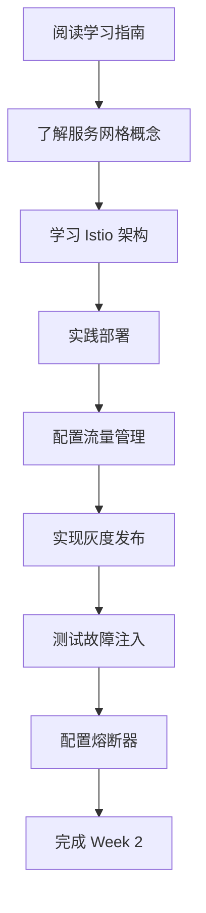

# 🚀 Week 2 - Istio 快速开始指南

## 📋 简介

这个指南将帮助您快速开始 Istio 服务网格的学习和实践。

## ⏱️ 预计时间

- **理论学习**: 3-4 小时
- **实践操作**: 6-8 小时
- **总计**: 10-12 小时

## 🎯 学习路径



## 📚 文档阅读顺序

1. **week2-istio-guide.md** - 理解服务网格概念和 Istio 架构
2. **week2-practice-guide.md** - 跟随实践步骤操作
3. **week2-progress.md** - 记录学习进度

## 🛠️ 快速开始

### 第一步：安装 Istio

```bash
cd /home/lw/homelab/ecommerce-microservices
./scripts/install-istio.sh
```

### 第二步：应用配置

```bash
# 应用基础配置
kubectl apply -f infrastructure/kubernetes/istio-config.yaml

# 应用高级配置
kubectl apply -f infrastructure/kubernetes/istio-advanced.yaml
```

### 第三步：验证安装

```bash
# 检查 Istio 状态
istioctl proxy-status

# 查看 Istio 资源
kubectl get vs,dr,gateway -n ecommerce-microservices
```

## 📝 学习检查清单

### 理论学习
- [ ] 理解服务网格的价值
- [ ] 掌握 Istio 架构（控制平面 vs 数据平面）
- [ ] 理解 Sidecar 模式
- [ ] 学习 VirtualService 和 DestinationRule
- [ ] 了解灰度发布流程

### 实践操作
- [ ] 安装 Istio 到集群
- [ ] 部署服务并注入 Sidecar
- [ ] 配置流量路由
- [ ] 实现 10% 灰度发布
- [ ] 测试故障注入
- [ ] 配置熔断器
- [ ] 使用 istioctl 调试

### 高级操作
- [ ] 配置 mTLS
- [ ] 设置授权策略
- [ ] 集成分布式追踪
- [ ] 配置请求重试

## 🎓 学习建议

### 第一天：理论学习（3-4 小时）
- 上午：阅读 `week2-istio-guide.md`
- 下午：学习 Istio 核心概念
- 晚上：阅读官方文档

### 第二天：实践部署（4-5 小时）
- 上午：安装 Istio 和部署服务
- 下午：配置流量管理和路由
- 晚上：测试基础功能

### 第三天：进阶实践（4-5 小时）
- 上午：实现灰度发布
- 下午：测试故障注入
- 晚上：配置熔断器和优化

## 💡 学习提示

1. **先理解再实践**：不要直接复制命令，先理解其作用
2. **遇到问题先查文档**：Istio 文档很完善
3. **善于使用工具**：
   - `istioctl` - 配置管理
   - `kubectl logs` - 查看日志
   - `istioctl proxy-config` - 查看代理配置
4. **记录问题**：遇到问题记录下来，便于复习
5. **不要害怕失败**：实验环境可以重新部署

## 📊 成功标准

完成后您应该能够：

- ✅ 解释服务网格的价值和适用场景
- ✅ 安装和配置 Istio
- ✅ 使用 VirtualService 管理流量
- ✅ 使用 DestinationRule 配置策略
- ✅ 实现灰度发布流程
- ✅ 测试故障注入
- ✅ 配置熔断器

## 🐛 遇到问题？

### 查看日志
```bash
# 查看应用日志
kubectl logs <pod-name> -c <container-name> -n ecommerce-microservices

# 查看 istio-proxy 日志
kubectl logs <pod-name> -c istio-proxy -n ecommerce-microservices
```

### 检查配置
```bash
# 查看 Istio 资源
kubectl get vs,dr,gateway -n ecommerce-microservices

# 查看代理状态
istioctl proxy-status

# 查看代理配置
istioctl proxy-config route <pod-name>
```

### 重置环境
```bash
# 删除所有配置
kubectl delete vs,dr,gateway -n ecommerce-microservices --all

# 重新应用
kubectl apply -f infrastructure/kubernetes/istio-config.yaml
```

## 📖 推荐阅读

- [Istio 官方文档](https://istio.io/latest/docs/)
- [Istio 任务](https://istio.io/latest/docs/tasks/)
- [Envoy 代理文档](https://www.envoyproxy.io/docs/envoy/latest/)

---

**祝您学习顺利！** 🚀
