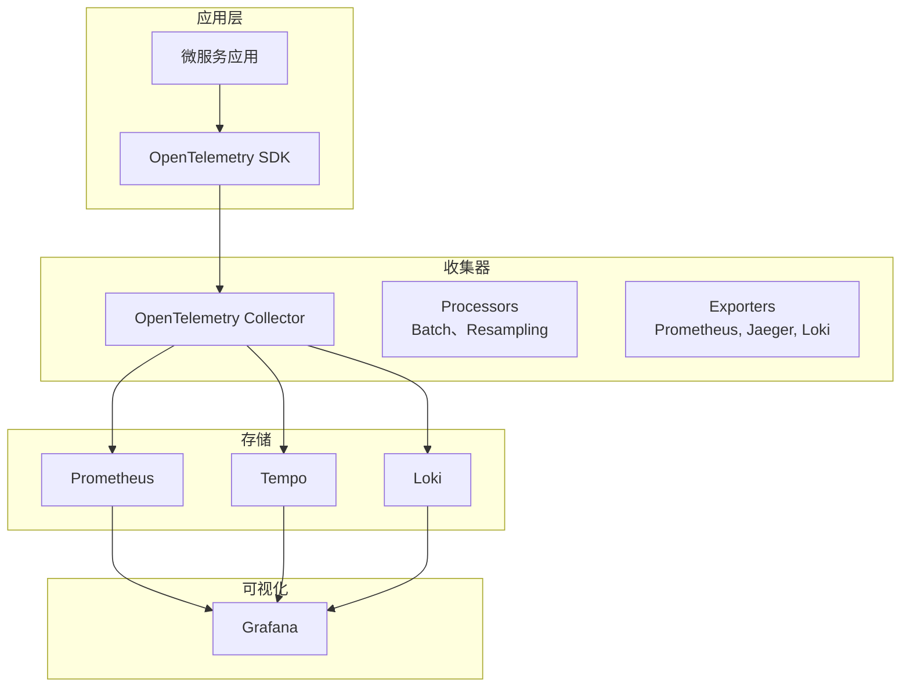
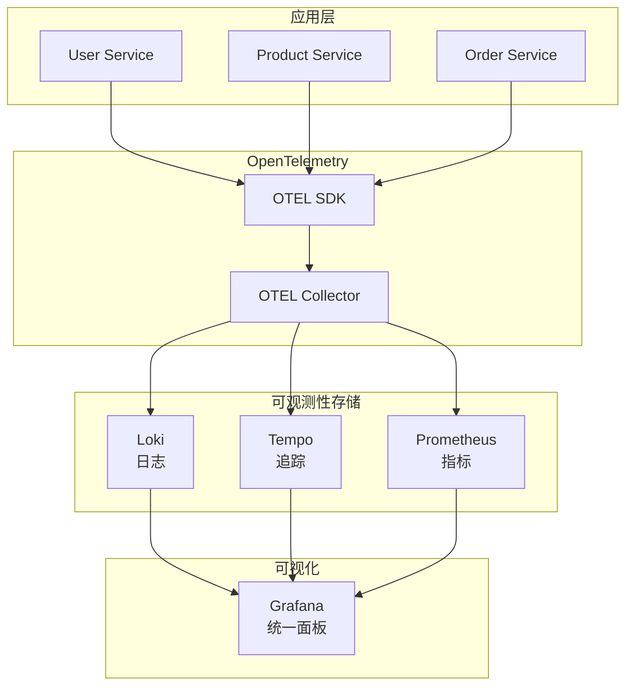

# Week 3: 云原生可观测性（三大支柱）

## 🎯 本周学习目标

1. **理解可观测性三大支柱**：日志（Logs）、追踪（Traces）、指标（Metrics）
2. **掌握 Loki 日志聚合**：配置 Loki + Promtail 收集日志
3. **实现分布式追踪**：集成 Tempo/Jaeger + OpenTelemetry
4. **深化 Prometheus 监控**：学习高级 PromQL 和自定义指标
5. **定义 SLO/SLI**：构建服务级别目标监控
6. **配置告警策略**：实现分级告警系统

## 📚 理论学习重点

### 1. 可观测性基础

#### 什么是可观测性？
可观测性是**通过外部输出来推断系统内部状态的能力**。三大支柱：

```
可观测性 = Logs（日志）+ Traces（追踪）+ Metrics（指标）
```

#### 为什么需要可观测性？
- **快速定位问题**：通过追踪找到问题根源
- **性能优化**：通过指标发现性能瓶颈
- **成本控制**：监控资源使用情况
- **服务治理**：SLO 驱动的运维

#### 三大支柱详解

**1. Logs（日志）**
- **用途**：记录离散事件
- **工具**：Loki、Elasticsearch
- **特点**：详细但量大，需要结构化

**2. Traces（追踪）**
- **用途**：跟踪请求在分布式系统中的流转
- **工具**：Tempo、Jaeger
- **特点**：展示请求的完整链路

**3. Metrics（指标）**
- **用途**：测量系统状态
- **工具**：Prometheus、Grafana
- **特点**：数值型，适合聚合和告警

### 2. OpenTelemetry 统一标准

#### OpenTelemetry 架构



#### OpenTelemetry 优势
- **统一标准**：一套 API 支持所有遥测数据
- **供应商无关**：解耦数据收集和存储
- **语言无关**：Go、Java、Python 等统一接入
- **完整链路**：从代码到基础设施的全链路追踪

### 3. Loki 日志聚合

#### Loki 架构

```yaml
# Promtail 配置示例
scrape_configs:
  - job_name: kubernetes-pods
    kubernetes_sd_configs:
      - role: pod
    relabel_configs:
      - source_labels: [__meta_kubernetes_pod_node_name]
        target_label: __host__
      - action: labelmap
        regex: __meta_kubernetes_pod_label_(.+)
      - source_labels: [__meta_kubernetes_namespace]
        target_label: namespace
      - source_labels: [__meta_kubernetes_pod_name]
        target_label: pod
```

#### Loki 查询语法 LogQL

```logql
# 基础查询
{app="user-service"} |= "error"

# 数值聚合
sum(rate({app="user-service"}[5m])) by (level)

# 日志分析
{app="order-service"} 
  | json 
  | filter response_code >= 500
  | stats sum by (endpoint)
```

### 4. Tempo 分布式追踪

#### Trace 结构

```go
// OpenTelemetry Go SDK 使用示例
import (
    "go.opentelemetry.io/otel"
    "go.opentelemetry.io/otel/trace"
    "go.opentelemetry.io/otel/propagation"
)

// 创建 tracer
tracer := otel.Tracer("user-service")

// 创建 span
ctx, span := tracer.Start(ctx, "process-order")
defer span.End()

// 添加属性
span.SetAttributes(attribute.String("user.id", userID))
span.SetAttributes(attribute.Int("order.total", total))

// 记录事件
span.AddEvent("order-created", trace.WithAttributes(...))
```

#### Trace 可视化

```
┌────────────────────────────────────────────────────┐
│ Trace ID: abc123                                    │
├────────────────────────────────────────────────────┤
│ [0ms] HTTP GET /api/v1/orders                      │
│   ├─ [10ms] Database Query                         │
│   │   └─ [15ms] Cache Lookup                       │
│   ├─ [20ms] Call Product Service                   │
│   │   ├─ [25ms] HTTP GET /products/{id}            │
│   │   └─ [30ms] Database Query                     │
│   └─ [35ms] Call User Service                      │
│       ├─ [40ms] HTTP GET /users/{id}               │
│       └─ [45ms] Database Query                     │
└────────────────────────────────────────────────────┘
```

### 5. Prometheus 高级查询

#### PromQL 高级用法

```promql
# 率计算（Rate）
rate(http_requests_total[5m])

# 区间聚合（Sum）
sum(rate(http_requests_total[5m])) by (status_code)

# 百分位数（Histogram）
histogram_quantile(0.95, sum(rate(http_request_duration_seconds_bucket[5m])) by (le))

# 窗口函数（Delta）
delta(process_cpu_seconds_total[5m])

# 条件查询
up{job="user-service"} == 0
```

#### 自定义指标

```go
// 定义自定义指标
import "go.opentelemetry.io/otel/metric"

counter := meter.NewFloat64Counter(
    "orders_created_total",
    metric.WithDescription("Total number of orders created"),
)

// 记录指标
counter.Add(ctx, 1.0,
    attribute.String("user.id", userID),
    attribute.String("product.category", category),
)
```

## 🏗️ 实践项目

### 系统架构



### 实践步骤

#### Step 1: 部署 Loki

```bash
# 添加 Loki Helm Chart
helm repo add grafana https://grafana.github.io/helm-charts
helm repo update

# 安装 Loki
helm install loki grafana/loki-stack \
  -n observability \
  --create-namespace \
  --set promtail.enabled=true
```

#### Step 2: 部署 Tempo

```bash
# 安装 Tempo
helm install tempo grafana/tempo \
  -n observability \
  --create-namespace
```

#### Step 3: 部署 OpenTelemetry Collector

```bash
# 安装 OpenTelemetry Operator
helm install opentelemetry-operator \
  opentelemetry-operator/opentelemetry-operator \
  -n observability \
  --create-namespace

# 部署 Collector
kubectl apply -f infrastructure/observability/otel-collector.yaml
```

#### Step 4: 集成 OpenTelemetry SDK

```bash
# 在应用代码中添加 OTEL
go get go.opentelemetry.io/otel@v1.0.0
go get go.opentelemetry.io/otel/trace@v1.0.0
go get go.opentelemetry.io/otel/metric@v1.0.0
go get go.opentelemetry.io/otel/exporters/jaeger
go get go.opentelemetry.io/contrib/instrumentation/github.com/gin-gonic/gin/otelgin
```

#### Step 5: 配置 Grafana 数据源

```bash
# 添加 Loki 数据源
# 添加 Tempo 数据源
# 配置日志链路追踪（Correlation）

kubectl apply -f infrastructure/observability/grafana-config.yaml
```

#### Step 6: 定义 SLO 和告警

```yaml
# Prometheus 告警规则
groups:
  - name: slo-alerts
    rules:
      # 可用性告警
      - alert: UserServiceAvailabilityLow
        expr: |
          sum(rate(http_requests_total{job="user-service",status=~"5.."}[5m]))
          /
          sum(rate(http_requests_total{job="user-service"}[5m]))
          > 0.01  # 1% 错误率
        annotations:
          description: "User service availability below 99%"
      
      # 延迟告警
      - alert: UserServiceLatencyHigh
        expr: |
          histogram_quantile(0.95,
            sum(rate(http_request_duration_seconds_bucket{job="user-service"}[5m])) by (le)
          ) > 0.2  # P95 > 200ms
        annotations:
          description: "User service P95 latency above 200ms"
```

## 🎯 学习成果验证

### 理论理解
- [ ] 理解可观测性三大支柱及其价值
- [ ] 掌握 OpenTelemetry 标准
- [ ] 理解 SLI/SLO/SLA 概念
- [ ] 掌握 PromQL 高级查询

### 实践能力
- [ ] 能部署 Loki 和 Tempo
- [ ] 能集成 OpenTelemetry SDK
- [ ] 能配置 Grafana 统一面板
- [ ] 能定义和监控 SLO
- [ ] 能配置分级告警

### 工具使用
- [ ] 使用 Loki 查询日志
- [ ] 使用 Tempo 查看分布式追踪
- [ ] 使用 Prometheus 高级查询
- [ ] 使用 Grafana 创建仪表板

## 📖 推荐学习资源

### 官方文档
- [OpenTelemetry 官方文档](https://opentelemetry.io/docs/)
- [Loki 文档](https://grafana.com/docs/loki/latest/)
- [Tempo 文档](https://grafana.com/docs/tempo/latest/)
- [Prometheus 文档](https://prometheus.io/docs/)

### 在线教程
- [OpenTelemetry 示例](https://github.com/open-telemetry/opentelemetry-go)
- [Grafana Labs 教程](https://grafana.com/tutorials/)

### 书籍推荐
- 《Observability Engineering》
- 《Site Reliability Engineering》

---

**本周目标**：为电商系统构建完整的可观测性体系，实现统一监控、追踪和告警。
