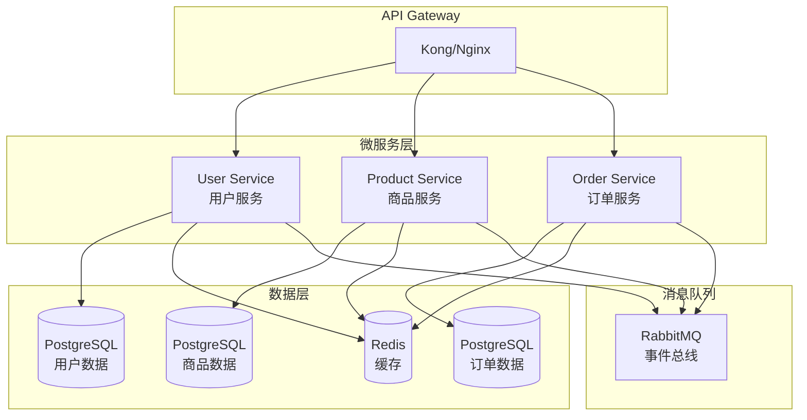

# Week 1: 微服务架构与 API 设计实践

## 🎯 本周学习目标

1. **掌握微服务拆分原则**：基于 DDD（领域驱动设计）进行服务边界划分
2. **学习 API 设计最佳实践**：RESTful API 和 gRPC 服务设计
3. **实践服务间通信**：同步和异步通信模式
4. **构建完整电商系统**：用户、商品、订单三个核心微服务

## 📚 理论学习重点

### 1. 微服务拆分原则

#### 单一职责原则
- 每个服务只负责一个业务领域
- 服务边界清晰，职责明确
- 避免服务间的紧耦合

#### 领域驱动设计（DDD）
- **聚合根（Aggregate Root）**：用户、商品、订单
- **限界上下文（Bounded Context）**：用户管理、商品目录、订单处理
- **领域事件（Domain Events）**：用户注册、订单创建、支付完成

#### 数据一致性
- **强一致性**：使用分布式事务（Saga 模式）
- **最终一致性**：通过事件驱动实现
- **CAP 定理权衡**：在一致性、可用性、分区容错性间选择

### 2. API 设计最佳实践

#### RESTful API 设计
```http
# 资源命名规范
GET    /api/v1/users/{id}           # 获取用户
POST   /api/v1/users                # 创建用户
PUT    /api/v1/users/{id}          # 更新用户
DELETE /api/v1/users/{id}          # 删除用户

# 状态码使用
200 OK          # 成功
201 Created     # 创建成功
400 Bad Request # 请求错误
404 Not Found   # 资源不存在
500 Internal Server Error # 服务器错误
```

#### gRPC 服务设计
```protobuf
// 服务定义
service UserService {
  rpc GetUser(GetUserRequest) returns (User);
  rpc CreateUser(CreateUserRequest) returns (User);
  rpc UpdateUser(UpdateUserRequest) returns (User);
  rpc DeleteUser(DeleteUserRequest) returns (Empty);
}

// 消息定义
message User {
  string id = 1;
  string email = 2;
  string name = 3;
  google.protobuf.Timestamp created_at = 4;
}
```

### 3. 服务间通信模式

#### 同步通信
- **HTTP/REST**：简单易用，适合查询操作
- **gRPC**：高性能，适合内部服务通信
- **GraphQL**：灵活查询，适合复杂数据需求

#### 异步通信
- **消息队列**：RabbitMQ、Apache Kafka
- **事件驱动**：发布/订阅模式
- **CQRS**：命令查询职责分离

## 🏗️ 实践项目：电商微服务系统

### 系统架构设计



### 服务职责划分

#### 1. User Service（用户服务）
- **职责**：用户注册、登录、个人信息管理
- **数据模型**：用户基本信息、认证信息
- **API 接口**：
  - `POST /api/v1/users` - 用户注册
  - `GET /api/v1/users/{id}` - 获取用户信息
  - `PUT /api/v1/users/{id}` - 更新用户信息
  - `POST /api/v1/auth/login` - 用户登录

#### 2. Product Service（商品服务）
- **职责**：商品管理、库存管理、价格管理
- **数据模型**：商品信息、库存、价格
- **API 接口**：
  - `GET /api/v1/products` - 获取商品列表
  - `GET /api/v1/products/{id}` - 获取商品详情
  - `POST /api/v1/products` - 创建商品
  - `PUT /api/v1/products/{id}` - 更新商品
  - `GET /api/v1/products/{id}/inventory` - 查询库存

#### 3. Order Service（订单服务）
- **职责**：订单创建、状态管理、支付处理
- **数据模型**：订单信息、订单项、支付状态
- **API 接口**：
  - `POST /api/v1/orders` - 创建订单
  - `GET /api/v1/orders/{id}` - 获取订单详情
  - `PUT /api/v1/orders/{id}/status` - 更新订单状态
  - `GET /api/v1/users/{userId}/orders` - 获取用户订单

### 技术栈选择

#### 编程语言：Go
- **优势**：高性能、并发支持好、云原生生态丰富
- **框架**：Gin（HTTP）、gRPC、GORM（ORM）

#### 数据库：PostgreSQL
- **优势**：ACID 支持、JSON 支持、扩展性好
- **连接池**：pgx、连接池管理

#### 缓存：Redis
- **用途**：会话存储、热点数据缓存、分布式锁

#### 消息队列：RabbitMQ
- **用途**：异步事件处理、服务解耦

## 📁 项目结构

```
ecommerce-microservices/
├── api-gateway/                 # API 网关
│   ├── kong/
│   └── nginx/
├── services/
│   ├── user-service/           # 用户服务
│   │   ├── cmd/
│   │   ├── internal/
│   │   ├── pkg/
│   │   ├── api/
│   │   ├── proto/              # gRPC 定义
│   │   ├── migrations/
│   │   ├── Dockerfile
│   │   └── go.mod
│   ├── product-service/        # 商品服务
│   │   ├── cmd/
│   │   ├── internal/
│   │   ├── pkg/
│   │   ├── api/
│   │   ├── proto/
│   │   ├── migrations/
│   │   ├── Dockerfile
│   │   └── go.mod
│   └── order-service/          # 订单服务
│       ├── cmd/
│       ├── internal/
│       ├── pkg/
│       ├── api/
│       ├── proto/
│       ├── migrations/
│       ├── Dockerfile
│       └── go.mod
├── shared/                     # 共享库
│   ├── database/
│   ├── logger/
│   ├── middleware/
│   └── utils/
├── infrastructure/             # 基础设施
│   ├── docker-compose.yml
│   ├── kubernetes/
│   └── terraform/
├── docs/                       # 文档
│   ├── api/
│   ├── architecture/
│   └── deployment/
└── scripts/                    # 脚本
    ├── setup.sh
    ├── test.sh
    └── deploy.sh
```

## 🚀 实施步骤

### Day 1-2: 环境搭建与基础框架
1. **开发环境准备**
   - Go 1.21+ 安装
   - PostgreSQL 和 Redis 安装
   - Docker 和 Docker Compose
   - 代码编辑器配置（VS Code + Go 插件）

2. **项目初始化**
   - 创建项目结构
   - 配置 Go modules
   - 设置共享库和工具

### Day 3-4: User Service 开发
1. **数据库设计**
   - 用户表结构设计
   - 数据库迁移脚本
   - 连接池配置

2. **API 开发**
   - RESTful API 实现
   - gRPC 服务实现
   - 数据验证和错误处理

3. **业务逻辑**
   - 用户注册和登录
   - JWT 认证
   - 密码加密

### Day 5-6: Product Service 开发
1. **商品管理功能**
   - 商品 CRUD 操作
   - 库存管理
   - 价格管理

2. **缓存策略**
   - Redis 缓存实现
   - 缓存更新策略
   - 缓存穿透防护

### Day 7: Order Service 开发
1. **订单处理**
   - 订单创建流程
   - 状态机设计
   - 分布式事务处理

2. **服务集成**
   - 服务间调用
   - 事件发布
   - 错误处理

## 📊 学习成果验证

### 技术能力检查
- [ ] 能独立设计微服务架构
- [ ] 掌握 RESTful API 设计原则
- [ ] 理解 gRPC 服务定义和实现
- [ ] 能处理服务间通信和数据一致性

### 实践项目检查
- [ ] 完成三个微服务的开发
- [ ] 实现完整的 API 接口
- [ ] 配置数据库和缓存
- [ ] 编写单元测试和集成测试

### 文档输出
- [ ] API 文档（Swagger/OpenAPI）
- [ ] 架构设计文档
- [ ] 部署和运维文档
- [ ] 学习总结博客

## 📖 推荐学习资源

### 在线文档
- [Go 官方文档](https://golang.org/doc/)
- [Gin 框架文档](https://gin-gonic.com/docs/)
- [gRPC Go 教程](https://grpc.io/docs/languages/go/)
- [PostgreSQL 文档](https://www.postgresql.org/docs/)

### 书籍推荐
- 《微服务架构设计模式》（Chris Richardson）
- 《领域驱动设计》（Eric Evans）
- 《Go 语言实战》（William Kennedy）

### 实践参考
- [Go 微服务示例](https://github.com/microservices-demo)
- [Kubernetes 微服务示例](https://github.com/GoogleCloudPlatform/microservices-demo)

---

**本周目标**：完成电商微服务系统的核心功能开发，为下周的 Istio 服务网格学习打下基础。
